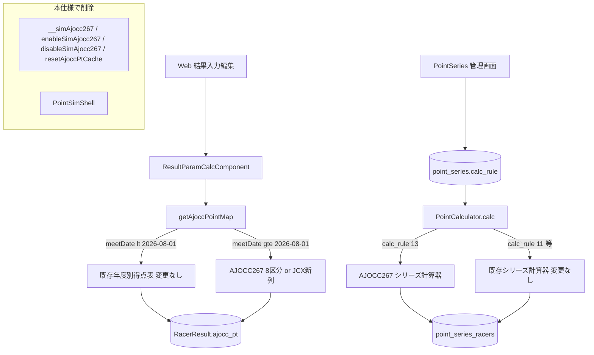
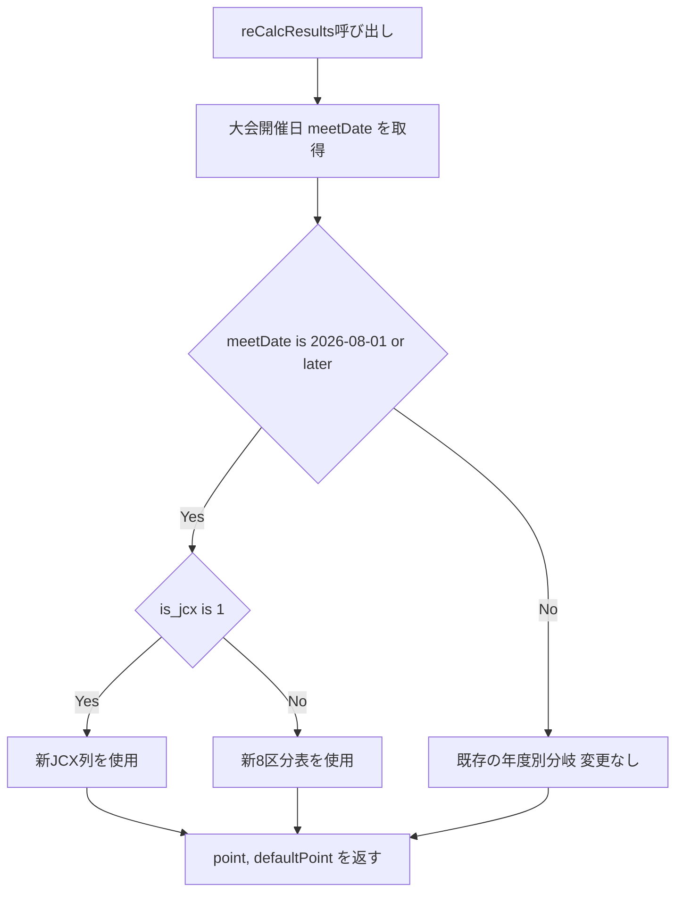
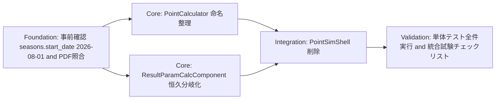

# 設計: ajocc-point-267-prod

タスクID: `ajocc-point-267-prod`
作成日: 2026-07-14

## Overview

**Purpose**: `point-sim-2025-26` で検証済みの新AJOCC得点表（8区分・新JCX列）を、
2026-27シーズン（2026-08-01以降開催の大会）の本番ポイント計算へ恒久的に適用する。
現在この新表は `origin/main`（PR #12でマージ済み）にシミュレーション専用フラグ
（`__simAjocc267`、既定 `false`）でガードされた状態で存在しており、本設計はこのガードを
「シーズン起点の恒久判定」へ置き換え、`_TEST` を含む識別子を本番用の名称へ整理する。

**Users**: AJOCC運営担当者（新得点表での大会運営・シリーズ集計）、開発・保守担当者
（本コードの継続保守）。

**Impact**: `cyclox2_svr/cyclox2`（CakePHP 2.x）の3ファイル
（`app/Cyclox/Util/PointCalculator.php`, `app/Controller/Component/ResultParamCalcComponent.php`,
`app/Console/Command/PointSimShell.php`）に閉じた変更。DBスキーマ変更やUI変更は伴わない。

### Goals
- 2026-08-01以降開催の大会のAJOCCポイント（System①）計算に、シミュレーション専用フラグの
  有効化なしで新8区分表・新JCX列が自動適用される。
- 2025-26以前の大会のAJOCCポイント計算結果が本改修前と完全に同一である（回帰保証）。
- JCF/JCXシリーズ点計算（System②）の配点ルールとして、新得点表を本番名称で選択できる。
- シミュレーション専用フラグ・`_TEST` 命名・シミュレーション専用実行手段（`PointSimShell`）が
  整理され、本番構成のみが残る。
- 新旧得点表切替ロジック・新得点表の値に対する自動テスト（TDD）が整備される。
- 実装済み新得点表の数値が公式PDFと一致していることが確認・記録される。

### Non-Goals
- `calc_rule` の自動選択・シーズン起点自動判定をSystem②に導入すること（既存の運用者による
  手動選択フローを維持する。research.md Design Decision 参照）。
- 残留ライン等のポイント基準パラメータの変更（`season-rules-2026-27` の対象）。
- ME⇔MM連動・カテゴリー判定ロジックの変更（`me-mm-linkage-2026-27` の対象）。
- ポイント表管理のUI化・DB化。
- `Season` テーブルを参照した動的な年度境界判定への刷新（既存パターンとの一貫性を優先し
  見送る。将来必要になれば別スコープで検討する）。

## Boundary Commitments

### This Spec Owns
- `PointCalculator`（`app/Cyclox/Util/PointCalculator.php`）における新得点表の定義・
  正式な計算器としての登録（`val=13`）。
- `ResultParamCalcComponent`（`app/Controller/Component/ResultParamCalcComponent.php`）内の
  `__getAjoccPointMap()` における新得点表のシーズン起点自動適用判定ロジック
  （AJOCCポイント計算、System①）。
- シミュレーション専用フラグ・関連メソッド（`__simAjocc267`, `enableSimAjocc267()`,
  `disableSimAjocc267()`, `resetAjoccPtCache()`）および `PointSimShell.php` の整理・削除。
- 上記変更に対応する自動テスト（`app/Test/Case/...`）の新規追加。
- 新得点表の数値と公式PDFとの照合作業・記録。

### Out of Boundary
- `point_series.calc_rule` の値そのものをどのシーズンにどう割り当てるかという運用判断
  （既存の管理画面フローに委ねる。本仕様は選択肢として正式名称の計算器を提供するのみ）。
- `JCF_234`（全日本選手権含むJCFシリーズ）のポイント表定義（変更しない）。
- 残留ライン・昇格枠等のルール値（`season-rules-2026-27`）。
- ME⇔MM連動・二重付与防止・カテゴリー是正バッチ（`me-mm-linkage-2026-27`,
  `catracer-cleanup-2026-27`）。
- JCXシリーズ戦の系統固定制御（`jcx-lineage-lock-2026-27`）。
- `cyclox2ressys_svr/cyclox2res_sys`（成績閲覧アプリ）側の変更（表示経路は既存のまま利用する
  想定。実装後に表示崩れがないことのみ確認する）。
- `OneTimeShell.php` 等、本仕様が新規に触れない既存バッチの挙動（`calcAjoccPt` の呼び出し方
  に既存の課題があっても本仕様では修正しない。ダウンストリームとして触れない）。

### Allowed Dependencies
- `origin/main`（`feat/point-table-ajocc-267-sim` マージ後の最新コード）を実装ブランチの
  起点とする。
- 既存の `PointCalculator::calculators()` レジストリ機構、`point_series.calc_rule` 選択の
  既存管理画面フロー（`PointSeriesController::add()/edit()`）。
- `Meet.is_jcx`, `Meet.at_date`（大会開催日）, `EntryCategory.applies_ajocc_pt` など、
  既存の年度境界判定が既に依存しているモデル属性。
- CakePHP 2.x 組み込みテストスイート（`Console/cake test`, `CakeTestCase`）。

### Revalidation Triggers
- `seasons` テーブルの2026-27シーズン `start_date` が `2026-08-01` 以外に変更された場合
  （本設計のリテラル日付分岐前提が崩れる）。
- 新得点表の数値が公式PDFとの照合で修正された場合（テーブル定義・テストの再確認が必要）。
- `me-mm-linkage-2026-27` が `ResultParamCalcComponent` の同一ファイルへ変更を加える場合
  （マージ競合の可能性、実装順・PRレビュー時に相互確認する）。
- `point_series.calc_rule` の割当を自動化する将来仕様が持ち上がった場合（本設計の
  「System②は手動選択のまま」という前提の再検証が必要）。

## Architecture

### Existing Architecture Analysis

AJOCCポイントは2系統に分かれて計算される（`point-sim-2025-26` の設計を踏襲）。

- **System①（AJOCCポイント、`ajocc_pt`）**: `ResultParamCalcComponent::calcAjoccPt()` →
  `__getAjoccPointMap()` が、大会開催日・出走人数・JCX判定から使用する得点表を選択する。
  Web結果入力・編集（`reCalcResults`）から都度呼び出され、年度境界はコード内リテラル
  `DateTime` 比較（`$divDate2017`, `$divDate2022`, `$divDate2024`, `$divDate2025`）で
  実装されている。**現状、新得点表は `$divDate2025`（2025-08-01）以降かつ
  `$this->__simAjocc267` が `true` の場合のみ適用される**（既定 `false` のため本番未適用）。
- **System②（シリーズ点、`point_series_racers`）**: `PointCalculator::calc()` が
  `point_series.calc_rule`（DB値、シーズンごとに運用担当者が管理画面で手動設定）に応じた
  計算器を選択する。新得点表は `val=13`（`AJOCC_267_TEST`）として既に登録済みで、
  フラグに依存しない（`calc_rule=13` が指定されたシリーズであればいつでも新表が使われる）。
- **確認済みの事実**（research.md 参照）: `feat/point-table-ajocc-267-sim` は既に
  `origin/main`（PR #12）へマージ済み。上記の実装は全て `main` 上に存在する。本仕様は
  新規のマージ作業ではなく、既存実装の「本番切替」と「命名整理」を行う。

### Architecture Pattern & Boundary Map



**Architecture Integration**:
- 選定パターン: 既存の「年度境界をリテラル `DateTime` 比較で分岐する」パターンをそのまま
  踏襲する（research.md Decision 参照）。新規の抽象化やDBスキーマは導入しない。
- ドメイン境界: System①（AJOCCポイント／`ResultParamCalcComponent`）とSystem②
  （シリーズ点／`PointCalculator`）は既存どおり独立を維持する。
- 既存パターンの維持: `__getAjoccPointMap()` の `if/else if` 連鎖構造、
  `PointCalculator::calculators()` レジストリパターン、`started_over` 区分配列構造。
- 新規コンポーネントなし（既存コンポーネント内の分岐条件変更・識別子リネーム・不要コード削除
  のみ）。
- Steering準拠: 本番直接コミット禁止・ブランチ運用（`docs/sdd/rules/branching-policy.md`）、
  TDD必須（`docs/sdd/rules/testing-policy.md`）。

### Technology Stack

| Layer | Choice / Version | Role in Feature | Notes |
|-------|------------------|------------------|-------|
| Backend | PHP 7.3 / CakePHP 2.x | `PointCalculator`, `ResultParamCalcComponent` の改修対象言語・FW | 既存アプリ本体と同一 |
| Data / Storage | MySQL 5.7 | `racer_results.ajocc_pt`, `point_series.calc_rule`, `point_series_racers.point` | スキーマ変更なし、既存カラムへの書込み経路のみ |
| Test | CakePHP 2.x 組込みテストスイート（`Console/cake test`） | 新規ユニットテストの実行基盤 | `app/Test/Case/` にこれまで実テストが無い領域（後述） |

## File Structure Plan

### Directory Structure（対象: `cyclox2_svr/cyclox2` submodule）
```
app/
├── Cyclox/Util/
│   └── PointCalculator.php                 # System②: 得点表定義・計算器レジストリ（改修）
├── Controller/Component/
│   └── ResultParamCalcComponent.php        # System①: AJOCCポイント計算・表選択ロジック（改修）
├── Console/Command/
│   └── PointSimShell.php                   # シミュレーション専用シェル（削除）
└── Test/Case/
    ├── Cyclox/Util/
    │   └── PointCalculatorTest.php         # 新規: AJOCC267シリーズ計算器の単体テスト
    └── Controller/Component/
        └── ResultParamCalcComponentTest.php # 新規: 得点表選択ロジック・回帰の単体テスト
```

### Modified Files
- `app/Cyclox/Util/PointCalculator.php` — `$AJOCC_267_TEST` → `$AJOCC_267` へのリネーム、
  `$TABLE_AJOCC267TEST` → `$TABLE_AJOCC267`、`__calcAJOCC267Test()` → `__calcAJOCC267()`、
  説明文からシミュレーション・テスト用である旨の文言を除去し本番用説明へ更新（`val=13` は
  現行のまま維持し、DB互換性リスクをゼロにする）。
- `app/Controller/Component/ResultParamCalcComponent.php` —
  `__getAjoccPointMap()` 内の `if ($this->__simAjocc267 && $mtDate >= $divDate2025)` を
  `if ($mtDate >= $divDate2026)`（新規定数 `$divDate2026 = new DateTime('2026-08-01')`）へ
  置き換え。`$__simAjocc267` フィールド、`enableSimAjocc267()`, `disableSimAjocc267()`,
  `resetAjoccPtCache()` を削除。

### Removed Files
- `app/Console/Command/PointSimShell.php` — シミュレーション専用フラグに依存しており、
  フラグ削除に伴い削除する（research.md Design Decision 参照。他ファイルからの参照なしを
  確認済み）。

### New Files
- `app/Test/Case/Cyclox/Util/PointCalculatorTest.php` — `PointCalculator::$AJOCC_267` の
  境界値・グレード非依存性のユニットテスト。
- `app/Test/Case/Controller/Component/ResultParamCalcComponentTest.php` —
  `__getAjoccPointMap()` / `calcAjoccPt()` のシーズン境界切替・新旧区分境界・JCX判定・
  2025-26以前の回帰のユニットテスト。

> `app/Test/Case/Controller/Component/`, `app/Test/Case/Model/Behavior/`,
> `app/Test/Case/View/Helper/` には現状 `empty` プレースホルダのみが存在し、実テストが
> 一件も無い。本仕様が当該領域で最初の実テストを追加する（Foundationフェーズでテスト
> 実行基盤が機能することを確認するタスクを設置する）。

## System Flows

### AJOCCポイント計算（System①）の表選択フロー



**Key Decisions**:
- 分岐条件は `__simAjocc267` を経由せず `meetDate` のみで確定する（Requirement 1.3）。
- `2026-08-01` より前の全パスは無変更（既存 `if/else if` チェーンの後続部分に一切手を
  加えない）ことで回帰リスクを最小化する（Requirement 2）。

## Requirements Traceability

| Requirement | Summary | Components | Interfaces | Flows |
|-------------|---------|------------|------------|-------|
| 1.1–1.5 | 新得点表のシーズン起点自動適用（非JCX・JCX・範囲外・異常系） | ResultParamCalcComponent | `__getAjoccPointMap()`, `calcAjoccPt()` | AJOCCポイント計算の表選択フロー |
| 2.1–2.3 | 過去シーズンへの非影響 | ResultParamCalcComponent | `__getAjoccPointMap()` | 同上（`meetDate < 2026-08-01` 経路） |
| 3.1–3.3 | シリーズ点計算への新得点表の本番提供 | PointCalculator | `PointCalculator::$AJOCC_267`, `calc()` | （既存のSystem②フロー、変更なし） |
| 4.1–4.4 | シミュレーション専用フラグ・命名の整理 | ResultParamCalcComponent, PointCalculator, PointSimShell | フィールド・メソッド削除、識別子リネーム | — |
| 5.1–5.5 | 自動テストの整備 | PointCalculatorTest, ResultParamCalcComponentTest | `CakeTestCase` | — |
| 6.1–6.3 | 公式PDFとの数値照合 | （実装外の検証作業） | — | — |

## Components and Interfaces

| Component | Domain/Layer | Intent | Req Coverage | Key Dependencies (P0/P1) | Contracts |
|-----------|--------------|--------|---------------|---------------------------|-----------|
| PointCalculator | Cyclox/Util（System②） | 新得点表の正式な計算器としての定義・提供 | 3.1, 3.2, 4.2 | PointSeriesController（P1, 選択肢として参照） | Batch |
| ResultParamCalcComponent | Controller/Component（System①） | AJOCCポイントのシーズン起点自動表選択 | 1.1–1.5, 2.1–2.3, 4.1, 4.3, 4.4 | reCalcResults呼び出し元（Web結果入力編集, P0） | Service |
| PointCalculatorTest | Test/Case | `AJOCC_267` シリーズ計算器の単体検証 | 5.5 | PointCalculator（P0） | — |
| ResultParamCalcComponentTest | Test/Case | 表選択ロジック・境界・回帰の単体検証 | 5.1–5.4 | ResultParamCalcComponent（P0） | — |

### System①: AJOCCポイント計算

#### ResultParamCalcComponent

| Field | Detail |
|-------|--------|
| Intent | 大会開催日・出走人数・JCX判定に基づき、AJOCCポイント計算に用いる得点表を選択し
ポイントを算出する |
| Requirements | 1.1, 1.2, 1.3, 1.4, 1.5, 2.1, 2.2, 2.3, 4.1, 4.3, 4.4 |

**Responsibilities & Constraints**
- `calcAjoccPt($rank, $startedCount, $meetDate, $isJcx)` は既存シグネチャを維持する
  （呼び出し元 `__doReCalcResults()` 等への影響を出さない）。
- `__getAjoccPointMap($mtDate, $startedCount, $isJcx)` の戻り値形式
  （`array($map, $defaultPoint)`）を変更しない。
- 2026-08-01より前の分岐（`$divDate2017`, `$divDate2022`, `$divDate2024` を用いた既存の
  `if/else if` チェーン）には一切変更を加えない。

**Dependencies**
- Inbound: Web結果入力・編集（`reCalcResults`）— 本仕様の変更後もシグネチャ・戻り値契約は
  不変のため影響なし（P0）。
- Outbound: なし（自己完結した表選択ロジック）。

**Contracts**: Service [x] / API [ ] / Event [ ] / Batch [ ] / State [ ]

##### Service Interface
```
interface AjoccPointCalculation {
  // rank: 順位（1始まり）, startedCount: 出走人数, meetDate: 大会開催日（YYYY-MM-DD）,
  // isJcx: JCX大会か否か
  // 戻り値: ポイント（int）。startedCount<=0 の場合は -1（既存の異常系契約を維持）
  calcAjoccPt(rank: int, startedCount: int, meetDate: string, isJcx: bool): int
}
```
- Preconditions: `meetDate` はパース可能な日付文字列であること。
- Postconditions: `meetDate >= 2026-08-01` の場合は新得点表（8区分／新JCX列）から算出した
  値を返す。`meetDate < 2026-08-01` の場合は本改修前と同一の値を返す。
- Invariants: 出力値は `meetDate` 以外の入力・呼び出し順序（インスタンスの使い回し）に
  依存しない（キャッシュフィールド `$ajoccPtMap`/`$defaultPt` は同一インスタンス内
  同一結果を保証するための既存最適化であり、本仕様では変更しない）。

**Implementation Notes**
- Integration: Web結果入力・編集からの呼び出し経路は無変更。呼び出し元の修正は不要。
- Validation: `Requirement 1.3`（フラグ非依存の恒久適用）を満たすため、`$__simAjocc267`
  参照を完全に除去したことをコードレビューで確認する（grep で `simAjocc267` が
  ヒットしないことを機械的に確認可能）。
- Risks: `$divDate2026` のリテラル値が実際の2026-27シーズン `start_date` と食い違うと
  誤った表が適用される。実装タスクの事前条件として `seasons` テーブルの実値確認を置く
  （research.md Risks 参照）。

### System②: シリーズ点計算

#### PointCalculator

| Field | Detail |
|-------|--------|
| Intent | JCF/JCXシリーズの配点ルール一覧に、新得点表を本番名称の選択肢として提供する |
| Requirements | 3.1, 3.2, 4.2 |

**Responsibilities & Constraints**
- `val=13` は変更しない（DB上の `calc_rule=13` との後方互換性を保つため。本番DBには
  現時点で `calc_rule=13` の行は存在しない前提だが、開発環境データとの整合のためにも
  `val` は変更しない）。
- `PointCalculator::calculators()` が返す配列内の該当要素の `name()`/`description()` を
  シミュレーション・テストを示唆しない文言へ更新する。
- `calc()` メソッドの `switch` 文における `case` 条件（`self::$AJOCC_267->val()`）、および
  内部の計算メソッド名（`__calcAJOCC267()`）をリネームするが、計算ロジック自体
  （グレード非依存で単一表から順位引き）は変更しない。

**Dependencies**
- Inbound: `PointSeriesController::add()/edit()`（`calculators()` を選択肢として表示、P1）。
- Outbound: なし。

**Contracts**: Service [ ] / API [ ] / Event [ ] / Batch [x] / State [ ]

##### Batch / Job Contract
- Trigger: `PointSeriesController::calcUpSeries()` 経由でシリーズランキング再計算時に
  `PointCalculator::getCalculator(13)->calc(...)` が呼ばれる（既存の呼び出し経路、無変更）。
- Input / validation: `result`（順位等を含む配列）, `grade`（本表では未使用）,
  `raceLapCount`, `raceStartedCount`, `meetDate`。
- Output / destination: `array('point' => int)` または `null`（範囲外時）。
  `point_series_racers` へ保存されるのは呼び出し元の既存ロジック。
- Idempotency & recovery: 既存どおり冪等（同一入力に対し同一出力）。本仕様では変更しない。

**Implementation Notes**
- Integration: `PointSeriesController` 側のコード変更は不要（`calculators()` の返す
  `name()`/`description()` が更新された値に自動的に反映される）。
- Validation: `PointCalculator::getCalculator(13)->name()` に `TEST` 文字列が含まれないこと
  をユニットテストで検証する。
- Risks: 運用担当者が2026-27シーズンのJCF/JCXシリーズ作成時に `AJOCC_267` を選び忘れる
  リスクは本仕様のコード変更では解消されない。統合試験チェックリストへの明記で軽減する
  （research.md Design Decision 参照）。

## Data Models

本仕様はスキーマ変更を伴わない。既存カラムへの書込み内容（値のロジック）のみが変わる。

### Data Contracts & Integration

| データ | 変更前 | 変更後 | 備考 |
|---|---|---|---|
| `racer_results.ajocc_pt` | 2026-08-01以降の大会でも既存年度別表の値 | 2026-08-01以降の大会は新8区分表／新JCX列の値 | 2025-08-01〜2026-07-31開催分は変更なし（`__simAjocc267` 既定 `false` により従来どおり本改修前から変化なし） |
| `point_series.calc_rule` | `13` を指定すると `AJOCC_267_TEST`（名称のみ） | `13` を指定すると `AJOCC_267`（名称のみ、計算内容は不変） | 値そのものの意味・計算結果は変わらない。表示名のみ変更 |
| `point_series_racers.point` | `calc_rule=13` 経由の計算結果（変更なし） | 同左（変更なし） | System②の計算ロジックは本仕様で変更しない |

## Error Handling

### Error Strategy
既存のエラーハンドリング方針を維持する。本仕様は新規の例外系を追加しない。

### Error Categories and Responses
- **出走人数異常**（`startedCount <= 0`）: 既存どおり `-1` を返す（Requirement 1.5）。
- **表範囲外の順位**: 既存どおり `defaultPoint`（新表では `0`）を返す（Requirement 1.4）。
- **日付パース失敗**: 既存の `__getAjoccPointMap()` の前提（`DateTime` へパース可能な文字列）
  を維持し、本仕様では新たなバリデーションを追加しない（既存呼び出し元が保証している契約を
  踏襲）。

### Monitoring
既存の `$this->log(...)` によるデバッグログ出力パターンを踏襲する。ログメッセージ文言から
「テスト」「シミュレーション」を示す表現を削除し、本番の分岐であることが分かる文言へ
更新する。

## Testing Strategy

- **Unit Tests**（`PointCalculatorTest`）:
  1. `AJOCC_267` シリーズ計算器が順位1位で1000点、109位で1点、110位で `null` を返すこと。
  2. `AJOCC_267` の計算結果がグレード1/2で同一であること（グレード非依存）。
  3. `PointCalculator::getCalculator(13)->name()` / `description()` に「TEST」「テスト」
     「シミュレーション」を含まないこと（Requirement 4.2 の機械的検証）。
- **Unit Tests**（`ResultParamCalcComponentTest`）:
  1. 大会開催日 `2026-08-01` 以降・非JCXで、出走人数区分の境界
     （4/5, 9/10, 19/20, 39/40, 59/60, 79/80, 99/100人）ごとに正しいポイントを返すこと
     （Requirement 5.1）。
  2. 大会開催日 `2026-08-01` 以降・JCXで、順位1位・109位・110位が正しいポイント
     （1000/1/0）を返すこと（Requirement 5.2）。
  3. 大会開催日境界（`2026-07-31` と `2026-08-01`）で新旧の表が正しく切り替わること
     （Requirement 5.3）。
  4. 2025-26以前の代表的な大会日付（例: `2025-11-01`, `2024-11-01`）・出走人数・順位・
     JCX有無の組み合わせについて、本改修前と同一の値を返すこと（Requirement 5.4 / 2.1–2.3。
     期待値は `point-sim-2025-26` の `PointSimShell::testTables()` に記載された回帰値
     （例: 非JCX started=50 rank1 → 180、JCX rank1 → 200）を引き継ぐ）。
  5. `__simAjocc267` フィールド・`enableSimAjocc267()`/`disableSimAjocc267()` メソッドが
     コード上に存在しないこと（Requirement 4.1、`ReflectionClass` 等による機械的検証、
     または grep ベースの静的チェックをテストタスクの一部として実施）。
- **Integration Tests**: 実データに近い1カテゴリー（2026-27シーズンを想定した開催日の
  ダミーデータ、または開発DB上の既存2025-26カテゴリーの日付を仮変更したテストフィクスチャ）
  に対して `reCalcResults()` を実行し、`racer_results.ajocc_pt` が期待値どおり更新される
  ことを確認する。
- **Manual/Integration Checklist**（`integration-test-checklist.md` に記録）:
  - 開発環境で `Console/cake test` によりユニットテストが全件成功すること。
  - 開発環境で2025-26シーズンの既存カテゴリーを再計算し、`ajocc_pt` が変化しないこと
    （簡易サンプルでの目視確認）。
  - `PointSeries/add.ctp` の配点ルール選択肢に「AJOCC_267」がテスト文言なしで表示されること。
  - 成績閲覧アプリ（`cyclox2ressys_svr`）でのランキング表示崩れがないこと（表示経路の
    確認のみ、コード変更は行わない）。

## Optional Sections

### Migration Strategy



- **Phase breakdown**: 事前確認・PDF照合（Foundation）→ 命名整理・分岐恒久化（Core, 並行可）→
  シミュレーション専用コード削除（Integration）→ テスト全件実行・統合試験チェックリスト
  （Validation）。PDF照合はテーブル値がこの後のCore実装・テストの前提となるため、
  手戻りを避ける目的で最も早いFoundation段階に配置する（research.md Risks 参照）。
- **Rollback trigger**: PDF照合で数値差異が見つかった場合はCore着手前にテーブル定義を
  修正する。2025-26回帰テストが失敗した場合は、`$divDate2026` 分岐・リネームをブランチ内で
  修正してから再検証する（本番DBへの影響が無い開発ブランチ上の作業のため、ロールバックは
  ブランチ単位の修正で完結する）。
- **Validation checkpoints**: Foundation完了時にPDF照合結果を記録、各Coreタスク完了時に
  ユニットテスト実行、Integration完了時に `grep` による削除対象識別子の残存確認、
  Validation完了時に全件テスト結果・統合試験チェックリストを記録。

<!-- SDD-OVERLAY:DESIGN-TECHREQ:START (sdd_base_template が付加。手動編集は再 init で再付与される) -->
## 技術要件・制約チェック（SDD overlay / 初回実装時）

> 旧 `tech-requirements.md` はこの節に統合済み。独立ファイルは作らない。
> 言語/FW/ライブラリは **Technology Stack**、テスト方針は **Testing Strategy**、既存コード結合は
> **Existing Architecture Analysis / Modified Files** に記載する。本節はそれらに収まらない
> 「環境固有の制約」と「初回実装前の確認」だけを補う。

### 環境固有の制約
| 制約 | 内容 |
|---|---|
| 言語ランタイムのバージョン制約 | PHP 7.3（既存アプリと同一。新規言語機能は使用しない） |
| データストアのバージョン制約 | MySQL 5.7（スキーマ変更なし。既存カラムへの書込み値ロジックのみ変更） |
| Docker / 実行環境での考慮事項 | `docker-compose exec cyclox2_svr bash -c "cd /var/www/html/app && Console/cake test ..."` で単体テストを実行する（`app/Test/Case` にこれまで実テストが無いため、テストランナーが正しく動作することをFoundationタスクで先に確認する） |
| その他 | 実装ブランチは submodule `cyclox2web` の最新 `origin/main`（PR #12 マージ済み）から作成する。ローカルの陳腐化した `main` 参照ではなく、必ず `git fetch` 後の `origin/main` を起点にする |

### 初回実装前の確認
- [ ] 上記スタック・テスト方針・既存結合・環境制約を確認した
- [ ] 人間が技術要件を確認した（**承認の記録は `spec.json` の design ゲートに集約。本チェックは二重管理しない**）
<!-- SDD-OVERLAY:DESIGN-TECHREQ:END -->
