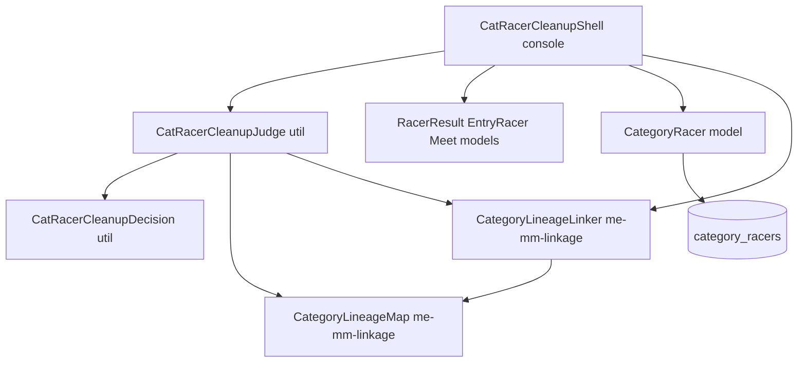
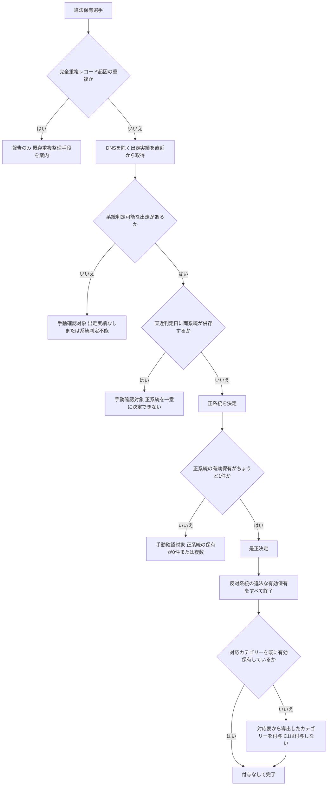
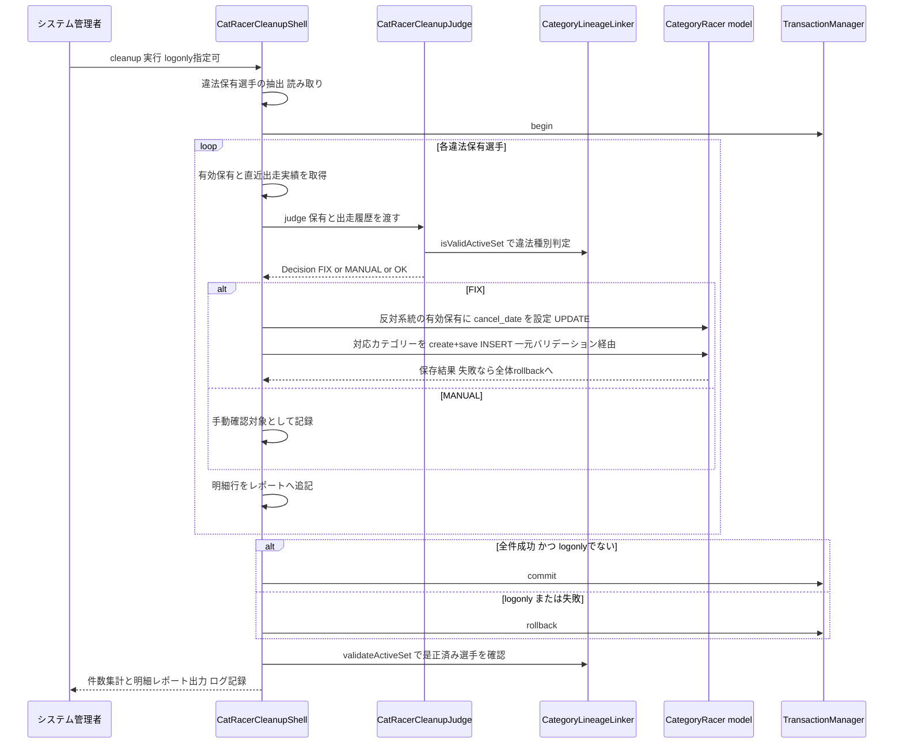

# Design Document: catracer-cleanup-2026-27

## Overview

本機能は、cyclox2web（CakePHP 2.x / PHP 7.3 / MySQL 5.7、`cyclox2_svr/cyclox2/`）に、
`category_racers` に蓄積した違法な有効保有の組合せ（対応外ペア等）を一括検出・是正する
コンソールバッチ（是正バッチ）を追加する。違法判定・対応表・元ME1特例の基準は
me-mm-linkage-2026-27 が定義する `CategoryLineageMap` / `CategoryLineageLinker` の公開 API を
唯一の正として参照し、本 spec 内に対応関係の定義を一切持たない。

**Users**: システム管理者（ローカル検証・本番前検証・本番適用時のバッチ実行者）。

**Impact**: 既存テーブル構造・既存コードは変更しない（新規ファイル追加のみ）。是正は
`category_racers` への UPDATE（cancel_date 設定）と INSERT（対応カテゴリー付与）のみで、
物理削除は行わない。是正の保存はすべて `CategoryRacer` モデル経由で行う。

> **【2026-08-15 改訂】** me-mm-linkage-2026-27 第2版では、一元的な整合性チェックは
> `$validate`（保存を拒否する）ではなく `afterSave()`（検知して警告する）で行われる。
> したがって本バッチの保存が同 spec のチェックに拒否されることはない。
> 一方で、是正の過程で一時的に不整合状態を経由する保存が大量の警告とログを生むため、
> **バッチ実行中は `CategoryRacer::$skipsLineageInspection` を `true` にして検知を抑止する**
> （同 spec がこのフラグを本バッチのために用意している）。
> あわせて、本機能は一度きりの移行処理ではなく**シーズン中も繰り返し実行する継続運用ツール**
> として位置づけ直す（不整合の新規発生は仕組みでは防止されないため）。

### Goals
- 違法な有効保有の組合せを持つ選手の全件検出と、種別分類・判定根拠つきレポート出力（読み取り専用）
- 「直近の出走実態」基準による正系統・正カテゴリー決定と、終了→付与の一括是正
- 任意タイミング実行・冪等・logonly（dry-run）・トランザクション・実行記録
- 是正後データが me-mm-linkage-2026-27 の判定基準で違法ペアゼロであることの検証手段
- TDD で 2026-07-31 までに実装可能な粒度への分解

### Non-Goals
- ME⇔MM 対応表・合法状態・元ME1特例の定義（me-mm-linkage-2026-27 が所有）
- 不整合の再発防止（me-mm-linkage-2026-27 が所有。ただし第2版では「防止」ではなく
  「検知・警告」であり、新規発生自体は止まらない）
- 完全重複レコードの是正（既存 `OneTimeShell::setupDuplicatedCatRacerDeleted()` の守備範囲。
  本バッチは検出・報告のみ）
- シーズン末降格判定の変更（season-rules-2026-27）
- 本番環境への適用作業そのもの（検証済み手順の提供まで。実行は人間）
- 女子系統（CL1〜CL3、WM）・年齢別カテゴリーの保有への変更

## Boundary Commitments

### This Spec Owns
- 違法保有選手の検出処理（読み取り専用）と検証処理（是正後の違法ゼロ確認）
- 「直近の出走実態」に基づく正系統・是正内容の決定ロジック（`CatRacerCleanupJudge`）
- 是正の実行制御（トランザクション・logonly・冪等性・チャンク実行）と
  `category_racers` への終了・付与の適用（`CatRacerCleanupShell`）
- 実行結果レポートの形式と実行ログへの記録
- 是正で付与する行の reason_id / reason_note / apply_date / cancel_date の運用規約

### Out of Boundary
- 対応表（ペア定義）・合法集合判定・元ME1判定のロジック（me-mm-linkage-2026-27 の
  `CategoryLineageMap` / `CategoryLineageLinker` が所有。本 spec は呼び出すのみ）
- `CategoryRacer` モデルの保存後検知（`afterSave()`）と警告蓄積API（同上）
- 完全重複レコードの整理（既存 OneTimeShell）
- res-sys（成績閲覧アプリ）側の変更
- 本番適用のオペレーション（runbook として手順を残すが、実行判断・実行は人間）

### Allowed Dependencies
- me-mm-linkage-2026-27 の公開 API のみ: `CategoryLineageMap::pairedCategory() /
  isEliteCategory() / isMastersCategory() / isLineageManagedCategory() / eliteCategories() /
  mastersCategories()`、`CategoryLineageLinker::isValidActiveSet() / validateActiveSet() /
  isFormerElite1()`（内部実装への直接依存は不可）
- 既存モデル: `CategoryRacer`、`Racer`、`RacerResult`、`EntryRacer`、`EntryCategory`、
  `EntryGroup`、`Meet`、`CategoryRacesCategory`、`TransactionManager`
- 既存 Const: `CategoryReason`（付与理由 `$BY_RULE`）、`RacerResultStatus`（DNS 判定）
- 既存のログ機構（CakeLog / `$this->log()`）

### Revalidation Triggers
- `CategoryLineageMap` の対応ペア定義、または `CategoryLineageLinker` の公開メソッドの
  シグネチャ・戻り値契約が変更された場合
- `CategoryRacer` の保存時バリデーションの適用条件（cancel のみの保存を対象外とする等）が
  変更された場合
- `racer_results.as_category` の運用（設定契機・値域）が変更された場合
- `category_races_categories` の対応（レースカテゴリー⇔カテゴリー）に系統をまたぐ行が
  追加された場合（現状は同一系統内に閉じている）

## Architecture

### Existing Architecture Analysis
- バッチは `app/Console/Command/*Shell.php` に置く規約。`OneTimeShell::execCategoryDown1718()`
  が「TRANSACTION + logonly（処理実行後 rollback）+ cancel→create + CSV 風ログ + 件数集計」の
  実行制御パターンを確立している。ただし OneTimeShell は「1回だけの処理」用のため、反復実行前提の
  本バッチは専用シェルを新設する
- 純粋ロジックは `app/Cyclox/Util/*`、列挙定義は `app/Cyclox/Const/*` に置く規約
  （me-mm-linkage-2026-27 も同構造で `CategoryLineageMap` / `CategoryLineageLinker` を新設する）
- 出走実態は `racer_results`（`as_category`＝出走時の成績対象カテゴリーコード、`status` 0=DNS）
  → `entry_racers` → `entry_categories`（`races_category_code`）→ `entry_groups` → `meets`
  （`at_date`）で辿れる。`as_category` の一括設定は過去に `OneTimeShell::setupAsCategory()` で
  実施済みだが、空のままの古いデータが残存しうる
- `category_racers` の有効保有 = `deleted=0 AND cancel_date IS NULL AND apply_date <= 基準日`。
  未来日 apply_date の自動付与行（年齢別）が存在するため `apply_date <= 基準日` が必須
  （rider-demotion-2025-26 の既知の落とし穴）

### Architecture Pattern & Boundary Map



**Architecture Integration**:
- 選定パターン: 「実行制御・データ入出力（Shell）」と「是正判定（Judge、DB 非依存）」の分離。
  brief の Boundary Candidates（検出/是正の分離、判定/DB 更新の分離）をそのまま採用
- 依存方向: Const（Map）→ Util（Linker, Judge, Decision）→ Model → Console（Shell）の一方向のみ。
  Judge は Model を参照しない（必要データは Shell が整形して渡す）
- 既存パターンの継承: `App::uses()` の層別読込、`TransactionManager`、logonly、CSV 風ログ
- 新規コンポーネントの理由: `CatRacerCleanupShell`（反復実行前提のバッチは OneTimeShell の契約外）、
  `CatRacerCleanupJudge` / `CatRacerCleanupDecision`（Requirement 2・3 の全分岐を DB なしで
  単体テストするため）
- Steering 準拠: 対応表の単一ソース参照（roadmap の Shared seams）。本 spec 内にペア定義・
  カテゴリーコードのハードコード判定を置かない

### Technology Stack

| Layer | Choice / Version | Role in Feature | Notes |
|-------|------------------|-----------------|-------|
| Backend / CLI | PHP 7.3 / CakePHP 2.x Console Shell | バッチ本体 | 新規ライブラリ追加なし |
| Data / Storage | MySQL 5.7（`category_racers` ほか既存テーブル） | 読み取り＋UPDATE/INSERT のみ | スキーマ変更なし・物理削除なし |
| Testing | CakePHP `CakeTestCase`（PHPUnit 基盤）＋ Fixture | Judge 単体・Shell 統合テスト | me-mm-linkage-2026-27 が新設するテストディレクトリ構造・フィクスチャを再利用 |

## File Structure Plan

### Directory Structure
```
app/
├── Cyclox/
│   └── Util/
│       ├── CatRacerCleanupJudge.php      # 新規: 是正判定の純粋ロジック（Requirement 2, 3, 4の決定部分）
│       └── CatRacerCleanupDecision.php   # 新規: 判定結果の値オブジェクト（FIX/MANUAL/OK と是正内容）
├── Console/
│   └── Command/
│       └── CatRacerCleanupShell.php      # 新規: detect / cleanup / verify サブコマンド（Requirement 1, 4, 5, 6, 7）
└── Test/
    ├── Case/
    │   ├── Cyclox/
    │   │   └── Util/
    │   │       └── CatRacerCleanupJudgeTest.php   # 新規: 判定全分岐の純粋単体テスト
    │   └── Console/
    │       └── Command/
    │           └── CatRacerCleanupShellTest.php   # 新規: 検出・是正・logonly・冪等の統合テスト
    └── Fixture/
        ├── MeetFixture.php               # 新規: 出走実態系テストデータ
        ├── EntryGroupFixture.php         # 新規
        ├── EntryCategoryFixture.php      # 新規
        ├── EntryRacerFixture.php         # 新規
        ├── RacerResultFixture.php        # 新規
        └── CategoryRacesCategoryFixture.php # 新規
```

### Modified Files
- なし（既存コードへの変更はない。`CategoryFixture` / `CategoryRacerFixture` / `RacerFixture` は
  me-mm-linkage-2026-27 が新設するものを再利用し、本 spec のテストに必要なデータ行が不足する
  場合は同フィクスチャへ行を追加する）

> `Test/Case` は `app` のクラス配置をミラーする規約（me-mm-linkage-2026-27 が
> `Cyclox/Util`・`Console/Command` 配下のテスト構造を新設済みの前提。未着手の場合は本 spec が
> 同じ対称構造を作る）。

## System Flows

### 是正判定フロー（1選手あたり）



**Key Decisions**:
- 系統判定は `as_category`（出走時の成績対象カテゴリー）を第一材料、空の場合は
  `races_category_code` → `category_races_categories` 対応から系統を導出（Requirement 2.2）
- 手動確認対象（Requirement 3）はデータ変更なし・理由付き報告のみ。安全側に倒す
- 付与カテゴリーは常に `CategoryLineageMap::pairedCategory(正系統の保有コード)`。
  CM1 の対応先は既定の C2 であり、是正による C1 の新規付与は発生しない（Requirement 4.5、
  research.md Decision 参照）

### cleanup 実行シーケンス



**Key Decisions**:
- 是正の適用順序は「終了（UPDATE）→ 付与（INSERT）」。付与時点の有効集合が合法になるため、
  me-mm-linkage-2026-27 のモデルバリデーションが安全網として機能する（Requirement 4.6）。
  cancel のみの保存はバリデーション対象外（同 spec design）なので終了処理は阻害されない
- 1回の実行は単一トランザクション。1件でも保存失敗があれば全体 rollback（Requirement 4.7、5.5）。
  大量データ時は offset/limit 引数でチャンク分割できる（チャンクごとに commit）
- logonly は `execCategoryDown1718` と同じ「全処理実行 → 最後に rollback」方式。判定・保存・
  バリデーションまで本番同等に通るため、dry-run として実質検証になる（Requirement 5.3）

## Requirements Traceability

| Requirement | Summary | Components | Interfaces | Flows |
|-------------|---------|------------|------------|-------|
| 1.1-1.5 | 違法保有の全件検出・分類・レポート | CatRacerCleanupShell, CategoryLineageLinker | `detect`, `isValidActiveSet()` | 是正判定フロー（分類まで） |
| 2.1-2.5 | 直近出走実態による正系統決定 | CatRacerCleanupJudge, CatRacerCleanupShell, CategoryLineageMap | `judge()`, `__recentLineageRaces()` | 是正判定フロー |
| 3.1-3.5 | エッジケースの手動確認送り | CatRacerCleanupJudge, CatRacerCleanupDecision | `judge()`（MANUAL 判定） | 是正判定フロー |
| 4.1-4.7 | 終了→付与の是正実行 | CatRacerCleanupShell, CategoryRacer model, CategoryLineageMap | `cleanup`, `pairedCategory()` | cleanup 実行シーケンス |
| 5.1-5.5 | 任意タイミング・冪等・logonly・トランザクション | CatRacerCleanupShell, TransactionManager | `cleanup`（logonly 引数） | cleanup 実行シーケンス |
| 6.1-6.4 | レポート出力・実行記録 | CatRacerCleanupShell | レポート出力（明細＋集計＋ログ） | cleanup 実行シーケンス |
| 7.1-7.3 | 是正後検証（違法ゼロ確認） | CatRacerCleanupShell, CategoryLineageLinker | `verify`（= detect の再実行） | - |

## Components and Interfaces

| Component | Domain/Layer | Intent | Req Coverage | Key Dependencies (P0/P1) | Contracts |
|-----------|--------------|--------|---------------|---------------------------|-----------|
| CatRacerCleanupJudge | Util | 是正内容の純粋判定 | 2, 3, 4（決定部分） | CategoryLineageMap (P0), CategoryLineageLinker (P0) | Service |
| CatRacerCleanupDecision | Util | 判定結果の値オブジェクト | 3, 4, 6 | なし | State |
| CatRacerCleanupShell | Console | 検出・是正・検証の実行制御と入出力 | 1, 4, 5, 6, 7 | CatRacerCleanupJudge (P0), CategoryRacer model (P0), TransactionManager (P0), 読み取り系モデル (P1) | Batch |

### Util層

#### CatRacerCleanupJudge

| Field | Detail |
|-------|--------|
| Intent | 1選手分の「有効保有＋直近出走履歴」から是正決定（FIX / MANUAL / OK）を導出する DB 非依存の判定エンジン |
| Requirements | 2.1, 2.2, 2.3, 2.4, 3.1, 3.2, 3.3, 3.4, 4.1, 4.2, 4.3, 4.4, 4.5 |

**Responsibilities & Constraints**
- 入力はすべて呼び出し側（Shell / テスト）が整形して渡す。本クラスは DB アクセス・保存を行わない
- 違法性・違法種別の判定は `CategoryLineageLinker::isValidActiveSet()` に委譲し、対応カテゴリーの
  導出は `CategoryLineageMap::pairedCategory()` に委譲する。カテゴリーコードの対応関係・系統
  所属を本クラス内にハードコードしない（Requirement 2.4）
- 系統判定の優先順位: (1) 出走履歴要素の `as_category` を `CategoryLineageMap` で系統判定、
  (2) 空なら要素に添付された対応カテゴリーコード群（`races_category_code` 経由で Shell が解決）
  で判定。全要素で判定不能なら MANUAL（Requirement 2.2, 3.2）
- 是正決定（FIX）の内容: 正系統の維持カテゴリー、終了対象（反対系統の違法な有効保有の行 ID 群）、
  付与カテゴリー（`pairedCategory(維持カテゴリー)`。既に有効保有していれば付与なし）。
  導出結果が C1 になる入力は存在しない（対応表上 CM1→C2 が既定）ことをテストで固定する
  （Requirement 4.5）

**Dependencies**
- Outbound: CategoryLineageMap — 系統判定・対応導出（P0）
- Outbound: CategoryLineageLinker — 集合の違法性判定（P0。判定系メソッドのみ・DB 変更なし）

**Contracts**: Service [x] / API [ ] / Event [ ] / Batch [ ] / State [ ]

##### Service Interface
```php
class CatRacerCleanupJudge
{
    /**
     * 1選手分の是正内容を判定する。
     *
     * @param string $racerCode 選手コード
     * @param array $activeHoldings 有効保有一覧。各要素:
     *   array('id' => int, 'category_code' => string, 'apply_date' => string)
     *   （ME/MM 対象カテゴリーのみ。有効判定条件は Shell 側の責務）
     * @param array $recentRaces 出走実績（DNS除外済み・開催日降順）。各要素:
     *   array('at_date' => string, 'meet_code' => string, 'as_category' => ?string,
     *         'races_category_code' => string, 'linked_category_codes' => string[])
     * @return CatRacerCleanupDecision
     */
    public function judge($racerCode, array $activeHoldings, array $recentRaces);
}
```
- Preconditions: `$activeHoldings` は「実行日時点で有効かつ対応表管理対象」の行のみを含む。
  `$recentRaces` は `meets.at_date` 降順で渡される。
  【2026-09 task 2.3独立レビュー指摘・task 4.1への事前条件】(a) 空配列は「DNS・削除を除いた
  出走実績が0件であること」を意味する（呼び出し側が遡り取得の途中結果など部分的な空チャンクを
  渡してはならない。Requirement 3.1判定の前提となる）。(b) 各要素は`at_date`を必ず持ち、
  全要素で書式が統一されていること（同日判定・降順ソートに文字列比較を用いるため）。
  (c) 判定結果（keep/cancel/grant/系統）は入力配列の順序に依存しないが、同日内に複数の
  系統判定可能な出走がある場合、判定根拠（Requirement 6.2の`race`）に採用されるのは入力配列内で
  先に現れた方であり、これは順序に依存する。同日内の判定根拠を安定させたい場合、SQL側で
  `at_date`に加え`meet_code`等の第二ソートキーを与えること
- Postconditions: 戻り値は必ず OK / FIX / MANUAL / DUP_ONLY のいずれかの status を持つ。
  FIX の場合、`(維持カテゴリー + 付与カテゴリー)` の集合は `isValidActiveSet()` を満たす。
  本メソッドは副作用を持たない（同一入力に対して常に同一出力）
- Invariants: 対応表管理対象外のカテゴリー（CL 系・WM・年齢別等）は判定に関与しない

**Implementation Notes**
- Integration: `App::uses('CatRacerCleanupJudge', 'Cyclox/Util')`。Linker はコンストラクタで
  受け取り、テスト時は実インスタンスをフィクスチャ DB とともに使用（isFormerElite1 等の DB 参照は
  Linker 内部の責務）
- Validation: 全分岐（OK / 5種の MANUAL 理由 / DUP_ONLY / 付与あり FIX / 付与なし FIX /
  同日両系統タイ）を `CatRacerCleanupJudgeTest` で網羅する。
  【2026-09 task 2.2独立レビューround-2 MINOR-4で訂正】Requirement 3.1-3.4 の4種に加え、
  task 2.2で追加した安全ガード由来のMANUAL理由（`MANUAL_REASON_DUPLICATE_HOLDING_UNSAFE_FIX`。
  同一カテゴリーの重複保有時にFIXが安全かを事後検証する。requirements.mdには対応する受入条件が
  ないが、実データで確認された破壊的FIX/no-op FIXのリスクに対する製品オーナー承認済みの追加）
  を合わせて5種となる
- Risks: Linker の `isValidActiveSet()` が「prospective set を呼び出し元が算出して渡す」契約
  であるため、Judge が渡す集合の構築規則をテストで契約化する（me-mm-linkage design の Risks と同旨）

#### CatRacerCleanupDecision

| Field | Detail |
|-------|--------|
| Intent | 判定結果（status・是正内容・判定根拠・手動確認理由）を運ぶ不変の値オブジェクト |
| Requirements | 3.5, 4.3, 6.1, 6.2 |

**Responsibilities & Constraints**
- status: `OK`（違法なし）/ `FIX`（自動是正可）/ `MANUAL`（手動確認対象）/
  `DUP_ONLY`（完全重複起因のみ・既存手段案内）
- FIX 時の内容: `keepCategoryCode`（正系統の維持）、`cancelTargetIds`（終了する行 ID 群）、
  `grantCategoryCode`（付与。不要時は null）
- 共通: `violationType`（対応外ペア／同一系統内複数／同一カテゴリー重複／3件以上）、
  `basis`（採用した直近出走の meet_code / at_date / 出走カテゴリー / 判定系統）、
  `manualReason`（MANUAL 時の理由コード＋説明）
- 生成後は変更不可（コンストラクタで全項目確定）

**Dependencies**
- なし（最下層の値オブジェクト）

**Contracts**: Service [ ] / API [ ] / Event [ ] / Batch [ ] / State [x]

##### State Management
- State model: イミュータブル。レポート明細行への変換メソッド（`toReportLine()`）を持つ
- Persistence & consistency: 永続化しない（レポート・ログ出力の入力になるのみ）
- Concurrency strategy: 不変オブジェクトのため考慮不要

### Console層

#### CatRacerCleanupShell

| Field | Detail |
|-------|--------|
| Intent | 検出（detect）・是正（cleanup）・検証（verify）のサブコマンドを提供し、データ入出力・トランザクション・レポートを担う |
| Requirements | 1.1, 1.2, 1.3, 1.4, 1.5, 2.5, 4.1, 4.2, 4.3, 4.6, 4.7, 5.1, 5.2, 5.3, 5.4, 5.5, 6.1, 6.2, 6.3, 6.4, 7.1, 7.2, 7.3 |

**Responsibilities & Constraints**
- サブコマンド:
  - `detect [offset] [limit]` — 違法保有選手の全件検出・分類・レポート。書き込みなし
    （Requirement 1）
  - `cleanup [offset] [limit] [logonly]` — 是正実行。logonly 指定時は全処理後 rollback
    （Requirement 4, 5）
  - `verify` — 全選手を対象に違法状態の残存を確認し、ゼロなら明示的に報告
    （Requirement 7。実装は detect の全件実行＋ゼロ判定の別出口）
- 違法候補の抽出: 「有効（`deleted=0 AND cancel_date IS NULL AND apply_date <= 実行日`）な
  対応表管理対象カテゴリー保有を2件以上持つ選手」を SQL で抽出し、各選手の有効集合を
  `CategoryLineageLinker::isValidActiveSet()` 相当の判定（Linker 呼び出し）に掛ける。
  管理対象カテゴリーの一覧は `CategoryLineageMap::eliteCategories()/mastersCategories()` から
  取得する（ハードコードしない）
- 出走実績の取得（`__recentLineageRaces()`）: `racer_results`（`status <> DNS` かつ
  `deleted=0`）→ `entry_racers` → `entry_categories` → `entry_groups` → `meets`
  （すべて `deleted=0`）を `meets.at_date` 降順で取得し、`races_category_code` ごとの対応
  カテゴリーコード群（`category_races_categories`、実行時に1回だけロードしてキャッシュ）を
  添えて Judge へ渡す。取得は直近から一定件数ずつ、系統判定可能な出走が見つかるまで遡る
  （Requirement 2.1, 2.5）
- 是正の適用: Decision（FIX）に従い、(1) `cancelTargetIds` の各行へ
  `cancel_date = 実行日の前日` を UPDATE（reason 系フィールドは変更しない）、
  (2) `grantCategoryCode` があれば `apply_date = 実行日`、
  `reason_id = CategoryReason::$BY_RULE->ID()`、reason_note =
  `2026-27対応ペア是正バッチによる（正系統=<code> 根拠=<meet_code>/<at_date>）` で
  create+save（一元バリデーション経由。`validate => false` を使わない）
- 冪等性: 是正済み選手は有効集合が合法になり検出条件に掛からないため、再実行は no-op に収束する
  （実行済みマーカーは持たない。research.md Decision 参照）
- レポート: 1選手1行の CSV 風明細（選手コード, 氏名, 違法種別, 是正前保有, 終了した行,
  付与カテゴリー, 判定根拠, status）を標準出力と専用ログ（CakeLog スコープ
  `catracer_cleanup`）へ出力し、末尾に集計（検出数・FIX数・MANUAL数・DUP_ONLY数・
  終了件数・付与件数、logonly の明示）を出す（Requirement 6）

**Dependencies**
- Outbound: CatRacerCleanupJudge — 是正判定（P0）
- Outbound: CategoryRacer model — 有効保有の取得・終了 UPDATE・付与 INSERT（P0）
- Outbound: CategoryLineageLinker — 検出・検証時の集合判定、是正後の validateActiveSet（P0）
- Outbound: CategoryLineageMap — 管理対象カテゴリー一覧（P0）
- Outbound: TransactionManager — トランザクション制御（P0）
- Outbound: RacerResult / EntryRacer / EntryCategory / EntryGroup / Meet /
  CategoryRacesCategory / Racer models — 出走実績・氏名等の読み取り（P1）

**Contracts**: Service [ ] / API [ ] / Event [ ] / Batch [x] / State [ ]

##### Batch / Job Contract
- Trigger: 手動実行のみ。`Console/cake cat_racer_cleanup <detect|cleanup|verify> [args]`
  （cron 登録はしない。任意タイミングで人間が起動する）
- Input / validation: `offset`/`limit`（整数、チャンク実行用・省略時は全件）、`logonly`
  （cleanup のみ）。不正引数は使用方法を表示して終了
- Output / destination: 標準出力＋専用ログファイル（`app/tmp/logs/catracer_cleanup.log`）。
  終了コード: 正常 0 / 保存失敗・例外 非0
- Idempotency & recovery: 状態収束による冪等（再実行で変更 0 件）。失敗時は全体 rollback で
  実行前状態に復帰し、そのまま再実行可能。チャンク実行時はチャンク単位で commit し、途中失敗
  しても当該チャンクのみ rollback（それ以前のチャンクは確定済み。再実行すれば残件のみ処理される）

**Implementation Notes**
- Integration: me-mm-linkage-2026-27 実装完了（Map / Linker / モデルバリデーション）が前提
  （roadmap Wave 2）。是正 INSERT はモデルバリデーションを通すため、終了→付与の順序を厳守する
- Validation: `CatRacerCleanupShellTest` で検出（違法種別ごと）・是正（終了＋付与の DB 状態）・
  付与なし是正・logonly（rollback 確認）・冪等（2回目実行で変更 0）・保存失敗時 rollback を
  フィクスチャ上で検証する
- Risks: (1) モデルバリデーションが1保存ごとに DB 参照するため大量是正時に遅い可能性 →
  detect で件数を事前把握し、チャンク実行で分割。logonly で所要時間を実測できる。
  (2) 本番実行タイミングのデータ差分 → 実行時点データで判定する設計のため問題にならないが、
  本番でも detect → cleanup logonly → cleanup の順で実行する手順を runbook 化する

## Data Models

### Domain Model
- 新規エンティティなし。`CategoryRacer`（選手×カテゴリー×有効期間）の既存モデルを使用する
- 本 spec が依拠する不変条件（me-mm-linkage-2026-27 所有）: 「選手の ME/MM 有効保有集合は
  空・単独・対応表上の正当ペアのいずれか」。本バッチの是正はこの不変条件を満たさないデータを
  満たす状態へ収束させる操作であり、是正後の集合は必ず不変条件を満たす（Requirement 4.6）

### Logical Data Model
- テーブル構造の変更なし。是正が触るのは `category_racers` の既存カラムのみ:
  - 終了: `cancel_date`（UPDATE。`reason_id`/`reason_note` は元の付与理由のため変更しない）
  - 付与: 新規行 INSERT（`racer_code`, `category_code`, `apply_date`, `reason_id=7`,
    `reason_note=定型文`）
- 読み取り: `racer_results.as_category` / `status`、`entry_categories.races_category_code`、
  `category_races_categories`、`meets.at_date`

### Physical Data Model
- スキーマ変更・インデックス追加なし。検出クエリ（racer_code GROUP BY / HAVING COUNT>=2）と
  出走実績クエリは、rider-demotion-2025-26 で同型のクエリを実データ規模で実行済みであり、
  バッチ用途（対話応答不要）では既存インデックスで許容範囲

### Data Contracts & Integration
- 外部 API・イベントの新設なし。本 spec の対外契約は
  (1) 是正後データが me-mm-linkage-2026-27 の `validateActiveSet()` に合格すること、
  (2) 是正付与行の reason_note 定型文（事後 SQL 検証・ダウンストリーム調査で使用）の2点

## Error Handling

### Error Strategy
- 是正実行は単一（またはチャンク単位の）トランザクションで囲み、保存失敗・例外発生時は
  rollback して実行前状態に戻す。部分適用状態を残さない（Requirement 4.7, 5.5）

### Error Categories and Responses
- **保存失敗（モデルバリデーション拒否を含む）**: 当該選手・保存内容・バリデーションエラーを
  ERR ログに出力し、トランザクション全体を rollback。終了コード非0。バリデーション拒否は
  設計上発生しないはずのため（終了→付与順序で prospective set は合法）、発生時は判定ロジックか
  データの想定外を意味し、自動リトライせず人間の調査に委ねる
- **判定不能（エッジケース）**: エラーではなく MANUAL 判定として正常フローで報告する
  （Requirement 3）。バッチは続行する
- **引数不正**: 使用方法を表示して即終了（DB 接続前）
- **予期しない例外**: `execCategoryDown1718` と同様に catch → rollback → ERR ログ →
  異常終了報告（Requirement 5.5）

### Monitoring
- 専用ログ（CakeLog スコープ `catracer_cleanup`）に明細＋集計を残す。実行日時・モード
  （detect/cleanup/verify、logonly か）をヘッダ行に記録し、実行証跡として参照可能にする
  （Requirement 6.3）。新規監視基盤は導入しない

## Testing Strategy

### Unit Tests（CatRacerCleanupJudgeTest — 純粋判定）
- 対応外ペア（例: CM1+C4）で直近出走が Masters → CM1 維持・C4 終了・C2 付与の FIX 決定
  （2.1, 2.3, 2.4, 4.1-4.3）
- 対応カテゴリーを既に保有（例: C3+CM2+CM3 で正系統 Elite）→ CM3 終了のみ・付与なし（4.4）
- 出走実績ゼロ／系統判定可能な出走なし（女子・年齢別のみ）／同日両系統タイ／正系統の保有 0 件
  または複数 → それぞれ理由コード付き MANUAL（3.1-3.4）
- as_category 空のとき races_category_code 対応（linked_category_codes）で系統判定できる（2.2）
- 完全重複起因の重複保有 → DUP_ONLY（1.5）
- CM1 維持時の付与先が C2 であり C1 が付与されないこと（4.5）
- 同一入力に対する決定の不変性（副作用なし）と、FIX 決定の維持+付与集合が
  `isValidActiveSet()` を満たすこと（4.6）

### Integration Tests（CatRacerCleanupShellTest — フィクスチャ DB）
- detect: 違法種別ごとの選手を混在させたフィクスチャで全件検出・分類・件数が正しい。
  実行後に DB が変化していない（1.1-1.4）
- cleanup: FIX 対象選手の DB 状態が「反対系統に cancel_date=前日設定・対応カテゴリー行が
  reason_id=7＋定型 note で INSERT・正系統は不変」になる（4.1-4.3、日付・reason 運用の確認）
- cleanup logonly: レポートは出るが DB が実行前と完全一致（5.3, 6.4）
- 冪等: cleanup 成功後に再度 cleanup → 変更 0 件・検出 0 件（5.2）
- 保存失敗の rollback: 保存失敗を強制するケースで全変更が取り消される（4.7, 5.5）
- verify: 是正後フィクスチャで「違法ゼロ」を明示報告、違法残存フィクスチャで残存を報告
  （7.1-7.3）
- 未来日 apply_date 行・deleted 行が有効保有・出走実績の判定に混入しない（2.5）

### Batch Tests（実データ検証 — 自動テスト外）
- ローカルダンプに対し detect → cleanup logonly → cleanup → verify を通しで実行し、
  件数・明細・所要時間を `test-results.md` に記録する（brief の In scope。本番適用手順の
  根拠となる）

## 技術要件・制約チェック（SDD overlay / 初回実装時）

### 環境固有の制約
| 制約 | 内容 |
|---|---|
| 言語ランタイムのバージョン制約 | PHP 7.3（既存 Docker 環境準拠）。7.4 以降の構文（`??=` 等）は使用しない |
| データストアのバージョン制約 | MySQL 5.7。スキーマ変更なし。検出 SQL は 5.7 互換の構文のみ使用 |
| Docker / 実行環境での考慮事項 | 既存 docker-compose 環境上で `Console/cake cat_racer_cleanup ...` を実行。ローカル検証はダンプ復元後の DB に対して行う（rider-demotion-2025-26 runbook §1 の手順を流用） |
| その他 | コード実装は submodule `cyclox2_svr/cyclox2/`（cyclox-dev/cyclox2web）側の新規ブランチで行い、PR も submodule 側に発行する。me-mm-linkage-2026-27 の実装完了（CategoryLineageMap / CategoryLineageLinker / モデルバリデーション）が実装着手の前提（roadmap Wave 2） |

### 初回実装前の確認
- [ ] 上記スタック・テスト方針・既存結合・環境制約を確認した
- [ ] 人間が技術要件を確認した（**承認の記録は `spec.json` の design ゲートに集約。本チェックは二重管理しない**）
