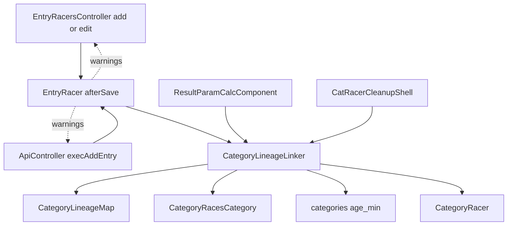
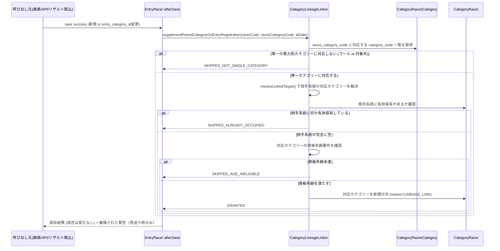
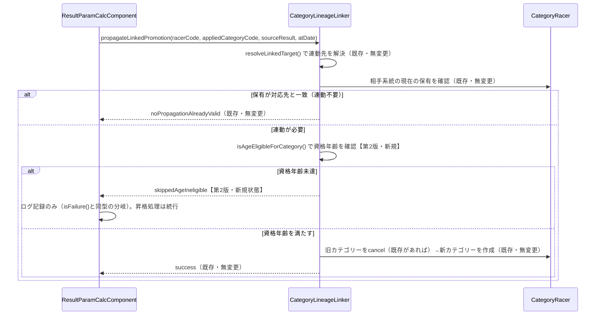
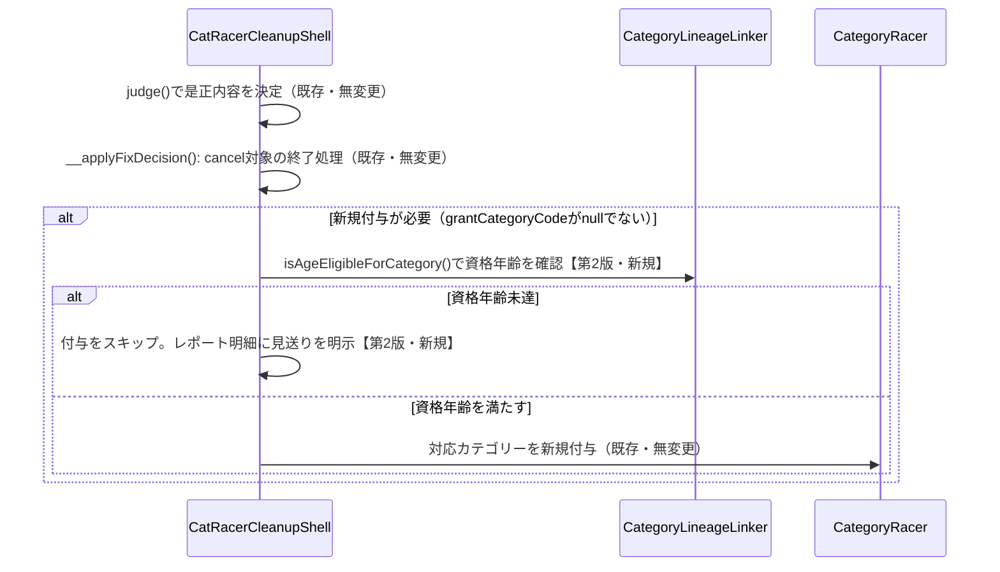

# Design Document: entry-auto-category-2026-27

## 改訂履歴（第2版・2026-09-09）

要件第2版（Requirement 8〜10）を反映し、資格年齢ガードの適用範囲を拡大した。第1版は
エントリー時の対応ペア補完（Requirement 1〜7）のみを対象としていたが、第2版では以下2つの
既存の付与経路にも同じ資格年齢ガードを適用する：

1. レース結果による昇格連動（`CategoryLineageLinker::propagateLinkedPromotion()`、
   me-mm-linkage-2026-27所有）
2. catracer-cleanup-2026-27の是正バッチ（`CatRacerCleanupShell::__applyFixDecision()`）

いずれも判定ロジック自体（誰を昇格させるか、誰を是正対象とするか）は変更せず、カテゴリーを
実際に新規付与する直前にのみ資格年齢確認を追加する。新規選手CSV登録・系統切替画面
（change_em）への適用は対象外（Requirement 10、人間承認済み）。

## Overview

本機能は、選手がレースにエントリーした時点で、実力別エリート（ME1〜ME4）⇔実力別マスターズ
（MM1〜MM3）の対応ペアのうち選手が保有していない側を自動的に補完付与する。対象は「相手系統を
一件も保有していない選手が、対応表上ただ一つのカテゴリーに定まる種目へエントリーした場合」に
限定し、既存の保有状態（正しいペアであれ不整合であれ）には一切介入しない。

**【第2版で追加】** さらに、対応ペアのカテゴリーが新規付与されうる既存の他経路（レース結果による
昇格連動、catracer-cleanup-2026-27の是正バッチ）についても、同一の資格年齢要件を一貫して適用する。

**Users**: 大会主催者（cyclox2webの管理画面利用者）および外部連携クライアント（cyclox2app等）の
利用者が、エントリー登録後に手動でカテゴリーを付与する作業から解放される。システム管理者は、
どの経路でカテゴリーが付与されても資格年齢要件が一貫して確認されることの恩恵を受ける。

**Impact**: `EntryRacer`モデルの保存フックに新たな副作用（対応ペアの補完）を追加する。既存の
エントリー登録・変更の成功/失敗判定、JCX系統固定チェック（jcx-lineage-lock-2026-27）の挙動は
変更しない。**【第2版で追加】** `CategoryLineageLinker::propagateLinkedPromotion()`の内部に
資格年齢チェックを挿入する（既存の呼び出し元インターフェース・戻り値の型は維持し、新しい
結果状態を追加する形の後方互換な変更）。`CatRacerCleanupShell`の是正適用処理にも同様の
チェックを挿入する。いずれも昇格処理・是正バッチの実行そのものは失敗させない。

### Goals
- エントリー登録・変更をトリガーに、対応表上一意に定まる種目への単独保有者の対応ペアを自動補完する
- 資格年齢要件を満たさない付与を行わない
- エントリー登録処理自体の成功/失敗判定に影響を与えない
- 付与を見送った場合、操作者・システム管理者が事後に把握できる
- **【第2版】** 昇格連動・是正バッチによる新規付与についても、同一の資格年齢要件を適用する
- **【第2版】** 資格年齢要件の確認を理由に、昇格処理・是正バッチの実行そのものを失敗・中断させない

### Non-Goals
- プール種目（複数カテゴリーが束ねられた種目）への対応（Requirement 4、対象外と確定済み）
- 既存の単独保有者・休眠選手への一括バックフィル
- 既存の不整合データ（対応外ペア・重複保有等）の是正そのもの
- レース結果による昇格判定そのもの（誰を昇格させるか）・昇格連動の対応先解決ロジック
  （me-mm-linkage-2026-27が引き続き所有。**【第2版】** 新規付与直前の資格年齢チェックのみ追加）
- JCX系統固定チェック（jcx-lineage-lock-2026-27が担当・変更しない）
- **【第2版】** 新規選手CSV登録時のカテゴリー指定への資格年齢ガード適用（Requirement 10.2、
  人間承認済み・対象外）
- **【第2版】** 系統切替画面（change_em）を通じた手動付与への資格年齢ガード適用
  （Requirement 10.3、人間承認済み・対象外）
- **【第2版】** 既に発生している資格年齢要件違反データ（3件確認済み）の遡及是正
  （Requirement 10.4）

## Boundary Commitments

### This Spec Owns
- エントリー登録・変更をトリガーとした対応ペアの補完付与判定ロジック
  （`CategoryLineageLinker`への新規メソッド追加）
- 種目（`races_category_code`）が単一の実力別カテゴリーに対応するかどうかの判定
- 資格年齢要件の判定ロジックそのもの（`CategoryLineageLinker`に共通関数として集約）
- 付与見送りの記録と、画面・API応答・サーバログへの通知
- **【第2版】** `propagateLinkedPromotion()`・catracer-cleanup是正バッチの「新規付与を実行する
  直前」への資格年齢チェックの挿入（挿入点そのものの追加のみ。それぞれの判定ロジック自体は
  引き続き元specが所有）

### Out of Boundary
- ME⇔MM対応表そのものの定義（`CategoryLineageMap`）— me-mm-linkage-2026-27が単一の正
- 元ME1判定・連動先解決ロジック（`CategoryLineageLinker::resolveLinkedTarget()`）— 変更せず
  そのまま呼び出す
- JCX系統固定チェック（`EntryRacer::beforeSave()`の既存ロジック）— 変更しない
- レース結果による昇格判定そのもの（誰が昇格対象か）・連動先の解決ロジック
  （`resolveLinkedTarget()`）— me-mm-linkage-2026-27が引き続き所有。本specは
  `propagateLinkedPromotion()`内の「新規付与直前」に資格年齢チェックを追加するのみで、
  昇格対象の判定・cancel/create自体の意味論は変更しない
- 既存の不整合データの是正ロジックそのもの（誰を是正対象とするか、正系統の判定基準）—
  catracer-cleanup-2026-27が引き続き所有。本specは是正バッチの「新規付与直前」に資格年齢
  チェックを追加するのみ
- プール種目への対応方法 — 本specでは対象外化のみ行い、フォールバック処理は設計しない
- **【第2版】** 新規選手CSV登録時のカテゴリー指定・系統切替画面（change_em）への資格年齢
  ガード適用（Requirement 10.2, 10.3、対象外と人間承認済み）
- **【第2版】** 既存の資格年齢要件違反データ（3件確認済み）の遡及是正（Requirement 10.4）

### Allowed Dependencies
- `CategoryLineageMap`（Const層、me-mm-linkage-2026-27）: 対応表参照
- `CategoryLineageLinker`の既存メソッド`resolveLinkedTarget()`・
  `__findActiveCategoryRacerOnSide()`（Util層、me-mm-linkage-2026-27）: 連動先解決・保有確認
- `CategoryRacer`モデル（me-mm-linkage-2026-27）: カテゴリー付与の保存先
- `CategoryRacesCategory`モデル（既存）: 種目→カテゴリーの多対多解決
- `categories.age_min`列（既存）: 資格年齢要件の情報源
- `Util::uciCXAgeAt()`（既存）: レース開催日基準の年齢計算
- **【第2版】** `CategoryLineageLinker::propagateLinkedPromotion()`（既存・me-mm-linkage-2026-27）:
  内部に資格年齢チェックを挿入する対象。呼び出し元インターフェース・既存の戻り値状態は維持する
- **【第2版】** `CatRacerCleanupShell::__applyFixDecision()`（既存・catracer-cleanup-2026-27）:
  同様にチェックを挿入する対象
- **【第2版】** `Racer.birth_date`（既存）: 資格年齢の算出元

### Revalidation Triggers
- `CategoryLineageMap`の対応表定義が変更された場合
- `categories.age_min`の値または資格年齢の算出基準が変更された場合
- `category_races_categories`のデータ構造（多対多の意味）が変更された場合
- `EntryRacer`モデルの保存フック構成（`beforeSave`/`afterSave`の責務分担）が変更された場合
- **【第2版】** `propagateLinkedPromotion()`の戻り値契約（`CategoryLineagePropagationResult`の
  状態一覧）が変更された場合、呼び出し元（`ResultParamCalcComponent`）の分岐が追随できているか
  再確認が必要
- **【第2版】** `CatRacerCleanupShell`の是正決定オブジェクト（`CatRacerCleanupDecision`）の構造が
  変更された場合

## Architecture

### Existing Architecture Analysis

- `EntryRacer::beforeSave()`は、jcx-lineage-lock-2026-27が実装したJCX系統固定チェックの
  ゲート（保存を拒否しうる）として既に存在する。本機能は同モデルに`afterSave()`を新設し、
  「保存後の副作用（対応ペア補完）」として責務を分離する。
- `CategoryRacer::afterSave()`（me-mm-linkage-2026-27）が「保存後検知・例外を握りつぶす・
  警告を蓄積・複数経路へ配信」というパターンを既に確立している。本機能はこのパターンを
  `EntryRacer`側にも展開する。
- `CategoryLineageLinker::propagateLinkedPromotion()`は「相手系統の旧カテゴリーをcancel→新規
  作成」という昇格連動の意味論を持つ。本機能はこれと異なる「相手系統が完全に空の場合のみ新規
  作成・cancel禁止」という意味論を持つため、別メソッドとして追加する（既存メソッドの契約は
  変更しない）。
- **【第2版】** `propagateLinkedPromotion()`は「対象の相手系統カテゴリーが現在の保有と異なる」
  と判定した場合に無条件でcancel→createを行う。資格年齢チェックはこの直前（cancel/create
  実行前）に挿入する。既存の呼び出し元（`ResultParamCalcComponent`の2箇所）は現在
  `isFailure()`のみを分岐しており、それ以外の状態（`noPropagationNotManaged` /
  `noPropagationAlreadyValid`）はログを出さず素通りさせている。新設する
  `skippedAgeIneligible`もこの既存パターンに倣い、ログ記録のみを行う（`isFailure()`と同型の
  分岐を追加。画面/API応答への表面化は行わない — 既存の`isFailure()`が現状そうなっていない
  ことと平仄を合わせる設計判断。詳細はComponents & Interfaces参照）。
- **【第2版】** `CatRacerCleanupShell::__applyFixDecision()`は、是正決定
  （`CatRacerCleanupDecision`）に含まれる`getGrantCategoryCode()`が非nullの場合に無条件で
  新規付与（INSERT）を行う。資格年齢チェックはこの直前に挿入する。是正対象選手の「終了
  （cancel）」対象行の処理は資格年齢と無関係のため変更しない。

### Architecture Pattern & Boundary Map



**Architecture Integration**:
- 選択したパターン: モデル層の保存フックへ集約（`CategoryRacer::afterSave()`と同型）
- ドメイン境界: 対応ペアの判定・付与ロジックは`CategoryLineageLinker`（Util層）に閉じ、
  `EntryRacer`（Model層）はトリガーと警告の橋渡しのみを担う
- 既存パターンの踏襲: 保存後検知・警告蓄積・3経路配信（me-mm-linkage-2026-27）、モデル保存
  フックへの集約（jcx-lineage-lock-2026-27）
- 新規コンポーネントの理由: `CategoryLineageLinker::supplementPairedCategoryOnEntryRegistration()`
  は既存の`propagateLinkedPromotion()`と意味論が異なる（cancel禁止）ため独立させる
- **【第2版】** 資格年齢の判定ロジックは`CategoryLineageLinker`に共通関数として1箇所へ集約し、
  `supplementPairedCategoryOnEntryRegistration()`・`propagateLinkedPromotion()`・
  `CatRacerCleanupShell`の3箇所から呼び出す（判定ロジックの重複を避ける）。一方、「判定に
  引っかかった時にどう振る舞うか」（ログのみ／レポート明示／既存呼び出し元の分岐パターン）は
  各呼び出し元の既存インターフェースに合わせて個別に設計する（research.md参照）。

### Technology Stack

| Layer | Choice / Version | Role in Feature | Notes |
|-------|------------------|-----------------|-------|
| Backend | CakePHP 2.x / PHP 7.3（既存） | `EntryRacer`モデルフック・`CategoryLineageLinker`拡張 | 新規依存なし |
| Data / Storage | MySQL 5.7（既存） | `category_racers`への新規行追加、`category_races_categories`・`categories.age_min`の参照 | スキーマ変更なし |

## File Structure Plan

### Modified Files
- `app/Model/EntryRacer.php` — `afterSave()`を新設。トリガー条件判定（新規登録、または
  `entry_category_id`変更を伴う更新）、`CategoryLineageLinker`呼び出し、警告蓄積プロパティ
  （`$entryCategorySupplementWarnings`）とゲッターを追加。既存の`beforeSave()`（JCX系統固定
  チェック）は変更しない。
- `app/Cyclox/Util/CategoryLineageLinker.php` — 新規メソッド3つを追加（既存メソッドの契約は
  無変更）:
  - `resolveSingleLineageCategory($racesCategoryCode)`
  - `supplementPairedCategoryOnEntryRegistration($racerCode, $racesCategoryCode, $atDate)`
  - **【第2版】** `isAgeEligibleForCategory($racerCode, $categoryCode, $atDate)` —
    資格年齢要件を満たすかを判定する共通関数（`categories.age_min`と`Racer.birth_date`を
    参照）。上記2メソッドと`propagateLinkedPromotion()`・`CatRacerCleanupShell`の3箇所から
    呼び出される単一の判定ロジック。

  新規の結果値オブジェクト`CategoryLineageSupplementResult`を同ファイル内に追加（既存の
  `CategoryLineagePropagationResult`と同じ配置パターン）。

  **【第2版】** 既存メソッド`propagateLinkedPromotion()`の内部に、cancel/create実行直前で
  `isAgeEligibleForCategory()`を呼び出す分岐を追加する（メソッドのシグネチャ・既存の戻り値
  状態は維持。新しい状態`skippedAgeIneligible($targetCategoryCode)`を
  `CategoryLineagePropagationResult`に追加）。
- `app/Controller/EntryRacersController.php` — `__addOnPage()`・`edit()`に、保存成功時の
  補完警告Flash表示を追加（`__setJcxLockWarningViewVars()`と同型のヘルパーを追加）。
  `__addOnApi()`の成功応答に警告フィールドを追加。
- `app/Controller/ApiController.php` — `execAddEntry()`の成功応答に、`EntryRacer`側で
  蓄積された補完警告を含める（`__summarizeLineageWarnings()`と同型のヘルパーを追加）。
- **【第2版】** `app/Controller/Component/ResultParamCalcComponent.php` — 既存の2箇所の
  `propagateLinkedPromotion()`呼び出し（`isFailure()`のみを分岐している箇所）に、新設した
  `skippedAgeIneligible`状態のログ記録分岐を追加する（既存の`isFailure()`分岐と同型。他の
  戻り値状態と同様、画面/API応答への表面化は行わない）。
- **【第2版】** `app/Console/Command/CatRacerCleanupShell.php` — `__applyFixDecision()`の
  新規付与（INSERT）直前に`isAgeEligibleForCategory()`を呼び出す分岐を追加する。資格年齢
  未達の場合は付与をスキップし（cancel対象の終了処理はそのまま実行する）、是正結果レポートの
  明細行に見送りである旨を追加する。

### Test Files (既存ファイルを拡張)
- `app/Test/Case/Model/EntryRacerTest.php`
- `app/Test/Case/Cyclox/Util/CategoryLineageLinkerTest.php`
- `app/Test/Case/Controller/EntryRacersControllerTest.php`
- `app/Test/Case/Controller/ApiControllerTest.php`
- **【第2版】** `app/Test/Case/Controller/Component/ResultParamCalcComponentTest.php`
- **【第2版】** `app/Test/Case/Console/Command/CatRacerCleanupShellTest.php`

## System Flows



**Key Decisions**:
- 補完処理は保存成功後（`afterSave`）にのみ実行され、失敗しても呼び出し元の保存結果には
  影響しない（Requirement 6.1, 6.2）。
- `SKIPPED_ALREADY_OCCUPIED`は「対応表上の正しいペア」「対応外ペア」「重複保有」のいずれの
  既存状態も区別せず一律にスキップする。これによりRequirement 7（既存不整合への不介入）を
  構造的に満たす。

### 【第2版】昇格連動・是正バッチへの資格年齢ガード挿入フロー





**Key Decisions（第2版）**:
- 資格年齢チェックは両経路とも「新規付与を実行する直前」の1点にのみ挿入し、それ以前の判定
  ロジック（昇格対象の決定、是正対象・正系統の決定）には一切手を加えない。
- `propagateLinkedPromotion()`の呼び出し元（`ResultParamCalcComponent`）は既存の`isFailure()`
  分岐と同型のログ記録のみを行う。画面/API応答への表面化は、既存の`isFailure()`ケースが現状
  そうなっていないことと平仄を合わせ、本改訂のスコープに含めない。
- catracer-cleanupの是正バッチは元々「レポートで人間が確認する」運用のため、見送りの明示は
  レポート明細への追記のみで足りる（リアルタイム通知は不要）。

## Requirements Traceability

| Requirement | Summary | Components | Interfaces | Flows |
|-------------|---------|------------|------------|-------|
| 1.1–1.4 | エントリー時の対応ペア補完（単一種目・相手系統ゼロ保有のみ・cancel禁止） | CategoryLineageLinker | `supplementPairedCategoryOnEntryRegistration()` | 上記シーケンス図 |
| 2.1–2.3 | 対応表・元ME1特例の単一定義への準拠 | CategoryLineageLinker | `resolveLinkedTarget()`（既存・無変更） | 上記シーケンス図の「resolveLinkedTarget」ステップ |
| 3.1–3.2 | 資格年齢要件の保護 | CategoryLineageLinker | `supplementPairedCategoryOnEntryRegistration()`（内部で`categories.age_min`参照） | 上記シーケンス図の「資格年齢要件を確認」ステップ |
| 4.1–4.2 | プール種目の対象外化 | CategoryLineageLinker | `resolveSingleLineageCategory()` | 上記シーケンス図の分岐 |
| 5.1–5.3 | 適用経路の網羅性 | EntryRacer | `afterSave()` | 全経路が`EntryRacer::save()`を経由 |
| 6.1–6.6 | 処理継続性・見送り時の通知 | EntryRacer, EntryRacersController, ApiController | `afterSave()`（try/catch）, 警告蓄積プロパティ, Flash/API応答 | シーケンス図の「ER-->>Caller」 |
| 7.1 | 既存不整合データへの不介入 | CategoryLineageLinker | `supplementPairedCategoryOnEntryRegistration()`の`SKIPPED_ALREADY_OCCUPIED`分岐 | 上記シーケンス図 |
| 8.1–8.4 | 昇格連動への資格年齢ガード適用 | CategoryLineageLinker, ResultParamCalcComponent | `propagateLinkedPromotion()`（拡張）, `isAgeEligibleForCategory()` | 【第2版】昇格連動シーケンス図 |
| 9.1–9.4 | 是正バッチへの資格年齢ガード適用 | CategoryLineageLinker, CatRacerCleanupShell | `__applyFixDecision()`（拡張）, `isAgeEligibleForCategory()` | 【第2版】是正バッチシーケンス図 |
| 10.1–10.4 | 資格年齢ガードの適用対象範囲の明示 | CategoryLineageLinker | `isAgeEligibleForCategory()`の呼び出し元を3箇所に限定（設計上の境界。新規選手CSV登録・change_emからは呼び出さない） | — |

## Components and Interfaces

| Component | Domain/Layer | Intent | Req Coverage | Key Dependencies (P0/P1) | Contracts |
|-----------|--------------|--------|---------------|---------------------------|-----------|
| CategoryLineageLinker（拡張） | Util | エントリー時の対応ペア補完判定・実行、資格年齢ガードの共通判定ロジック | 1, 2, 3, 4, 7, 8, 9, 10 | CategoryLineageMap (P0), CategoryRacesCategory (P0), CategoryRacer (P0), Racer (P0) | Service |
| EntryRacer（拡張） | Model | 保存フックからの補完呼び出しと警告蓄積 | 5, 6 | CategoryLineageLinker (P0) | State |
| EntryRacersController（拡張） | Controller | 個別登録・編集経路での警告配信 | 6.4, 6.5 | EntryRacer (P0) | API |
| ApiController（拡張） | Controller | 一括登録経路での警告配信 | 6.5, 6.6 | EntryRacer (P0) | API |
| ResultParamCalcComponent（拡張） | Component | 昇格連動での資格年齢見送りのログ記録 | 8.2, 8.3 | CategoryLineageLinker (P0) | Service |
| CatRacerCleanupShell（拡張） | Console | 是正バッチでの資格年齢見送りの判定・レポート明示 | 9.1, 9.2, 9.3 | CategoryLineageLinker (P0) | Batch |

### Util層

#### CategoryLineageLinker（拡張）

| Field | Detail |
|-------|--------|
| Intent | エントリー登録・変更をトリガーとした対応ペアの補完付与を判定・実行する。資格年齢ガードの
  共通判定ロジックを提供する |
| Requirements | 1.1, 1.2, 1.3, 1.4, 2.1, 2.2, 2.3, 3.1, 3.2, 4.1, 4.2, 7.1, 8.1, 8.4, 9.1, 9.4, 10.1, 10.2, 10.3 |

**Responsibilities & Constraints**
- 本機能で追加する新規メソッドは、既存の`isValidActiveSet()`・`resolveLinkedTarget()`等の契約を
  一切変更しない（純粋な追加）。**【第2版】** ただし`propagateLinkedPromotion()`は例外的に、
  cancel/create実行直前の分岐追加という形で内部ロジックを拡張する（呼び出し元シグネチャ・
  既存の戻り値状態は維持）。
- 相手系統の判定は「対応表上の正しいペアであるか」を問わず、「何か有効保有しているか」のみで
  行う（既存の`__findActiveCategoryRacerOnSide()`をそのまま再利用）。これによりRequirement 7
  （既存不整合への不介入）を追加ロジックなしに満たす。
- 資格年齢の判定基準日はエントリー先の大会開催日（`$atDate`）とする（レース結果連動と同じ
  基準日の扱い方に揃える）。
- **【第2版】** `isAgeEligibleForCategory()`は`supplementPairedCategoryOnEntryRegistration()`・
  `propagateLinkedPromotion()`・`CatRacerCleanupShell`の3箇所からのみ呼び出される想定とし
  （Requirement 10.1）、新規選手CSV登録・change_emからは呼び出さない（設計上、これらの経路に
  本メソッドへの参照を追加しないことでRequirement 10.2, 10.3を担保する）。
- **【第2版】** 資格年齢はCM1〜CM4がいずれも35歳、C1〜C4は19/17/15/13歳という`categories`の
  既存データにより、「相手系統に既に何か保有している選手への連動」では実質的に判定が
  ブロックされることがない（既に一方の資格年齢を満たしている以上、対応表上の相手カテゴリーの
  資格年齢も構造的に満たすため）。判定が実際に効くのは「相手系統を1件も保有していない選手への
  新規付与」の場合のみ（research.md参照）。

**Contracts**: Service [x] / API [ ] / Event [ ] / Batch [ ] / State [ ]

##### Service Interface
```php
interface CategoryLineageLinkerEntrySupplement {
    /**
     * 指定した races_category_code が対応表管理対象の実力別カテゴリー1つに一意対応するか
     * 判定する。プール種目（複数カテゴリーに対応）または対象外カテゴリーの場合は null。
     * @param string $racesCategoryCode
     * @return string|null
     */
    public function resolveSingleLineageCategory(string $racesCategoryCode): ?string;

    /**
     * エントリー登録・変更をトリガーに、対応ペアの補完付与を判定・実行する。
     * 相手系統に何らかの有効保有が既にある場合（正しいペアか不整合かを問わない）、または
     * 資格年齢要件を満たさない場合は付与を行わない。既存カテゴリーのcancelは一切行わない。
     * @param string $racerCode
     * @param string $racesCategoryCode エントリー先の種目コード
     * @param string $atDate 大会開催日
     * @return CategoryLineageSupplementResult
     */
    public function supplementPairedCategoryOnEntryRegistration(
        string $racerCode,
        string $racesCategoryCode,
        string $atDate
    ): CategoryLineageSupplementResult;

    /**
     * 【第2版・新規】選手が指定カテゴリーの資格年齢要件を、指定日時点で満たしているかを判定する。
     * supplementPairedCategoryOnEntryRegistration()・propagateLinkedPromotion()・
     * CatRacerCleanupShellの3箇所から呼び出される共通判定ロジック。
     * @param string $racerCode
     * @param string $categoryCode 判定対象のカテゴリーコード（categories.age_minを参照）
     * @param string $atDate 判定基準日
     * @return bool 資格年齢要件を満たしていればtrue
     */
    public function isAgeEligibleForCategory(
        string $racerCode,
        string $categoryCode,
        string $atDate
    ): bool;
}
```
- Preconditions: `$racerCode`は存在する選手コード。`$racesCategoryCode`は`races_categories.code`。
- Postconditions: 付与が行われた場合、選手は相手系統に新規の有効カテゴリー1件を保有する。
  付与が行われなかった場合、選手の保有状態は一切変化しない。
- Invariants: 本メソッドは既存の有効カテゴリーを一件も終了（cancel）しない。
  **【第2版】** `isAgeEligibleForCategory()`はDBを変更しない（判定のみ）。

**Implementation Notes**
- Integration: `EntryRacer::afterSave()`から呼び出す。
- Validation: 資格年齢は`Util::uciCXAgeAt()`で計算した年齢と`categories.age_min`を比較する。
- Risks: 大量エントリー時（一括API）のクエリ回数増加は、既存の`asCategory()`等と同等の負荷で
  あり許容範囲（research.md参照）。

### Model層

#### EntryRacer（拡張）

| Field | Detail |
|-------|--------|
| Intent | 保存成功後に対応ペア補完をトリガーし、見送り結果を警告として蓄積する |
| Requirements | 5.1, 5.2, 5.3, 6.1, 6.2, 6.3 |

**Responsibilities & Constraints**
- `afterSave()`は新規登録、および`entry_category_id`の変更を伴う更新の場合にのみ補完処理を
  トリガーする（既存の`beforeSave()`の`__isCategoryLineageRelevantSave()`相当の判定条件を
  流用）。
- 補完処理の例外は`try/catch`で握りつぶし、ログに記録したうえで保存結果に影響させない
  （`CategoryRacer::afterSave()`と同じ方針）。
- エントリーの取消・削除では、既に付与された対応カテゴリーを取り消さない（Requirement 5.3）。

**Dependencies**
- Outbound: CategoryLineageLinker（P0）

**Contracts**: Service [ ] / API [ ] / Event [ ] / Batch [ ] / State [x]

##### State Management
- State model: 警告蓄積は`CategoryRacer::getLineageWarnings()`と同型の一時プロパティ
  （リクエスト内のみ・永続化しない）
- Persistence & consistency: 補完付与自体は`category_racers`テーブルへの新規行追加のみ
- Concurrency strategy: 既存の`CategoryRacer`保存と同じ整合性モデルに従う（追加の排他制御なし）

**Implementation Notes**
- Integration: `EntryRacersController`・`ApiController`が保存後にこのプロパティを読み取り、
  警告として配信する。
- Risks: `beforeSave()`（JCX系統固定チェック）との責務混同を避けるため、コードコメントで
  明示する。

### Controller層

#### EntryRacersController（拡張）

| Field | Detail |
|-------|--------|
| Intent | 個別登録・編集経路での見送り警告の配信 |
| Requirements | 6.4, 6.5 |

**Implementation Notes**
- Integration: `__addOnPage()`・`edit()`で保存成功後にFlashへ警告を追加する
  （`__setJcxLockWarningViewVars()`と同型）。`__addOnApi()`の成功応答へ警告フィールドを追加する。
- Validation: 警告の有無に関わらず、保存自体の成功応答は変化させない（Requirement 6.6）。
- Risks: なし（既存の警告配信パターンの横展開）。

#### ApiController（拡張）

| Field | Detail |
|-------|--------|
| Intent | 一括登録経路（`execAddEntry()`）での見送り警告の配信 |
| Requirements | 6.5, 6.6 |

**Implementation Notes**
- Integration: `__summarizeLineageWarnings()`と同型のヘルパーで、`execAddEntry()`内で保存された
  各`EntryRacer`から蓄積警告を集約し、成功応答に追加情報として含める。
- Validation: 既存のcyclox2app向け成功/失敗判定フォーマットを変更しない（追加フィールドのみ）。

### Component層【第2版】

#### ResultParamCalcComponent（拡張）

| Field | Detail |
|-------|--------|
| Intent | 昇格連動（`propagateLinkedPromotion()`）が資格年齢未達で付与を見送った場合のログ記録 |
| Requirements | 8.2, 8.3 |

**Responsibilities & Constraints**
- 既存の2箇所の呼び出し（エリート側昇格に伴う連動、マスターズ側昇格に伴う連動）それぞれに、
  `skippedAgeIneligible`状態のログ記録分岐を追加する。既存の`isFailure()`分岐と同じ形式
  （`$this->log(...)`）を踏襲し、新しいログスコープや通知チャネルは導入しない。
- 昇格処理そのもの（昇格元カテゴリーの変更、保持ポイント付与、リザルト取込の続行）には一切
  影響しない（Requirement 8.2）。

**Dependencies**
- Outbound: CategoryLineageLinker（P0、既存の呼び出しを通じて間接的に依存）

**Contracts**: Service [ ] / API [ ] / Event [ ] / Batch [ ] / State [ ]

**Implementation Notes**
- Integration: 既存の`$propagationResult->isFailure()`の直後に
  `$propagationResult->isSkippedAgeIneligible()`（新設）の分岐を追加する。
- Validation: ログメッセージに選手コード・見送られたカテゴリーコードを含める（事後追跡性）。
- Risks: なし（既存の`isFailure()`分岐と対称の追加）。

#### CatRacerCleanupShell（拡張）

| Field | Detail |
|-------|--------|
| Intent | 是正バッチが資格年齢未達で付与を見送った場合の判定とレポート明示 |
| Requirements | 9.1, 9.2, 9.3 |

**Responsibilities & Constraints**
- `__applyFixDecision()`の新規付与（INSERT）直前に`isAgeEligibleForCategory()`を呼び出す。
  資格年齢未達の場合、当該選手の付与のみをスキップする（cancel対象の終了処理は影響を受けず
  実行される。是正後の状態は「単独保有」となり、me-mm-linkage-2026-27のRequirement 2.2が
  定める正常な状態に該当する）。
- 是正バッチの実行そのもの（他選手の是正処理、トランザクションのコミット）は資格年齢の確認を
  理由に中断・失敗させない（Requirement 9.3）。

**Dependencies**
- Outbound: CategoryLineageLinker（P0）

**Contracts**: Service [ ] / API [ ] / Event [ ] / Batch [x] / State [ ]

##### Batch / Job Contract
- Trigger: 既存の`cleanup`サブコマンド実行（無変更）
- Input / validation: 既存の是正決定（`CatRacerCleanupDecision`）に加え、資格年齢の確認を
  新規付与の直前に追加
- Output / destination: 既存の是正結果レポートに、資格年齢見送りを明示する明細行を追加
- Idempotency & recovery: 既存の冪等性・logonlyモード・トランザクション制御は無変更

**Implementation Notes**
- Integration: `__applyFixDecision()`の`if ($grantCategoryCode !== null)`ブロック内、
  `create()`呼び出しの前に判定を挿入する。
- Validation: レポート明細に「資格年齢要件未達のため見送り」である旨と対象カテゴリーコードを
  含める。
- Risks: なし（既存の是正判定ロジック・レポート構造への追加のみ）。

## Data Models

### Domain Model
本機能は新しいドメイン概念を導入しない。既存の`category_racers`（カテゴリー認定履歴）に
`reason_id = CategoryReason::$LINEAGE_LINK`（既存の定数、reason_note文言で「昇格連動」と
「エントリー補完」を区別）の新規行を追加するのみ。**【第2版】** 昇格連動・是正バッチ経由の
新規付与は、それぞれ既存の`reason_id`（`CategoryReason::$LINEAGE_LINK`・`$BY_RULE`）をそのまま
用いる（新しいreason区分は導入しない）。「資格年齢要件を満たさず付与を見送った」という事実
そのものはcategory_racersに行として残らない（付与しなかったため）。ログ・レポートにのみ記録
される。

### Logical Data Model
- スキーマ変更なし。既存テーブル（`category_racers`, `category_races_categories`, `categories`）
  をそのまま参照する。

## Error Handling

### Error Strategy
- 補完処理の失敗は保存処理自体を失敗させない（Requirement 6.1, 6.2）。`EntryRacer::afterSave()`
  内で例外を捕捉し、ログに記録する。

### Error Categories and Responses
**System Errors**: 補完判定・付与処理中の予期しない例外 → ログ記録のうえ処理継続（保存済みの
エントリーはそのまま有効）。
**Business Logic Errors**: 資格年齢未達・相手系統既保有・プール種目 → いずれもエラーではなく
「付与見送り」として扱い、Requirement 6の通知経路で伝達する。**【第2版】** 昇格連動・是正
バッチでの資格年齢未達も同様に「付与見送り」として扱うが、通知経路は各呼び出し元の既存パターン
に従う（昇格連動＝ログのみ、是正バッチ＝レポート明細）。いずれも昇格処理・是正バッチの実行
そのものを失敗させない（Requirement 8.2, 9.3）。

### Monitoring
既存の`CakeLog`スコープ運用（jcx-lineage-lock-2026-27の`jcx_lineage_lock`スコープ相当）に
倣い、専用ログスコープ（例: `entry_auto_category`）を用いる。**【第2版】** 昇格連動での見送りも
同スコープへ記録する。

## Testing Strategy

### Unit Tests
- `CategoryLineageLinker::resolveSingleLineageCategory()`: 単一カテゴリー対応・プール種目・
  対象外カテゴリーの3パターン
- `CategoryLineageLinker::supplementPairedCategoryOnEntryRegistration()`: 正常付与、相手系統
  既保有（正しいペア/対応外ペア/重複の3パターン）でのスキップ、資格年齢未達でのスキップ、
  元ME1特例経由でのC1付与
- **【第2版】** `CategoryLineageLinker::isAgeEligibleForCategory()`: 資格年齢ちょうど・1日前・
  1日後の境界値、CM1〜CM4（35歳）・C1〜C4（19/17/15/13歳）それぞれでの判定
- **【第2版】** `CategoryLineageLinker::propagateLinkedPromotion()`（拡張分）: 相手系統が空かつ
  資格年齢未達での`skippedAgeIneligible`返却・cancel/createが実行されないことの確認、相手系統
  既保有（＝既に資格年齢を満たす）での通常のcancel→create動作が維持されることの確認（回帰）

### Integration Tests
- `EntryRacer::afterSave()`: 新規登録での補完発火、`entry_category_id`変更を伴う更新での
  再判定、無関係フィールド更新での非発火、保存失敗時の非発火
- 一括API（`ApiController::execAddEntry()`）経由での`saveAssociated()`カスケードによる補完発火
- **【第2版】** `ResultParamCalcComponent`の2箇所の昇格連動呼び出し: 資格年齢未達での
  ログ記録・昇格処理自体の続行、資格年齢を満たす場合の従来どおりの連動動作（回帰）
- **【第2版】** `CatRacerCleanupShell::__applyFixDecision()`: 資格年齢未達での付与スキップ・
  cancel処理は実行されること・レポート明細への見送り明示、logonlyモードでの同一挙動

### E2E/UI Tests
- 管理画面での個別エントリー登録 → 対応ペアが補完され、Flashに何も表示されない（正常系）
- 資格年齢未達の選手のエントリー登録 → 保存は成功するが、見送りのFlashが表示される
- **【第2版】** リザルトアップロードで昇格が発生し、対象選手が資格年齢未達 → リザルト取込は
  成功し、対象選手の相手系統は変化しない
- **【第2版】** 是正バッチ（`cleanup`サブコマンド）実行で資格年齢未達の選手を含む → バッチは
  正常終了し、レポートに見送り選手が明示される

## 技術要件・制約チェック（SDD overlay / 初回実装時）

### 環境固有の制約
| 制約 | 内容 |
|---|---|
| 言語ランタイムのバージョン制約 | PHP 7.3 / CakePHP 2.x（既存踏襲、変更なし） |
| データストアのバージョン制約 | MySQL 5.7（既存踏襲、スキーマ変更なし） |
| Docker / 実行環境での考慮事項 | 既存の`cyclox2_svr`コンテナ構成をそのまま使用 |
| その他 | なし |

### 初回実装前の確認
- [x] 上記スタック・テスト方針・既存結合・環境制約を確認した
- [ ] 人間が技術要件を確認した（承認の記録は`spec.json`のdesignゲートに集約）
