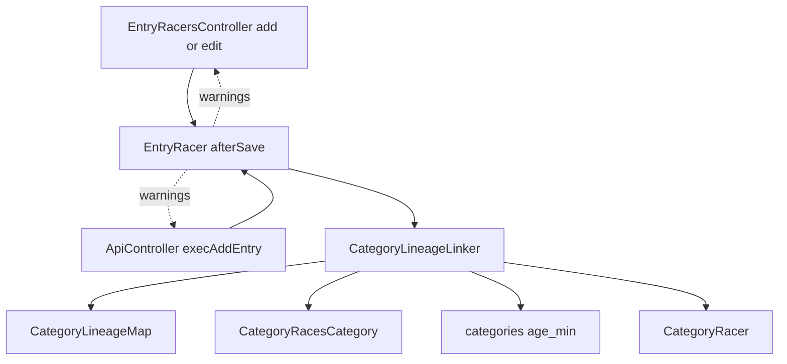
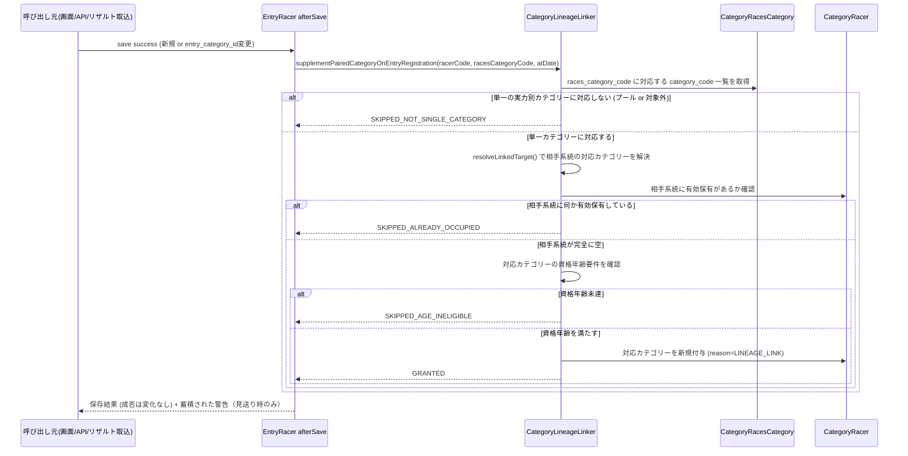

# Design Document: entry-auto-category-2026-27

## Overview

本機能は、選手がレースにエントリーした時点で、実力別エリート（ME1〜ME4）⇔実力別マスターズ
（MM1〜MM3）の対応ペアのうち選手が保有していない側を自動的に補完付与する。対象は「相手系統を
一件も保有していない選手が、対応表上ただ一つのカテゴリーに定まる種目へエントリーした場合」に
限定し、既存の保有状態（正しいペアであれ不整合であれ）には一切介入しない。

**Users**: 大会主催者（cyclox2webの管理画面利用者）および外部連携クライアント（cyclox2app等）の
利用者が、エントリー登録後に手動でカテゴリーを付与する作業から解放される。

**Impact**: `EntryRacer`モデルの保存フックに新たな副作用（対応ペアの補完）を追加する。既存の
エントリー登録・変更の成功/失敗判定、JCX系統固定チェック（jcx-lineage-lock-2026-27）の挙動は
変更しない。

### Goals
- エントリー登録・変更をトリガーに、対応表上一意に定まる種目への単独保有者の対応ペアを自動補完する
- 資格年齢要件を満たさない付与を行わない
- エントリー登録処理自体の成功/失敗判定に影響を与えない
- 付与を見送った場合、操作者・システム管理者が事後に把握できる

### Non-Goals
- プール種目（複数カテゴリーが束ねられた種目）への対応（Requirement 4、対象外と確定済み）
- 既存の単独保有者・休眠選手への一括バックフィル
- 既存の不整合データ（対応外ペア・重複保有等）の是正
- レース結果による昇格連動（me-mm-linkage-2026-27で実装済み・変更しない）
- JCX系統固定チェック（jcx-lineage-lock-2026-27が担当・変更しない）

## Boundary Commitments

### This Spec Owns
- エントリー登録・変更をトリガーとした対応ペアの補完付与判定ロジック
  （`CategoryLineageLinker`への新規メソッド追加）
- 種目（`races_category_code`）が単一の実力別カテゴリーに対応するかどうかの判定
- 補完付与にあたっての資格年齢チェック
- 付与見送りの記録と、画面・API応答・サーバログへの通知

### Out of Boundary
- ME⇔MM対応表そのものの定義（`CategoryLineageMap`）— me-mm-linkage-2026-27が単一の正
- 元ME1判定・連動先解決ロジック（`CategoryLineageLinker::resolveLinkedTarget()`）— 変更せず
  そのまま呼び出す
- JCX系統固定チェック（`EntryRacer::beforeSave()`の既存ロジック）— 変更しない
- レース結果による昇格連動（`CategoryLineageLinker::propagateLinkedPromotion()`）— 変更せず、
  本specの新規メソッドとは完全に独立させる
- 既存の不整合データの是正 — catracer-cleanup-2026-27の管轄
- プール種目への対応方法 — 本specでは対象外化のみ行い、フォールバック処理は設計しない

### Allowed Dependencies
- `CategoryLineageMap`（Const層、me-mm-linkage-2026-27）: 対応表参照
- `CategoryLineageLinker`の既存メソッド`resolveLinkedTarget()`・
  `__findActiveCategoryRacerOnSide()`（Util層、me-mm-linkage-2026-27）: 連動先解決・保有確認
- `CategoryRacer`モデル（me-mm-linkage-2026-27）: カテゴリー付与の保存先
- `CategoryRacesCategory`モデル（既存）: 種目→カテゴリーの多対多解決
- `categories.age_min`列（既存）: 資格年齢要件の情報源
- `Util::uciCXAgeAt()`（既存）: レース開催日基準の年齢計算

### Revalidation Triggers
- `CategoryLineageMap`の対応表定義が変更された場合
- `categories.age_min`の値または資格年齢の算出基準が変更された場合
- `category_races_categories`のデータ構造（多対多の意味）が変更された場合
- `EntryRacer`モデルの保存フック構成（`beforeSave`/`afterSave`の責務分担）が変更された場合

## Architecture

### Existing Architecture Analysis

- `EntryRacer::beforeSave()`は、jcx-lineage-lock-2026-27が実装したJCX系統固定チェックの
  ゲート（保存を拒否しうる）として既に存在する。本機能は同モデルに`afterSave()`を新設し、
  「保存後の副作用（対応ペア補完）」として責務を分離する。
- `CategoryRacer::afterSave()`（me-mm-linkage-2026-27）が「保存後検知・例外を握りつぶす・
  警告を蓄積・複数経路へ配信」というパターンを既に確立している。本機能はこのパターンを
  `EntryRacer`側にも展開する。
- `CategoryLineageLinker::propagateLinkedPromotion()`は「相手系統の旧カテゴリーをcancel→新規
  作成」という昇格連動の意味論を持つ。本機能はこれと異なる「相手系統が完全に空の場合のみ新規
  作成・cancel禁止」という意味論を持つため、別メソッドとして追加する（既存メソッドの契約は
  変更しない）。

### Architecture Pattern & Boundary Map



**Architecture Integration**:
- 選択したパターン: モデル層の保存フックへ集約（`CategoryRacer::afterSave()`と同型）
- ドメイン境界: 対応ペアの判定・付与ロジックは`CategoryLineageLinker`（Util層）に閉じ、
  `EntryRacer`（Model層）はトリガーと警告の橋渡しのみを担う
- 既存パターンの踏襲: 保存後検知・警告蓄積・3経路配信（me-mm-linkage-2026-27）、モデル保存
  フックへの集約（jcx-lineage-lock-2026-27）
- 新規コンポーネントの理由: `CategoryLineageLinker::supplementPairedCategoryOnEntryRegistration()`
  は既存の`propagateLinkedPromotion()`と意味論が異なる（cancel禁止）ため独立させる

### Technology Stack

| Layer | Choice / Version | Role in Feature | Notes |
|-------|------------------|-----------------|-------|
| Backend | CakePHP 2.x / PHP 7.3（既存） | `EntryRacer`モデルフック・`CategoryLineageLinker`拡張 | 新規依存なし |
| Data / Storage | MySQL 5.7（既存） | `category_racers`への新規行追加、`category_races_categories`・`categories.age_min`の参照 | スキーマ変更なし |

## File Structure Plan

### Modified Files
- `app/Model/EntryRacer.php` — `afterSave()`を新設。トリガー条件判定（新規登録、または
  `entry_category_id`変更を伴う更新）、`CategoryLineageLinker`呼び出し、警告蓄積プロパティ
  （`$entryCategorySupplementWarnings`）とゲッターを追加。既存の`beforeSave()`（JCX系統固定
  チェック）は変更しない。
- `app/Cyclox/Util/CategoryLineageLinker.php` — 新規メソッド2つを追加（既存メソッドは無変更）:
  `resolveSingleLineageCategory($racesCategoryCode)`、
  `supplementPairedCategoryOnEntryRegistration($racerCode, $racesCategoryCode, $atDate)`。
  新規の結果値オブジェクト`CategoryLineageSupplementResult`を同ファイル内に追加（既存の
  `CategoryLineagePropagationResult`と同じ配置パターン）。
- `app/Controller/EntryRacersController.php` — `__addOnPage()`・`edit()`に、保存成功時の
  補完警告Flash表示を追加（`__setJcxLockWarningViewVars()`と同型のヘルパーを追加）。
  `__addOnApi()`の成功応答に警告フィールドを追加。
- `app/Controller/ApiController.php` — `execAddEntry()`の成功応答に、`EntryRacer`側で
  蓄積された補完警告を含める（`__summarizeLineageWarnings()`と同型のヘルパーを追加）。

### Test Files (既存ファイルを拡張)
- `app/Test/Case/Model/EntryRacerTest.php`
- `app/Test/Case/Cyclox/Util/CategoryLineageLinkerTest.php`
- `app/Test/Case/Controller/EntryRacersControllerTest.php`
- `app/Test/Case/Controller/ApiControllerTest.php`

## System Flows



**Key Decisions**:
- 補完処理は保存成功後（`afterSave`）にのみ実行され、失敗しても呼び出し元の保存結果には
  影響しない（Requirement 6.1, 6.2）。
- `SKIPPED_ALREADY_OCCUPIED`は「対応表上の正しいペア」「対応外ペア」「重複保有」のいずれの
  既存状態も区別せず一律にスキップする。これによりRequirement 7（既存不整合への不介入）を
  構造的に満たす。

## Requirements Traceability

| Requirement | Summary | Components | Interfaces | Flows |
|-------------|---------|------------|------------|-------|
| 1.1–1.4 | エントリー時の対応ペア補完（単一種目・相手系統ゼロ保有のみ・cancel禁止） | CategoryLineageLinker | `supplementPairedCategoryOnEntryRegistration()` | 上記シーケンス図 |
| 2.1–2.3 | 対応表・元ME1特例の単一定義への準拠 | CategoryLineageLinker | `resolveLinkedTarget()`（既存・無変更） | 上記シーケンス図の「resolveLinkedTarget」ステップ |
| 3.1–3.2 | 資格年齢要件の保護 | CategoryLineageLinker | `supplementPairedCategoryOnEntryRegistration()`（内部で`categories.age_min`参照） | 上記シーケンス図の「資格年齢要件を確認」ステップ |
| 4.1–4.2 | プール種目の対象外化 | CategoryLineageLinker | `resolveSingleLineageCategory()` | 上記シーケンス図の分岐 |
| 5.1–5.3 | 適用経路の網羅性 | EntryRacer | `afterSave()` | 全経路が`EntryRacer::save()`を経由 |
| 6.1–6.6 | 処理継続性・見送り時の通知 | EntryRacer, EntryRacersController, ApiController | `afterSave()`（try/catch）, 警告蓄積プロパティ, Flash/API応答 | シーケンス図の「ER-->>Caller」 |
| 7.1 | 既存不整合データへの不介入 | CategoryLineageLinker | `supplementPairedCategoryOnEntryRegistration()`の`SKIPPED_ALREADY_OCCUPIED`分岐 | 上記シーケンス図 |

## Components and Interfaces

| Component | Domain/Layer | Intent | Req Coverage | Key Dependencies (P0/P1) | Contracts |
|-----------|--------------|--------|---------------|---------------------------|-----------|
| CategoryLineageLinker（拡張） | Util | エントリー時の対応ペア補完判定・実行 | 1, 2, 3, 4, 7 | CategoryLineageMap (P0), CategoryRacesCategory (P0), CategoryRacer (P0) | Service |
| EntryRacer（拡張） | Model | 保存フックからの補完呼び出しと警告蓄積 | 5, 6 | CategoryLineageLinker (P0) | State |
| EntryRacersController（拡張） | Controller | 個別登録・編集経路での警告配信 | 6.4, 6.5 | EntryRacer (P0) | API |
| ApiController（拡張） | Controller | 一括登録経路での警告配信 | 6.5, 6.6 | EntryRacer (P0) | API |

### Util層

#### CategoryLineageLinker（拡張）

| Field | Detail |
|-------|--------|
| Intent | エントリー登録・変更をトリガーとした対応ペアの補完付与を判定・実行する |
| Requirements | 1.1, 1.2, 1.3, 1.4, 2.1, 2.2, 2.3, 3.1, 3.2, 4.1, 4.2, 7.1 |

**Responsibilities & Constraints**
- 本機能で追加する2メソッドは、既存の`isValidActiveSet()`・`resolveLinkedTarget()`・
  `propagateLinkedPromotion()`等の契約を一切変更しない（純粋な追加）。
- 相手系統の判定は「対応表上の正しいペアであるか」を問わず、「何か有効保有しているか」のみで
  行う（既存の`__findActiveCategoryRacerOnSide()`をそのまま再利用）。これによりRequirement 7
  （既存不整合への不介入）を追加ロジックなしに満たす。
- 資格年齢の判定基準日はエントリー先の大会開催日（`$atDate`）とする（レース結果連動と同じ
  基準日の扱い方に揃える）。

**Dependencies**
- Outbound: CategoryLineageMap（対応表参照, P0）
- Outbound: CategoryRacesCategory model（種目→カテゴリー解決, P0）
- Outbound: CategoryRacer model（保有確認・新規付与, P0）
- Outbound: `categories.age_min`（資格年齢参照, P0）

**Contracts**: Service [x] / API [ ] / Event [ ] / Batch [ ] / State [ ]

##### Service Interface
```php
interface CategoryLineageLinkerEntrySupplement {
    /**
     * 指定した races_category_code が対応表管理対象の実力別カテゴリー1つに一意対応するか
     * 判定する。プール種目（複数カテゴリーに対応）または対象外カテゴリーの場合は null。
     * @param string $racesCategoryCode
     * @return string|null
     */
    public function resolveSingleLineageCategory(string $racesCategoryCode): ?string;

    /**
     * エントリー登録・変更をトリガーに、対応ペアの補完付与を判定・実行する。
     * 相手系統に何らかの有効保有が既にある場合（正しいペアか不整合かを問わない）、または
     * 資格年齢要件を満たさない場合は付与を行わない。既存カテゴリーのcancelは一切行わない。
     * @param string $racerCode
     * @param string $racesCategoryCode エントリー先の種目コード
     * @param string $atDate 大会開催日
     * @return CategoryLineageSupplementResult
     */
    public function supplementPairedCategoryOnEntryRegistration(
        string $racerCode,
        string $racesCategoryCode,
        string $atDate
    ): CategoryLineageSupplementResult;
}
```
- Preconditions: `$racerCode`は存在する選手コード。`$racesCategoryCode`は`races_categories.code`。
- Postconditions: 付与が行われた場合、選手は相手系統に新規の有効カテゴリー1件を保有する。
  付与が行われなかった場合、選手の保有状態は一切変化しない。
- Invariants: 本メソッドは既存の有効カテゴリーを一件も終了（cancel）しない。

**Implementation Notes**
- Integration: `EntryRacer::afterSave()`から呼び出す。
- Validation: 資格年齢は`Util::uciCXAgeAt()`で計算した年齢と`categories.age_min`を比較する。
- Risks: 大量エントリー時（一括API）のクエリ回数増加は、既存の`asCategory()`等と同等の負荷で
  あり許容範囲（research.md参照）。

### Model層

#### EntryRacer（拡張）

| Field | Detail |
|-------|--------|
| Intent | 保存成功後に対応ペア補完をトリガーし、見送り結果を警告として蓄積する |
| Requirements | 5.1, 5.2, 5.3, 6.1, 6.2, 6.3 |

**Responsibilities & Constraints**
- `afterSave()`は新規登録、および`entry_category_id`の変更を伴う更新の場合にのみ補完処理を
  トリガーする（既存の`beforeSave()`の`__isCategoryLineageRelevantSave()`相当の判定条件を
  流用）。
- 補完処理の例外は`try/catch`で握りつぶし、ログに記録したうえで保存結果に影響させない
  （`CategoryRacer::afterSave()`と同じ方針）。
- エントリーの取消・削除では、既に付与された対応カテゴリーを取り消さない（Requirement 5.3）。

**Dependencies**
- Outbound: CategoryLineageLinker（P0）

**Contracts**: Service [ ] / API [ ] / Event [ ] / Batch [ ] / State [x]

##### State Management
- State model: 警告蓄積は`CategoryRacer::getLineageWarnings()`と同型の一時プロパティ
  （リクエスト内のみ・永続化しない）
- Persistence & consistency: 補完付与自体は`category_racers`テーブルへの新規行追加のみ
- Concurrency strategy: 既存の`CategoryRacer`保存と同じ整合性モデルに従う（追加の排他制御なし）

**Implementation Notes**
- Integration: `EntryRacersController`・`ApiController`が保存後にこのプロパティを読み取り、
  警告として配信する。
- Risks: `beforeSave()`（JCX系統固定チェック）との責務混同を避けるため、コードコメントで
  明示する。

### Controller層

#### EntryRacersController（拡張）

| Field | Detail |
|-------|--------|
| Intent | 個別登録・編集経路での見送り警告の配信 |
| Requirements | 6.4, 6.5 |

**Implementation Notes**
- Integration: `__addOnPage()`・`edit()`で保存成功後にFlashへ警告を追加する
  （`__setJcxLockWarningViewVars()`と同型）。`__addOnApi()`の成功応答へ警告フィールドを追加する。
- Validation: 警告の有無に関わらず、保存自体の成功応答は変化させない（Requirement 6.6）。
- Risks: なし（既存の警告配信パターンの横展開）。

#### ApiController（拡張）

| Field | Detail |
|-------|--------|
| Intent | 一括登録経路（`execAddEntry()`）での見送り警告の配信 |
| Requirements | 6.5, 6.6 |

**Implementation Notes**
- Integration: `__summarizeLineageWarnings()`と同型のヘルパーで、`execAddEntry()`内で保存された
  各`EntryRacer`から蓄積警告を集約し、成功応答に追加情報として含める。
- Validation: 既存のcyclox2app向け成功/失敗判定フォーマットを変更しない（追加フィールドのみ）。

## Data Models

### Domain Model
本機能は新しいドメイン概念を導入しない。既存の`category_racers`（カテゴリー認定履歴）に
`reason_id = CategoryReason::$LINEAGE_LINK`（既存の定数、reason_note文言で「昇格連動」と
「エントリー補完」を区別）の新規行を追加するのみ。

### Logical Data Model
- スキーマ変更なし。既存テーブル（`category_racers`, `category_races_categories`, `categories`）
  をそのまま参照する。

## Error Handling

### Error Strategy
- 補完処理の失敗は保存処理自体を失敗させない（Requirement 6.1, 6.2）。`EntryRacer::afterSave()`
  内で例外を捕捉し、ログに記録する。

### Error Categories and Responses
**System Errors**: 補完判定・付与処理中の予期しない例外 → ログ記録のうえ処理継続（保存済みの
エントリーはそのまま有効）。
**Business Logic Errors**: 資格年齢未達・相手系統既保有・プール種目 → いずれもエラーではなく
「付与見送り」として扱い、Requirement 6の通知経路で伝達する。

### Monitoring
既存の`CakeLog`スコープ運用（jcx-lineage-lock-2026-27の`jcx_lineage_lock`スコープ相当）に
倣い、専用ログスコープ（例: `entry_auto_category`）を用いる。

## Testing Strategy

### Unit Tests
- `CategoryLineageLinker::resolveSingleLineageCategory()`: 単一カテゴリー対応・プール種目・
  対象外カテゴリーの3パターン
- `CategoryLineageLinker::supplementPairedCategoryOnEntryRegistration()`: 正常付与、相手系統
  既保有（正しいペア/対応外ペア/重複の3パターン）でのスキップ、資格年齢未達でのスキップ、
  元ME1特例経由でのC1付与

### Integration Tests
- `EntryRacer::afterSave()`: 新規登録での補完発火、`entry_category_id`変更を伴う更新での
  再判定、無関係フィールド更新での非発火、保存失敗時の非発火
- 一括API（`ApiController::execAddEntry()`）経由での`saveAssociated()`カスケードによる補完発火

### E2E/UI Tests
- 管理画面での個別エントリー登録 → 対応ペアが補完され、Flashに何も表示されない（正常系）
- 資格年齢未達の選手のエントリー登録 → 保存は成功するが、見送りのFlashが表示される

## 技術要件・制約チェック（SDD overlay / 初回実装時）

### 環境固有の制約
| 制約 | 内容 |
|---|---|
| 言語ランタイムのバージョン制約 | PHP 7.3 / CakePHP 2.x（既存踏襲、変更なし） |
| データストアのバージョン制約 | MySQL 5.7（既存踏襲、スキーマ変更なし） |
| Docker / 実行環境での考慮事項 | 既存の`cyclox2_svr`コンテナ構成をそのまま使用 |
| その他 | なし |

### 初回実装前の確認
- [x] 上記スタック・テスト方針・既存結合・環境制約を確認した
- [ ] 人間が技術要件を確認した（承認の記録は`spec.json`のdesignゲートに集約）
