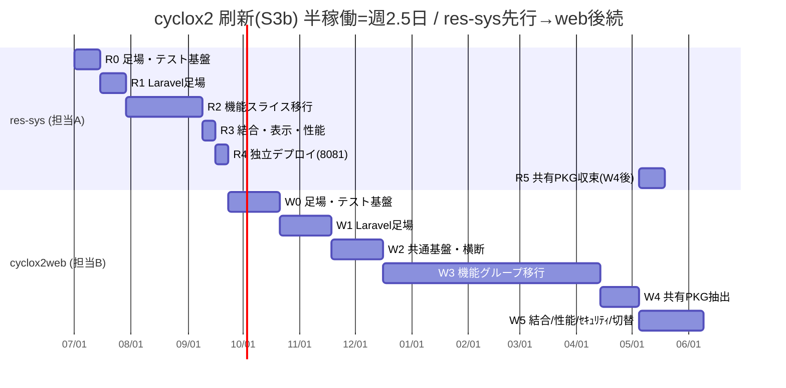
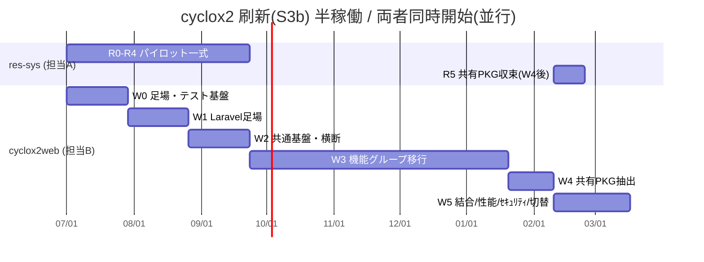

# 開発タスク・工数・ガント（S3b 採用）

> 親: [README.md](README.md) ／ タスク詳細CSV: [tasks-cyclox2web.csv](tasks-cyclox2web.csv) / [tasks-cyclox2res-sys.csv](tasks-cyclox2res-sys.csv)

## 前提（確定要求仕様ベースライン）
- ゴール水準 **S3b**: PHP 8.3 + Laravel 12、共有ドメインを Composer パッケージ化（GitHub VCS 配布）、res-sys は **read-only・別サーバー独立デプロイ**、DBスキーマ不変、CI3延命措置は**挟まない**。
- 体制: **担当者2名（cyclox2web 担当B / res-sys 担当A）、各 半稼働（週2.5日）**。Claude Code(Opus)主体＋本人レビュー/テスト。
- 進行: **res-sys 先行 → cyclox2web 後続**（res-sys をパイロットにして移行パターンを確立）。
- 詳細未確定のため、各タスクは確定仕様の範囲で見積もり。確度 **±40%**（テスト皆無・未知の業務分岐で上振れしやすい）。
- カレンダー換算: 工数(人日) ÷ 2.5 = 所要週。開始は相対（プレースホルダ 2026-07-01、実日付へスライド可）。

## 工数サマリ
| 担当 | アプリ | 総工数 | 半稼働カレンダー |
|---|---|---|---|
| 担当A | cyclox2res-sys | 約 30.5 人日 | パイロット約11週 ＋ R5(共有PKG収束)約1.5週(web依存) |
| 担当B | cyclox2web | 約 92 人日 | 約 37 週 |
| 合計 | — | 約 122.5 人日 | 直列(res-sys先行/web後続)で**約49週(≈11ヶ月)** |

> **重要トレードオフ**: 「res-sys先行→web後続」を直列で組むと web 着手が約12週遅れ、全体は約49週。担当が別人なら **両者を同時開始（並行）すると全体は約37週(≈8.5ヶ月、webが長辺)** に短縮できる。下のガントは指定どおり直列。並行版が必要なら依存(`after`)を外して再描画する。

## クロス依存（唯一の担当間依存）
- **res-sys R5（共有パッケージ収束）は web W4.2（共有ロジック抽出）完了が前提**。それ以外は各担当が独立に進行。

---

## ガント（Mermaid・直列: res-sys先行→web後続）

## ガント（Mermaid・参考: 両者同時開始＝並行）

---

## マイルストーン
| MS | 内容 | 直列 目安 | 並行 目安 |
|---|---|---|---|
| MS1 | res-sys パイロット稼働(別サーバー) | 〜12週 | 〜12週 |
| MS2 | web 計算系3群(W3.4-3.6)完了 | 〜37週 | 〜25週 |
| MS3 | 共有パッケージ提供(W4) | 〜44週 | 〜32週 |
| MS4 | res-sys 共有PKG収束(R5) | 〜46週 | 〜34週 |
| MS5 | web 本番切替・旧Cake2停止(W5) | 〜49週 | 〜37週 |

## 注記
- 工数は確定仕様レベルの粗見積もり。要件・設計を詰める(`/kiro-spec-init`)と各タスクが分解され精度が上がる。
- 計算系(W0.3 / W3.4-3.6 / W5.2)は最大リスク。ゴールデン突合に十分なバッファを置く。
- 並行版は web が長辺(クリティカルパス)。短縮したい場合は web 側の増員/稼働率引き上げが最も効く。
