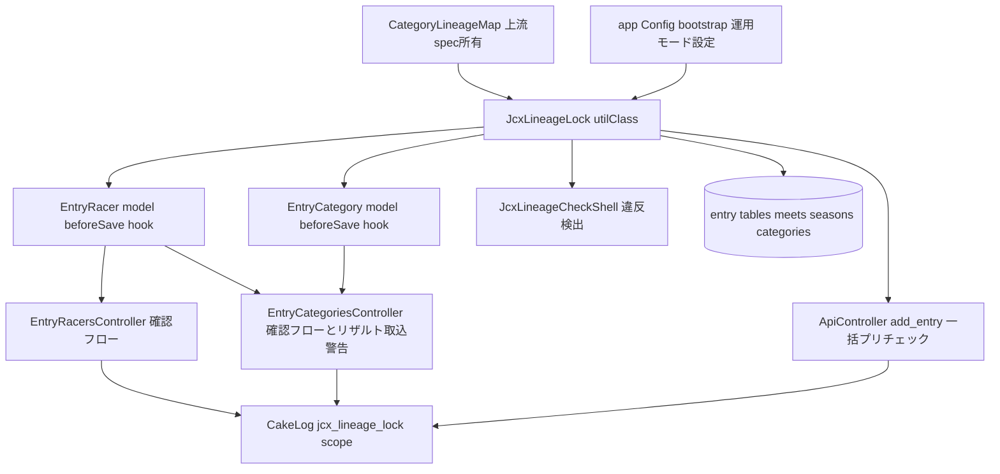
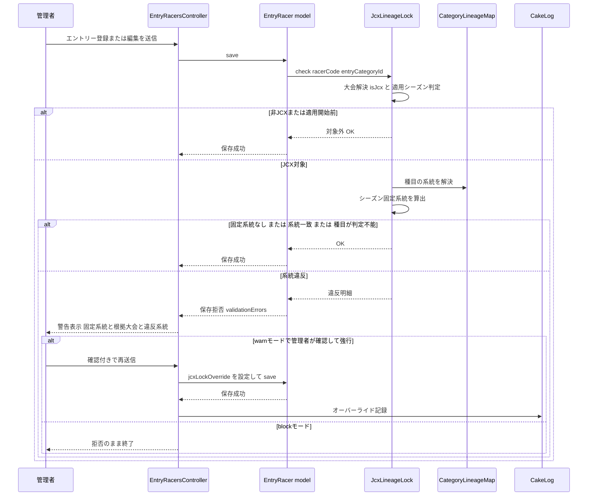
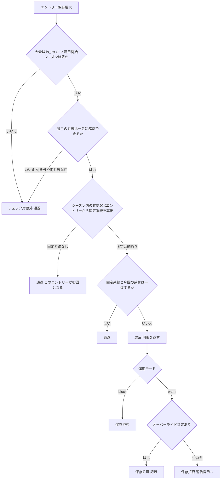

# Design Document: jcx-lineage-lock-2026-27

## Overview

本機能は、cyclox2web（CakePHP 2.x / PHP 7.3 / MySQL 5.7、`cyclox2_svr/cyclox2/`）のエントリー
登録・変更機能に「JCX系統固定チェック」を追加する。選手が当該シーズンのJCX戦（`meets.is_jcx = 1`）
に最初にエントリーした系統（エリート/マスターズ）を固定系統とし、同一シーズンの他のJCX戦へ
異なる系統でエントリーしようとする操作を、すべての書込経路（管理画面・外部API・リザルトファイル
取込）で検出して警告または拒否する。

**Users**: 大会主催者・システム管理者（画面からのエントリー登録・編集・種目変更・リザルト取込）、
外部エントリー管理ツール利用の主催者（API一括登録）。

**Impact**: エントリー関連テーブルのスキーマは変更しない。`EntryRacer`/`EntryCategory` モデルの
保存フローに一元的な検査フックを追加し、各コントローラには警告表示・オーバーライドのUXのみを
追加する。非JCX大会のエントリー処理は挙動を一切変更しない。系統判定は上流spec
（me-mm-linkage-2026-27）の `CategoryLineageMap` を単一の正として参照する。

### Goals
- JCX戦へのエントリー登録・変更の全経路で、同一の判定基準による系統固定チェックを行う
- 固定系統を「シーズン内の有効なJCXエントリーのうち開催日最古のもの」から都度算出し、
  取消・削除再作成でも常に正しい判定を返す
- 制御強度（ハードエラー/警告+管理者確認）を運用モード設定で切替可能にし、オーバーライドは
  必ず記録する
- 違反状態の一覧を出力する運用支援シェルを提供する
- 2026-07-31 までにTDDで実装可能な粒度に分解できる設計にする

### Non-Goals
- 通常戦（非JCX）のエントリー制御変更
- カテゴリー保有（`category_racers`）の整合性管理（me-mm-linkage-2026-27）
- JCXシリーズのポイント計算・集計の変更（`ResultParamCalcComponent` の is_jcx 分岐は不変更）
- res-sys（成績閲覧アプリ）側の変更
- 選手統合（unite_racer）で事後的に生じる系統混在の是正（検出シェルで発見し運用対処）
- `CatLimitShell` / `racers.cat_limit` の既存挙動の変更

## Boundary Commitments

### This Spec Owns
- JCX系統固定の判定ロジック（`JcxLineageLock` Util）: レースカテゴリー→系統の解決、
  シーズン固定系統の算出、違反判定（単体・一括）
- `EntryRacer` / `EntryCategory` モデル保存時のJCX系統固定チェックフック
- 各エントリー経路（画面・API・リザルト取込）の警告表示・オーバーライドUXとその記録
- 運用モード（warn/block）・適用開始シーズンの設定定義
- 違反検出シェル（`JcxLineageCheckShell`）

### Out of Boundary
- 系統（エリート/マスターズ）そのものの定義・対応表（me-mm-linkage-2026-27 の
  `CategoryLineageMap` が所掌。本specは公開APIを参照するのみで再定義しない）
- `meets.is_jcx` の設定UI・意味（既存の大会登録機能のまま）
- 通常戦エントリーの挙動、エントリー画面の既存フロー自体の再設計
- `category_racers` への保存・バリデーション（me-mm-linkage-2026-27）
- res-sys、およびJCXポイント計算（point-sim / calc_rule 系）

### Allowed Dependencies
- 上流: me-mm-linkage-2026-27 の `CategoryLineageMap` **公開APIのみ**
  （`isEliteCategory` / `isMastersCategory` / `eliteCategories` / `mastersCategories` /
  `isLineageManagedCategory`。内部実装・privateメンバーへの依存は不可）
- 既存テーブル（読み取りのみ）: `meets`（is_jcx, season_id, at_date）、`seasons`（start_date）、
  `entry_groups` / `entry_categories` / `entry_racers`、`races_categories`、
  `category_races_categories`、`categories`
- 既存の `app/Cyclox/Const/*` enum風パターン、`App::uses()` レイヤー読込規約、SoftDelete
  （deleted=0 での有効判定）、`CakeLog`
- スキーマ変更なし（インデックス追加のみ、性能実測で必要と判明した場合に限り人間承認の上で許容）

### Revalidation Triggers
- `CategoryLineageMap` の対応ペア定義・公開APIシグネチャが変更された場合（上流specの
  Revalidation Trigger と対）
- `meets.is_jcx` の意味・設定方法が変更された場合
- エントリーの新しい書込経路（新コントローラ・新API）が追加され、`EntryRacer`/`EntryCategory`
  モデルの save 系を経由しない場合
- シーズン境界の管理方法（`meets.season_id` / `seasons`）が変更された場合
- 制御強度のデフォルト運用モードが人間承認で確定・変更された場合（設定値と文書の同期）

## Architecture

### Existing Architecture Analysis
- エントリーは `entry_groups`（大会内グループ）→ `entry_categories`（種目=races_category を持つ）
  → `entry_racers`（選手行）の3階層。書込は6経路あるが、選手行・種目の書込はすべて
  `EntryRacer`/`EntryCategory` モデルの save 系メソッド（save/saveMany/saveAssociated）を経由する
  （research.md 全数調査）。両モデルに既存の beforeSave フックは無く、追加しても既存挙動と
  衝突しない
- `meets.is_jcx` は現在 `ResultParamCalcComponent`（ポイント計算）のみが参照。エントリー経路に
  JCX判定は存在しない
- `app/Cyclox/Util/*` にモデル横断の純粋ロジックを置く規約、`app/Cyclox/Const/*` に enum風
  定数クラスを置く規約が確立している（me-mm-linkage も同規約で `CategoryLineageMap` /
  `CategoryLineageLinker` を配置）
- 外部API（`ApiController::add_entry`）は「同名エントリーグループの削除→再作成」方式のため、
  判定時に再作成対象自身の旧エントリーを根拠から除外する必要がある（Requirement 4.2）

### Architecture Pattern & Boundary Map



**Architecture Integration**:
- 選定パターン: research.md の評価どおり「モデル層フック一元化 + コントローラUX分離」
  （案A）。判定ロジック（Util）/ 強制点（Model hook）/ 警告・オーバーライドUX（Controller）/
  運用支援（Shell）を分離する
- ドメイン境界: 「系統の定義」は上流specが所有し、本specは「JCX戦という文脈での系統の
  時系列制約」だけを所有する。判定は読み取り専用で、書込への介入は保存の許否のみ
- 依存方向: Const（上流Map）→ Util（JcxLineageLock）→ Model（hook）→ Controller / Console。
  逆方向参照は禁止。me-mm-linkage と同一の層構造を踏襲
- 新規コンポーネントの理由: `JcxLineageLock`（判定基準を全経路・シェルで共有するため単一
  Utilに集約）、`JcxLineageCheckShell`（warn運用・非ブロック経路で残り得る違反の事後検出が
  要件 6 で要求されるため）

### Technology Stack

| Layer | Choice / Version | Role in Feature | Notes |
|-------|------------------|-----------------|-------|
| Backend | PHP 7.3 / CakePHP 2.x | 既存フレームワークのまま。Util/Model hook/Controller/Shell を追加 | 新規ライブラリ追加なし |
| Data / Storage | MySQL 5.7（既存テーブルのみ・読み取り） | 判定はエントリー階層+meets/seasons+カテゴリー対応の読み取りjoin | DDLなし（インデックス追加のみ条件付き許容） |
| Config | CakePHP `Configure`（bootstrap.php） | 運用モード（warn/block）・適用開始日の保持 | コード変更なしの切替（Requirement 1.4, 5.1） |
| Logging | `CakeLog`（専用scope `jcx_lineage_lock`） | オーバーライド記録・違反警告・内部エラー記録 | Requirement 5.3, 4.3, 7.4 |
| Testing | CakePHP `CakeTestCase`（`app/Test/`） | Util/Model/Controller/Shell のTDD | 既存テスト基盤のまま |

## File Structure Plan

### Directory Structure（新規ファイル）
```
cyclox2_svr/cyclox2/app/
├── Cyclox/
│   └── Util/
│       ├── JcxLineageLock.php            # 新規: 判定エンジン（系統解決・固定系統算出・違反判定）
│       └── JcxLineageCheckResult.php     # 新規: 判定結果の値オブジェクト（違反明細を保持）
├── Console/
│   └── Command/
│       └── JcxLineageCheckShell.php      # 新規: シーズン内違反の一覧出力シェル（Requirement 6）
├── View/
│   └── Elements/
│       └── jcx_lock_warning.ctp          # 新規: 警告+確認（オーバーライド）表示の共通エレメント
└── Test/
    ├── Case/
    │   ├── Cyclox/Util/
    │   │   └── JcxLineageLockTest.php            # 新規
    │   ├── Model/
    │   │   ├── EntryRacerTest.php                # 新規（本spec分のフック検証）
    │   │   └── EntryCategoryTest.php             # 新規（種目変更時の一括検証）
    │   ├── Controller/
    │   │   ├── EntryRacersControllerTest.php     # 新規（確認フロー）
    │   │   ├── EntryCategoriesControllerTest.php # 新規（編集確認+リザルト取込警告）
    │   │   └── ApiControllerTest.php             # 新規（一括プリチェック・応答仕様）
    │   └── Console/Command/
    │       └── JcxLineageCheckShellTest.php      # 新規
    └── Fixture/
        ├── SeasonFixture.php             # 新規（2025-26 / 2026-27 の2シーズン）
        ├── MeetFixture.php               # 新規（is_jcx=0/1、season_id、at_date のバリエーション）
        ├── EntryGroupFixture.php         # 新規
        ├── EntryCategoryFixture.php      # 新規
        ├── EntryRacerFixture.php         # 新規
        ├── RacesCategoryFixture.php      # 新規
        └── CategoryRacesCategoryFixture.php # 新規（種目→カテゴリー対応）
```
> `CategoryFixture` / `RacerFixture` は me-mm-linkage-2026-27 が新設予定のものを再利用する
> （存在しない場合のみ本specで作成する。フィクスチャの重複定義はしない）。

### Modified Files
- `app/Model/EntryRacer.php` — `beforeSave` を新設し、`JcxLineageLock::check()` へ委譲。
  違反かつオーバーライド未指定なら保存を拒否（false + validationErrors設定）。オーバーライド
  受付用の public プロパティ（例: `$jcxLockOverride`）を追加
- `app/Model/EntryCategory.php` — `beforeSave` を新設。既存レコードの `races_category_code`
  変更時のみ、所属する有効 EntryRacer 全員を `checkBulk()` で検証
- `app/Controller/EntryRacersController.php` — `__addOnPage()` / `__addOnApi()` / `edit()` で
  保存失敗が系統違反による場合に警告（違反明細）を表示し、warn モード時は確認付き再送信
  （オーバーライド）を受け付ける。オーバーライド実行を記録
- `app/Controller/EntryCategoriesController.php` — `edit()`（種目変更）に同様の警告・確認
  フロー。`__write_results()`（リザルト取込）は saveMany 前に `checkBulk()` を実行し、違反を
  記録+結果画面に警告表示のうえ非ブロックで続行（オーバーライド扱いで記録）
- `app/Controller/ApiController.php` — `execAddEntry()` の `saveAssociated` 前に対象全選手を
  `checkBulk()`（再作成対象の旧エントリー除外指定付き）でプリチェック。違反ありかつ
  オーバーライド指定なしなら登録せず違反一覧をJSON応答。指定ありかつ warn モードなら
  実行+記録
- `app/Config/bootstrap.php` — 設定キー `Configure::write('JcxLineageLock', ...)` を追加
  （`mode`: 'warn'|'block'、`effectiveFrom`: '2026-04-01'）
- `app/Config/core.php` または bootstrap — `CakeLog` の scope `jcx_lineage_lock` 用ログ設定を追加
- `app/View/EntryRacers/`・`app/View/EntryCategories/` の該当ビュー — 警告エレメント
  （`jcx_lock_warning.ctp`）の組み込みと確認用hidden項目の追加（対象ctpは既存フォームの
  add/edit系。実装時に画面フローに合わせて特定する）

## System Flows

### 管理画面（個別エントリー）での検出・確認フロー



**Key Decisions**:
- 強制点はモデル（beforeSave）にあり、コントローラは表示と確認受付のみを担う。確認付き
  再送信時もモデルの関門を通る（override プロパティで明示スキップ+必ず記録）
- blockモードではコントローラが確認UI自体を出さない（Requirement 5.4）

### 判定ロジック（JcxLineageLock::check）の決定フロー



- 判定は読み取り専用。内部エラー時は fail-open（記録して通過。Requirement 7.4、
  research.md Decision 参照）
- 固定系統の算出対象は「同一シーズン・is_jcx=1・deleted=0 の entry_racers」を大会開催日昇順・
  同日時はエントリーID昇順で並べた先頭。除外ID指定（削除→再作成経路用）を受け付ける

## Requirements Traceability

| Requirement | Summary | Components | Interfaces | Flows |
|-------------|---------|------------|------------|-------|
| 1.1 | is_jcx による対象識別 | JcxLineageLock | `isCheckTarget()` | 決定フロー |
| 1.2 | 非JCXは従来どおり | JcxLineageLock, EntryRacer hook | `isCheckTarget()` が false で即通過 | 決定フロー |
| 1.3 | 適用開始前シーズンは対象外 | JcxLineageLock, Config | `isCheckTarget()`（seasons.start_date と effectiveFrom 比較） | 決定フロー |
| 1.4 | 適用開始基準の設定化 | Config（bootstrap） | `Configure JcxLineageLock.effectiveFrom` | - |
| 2.1 | 系統判定の単一ソース共有 | JcxLineageLock → CategoryLineageMap | `lineageOfRacesCategory()` | - |
| 2.2 | 初回JCXエントリーで固定 | JcxLineageLock | `fixedLineage()` | 決定フロー |
| 2.3 | エントリー無しは未確定 | JcxLineageLock | `fixedLineage()` が null | 決定フロー |
| 2.4 | 取消時の再判定 | JcxLineageLock | 都度算出（deleted=0 のみ参照） | - |
| 2.5 | 系統判定不能種目は対象外 | JcxLineageLock | `lineageOfRacesCategory()` が null で通過 | 決定フロー |
| 2.6 | 出走有無を問わない | JcxLineageLock | `fixedLineage()`（entry_racers のみ参照） | - |
| 3.1 | 画面新規登録の検出 | EntryRacer hook, EntryRacersController | `beforeSave` → `check()` | 確認フロー |
| 3.2 | 画面編集（所属変更）の検出 | EntryRacer hook, EntryRacersController | 同上（編集時は既存行とマージして判定） | 確認フロー |
| 3.3 | 種目変更の一括検出 | EntryCategory hook | `beforeSave` → `checkBulk()` | - |
| 3.4 | 警告の表示内容 | jcx_lock_warning.ctp, JcxLineageCheckResult | 違反明細（選手・固定系統・根拠大会・違反系統） | 確認フロー |
| 3.5 | 未確定時は通過し固定確定 | JcxLineageLock | `fixedLineage()` null → 通過 | 決定フロー |
| 4.1 | API違反一覧応答 | ApiController | `checkBulk()` + JSONエラー応答 | - |
| 4.2 | 削除再作成時の自己除外 | ApiController, JcxLineageLock | `checkBulk(excludeMeetCode)` | - |
| 4.3 | リザルト取込の警告記録 | EntryCategoriesController | `checkBulk()` + ログ + 結果画面警告 | - |
| 4.4 | リザルト取込は非ブロック | EntryCategoriesController | override 扱いで続行+記録 | - |
| 5.1 | 運用モードの設定切替 | Config, JcxLineageLock | `Configure JcxLineageLock.mode` | 決定フロー |
| 5.2 | warn時の画面オーバーライド | EntryRacersController, EntryCategoriesController | 確認付き再送信 + `$jcxLockOverride` | 確認フロー |
| 5.3 | オーバーライドの記録 | CakeLog scope jcx_lineage_lock | 実行者・選手・大会・違反内容・日時 | 確認フロー |
| 5.4 | block時はオーバーライド不可 | JcxLineageLock, 各Controller | mode=block で override 無効+UI非表示 | 決定フロー |
| 5.5 | 【2026-08-15改訂】API違反はoverride有無によらず受理し完了 | ApiController | 違反時も登録を完了、`jcx_lineage_violations` を応答に含める | - |
| 5.6 | オーバーライド指定はログ区別として記録 | ApiController, CakeLog | override パラメータ + ログ（強行/自動受理の区別） | - |
| 6.1 | 違反一覧の取得手段 | JcxLineageCheckShell | `detect` サブコマンド（season指定） | - |
| 6.2 | 一覧の出力項目 | JcxLineageCheckShell, JcxLineageCheckResult | 選手・大会・開催日・系統 | - |
| 7.1 | 非JCXの非影響 | EntryRacer hook | is_jcx 判定を最初に行い即 return | 決定フロー |
| 7.2 | 個別チェックの応答時間 | JcxLineageLock | インデックス済みjoin+リクエスト内メモ化 | - |
| 7.3 | 一括チェックの性能 | JcxLineageLock | `checkBulk()`（IN句一括クエリ） | - |
| 7.4 | 内部エラー時 fail-open | JcxLineageLock | try-catch + エラーログ + 通過 | - |
| 7.5 | チェックは読み取り専用 | JcxLineageLock | 判定メソッドは SELECT のみ | - |

## Components and Interfaces

| Component | Domain/Layer | Intent | Req Coverage | Key Dependencies (P0/P1) | Contracts |
|-----------|--------------|--------|---------------|---------------------------|-----------|
| JcxLineageLock | Util | JCX系統固定の判定エンジン（読み取り専用） | 1, 2, 5.1, 7 | CategoryLineageMap (P0), entry系/meets/seasons テーブル (P0), Configure (P1) | Service |
| JcxLineageCheckResult | Util（値オブジェクト） | 判定結果・違反明細の受け渡し | 3.4, 4.1, 6.2 | なし | State |
| EntryRacer hook | Model | 選手エントリー保存の強制点 | 3.1, 3.2, 3.5, 7.1 | JcxLineageLock (P0) | Service |
| EntryCategory hook | Model | 種目変更保存の強制点 | 3.3 | JcxLineageLock (P0) | Service |
| EntryRacersController（拡張） | Controller | 個別登録・編集の警告/確認UX | 3.1, 3.2, 3.4, 5.2, 5.3, 5.4 | EntryRacer hook (P0), jcx_lock_warning.ctp (P1) | Service |
| EntryCategoriesController（拡張） | Controller | 種目変更の警告/確認UX + リザルト取込警告 | 3.3, 3.4, 4.3, 4.4, 5.2, 5.3 | EntryCategory hook (P0), JcxLineageLock (P0) | Service |
| ApiController（拡張） | Controller | API一括登録のプリチェックと応答 | 4.1, 4.2, 5.5, 5.6 | JcxLineageLock (P0) | API |
| JcxLineageCheckShell | Console | シーズン違反状態の検出・一覧出力 | 6.1, 6.2 | JcxLineageLock (P0) | Batch |
| 設定（bootstrap） | Config | 運用モード・適用開始日の保持 | 1.4, 5.1 | なし | State |

### Util層

#### JcxLineageLock

| Field | Detail |
|-------|--------|
| Intent | JCX系統固定に関するすべての判定（対象判定・系統解決・固定系統算出・違反判定）を単一クラスで提供する |
| Requirements | 1.1, 1.2, 1.3, 2.1, 2.2, 2.3, 2.4, 2.5, 2.6, 3.5, 4.2, 5.1, 7.2, 7.3, 7.4, 7.5 |

**Responsibilities & Constraints**
- 判定は読み取り専用（SELECTのみ）。DB書込・状態永続化は行わない（Requirement 7.5）
- 系統の定義は `CategoryLineageMap` 公開APIのみを参照する（`category_group_id` の直書き禁止）
- 種目→系統の解決規則: `category_races_categories` で紐づくカテゴリーコード群を取得し、
  `CategoryLineageMap` でエリート/マスターズへ写像。片系統のみに解決される場合のみ系統確定、
  それ以外（対象外のみ・両系統混在・紐づけ無し）は null（チェック対象外）
- 固定系統の算出: 同一 `season_id`・`is_jcx=1`・`deleted=0` の entry_racers を
  `meets.at_date` 昇順→`entry_racers.id` 昇順で走査した先頭の系統。除外条件
  （entry_racer ID群 または meet_code）を指定可能（削除→再作成経路・編集時の自己除外用）
- リクエスト内メモ化: 種目→系統マップ（static）、選手×シーズンの固定系統（インスタンス内）。
  メモ化は同一リクエスト内に限定し、明示クリアAPIを持つ（テスト・バルク再判定用）
- 内部エラーは捕捉して `CakeLog::error`（scope `jcx_lineage_lock`）へ記録し、
  「対象外（通過）」を返す（fail-open、Requirement 7.4）

**Dependencies**
- Outbound: CategoryLineageMap — 系統定義の単一ソース（P0）
- Outbound: Meet / Season / EntryRacer / EntryCategory / EntryGroup / RacesCategory /
  CategoryRacesCategory 各モデル — 判定用読み取り（P0）
- Outbound: Configure — mode / effectiveFrom（P1、未設定時は安全なデフォルトへフォールバック）

**Contracts**: Service [x] / API [ ] / Event [ ] / Batch [ ] / State [ ]

##### Service Interface
```php
/**
 * JCX系統固定の判定エンジン。全メソッドは読み取り専用。
 * 系統は文字列定数 self::LINEAGE_ELITE ('elite') / self::LINEAGE_MASTERS ('masters') で表す。
 */
class JcxLineageLock {
    /** @return bool 大会が is_jcx=1 かつ 適用開始シーズン以降か（false なら全チェック対象外） */
    public function isCheckTarget(string $meetCode): bool;

    /** @return string|null 種目（races_category_code）の系統。一意に解決できない場合 null */
    public function lineageOfRacesCategory(string $racesCategoryCode): ?string;

    /**
     * 選手のシーズン固定系統を算出する。
     * @param array $exclude ['entryRacerIds' => int[], 'meetCode' => string] 判定除外条件
     * @return array|null null=未確定。確定時は
     *   ['lineage' => string, 'meetCode' => string, 'meetName' => string,
     *    'atDate' => string, 'entryRacerId' => int]
     */
    public function fixedLineage(string $racerCode, int $seasonId, array $exclude = array()): ?array;

    /**
     * 1件のエントリー（登録・変更）を判定する。
     * @return JcxLineageCheckResult ok() / isViolation() / violations() を持つ結果
     */
    public function check(string $racerCode, string $racesCategoryCode, string $meetCode,
                          array $exclude = array()): JcxLineageCheckResult;

    /**
     * 複数選手の一括判定。固定系統算出を選手コード IN句の1クエリに集約する。
     * @param array $items [['racerCode' => ..., 'racesCategoryCode' => ...], ...]
     * @return JcxLineageCheckResult 全違反明細を集約した結果
     */
    public function checkBulk(array $items, string $meetCode, array $exclude = array()): JcxLineageCheckResult;

    /** @return string 運用モード 'warn'|'block'（Configure 未設定時は 'warn' にフォールバック） */
    public function mode(): string;

    /** メモ化キャッシュのクリア（テスト・再判定用） */
    public function clearCache(): void;
}
```
- Preconditions: meetCode が実在すること（不在時は fail-open で対象外扱い+エラーログ）
- Postconditions: いかなる呼出でもDB状態を変更しない
- Invariants: 同一リクエスト・同一入力に対する判定結果は一貫する（メモ化と実問い合わせで
  結果が変わらない）

#### JcxLineageCheckResult

| Field | Detail |
|-------|--------|
| Intent | 判定結果と違反明細（警告表示・API応答・ログの共通ペイロード）を不変で保持する |
| Requirements | 3.4, 4.1, 6.2 |

**Contracts**: Service [ ] / API [ ] / Event [ ] / Batch [ ] / State [x]

##### State Management
- State model: イミュータブル。`ok(): bool`、`violations(): array`（各要素:
  `racerCode` / `racerName` / `attemptedLineage` / `fixedLineage` / `basisMeetCode` /
  `basisMeetName` / `basisAtDate`）、`toLogMessage(): string`、`toApiArray(): array`
- Persistence & consistency: 永続化しない（リクエスト内の値オブジェクト）
- Concurrency strategy: 読み取り専用のため考慮不要

### Model層（強制点）

#### EntryRacer hook（EntryRacer::beforeSave 拡張）

| Field | Detail |
|-------|--------|
| Intent | 選手エントリーのあらゆる保存（save/saveMany/saveAssociated 経由）に対する単一の強制点 |
| Requirements | 3.1, 3.2, 3.5, 7.1 |

**Responsibilities & Constraints**
- `beforeSave` で保存予定データ（新規は `$this->data`、編集は既存行とのマージ）から
  racerCode / entry_category_id を解決し、`JcxLineageLock::check()` を呼ぶ
- 違反時: `mode=block`、または `mode=warn` かつ `$jcxLockOverride !== true` なら false を
  返して保存を拒否し、`validationErrors` に違反明細（JcxLineageCheckResult 由来）を設定する。
  呼出元コントローラが明細を取得できるよう、最後の判定結果を public プロパティ
  （`$lastJcxCheckResult`）に保持する
- `$jcxLockOverride === true` での通過時は、フック内では記録せずコントローラ側の記録に委ねる
  （記録には実行者情報が必要で、モデル層では取得できないため）
- 非JCX・対象外は `isCheckTarget()` の即時 false で従来挙動を維持（Requirement 7.1）。
  entry_category_id 未確定のネスト保存（saveAssociated 内）では、親 EntryCategory から
  伝播されたコンテキストを参照する（実装時に foreignKey 解決順序を確認）
- racer_code のみの更新（選手統合経路）は entry_category_id・系統が不変のため判定対象外とする
  （フィールド変更セットで判別）

**Dependencies**
- Outbound: JcxLineageLock（P0）

**Contracts**: Service [x]（beforeSave コールバック契約: false 返却で保存中止）

#### EntryCategory hook（EntryCategory::beforeSave 拡張）

| Field | Detail |
|-------|--------|
| Intent | 種目（races_category_code）変更時に所属選手全員を一括検証する強制点 |
| Requirements | 3.3 |

**Responsibilities & Constraints**
- 既存レコードの更新で `races_category_code` が変更される場合のみ発火（新規作成・他フィールド
  更新では何もしない）
- 有効（deleted=0）な所属 EntryRacer 全員を `checkBulk()` で検証し、違反があれば
  EntryRacer hook と同じ拒否・オーバーライド規約に従う（`$jcxLockOverride` プロパティ、
  `$lastJcxCheckResult` 保持）

**Dependencies**
- Outbound: JcxLineageLock（P0）

**Contracts**: Service [x]

### Controller層（UX・経路適用）

#### EntryRacersController（拡張）/ EntryCategoriesController（拡張）

| Field | Detail |
|-------|--------|
| Intent | 保存拒否（系統違反）を警告画面に変換し、warn モードでは確認付き再送信（オーバーライド）を受け付けて記録する |
| Requirements | 3.1, 3.2, 3.3, 3.4, 4.3, 4.4, 5.2, 5.3, 5.4 |

**Responsibilities & Constraints**
- save 失敗時に `$lastJcxCheckResult` を検査し、系統違反であれば `jcx_lock_warning.ctp`
  エレメントで違反明細（Requirement 3.4 の4項目）を表示。warn モード時のみ確認用チェック
  ボックス+hidden（確認トークン）を出力し、確認付き再送信で `$jcxLockOverride = true` を
  設定して再 save する
- オーバーライド成功時に `CakeLog::write('jcx_lineage_lock', ...)` で実行者（ログイン
  ユーザー）・選手・大会・違反内容・日時を記録（Requirement 5.3）
- `__write_results()`（リザルト取込）: saveMany 前に `checkBulk()` を実行。違反があっても
  `$jcxLockOverride` を設定して続行し、違反明細をログ記録+取込結果ビューに警告として渡す
  （Requirement 4.3, 4.4。自動オーバーライドとして記録に「経路: リザルト取込」を含める）
- block モード時は確認UIを一切出さず拒否メッセージのみ表示（Requirement 5.4）

**Contracts**: Service [x]

#### ApiController（拡張）

| Field | Detail |
|-------|--------|
| Intent | 外部API一括エントリー登録（add_entry）に一括プリチェックと違反応答・オーバーライド受付を追加する |
| Requirements | 4.1, 4.2, 5.5, 5.6 |

**Contracts**: Service [ ] / API [x] / Event [ ] / Batch [ ] / State [ ]

##### API Contract
| Method | Endpoint | Request | Response | Errors |
|--------|----------|---------|----------|--------|
| POST | /api/add_entry（既存） | 既存ペイロード + 任意 `jcx_lock_override`（boolean、省略時 false。**2026-08-15改訂: warnモードでは実質未使用**、下記参照） | 既存成功応答（変更なし。**2026-08-15実装時訂正: `jcx_lineage_violations` は成功応答へ追加しない**、下記参照） | mode=block のときのみ、既存のエラー応答形式に `jcx_lineage_violations` を追加して登録全体を拒否 |

- `execAddEntry()` 内で、旧 EntryGroup 削除**前**に `checkBulk(items, meetCode,
  ['meetCode' => 対象大会])` を実行する（自大会の旧エントリーを根拠から除外。Requirement 4.2）。
- **【2026-08-15 改訂・人間承認済み】mode=warn では、違反の有無・`jcx_lock_override` の値に
  かかわらず登録を完了させる。** `jcx_lock_override` が `true` の場合は「意図的な確認済み
  強行」、`false`（既定）の場合は「自動受理（cyclox2app 等、override を送らないクライアント
  からの登録）」として、ログ上の記録内容（下記）で区別する（Requirement 5.5, 5.6）。
- **【2026-08-15 実装時に発覚・訂正】`execAddEntry()` の成功応答は `array('ok')` という
  **リスト形状**（me-mm-linkage-2026-27 の `execAddResult` と同じ構造）であり、
  `upload_category_racers()` のような連想配列ではない。ここへ文字列キー
  `jcx_lineage_violations` を追加すると、応答の当該フィールドが JSON 配列 `["ok"]` から
  オブジェクト `{"0":"ok","jcx_lineage_violations":[...]}` へ変わり、既存クライアントの型を
  破壊する。**したがって成功応答への追加は行わない**。warn モードで検知した違反は
  サーバログ（scope `jcx_lineage_lock`）にのみ記録する。管理者向けの可視化は
  `JcxLineageCheckShell`（Requirement 6）が担う
- mode=block のときは従来どおり、override 指定の有無にかかわらず違反時は登録全体を拒否する
  （旧 EntryGroup の削除も行わない。5.4 と整合。この経路は変更していない）。エラー応答は
  `$this->error()` が組み立てる連想配列（`$this->result['error']`）のサブキーへの追加であり、
  型を破壊しないため `jcx_lineage_violations` を安全に含められる
  （`EntryRacersController::__errorWithJcxLockDetail()` と同じ技法）
- 既存の成功応答の構造・型は変更しない（Requirement 7.1 の非影響方針）

> **【2026-08-15 決定】me-mm-linkage-2026-27 第2版の方針との整合**
>
> me-mm-linkage-2026-27 が有識者レビューを受けて「cyclox2app からのアップロードを不整合を
> 理由に止めない」方針へ第2版改訂されたことを受け、本 spec の `add_entry`（API）についても
> **同じ方針を採用する**と人間が判断した（2026-08-15）。理由: cyclox2app は
> `jcx_lock_override` を送信しないため、初版の「override 無しなら拒否」のままでは
> JCX 大会へのエントリー登録が API 経由では常に失敗する構造になっていた。
>
> **この決定は API 経路（`add_entry`, リザルト取込）に限る。** 管理画面経路
> （Requirement 3、`exec_change_em`相当の確認UIを持つ操作）は対象外であり、
> mode=warn でも違反検出時にその場で確認を求める設計（案B、2026-07-15承認）を維持する。
> JCX の系統固定が「登録させない」意味を持つべき場面は、人間が操作する画面側で確保する。

> **【2026-08-15 要再確認】me-mm-linkage-2026-27 第2版の方針との突き合わせ**
>
> me-mm-linkage-2026-27 は有識者レビューを受け、「cyclox2app からのアップロードを不整合を理由に
> 止めない」ことを最優先の方針として第2版へ改訂された（roadmap.md「Requirement 3 方針転換」）。
> 本 spec の `add_entry`（API）における違反時の扱いは、既定の `mode=warn` であっても
> `jcx_lock_override` が無ければ**登録全体を拒否する**設計になっており、cyclox2app 側が
> `jcx_lock_override` を送らない限りエントリー登録が失敗する。これは同じ懸念
> （シーズン中に外部アプリからの登録が止まり主催者からの問い合わせが多発する）に該当しうる。
>
> ただし本 spec が扱うのは**エントリー時の業務ルール制御**であり、me-mm-linkage が扱う
> **カテゴリー認定データの整合性検知**とはレイヤが異なる。JCX シリーズ戦の系統固定は
> 「登録させない」こと自体に意味がある可能性があるため、機械的に警告方式へ倒すべきとは限らない。
>
> **本 spec の実装着手前に、`mode=warn` での API 経路の扱い（拒否か、警告付き受理か）を
> 人間に再確認すること。** 本注記は me-mm-linkage-2026-27 第2版のスコープ外であり、
> ここでは設計の変更を行わず論点の記録に留める。

### Console層

#### JcxLineageCheckShell

| Field | Detail |
|-------|--------|
| Intent | 指定シーズンの系統固定違反状態（両系統のJCXエントリーを持つ選手）を一覧出力する |
| Requirements | 6.1, 6.2 |

**Contracts**: Service [ ] / API [ ] / Event [ ] / Batch [x] / State [ ]

##### Batch / Job Contract
- Trigger: 手動実行 `Console/cake jcx_lineage_check detect --season <season_id>`
  （season 省略時は本日が属するシーズン）
- Input / validation: season_id の実在確認。不在ならエラー終了
- Output / destination: 標準出力（選手コード・選手名・大会名/開催日・系統のペア一覧）。
  `--csv` オプションでCSV形式出力
- Idempotency & recovery: 読み取り専用のため再実行自由。データ変更なし

### Config

- `app/Config/bootstrap.php` に以下を追加:
  - `Configure::write('JcxLineageLock.mode', 'warn')` — 'warn' | 'block'
    （**デフォルト値 'warn' は 2026-07-15 人間承認で確定（agreement-log 決定点#1: 案B採用）。
    ただし「警告と回避誘導は強め」の条件付き — 警告UIは違反内容＋固定系統・根拠大会・回避策
    （固定系統側の対応カテゴリーでのエントリー）を明示し、オーバーライドは既定ボタンにしない
    意図的な確認操作とする。Requirement 5 AC7 参照**）
  - `Configure::write('JcxLineageLock.effectiveFrom', '2026-04-01')` — この日付以降に開始する
    シーズン（`seasons.start_date >= effectiveFrom`）の大会のみチェック対象（Requirement 1.3, 1.4）
- `CakeLog` 設定に scope `jcx_lineage_lock` のファイルログを追加（`app/tmp/logs/` 配下）

## Data Models

本機能はスキーマ変更を行わない。判定に使用する既存構造（読み取りのみ）:

- 判定join: `entry_racers`（racer_code, entry_category_id, deleted）→ `entry_categories`
  （races_category_code, deleted）→ `entry_groups`（meet_code, deleted）→ `meets`
  （is_jcx, season_id, at_date）→ `seasons`（start_date）
- 系統解決: `races_categories.code` → `category_races_categories` → `categories.code` →
  `CategoryLineageMap`（コード内対応表）
- 固定系統は導出値であり、どのテーブルにも保存しない（取消・再作成への追随は Requirement 2.4 /
  4.2 のとおり導出で実現）
- オーバーライド記録はアプリログ（scope `jcx_lineage_lock`）に構造化1行
  （日時・実行者・経路・選手・大会・固定系統/違反系統・根拠大会）で残す。DBテーブル化は
  現時点では行わない（将来の要望時に Revalidation）

## Error Handling

### Error Strategy
- **違反（業務ルールエラー）**: 保存拒否+違反明細の提示（画面: 警告エレメント、API: 構造化
  エラー応答）。warn モードでは確認付き強行の導線を提示
- **判定不能（内部エラー）**: fail-open。`CakeLog::error`（scope `jcx_lineage_lock`）に記録し
  チェックを通過させる（Requirement 7.4）。エントリー処理自体の例外系は既存挙動のまま
- **設定不正**（mode に不正値等）: 安全側デフォルト（'warn'）にフォールバックし警告ログ

### Error Categories and Responses
- 業務エラー（系統違反）: 画面=警告+（warn時）確認導線 / API=登録拒否+`jcx_lineage_violations`
- システムエラー（判定処理内）: ログ記録+チェックスキップ（エントリーは継続）
- 入力エラー（既存バリデーション）: 従来どおり（本機能は関与しない）

### Monitoring
- scope `jcx_lineage_lock` のログに、(1) オーバーライド実行、(2) リザルト取込の違反警告、
  (3) 判定内部エラー、を構造化して記録。違反状態の定期点検は `JcxLineageCheckShell` で行う

## Testing Strategy

### Unit Tests（TDD・実装とセット）
1. `JcxLineageLockTest::lineageOfRacesCategory` — 種目→系統解決: エリート種目/マスターズ種目/
   対象外種目（女子等）/ 両系統混在種目 / 紐づけ無し種目の5系（2.1, 2.5）
2. `JcxLineageLockTest::fixedLineage` — 固定系統算出: 未エントリー=null / 単一系統 / 開催日
   昇順の先頭選択 / 取消済（deleted）除外 / exclude指定（meetCode・entryRacerIds）/
   非JCX大会・他シーズン・適用開始前シーズンの不算入（1.3, 2.2, 2.3, 2.4, 2.6, 4.2）
3. `JcxLineageLockTest::check/checkBulk/mode` — 違反判定・一括判定（IN句1クエリの確認）・
   モードフォールバック・fail-open（例外注入でOKを返しログが残る）（5.1, 7.3, 7.4）
4. `EntryRacerTest` — beforeSave: 非JCXは無影響 / JCX初回は通過 / 違反は拒否+validationErrors /
   override で通過 / block モードで override 無効 / racer_code のみ更新は対象外
   （3.1, 3.2, 3.5, 5.4, 7.1）
5. `EntryCategoryTest` — races_category_code 変更時のみ発火 / 所属選手に違反者がいれば拒否+
   違反者明細（3.3）

### Integration Tests
1. `EntryRacersControllerTest` — 登録→警告表示→確認付き再送信→保存成功+オーバーライドログ
   （warn）/ 拒否のみ（block）（3.1, 3.4, 5.2, 5.3, 5.4）
2. `ApiControllerTest::add_entry` — **【2026-08-15改訂】** warn モードでは違反選手を含む
   一括登録も完了し `jcx_lineage_violations` を返す（override有無いずれでも） / block モード
   では override 指定があっても引き続き拒否 / 同一大会再アップロードが自己の旧エントリーと
   衝突しない（4.1, 4.2, 5.5, 5.6）
3. `EntryCategoriesControllerTest::write_results` — 違反を含むリザルト取込が完了し、警告が
   ログと結果画面に残る（4.3, 4.4）
4. `JcxLineageCheckShellTest` — 両系統エントリーを持つ選手のみが一覧され、出力項目が
   要件どおり（6.1, 6.2）

### Performance/Load
1. `checkBulk` が選手数Nに対して固定系統算出クエリ1回で済むこと（クエリ回数アサート）（7.3）
2. 非JCX大会の保存で JcxLineageLock のDB問い合わせが発生しないこと（7.1）
3. 個別チェックの追加クエリが数回以内であること（メモ化の検証）（7.2）

## Security Considerations
- オーバーライドは管理画面の認証済みユーザー（既存Auth）と、APIの既存認証機構の範囲内でのみ
  可能。新たな認可ロジックは追加しない
- オーバーライド記録に実行者識別子を必ず含め、事後監査可能にする（Requirement 5.3）
- 判定は読み取り専用であり、チェック機構自体が改ざん経路にならない（Requirement 7.5）

## Performance & Scalability
- 目標: 個別エントリー保存のチェック追加コスト 数百ms以内（Requirement 7.2）、一括経路は
  選手数比例のクエリ増を出さない（7.3）
- 手段: (1) is_jcx / 適用シーズン判定を最初に行い非対象を即時通過、(2) 種目→系統マップの
  リクエスト内static メモ化、(3) バルクは racer_code IN句の1クエリ、(4) 実装時に EXPLAIN で
  検索計画を確認し、不足時のみインデックス追加を人間へ提案（Allowed Dependencies の条件付き許容）

<!-- SDD-OVERLAY:DESIGN-TECHREQ:START -->
## 技術要件・制約チェック（SDD overlay / 初回実装時）

### 環境固有の制約
| 制約 | 内容 |
|---|---|
| 言語ランタイムのバージョン制約 | PHP 7.3（EOL）。7.4+の構文（typed property・arrow fn 等）は使用不可。nullable型ヒントは可 |
| データストアのバージョン制約 | MySQL 5.7。ウィンドウ関数なし（8.0機能不使用）。判定クエリは ORDER BY + LIMIT で先頭選択 |
| Docker / 実行環境での考慮事項 | テストは cyclox2_svr コンテナ内の CakePHP テストランナーで実行（`app/Test/`）。DB接続は既存 database.php のテスト設定に従う |
| その他 | 上流 me-mm-linkage-2026-27（CategoryLineageMap）の実装完了が前提（Wave 1 → Wave 2）。アプリ本体の変更は submodule cyclox-dev/cyclox2web 側ブランチで行う。`meets.is_jcx` はERマスタ未反映のためフィクスチャで実在を担保 |

### 初回実装前の確認
- [x] 上記スタック・テスト方針・既存結合・環境制約を確認した（research.md 参照）
- [ ] 人間が技術要件を確認した（**承認の記録は `spec.json` の design ゲートに集約。本チェックは二重管理しない**）
<!-- SDD-OVERLAY:DESIGN-TECHREQ:END -->
