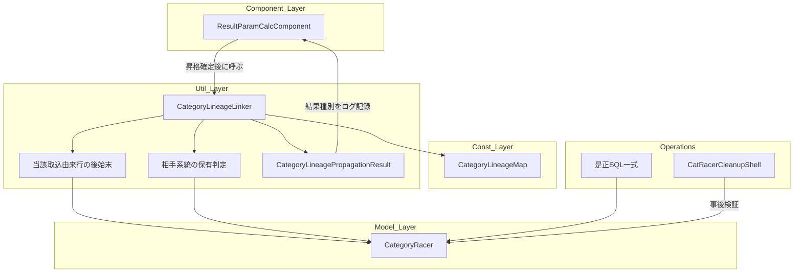
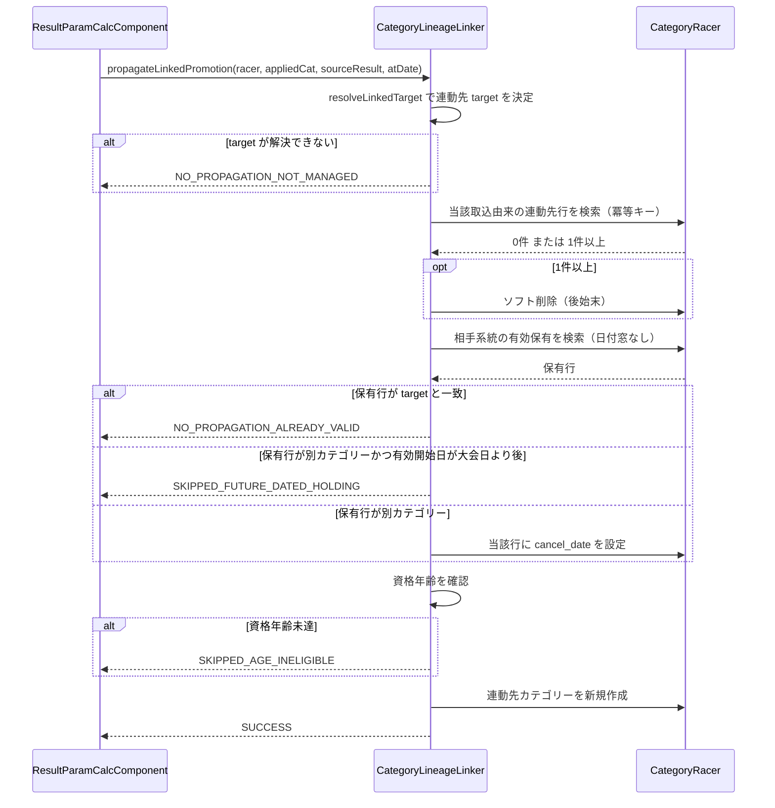

# Technical Design

## Overview

**Purpose**: 本設計は、レース結果による昇格の系統間連動が、同一リザルトの再取込に対して冪等に
なることを保証する。取込回数によらず、連動先カテゴリーの有効保有は常にちょうど1件へ収束する。

**Users**: 大会主催者（リザルトをアップロードする運営者）は、取込をやり直しても重複を手作業で
削除する必要がなくなる。システム管理者は、シーズン末の残留・降格判定と既存の不整合検出を、
汚れていない入力で実行できる。

**Impact**: `CategoryLineageLinker::propagateLinkedPromotion()` の重複防止判定を、日付窓に依存
しない方式へ改める。あわせて、既に発生している重複データ（起票時点で5選手・8行）を是正する。
判定内容（誰にどのカテゴリーを連動させるか）は一切変更しない。

### Goals

- 同一種目のリザルトを何回取り込んでも、連動先カテゴリーの有効保有が1件に収束する（1.1〜1.4）
- 連動先系統の保有判定が、有効開始日が大会日より後の行も観測できる（2.1〜2.4）
- 後始末が当該取込に由来する行だけを対象とする（3.1〜3.3）
- 本欠陥由来の重複データが是正され、是正の前後を検証できる（4.1〜4.7）
- 既存の連動挙動（対応表・元ME1特例・資格年齢ガード・失敗時の処理継続）が変わらない（5.1〜5.6）

### Non-Goals

- 昇格判定そのもの（誰を昇格させるか・何人昇格させるか）の変更
- 連動先の解決ロジック（対応表・元ME1特例）の変更
- 資格年齢ガードの判定内容（`categories.age_min` の参照・年齢計算・境界）の変更
- エントリー時の対応ペア補完（`supplementPairedCategoryOnEntryRegistration()`）の挙動変更
- 再取込により昇格対象者・昇格人数が変わり、前回昇格した選手が今回は昇格しなくなった場合の
  後始末（別specへ切り出し済み。requirements.md Boundary Context 参照）
- リザルト取込経路への整合性警告の配信追加（別specへ切り出し済み）

## Boundary Commitments

### This Spec Owns

- `CategoryLineageLinker::propagateLinkedPromotion()` の内部手順（連動先の保有判定・後始末・
  新規作成の順序と条件）
- `CategoryLineageLinker::__findActiveCategoryRacerOnSide()` の検索条件
- `CategoryLineagePropagationResult` が表現する結果種別の集合
- 本欠陥に由来する重複行の是正手順（検出・バックアップ・適用・検証のSQL一式）

### Out of Boundary

- 昇格判定・昇格人数・昇格対象者の決定（`ResultParamCalcComponent` の既存ロジック）
- 連動先カテゴリーの決定（`CategoryLineageMap` / `resolveLinkedTarget()` / `isFormerElite1()`）
- 資格年齢判定（`isAgeEligibleForCategory()`）の内容
- 整合性検知（`CategoryRacer::afterSave()`）のロジックと配信経路
- `apply_date <= $atDate` を「レース当日の所属」の意味で使っている11箇所（research.md 1.2 の
  分類表 #2〜#12）。本specが変更するのは目的Bに該当する1箇所（#1）のみである
- **同日開催の別大会に対する盲点**（`__applyRankUp2CM()` の `$hasNewCat` 判定と
  `__setupCatRacerCancel()` が、同じ日のうちに発効した昇格を観測できない）。+1日規約と同日開催の
  相互作用に由来する別の論点であり、c18d056より前から存在する。実データでも、昇格・連動由来の
  有効行を由来大会の開催日と突き合わせて重複判定した結果、**同一開催日の別大会に由来する重複は
  全期間で0件**である（`meet_code` だけで判定すると2デーレースやエントリーCSV由来の行が混ざり
  誤読を招くため、開催日での突き合わせが必要。research.md 1.2「#2・#3 に共通して残る盲点」）
- 本欠陥に由来しない既存不整合データの是正（catracer-cleanup-2026-27の管轄）

### Allowed Dependencies

- `CategoryLineageMap`（対応表の単一定義。参照のみ、再定義しない）
- `CategoryReason::$LINEAGE_LINK`（連動付与の理由区分）
- `CategoryRacer` モデル（`Utils.SoftDelete` ビヘイビア込み）
- `CatRacerCleanupShell` の `detect` / `verify`（是正の事後確認に利用）

依存の向きは `Const → Util → Model` を維持する。`CategoryLineageLinker`（Util層）が
`ResultParamCalcComponent`（Component層）を参照してはならない。

### Revalidation Triggers

以下の変更が生じた場合、依存側（`ResultParamCalcComponent` の2つの呼び出し箇所、および
`CategoryLineagePropagationResult` を解釈する全ての箇所）は再確認を要する。

- `CategoryLineagePropagationResult` の結果種別の追加・削除・意味変更
- 連動先行の識別条件（冪等キー）の構成要素の変更
- `apply_date` / `cancel_date` の設定規約（現行: cancel は大会当日、apply は翌日）の変更
- 連動先行に記録する `reason_id` の変更

## Architecture

### Existing Architecture Analysis

本欠陥の核心は、**同一の検索条件 `apply_date <= $atDate` が2つの異なる目的に使われている**
ことにある（research.md 1.2 に全12箇所の分類を記録）。

| 目的 | 問い | `apply_date <= $atDate` の妥当性 |
|---|---|---|
| A: 時点の所属 | 「レース当日、選手は何を名乗っていたか」 | **正しい**。11箇所で使用中、変更しない |
| B: 自己の書き込み確認 | 「この処理は既に結果を書いていないか」 | **誤り**。書き込む行の `apply_date` が `$atDate + 1日` のため、自分の書いた行が必ず窓の外に落ちる |

**目的Bに該当するのは `__findActiveCategoryRacerOnSide()` の1箇所のみ**であり、本specの修正対象は
そこに限られる。

混入経緯はc18d056（2026-08-23）の差分で直接確認できる。改訂前は呼び出し元が「当日+1日」を渡して
おり、Linker内でガードの窓と作成行の `apply_date` に同じ値が使われていたため**自己観測性が成立
していた**。+1日の計算をLinker内部へ移す際に、**作成行（書き込み）にだけ適用し、ガード
（読み取り）の窓は渡された生の `$atDate` のまま据え置いた**ことで両者が1日ずれた。同コミットは
検知側（`CategoryRacer::$lineageInspectionAtDate` の新設）は正しく追随させており、**同一コミット
内で読み手が分かれている**。

エントリー補完（`supplementPairedCategoryOnEntryRegistration()`）は、日付窓を持たないヘルパー
`__findCurrentlyActiveCategoryCodesOnSide()` を使い、書き込む行の `apply_date` も大会当日その
ままであるため、自己観測性が成立している。**本設計はこの既存の正しい形に寄せる**。

### Architecture Pattern & Boundary Map



**Architecture Integration**:

- **Selected pattern**: 既存の「昇格元系統側の冪等化削除」パターンを連動先系統側へ対称展開し、
  あわせて保有判定を日付窓に依存しない方式へ置換する（research.md Option C）。対称展開元の
  パターンは実運用で長期に実証されている（旧行の `deleted_date` と新行の `created` が秒まで
  一致する「削除して作り直した」痕跡が `reason_id = RESULT_UP` で2,148組、最古は2018年。
  research.md 1.4）。
- **Domain/feature boundaries**: 判定の materialization（保存の冪等性）は Util層が所有し、
  判定内容（誰に何を）は既存の所有者が引き続き持つ。
- **Existing patterns preserved**: 冪等キーの構成（`racer_code + meet_code + category_code +
  apply_date + reason_id`）、ソフト削除による後始末、失敗時のfail-open、`HoldPoint` 非関与。
- **New components rationale**: 新規コンポーネントは作らない。既存メソッドの内部手順の変更と、
  結果種別の1件追加のみ。
- **Steering compliance**: `existing-data-inconsistency-policy.md` の「既存の不整合行そのものは
  変更しない」を維持する。本設計が削除・終了の対象とするのは、**当該取込が自ら作った行**に
  限られる。

### Technology Stack

| Layer | Choice / Version | Role in Feature | Notes |
|-------|------------------|-----------------|-------|
| Backend / Services | PHP 5.x系 + CakePHP 2.x | 既存スタック。変更なし | 新規依存なし |
| Data / Storage | MySQL（`category_racers`） | 連動先カテゴリー行の永続化 | スキーマ変更なし |
| Test | PHPUnit 3.7.38（`Console/cake test`） | 既存踏襲 | 新規フィクスチャ不要 |
| Operations | SQL スクリプト（人間が実行） | 既存重複データの是正 | `.kiro/specs/<id>/sql/` 先例に準拠 |

## File Structure Plan

### Modified Files

- `app/Cyclox/Util/CategoryLineageLinker.php`
  — `propagateLinkedPromotion()` に当該取込由来行の後始末を追加。
  `__findActiveCategoryRacerOnSide()` の `apply_date` 上限を撤廃。
  `CategoryLineagePropagationResult` に結果種別 `SKIPPED_FUTURE_DATED_HOLDING` を追加。
- `app/Controller/Component/ResultParamCalcComponent.php`
  — 新しい結果種別を検知してログ記録する分岐を、既存の `isSkippedAgeIneligible()` 分岐と同型で
  2箇所（`__execApplyRankUp()` / `__applyRankUp2CM()`）に追加。判定ロジックは変更しない。
- `app/Test/Case/Cyclox/Util/CategoryLineageLinkerTest.php`
  — 反復呼び出しの回帰テストを追加。
- `app/Test/Case/Controller/Component/ResultParamCalcComponentTest.php`
  — 昇格経路からの反復呼び出しの回帰テストを追加。
- `.kiro/steering/existing-data-inconsistency-policy.md`
  — 再発防止の観点（自己観測性・流用時の逆照合）を追記（7.1, 7.2）。既に「有効期間を持つ
  データへの存在判定の注意点」という同型の節があり、その直下に並べる。
- `.kiro/specs/lineage-propagation-idempotency-2026-27/agreement-log.md`
  — 本欠陥が混入した経緯（2026-08-23の日付規約改訂が、その日付を読むガード側へ波及確認され
  なかったこと）を決定事項として記録する（7.3）。research.md 1.2 の分類表を根拠として参照する。

### New Files

```
.kiro/specs/lineage-propagation-idempotency-2026-27/sql/
├── 01_detect_duplicates.sql   # 是正対象の検出（適用前後の両方で使う）
├── 02_backup.sql              # category_racers のバックアップ表作成
├── 03_fix_duplicates.sql      # 余剰行のソフト削除
├── 04_verify.sql              # 是正後の検証
└── README.md                  # 実行手順・前提・ロールバック方法
```

## System Flows

### 修正後の `propagateLinkedPromotion()` の手順



**Key Decisions**:

- **後始末の対象特定は保有判定より前、実際の削除は新規作成の直前。**
  自分が前回書いた行を保有判定に含めると「既に正しいペアを保有している」と判定して
  `NO_PROPAGATION_ALREADY_VALID` を返し、`meet_code` / `racer_result_id` が前回のまま古い行が
  残り続ける。そのため**対象の特定は先に行い、判定材料からは除外する**。
  一方、**削除そのものは新規作成が確定してから行う**。判定より前に削除してしまうと、その後に
  見送りへ倒れる経路（未来日保有・資格年齢未達）で「行を消して何も作らない」純損失になる
  （2026-09-25・独立レビュー指摘H-1で実証。先行大会のリザルトを後続大会の取込後に再取込すると
  到達する）。見送り時はDBを一切変更しないという本メソッドのPostconditionを守る。
- **後始末の対象は有効な行（`cancel_date` 未設定）に限る。** 既に終了している同一キーの行は、
  他大会の昇格により正しく終了させられた履歴行か、運用者が手作業で終了させた行である。
  いずれも現在の保有状態を構成せず作り直す必要が無いうえ、削除すると所属履歴が失われる
  （同レビュー指摘M-4）。
- **後始末に成功し新規作成に失敗した場合は、取り除いた行を復元する。** 呼び出し元は連動の失敗を
  ログのみに留めて昇格処理を継続・コミットするため、復元しないと「前回行だけが消えた」状態が
  確定する（同レビュー指摘M-3）。
- **資格年齢の確認位置は変更しない。** 現行どおり保有判定の後に置く。前へ移すと、既に正しい
  ペアを保有している資格年齢未達の選手の結果種別が `NO_PROPAGATION_ALREADY_VALID` から
  `SKIPPED_AGE_INELIGIBLE` へ変わり、5.2/5.3（既存挙動の維持）に反する。
- **有効開始日が大会日より後の別カテゴリーは終了させない。** `cancel_date = $atDate` を書くと
  `apply_date > cancel_date` の逆転行になる。終了も新規作成も行わず記録のみ残す（2.3）。
  新規作成まで行うと同系統内複数保有を新たに生むため、伝播全体を見送る。

## Requirements Traceability

| Requirement | Summary | Components | Interfaces | Flows |
|-------------|---------|------------|------------|-------|
| 1.1, 1.2 | 取込回数によらず1件に収束 | CategoryLineageLinker | propagateLinkedPromotion | 後始末→保有判定→作成 |
| 1.3, 1.4 | 自分が書いた行を保有と判定 | CategoryLineageLinker | __findActiveCategoryRacerOnSide | 保有判定（日付窓なし） |
| 2.1 | 未来日の行も有効として扱う | CategoryLineageLinker | __findActiveCategoryRacerOnSide | 保有判定 |
| 2.2 | 正しいペアなら何もしない | CategoryLineageLinker | propagateLinkedPromotion | ALREADY_VALID 分岐 |
| 2.3 | 逆転する終了処理を行わない | CategoryLineageLinker, CategoryLineagePropagationResult | SKIPPED_FUTURE_DATED_HOLDING | FUTURE_DATED 分岐 |
| 2.4 | ソフト削除行を対象外とする | CategoryRacer | Utils.SoftDelete（既存動作） | 保有判定 |
| 3.1 | 由来しない行を変更しない | CategoryLineageLinker | 冪等キーによる限定 | 後始末 |
| 3.2 | 昇格元と同じ考え方で特定 | CategoryLineageLinker | 冪等キー | 後始末 |
| 3.3 | 変わる識別子を使わない | CategoryLineageLinker | 冪等キー（`racer_result_id` を含めない） | 後始末 |
| 4.1〜4.7 | 既存重複の是正 | 是正SQL一式 | 01〜04 スクリプト | 運用手順 |
| 5.1, 5.2 | 連動先決定・年齢ガードの不変 | CategoryLineageLinker | resolveLinkedTarget, isAgeEligibleForCategory | 既存回帰テスト |
| 5.3 | 対応外ペア保有時の従来判断 | CategoryLineageLinker | propagateLinkedPromotion | cancel→create 分岐 |
| 5.4 | 失敗時も昇格を継続 | ResultParamCalcComponent | 既存のfail-open分岐 | 呼び出し元 |
| 5.5 | HoldPoint に関与しない | CategoryLineageLinker | （参照を持たない） | — |
| 5.6 | エントリー補完が不変 | CategoryLineageLinker | supplementPairedCategoryOnEntryRegistration（変更しない） | — |
| 6.1 | 由来の判別情報を残す | CategoryLineageLinker | reason_note, meet_code, racer_result_id | 新規作成 |
| 6.2 | 既保有での見送りを記録 | CategoryLineageLinker | 記録（事後追跡性）表 DEBUG行 | ALREADY_VALID 分岐 |
| 6.3 | 後始末の実行を記録 | CategoryLineageLinker, ResultParamCalcComponent | 記録（事後追跡性）表 INFO/WARNING行 | 後始末・FUTURE_DATED 分岐 |
| 6.4 | 是正記録 | 是正SQL一式 | バックアップ表 | 運用手順 |
| 7.1, 7.2 | 再発防止の観点を記録 | steering | existing-data-inconsistency-policy.md | — |
| 7.3 | 混入経緯を記録 | agreement-log | 決定事項（research.md 1.2 を根拠に参照） | — |

## Components and Interfaces

| Component | Domain/Layer | Intent | Req Coverage | Key Dependencies (P0/P1) | Contracts |
|-----------|--------------|--------|--------------|--------------------------|-----------|
| CategoryLineageLinker | Util | 連動先付与の冪等化と保有判定の是正 | 1, 2, 3, 5, 6 | CategoryRacer (P0), CategoryLineageMap (P0) | Service, State |
| CategoryLineagePropagationResult | Util | 結果種別の表現に1種別を追加 | 2.3, 6.3 | — | Service |
| ResultParamCalcComponent | Component | 新結果種別のログ記録 | 5.4, 6.3 | CategoryLineageLinker (P0) | Service |
| 是正SQL一式 | Operations | 既存重複データの是正 | 4 | CategoryRacer テーブル (P0) | Batch |

### Util 層

#### CategoryLineageLinker

| Field | Detail |
|-------|--------|
| Intent | 連動先カテゴリーを、再取込に対して冪等に保存する |
| Requirements | 1.1, 1.2, 1.3, 1.4, 2.1, 2.2, 2.3, 2.4, 3.1, 3.2, 3.3, 5.1, 5.2, 5.3, 5.5, 6.1, 6.2, 6.3 |

**Responsibilities & Constraints**

- `propagateLinkedPromotion()` は本クラスで唯一DB保存を行うメソッドである（既存制約を維持）。
- 削除・終了の対象は、**当該取込が自ら作った行**（冪等キーで特定）と、**対応表上の連動先では
  ない相手系統の有効行**（従来どおり）に限る。手動付与・エントリー補完・他大会由来の行は
  冪等キーに `meet_code` と `reason_id` を含めることで自然に除外される（3.1）。
- 冪等キーに `racer_result_id` を含めてはならない（3.3）。`ApiController::execAddResult()` が
  再取込のたびに `racer_results` を全削除して新idで作り直すため、含めると後始末が機能しない。

**Dependencies**

- Inbound: `ResultParamCalcComponent::__execApplyRankUp()` / `__applyRankUp2CM()` — 昇格確定後の
  連動実行（P0）
- Outbound: `CategoryRacer` — 検索・保存・ソフト削除（P0）／`CategoryLineageMap` — 対応表（P0）
- External: なし

**Contracts**: Service [x] / API [ ] / Event [ ] / Batch [ ] / State [x]

##### Service Interface

```php
/**
 * @param string $racerCode
 * @param string $appliedCategoryCode 昇格により新たに有効となったカテゴリー（昇格元系統側）
 * @param array  $sourceResult         'meet_code' / 'id' を含む昇格元リザルト
 * @param string $atDate               昇格元レースの日付（生の日付）
 * @return CategoryLineagePropagationResult
 */
public static function propagateLinkedPromotion($racerCode, $appliedCategoryCode, array $sourceResult, $atDate);
```

- **Preconditions**: `$atDate` は有効な日付文字列。`$sourceResult['meet_code']` は当該大会コード。
- **Postconditions**: 戻り値が `SUCCESS` の場合、選手は相手系統に連動先カテゴリーを
  `apply_date = $atDate + 1日` でちょうど1件有効保有する。同一の引数（`$sourceResult['id']` は
  異なってよい）で連続して呼んでも、有効保有は1件のままである（1.1, 1.2）。
- **Invariants**: 本メソッドは `HoldPoint` を参照しない（5.5）。エントリー補完の経路
  （`supplementPairedCategoryOnEntryRegistration()`）には影響しない（5.6）。

##### State Management

- **冪等キー（後始末の対象特定）**: `racer_code` ＋ `meet_code`（`$sourceResult['meet_code']`）
  ＋ `category_code`（解決した連動先）＋ `apply_date`（`$atDate + 1日`）＋
  `reason_id = CategoryReason::$LINEAGE_LINK`。昇格元系統側が同一目的で用いている条件と
  同じ構成である（3.2）。
- **後始末の方式**: `CategoryRacer->delete()` によるソフト削除。`cancel_date` 設定を採らない
  理由は、`apply_date = $atDate + 1日` に対して `cancel_date = $atDate` を書くと期間が逆転し、
  かつ昇格元系統側の後始末（ソフト削除）と非対称になるため。
- **後始末の実行位置**: 対象の特定は保有判定の前、削除は新規作成の直前（Key Decisions 参照）。
  特定した行は保有判定の対象から除外する。削除に成功したあと新規作成に失敗した場合は、
  ソフト削除を取り消して元に戻す。
- **保有判定の検索条件（変更後）**: `racer_code` ＋ 同一系統のカテゴリーコード群 ＋
  （`cancel_date IS NULL` または `cancel_date >= $atDate`）。**`apply_date` の上限条件を削除**
  する（2.1）。ソフト削除行は `Utils.SoftDelete` により自動的に除外される（2.4）。

##### 記録（事後追跡性）

現行の `CategoryLineageLinker` はログを出力せず、呼び出し元が結果種別を見てログを書く構造で
ある。しかし呼び出し元が記録しているのは `FAILURE` と `SKIPPED_AGE_INELIGIBLE` のみであり、
6.2（既に保有済みで新規作成しない場合）と 6.3（後始末を行った場合）を満たさない。

本設計では、**本メソッドの内部で起きた事実は本メソッド自身が記録する**方針を採る
（`CategoryRacer::afterSave()` が検知結果を自ら記録している既存の前例と同型）。記録する事象と
水準は次のとおり。呼び出し元の既存のログ記録は変更しない。

| 事象 | 水準 | 記録する内容 | Req |
|---|---|---|---|
| 当該取込由来の既存行を後始末した | INFO | 選手コード・大会コード・連動先・削除件数 | 6.3 |
| 既に連動先を保有しており新規作成しない | DEBUG | 選手コード・大会コード・連動先 | 6.2 |
| 未来日の別カテゴリー保有により見送った | WARNING | 選手コード・大会コード・連動先・保有中カテゴリー | 2.3, 6.3 |

ログスコープは既存の `entry_auto_category` を用いる（同じ系統連動の関心事であり、新しい
スコープを増やさない）。

**Implementation Notes**

- Integration: **【2026-09-25改訂】** 後始末の**対象特定**は連動先の解決（`resolveLinkedTarget()`）
  の直後・保有判定の直前に置き、特定した行は保有判定の対象から除外する。**削除の実行**は新規
  作成の直前に置く。順序の根拠は System Flows の Key Decisions を参照。
- Validation: **【2026-09-25改訂】** 資格年齢未達で見送る場合も後始末は実行しない（削除は新規
  作成の直前にのみ行う）。したがって前回の取込で作成された行はそのまま残る。
- Risks: 同一大会で同一選手が複数種目に出走し、いずれの昇格でも同じ連動先へ解決される場合、
  後回しの取込が先の行を後始末して作り直す。結果の有効保有は1件で正しいが、`racer_result_id`
  は最後に処理された昇格のものになる。実害が無いため許容し、design上の既知事項として記録する。

#### CategoryLineagePropagationResult

| Field | Detail |
|-------|--------|
| Intent | 連動処理の結果種別を表現する。本specで1種別を追加する |
| Requirements | 2.3, 6.3 |

**Contracts**: Service [x] / API [ ] / Event [ ] / Batch [ ] / State [ ]

##### Service Interface

```php
// 既存: NO_PROPAGATION_NOT_MANAGED / NO_PROPAGATION_ALREADY_VALID /
//       SKIPPED_AGE_INELIGIBLE / SUCCESS / FAILURE
// 追加:
public static function skippedFutureDatedHolding($categoryCode, $heldCategoryCode);
public function isSkippedFutureDatedHolding();
```

- **Preconditions**: 相手系統に、連動先とは異なるカテゴリーが、大会日より後の有効開始日で
  保有されている。
- **Postconditions**: 呼び出し元はこの種別を検知してログに記録する。DBは一切変更されない。

**Implementation Notes**

- Integration: 既存の結果種別の値・意味は変更しない。追加のみとする（Revalidation Triggers 参照）。
- Risks: **【2026-09-25・独立レビュー指摘H-1により改訂】** 当初は「エントリー補完が未来日で
  付与済みの場合に限られる・頻度は低い」と評価していたが誤りだった。エントリー補完が一切
  関与しない経路でも到達する: **先行大会のリザルトを、後続大会の取込後に再取込する**と、
  後続大会の昇格で作られた相手系統カテゴリーが先行大会の大会日から見て未来日になるため、
  この分岐に入る。主催者が過去大会のリザルトを訂正する運用で現実に起こりうる。
  ログには選手コード・連動先・保有中のカテゴリー・その有効開始日を含める。
- Risks: 同一大会で同一選手が2回昇格し、いずれも同じ系統側へ連動する場合も本分岐に入る
  （1回目の連動で作られた行の有効開始日が大会日+1日のため）。修正前は新規作成していたが、
  その結果は同系統内複数保有という不整合であり、見送る方がRequirement 2.3の意図に沿う。

### Component 層

#### ResultParamCalcComponent

| Field | Detail |
|-------|--------|
| Intent | 新しい結果種別を検知してログに記録する（判定ロジックは変更しない） |
| Requirements | 5.4, 6.3 |

**Implementation Notes**

- Integration: `__execApplyRankUp()` と `__applyRankUp2CM()` の2箇所に、既存の
  `isSkippedAgeIneligible()` 分岐と同型のログ記録分岐を追加する。昇格処理は従来どおり継続する。
- Validation: 既存の `isFailure()` 分岐・fail-open の挙動は変更しない（5.4）。
- Risks: 追加箇所は2箇所のみ。呼び出し順序・引数は変更しないため、既存テストへの影響は無い。

### Operations

#### 是正SQL一式

| Field | Detail |
|-------|--------|
| Intent | 本欠陥に由来する重複行を、承認・復元可能な手順で是正する |
| Requirements | 4.1, 4.2, 4.3, 4.4, 4.5, 4.6, 4.7, 6.4 |

**Contracts**: Service [ ] / API [ ] / Event [ ] / Batch [x] / State [ ]

##### Batch / Job Contract

- **Trigger**: 人間が手動で実行する。自動実行はしない（4.5）。**実行はコード修正のデプロイ後**
  とする。修正前に是正しても、次の再取込で同じ重複が再発する（実例: `KNS-000-2879` は
  2026-09-24 07:31〜07:32に4行が手動削除されたが、約5分後の07:37:31の取込で再び1行作られた）。
  この順序はagreement-log.md 決定事項#5と整合する。
- **Input / validation**: `01_detect_duplicates.sql` が是正対象の一覧を出力する。`reason_id =
  LINEAGE_LINK` を条件に含むため、本欠陥の稼働開始（2026-09）より前の昇格由来行
  （`reason_id = RESULT_UP`）は構造的に対象外となる（実データで確認済み: 2026年より前の
  該当行は0件）。対象は
  「`reason_id = LINEAGE_LINK` かつ有効（未削除・`cancel_date IS NULL`）で、紐づくリザルトが
  ソフト削除済みであり、かつ同一の（選手・カテゴリー・有効開始日・大会）に生存リザルトへ紐づく
  兄弟行が存在するもの」に限定する（4.1, 4.2, 4.3）。この条件は開発DBで検証済みで、
  過剰削除・取りこぼしともゼロであることを確認している。
- **Output / destination**: `category_racers` の該当行を `deleted = 1` へ更新する（ソフト削除）。
- **Idempotency & recovery**: `02_backup.sql` が実行前の `category_racers` 全体をバックアップ表
  へ複写する（4.6）。再実行しても対象は既に `deleted = 1` のため追加の影響は無い。
  `04_verify.sql` が是正後に本欠陥由来の重複が0件であることと、対応ペアが失われていないことを
  確認する（4.7）。

**Implementation Notes**

- Integration: `.kiro/specs/<id>/sql/` 配下に置く先例（`rider-demotion-2025-26`,
  `season-rules-2026-27`）に合わせ、番号順の実行を `README.md` に明記する。
- Validation: 是正後に `CatRacerCleanupShell detect` を実行し、新たな不整合が発生していない
  ことを確認する。
- Risks: 本番適用時は、実行前に `01` の出力を人間が確認する。開発DBで確認した件数（8行）と
  本番の件数は、その後の取込により異なりうる。

## Data Models

### Logical Data Model

本specはスキーマを変更しない。関係する `category_racers` の列と本設計での役割を示す。

| 列 | 役割 | 本設計での扱い |
|---|---|---|
| `racer_code` | 選手 | 冪等キーの構成要素 |
| `category_code` | カテゴリー | 冪等キーの構成要素。連動先の解決結果 |
| `apply_date` | 有効開始日 | 冪等キーの構成要素。連動先行は `$atDate + 1日` |
| `cancel_date` | 有効終了日 | 保有判定の条件。未設定または `$atDate` 以降なら有効 |
| `reason_id` | 付与理由 | 冪等キーの構成要素。連動付与は `LINEAGE_LINK` |
| `meet_code` | 由来大会 | 冪等キーの構成要素。由来しない行を除外する要 |
| `racer_result_id` | 由来リザルト | **冪等キーに含めない**（再取込で変わるため） |
| `deleted` | ソフト削除 | 後始末の手段。保有判定からは自動除外される |

**Consistency & Integrity**: 連動先行の一意性はDB制約ではなくアプリケーションロジックで担保
する。ソフト削除行が同一キーで残るため単純な UNIQUE 索引は適用できない（research.md 却下事項）。

## Error Handling

### Error Strategy

本specは既存のエラー方針を変更しない。連動処理の失敗（保存失敗・内部例外）は従来どおり
`FAILURE` を返し、呼び出し元はログを記録して昇格処理を継続する（5.4、fail-open）。

### Error Categories and Responses

- **後始末の削除に失敗**: **【2026-09-25改訂】** `FAILURE` は返さず、ログに記録して処理を継続
  する（fail-open）。削除できなかった行が残るため重複が残る可能性があるが、連動付与そのものを
  止めるより望ましい。ログに選手コード・大会コード・連動先・対象行のidを記録する（6.3）。
- **後始末に成功し新規作成に失敗**: 取り除いた行のソフト削除を取り消してから `FAILURE` を返す。
  復元の成否もログに記録する（6.3）。
- **相手系統に未来日の別カテゴリーを保有**: `SKIPPED_FUTURE_DATED_HOLDING` を返す。DBは変更
  しない。運営者が状況を追えるようログに保有中のカテゴリーを含める（2.3, 6.3）。
- **資格年齢未達**: 既存どおり `SKIPPED_AGE_INELIGIBLE`。挙動は変更しない（5.2）。

### Monitoring

既存のログ経路（`CakeLog`、`entry_auto_category` スコープ）をそのまま用いる。リザルト取込
経路への警告配信の追加は本specのスコープ外（別spec）。

## Testing Strategy

### Unit Tests（`CategoryLineageLinkerTest`）

1. **同一の昇格を3回連続で連動させても、連動先の有効保有が1件のままであること**（1.1, 1.2）。
   各回で `$sourceResult['id']` を変える（本番の再取込では `racer_result_id` が毎回変わるため、
   固定すると本番障害を再現できない）。**修正前のコードでこのテストが失敗することを先に確認
   する。**
2. 相手系統に連動先カテゴリーを未来日の有効開始日で保有している選手に対し、
   `NO_PROPAGATION_ALREADY_VALID` が返り、行が増えないこと（1.3, 1.4, 2.1, 2.2）。
3. 相手系統に連動先とは異なるカテゴリーを未来日の有効開始日で保有している選手に対し、
   `SKIPPED_FUTURE_DATED_HOLDING` が返り、終了処理も新規作成も行われないこと（2.3）。
4. 後始末が、同一選手の手動付与行・エントリー補完行・他大会由来の連動行を削除しないこと（3.1）。
5. 元ME1特例・資格年齢未達見送り・対応外ペア保有時の従来判断が変わらないこと（5.1, 5.2, 5.3）。

### Integration Tests（`ResultParamCalcComponentTest`）

1. **昇格経路（`__execApplyRankUp()`）を3回連続で実行しても、連動先の有効保有が1件のまま**
   であること（1.1, 1.2）。毎回異なるリザルトidを与える。
2. 昇格経路（`__applyRankUp2CM()`、マスターズ側昇格→エリート側連動）でも同様であること。
3. `SKIPPED_FUTURE_DATED_HOLDING` が呼び出し元でログに記録され、昇格処理自体は成功すること
   （5.4, 6.3）。
4. 既存の連動テスト（`testEliteC3ToC2PropagatesMastersCm2ToCm1` 等）が全て green のままである
   こと（5.1〜5.5 の回帰）。

### Operations Verification（是正SQL）

1. `01_detect_duplicates.sql` が是正対象のみを列挙し、単独行（重複していない連動行）・本欠陥に
   由来しない既存不整合を含まないこと（4.2, 4.3, 4.4）。
2. `03` 適用後に `01` が0件を返し、対応ペアが失われていないこと（4.7）。
3. `CatRacerCleanupShell detect` が新たな不整合を報告しないこと。

### 採らない検証方法とその理由

`ApiController::execAddResult()` まで通す反復取込のE2Eテストは採らない。Meet / EntryGroup /
EntryCategory / EntryRacer / RacerResult の一式を大会単位で構築する必要があり、本specの変更点
（Util層の1メソッドとその呼び出し元2箇所）に対して不釣り合いに重い。再取込で
`racer_result_id` が変わるという本質的な条件は、上記の単体・統合テストで毎回異なるidを与える
ことにより再現できる。

<!-- SDD-OVERLAY:DESIGN-TECHREQ:START (sdd_base_template が付加。手動編集は再 init で再付与される) -->
## 技術要件・制約チェック（SDD overlay / 初回実装時）

> 旧 `tech-requirements.md` はこの節に統合済み。独立ファイルは作らない。
> 言語/FW/ライブラリは **Technology Stack**、テスト方針は **Testing Strategy**、既存コード結合は
> **Existing Architecture Analysis / Modified Files** に記載する。本節はそれらに収まらない
> 「環境固有の制約」と「初回実装前の確認」だけを補う。

### 環境固有の制約
| 制約 | 内容 |
|---|---|
| 言語ランタイムのバージョン制約 | CakePHP 2.x / PHP 5.x系。型宣言・無名クラス等の新しい言語機能は使用不可 |
| データストアのバージョン制約 | MySQL。ソフト削除行が残るため部分索引に相当する一意制約は使用不可 |
| Docker / 実行環境での考慮事項 | テストは `docker exec cyclox2_svr bash -c "cd /var/www/html/app && Console/cake test app <path>"` で実行する。コンテナは main チェックアウトをバインドマウントしており、worktree のコードは参照しない |
| その他 | 是正SQLは本番DBに対して人間が実行する。実行前に `01` の出力を人間が確認する |

### 初回実装前の確認
- [ ] 上記スタック・テスト方針・既存結合・環境制約を確認した
- [ ] 人間が技術要件を確認した（**承認の記録は `spec.json` の design ゲートに集約。本チェックは二重管理しない**）
<!-- SDD-OVERLAY:DESIGN-TECHREQ:END -->
