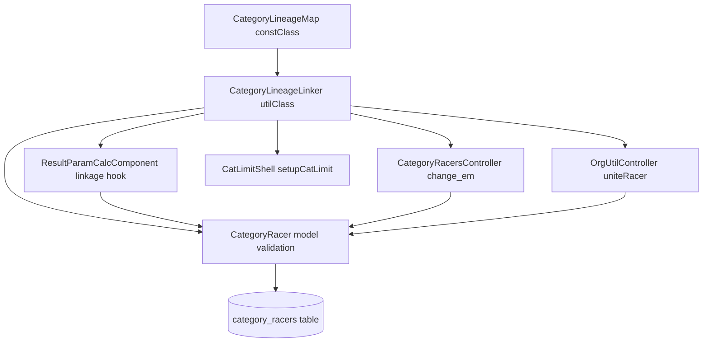
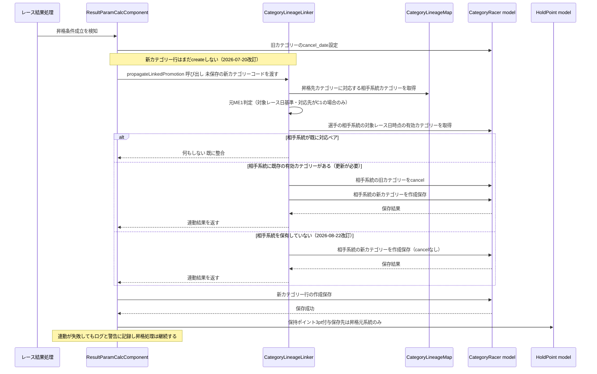
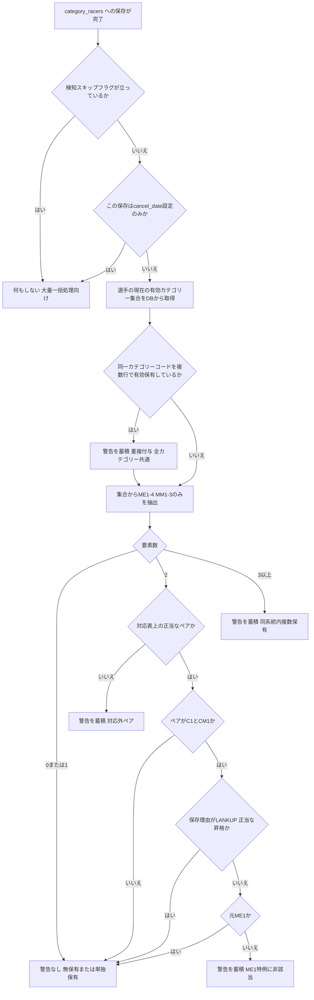

# Design Document: me-mm-linkage-2026-27

> **第2版（2026-08-15 改訂）**: requirements 第2版（Requirement 3 の「拒否」→「検知と警告」転換、
> Requirement 10「外部連携アプリからの処理継続性の保証」新設）に追随する改訂。
> **設計上の核心的な変更は、不整合の検知を `CategoryRacer::$validate`（保存を失敗させる）から
> `CategoryRacer::afterSave()`（保存後に検知し警告を蓄積する）へ移すこと**。
> 対応表・判定ロジック（`CategoryLineageMap` / `CategoryLineageLinker`）は無変更で流用できる。
> 経緯・レビュー指摘の詳細は agreement-log.md「有識者レビューによる方針転換」節を参照。

## Overview

本機能は、cyclox2web（CakePHP 2.x / PHP 7.3 / MySQL 5.7、`cyclox2_svr/cyclox2/`）における選手の
カテゴリー認定（`category_racers`）を拡張し、AJOCC 2026-27ルールの「実力別エリート（ME1〜ME4 /
`C1`〜`C4`）と実力別マスターズ（MM1〜MM3 / `CM1`〜`CM3`）の対応ペア両保有」を正規のデータ状態として
扱えるようにする。

**Users**: 大会主催者（カテゴリー付与・切替操作を行う）、システム管理者（選手統合・シーズン
バッチ運用を行う）、選手（両系統での認定状態の恩恵を受ける）。

**Impact**: 既存の `category_racers` テーブル構造・履歴管理方式（`apply_date`/`cancel_date`/
`reason_id`）は変更しない。カテゴリー認定情報の保存経路すべてに一元的な整合性検証を追加し、
レース結果によるリアルタイム昇格処理に系統間連動を追加する。既存の「片系統完結」の昇格挙動・
ランキング集計挙動・res-sys側の表示挙動は変更しない。

### Goals
- ME⇔MM対応表を単一のソースとして定義し、本specおよび後続4spec（catracer-cleanup-2026-27、
  season-rules-2026-27、jcx-lineage-lock-2026-27、ajocc-point-267-prod）から参照可能にする
- レース結果に基づくリアルタイム昇格が、対応表に沿って相手系統のカテゴリーへ連動する
- 対応外ペア・重複付与を、カテゴリー認定情報のあらゆる保存経路で**検知し警告する**
  （保存操作は完了させる。自動整合もしない）
- **不整合の検知を理由に、cyclox2app からの選手データ一括アップロード・リザルト取込を
  失敗させたり中断させたりしない**（Requirement 10）
- `change_em`・`CatLimitShell`・`unite_racer` の既存不具合（brief記載の要改修項目）を、
  対応表と一元検知を土台にして解消する
- TDDで実装可能な粒度に分解できる設計にする

### Non-Goals
- 既存の対応外ペアデータの是正（catracer-cleanup-2026-27）
- シーズン末の残留・降格判定ロジックの変更（season-rules-2026-27）
- JCXエントリー時の系統固定制御（jcx-lineage-lock-2026-27）
- 新8区分ポイント表の本番化（ajocc-point-267-prod）
- 女子系統（`CL1`〜`CL3`、`WM`）への対応表適用（research.mdで対象外と確定済み）
- AJOCCランキング集計ロジック自体の変更

## Boundary Commitments

### This Spec Owns
- ME⇔MM対応表の定義（`CategoryLineageMap`）とその判定API（`CategoryLineageLinker`）
- `category_racers` への保存時に対応外ペア・重複付与を**検知し警告を蓄積する**ロジック
  （`CategoryRacer` モデルの `afterSave`）と、蓄積された警告の取得API
- 蓄積された警告の伝達経路（画面 Flash / API レスポンスの `warnings` / サーバログ）
- レース結果によるリアルタイム昇格時の系統間連動ロジック（`ResultParamCalcComponent`拡張）
- 元ME1判定ロジック
- `change_em`（系統切替画面）の新ルール下での役割・挙動
- `CatLimitShell::setupCatLimit()` の両系統出走選手への対応
- `OrgUtilController::uniteRacer()` の重複防止チェック

### Out of Boundary
- 既存の不整合データそのものの是正（catracer-cleanup-2026-27）。本specは「今後の保存」のみを
  正しく保つ
- シーズン末の残留・降格判定、系統横断残留判定（season-rules-2026-27）
- JCXシリーズ戦のエントリー制御（jcx-lineage-lock-2026-27）
- 女子系統（`CL1`〜`CL3`、`WM`）へのペア対応表適用
- res-sys（成績閲覧アプリ）側の実装変更
- AJOCCランキング集計（`PointSeriesController`等）のロジック変更

### Allowed Dependencies
- 既存 `category_racers`／`categories`／`hold_points` テーブル構造（スキーマ変更なし。
  `racers.cat_limit` は既存 `varchar(255)` カラムの値域拡張のみ）
- 既存の `app/Cyclox/Const/*` enum風パターン（`EntryCatLimit` 等）
- 既存の `SoftDelete` ビヘイビア、`TransactionManager`
- 後続spec（catracer-cleanup-2026-27 等）は本specが定義する `CategoryLineageMap` /
  `CategoryLineageLinker` の公開APIにのみ依存してよい（内部実装への直接依存は不可）

### Revalidation Triggers
- `CategoryLineageMap` の対応ペア定義（コード一覧・対応関係）が変更された場合
- `CategoryLineageLinker` の公開メソッドのシグネチャ・戻り値契約が変更された場合
- HoldPoint付与先の決定方針（本設計の Decision 参照）が変更された場合
- `category_racers` への新しい保存経路が追加され、一元検知（`afterSave`）の適用対象から漏れる場合
- 警告の伝達経路（画面 Flash / API 応答の `warnings` / サーバログ）の契約が変更された場合

## Architecture

### Existing Architecture Analysis
- CakePHPの伝統的なMVC構成。ドメインロジックの多くは `Controller/Component`
  （`ResultParamCalcComponent`）に集中しており、Modelは薄い（`CategoryRacer` はバリデーション
  ほぼ無し）。
- `app/Cyclox/Const/*` に、DBに依存しない列挙的な定数クラス群が既に存在し、
  `App::uses('XXX', 'Cyclox/Const')` で読み込む規約が確立している。
- `app/Cyclox/Util/*` に、モデルを介さない純粋ロジック（`PointCalculator`, `AjoccUtil`等）を置く
  規約が既に存在する。
- `category_racers` への保存経路は13箇所（`grep`で実測、brief記載の14経路とほぼ一致）あり、
  いずれも `CategoryRacer->save()`/`saveAll()`/`saveMany()` を経由し、`validate => false` を
  指定していない（research.md参照）。

### Architecture Pattern & Boundary Map



**Architecture Integration**:
- 選定パターン: 既存の層構造（Const → Util → Model → Component/Controller/Console）をそのまま
  踏襲する拡張型パターン。新規サブシステムは作らない。
- ドメイン境界: 「対応表の定義」（Const）と「対応表を使った判定ロジック」（Util）を分離し、
  「判定結果に基づく保存後の検知・警告蓄積」（Model の `afterSave`）と「判定結果に基づく連動更新」
  （Component/Controller/Console）を利用側に委ねる。判定ロジックを単一のUtilクラスに集約することで、Model層・
  Component層・Controller層・Console層のいずれからも同じ判定基準を参照できる。
- 既存パターンの継承: `app/Cyclox/Const/*` のenum風パターン、`App::uses()`によるレイヤー読込規約、
  `TransactionManager`によるトランザクション境界を維持する。
- 新規コンポーネントの理由: `CategoryLineageMap`（対応表の単一ソースが要件で明示的に要求されている）、
  `CategoryLineageLinker`（対応表単体では表現できない「元ME1判定」「保有集合としての正当性判定」
  「連動先カテゴリーの解決」という手続き的ロジックが必要なため、Const層とModel/Component層の間に
  1枚追加する）。
- Steering準拠: 依存方向は Const → Util → Model → Component/Controller/Console の一方向のみ
  （逆方向の参照は禁止）。

### Technology Stack

| Layer | Choice / Version | Role in Feature | Notes |
|-------|------------------|-----------------|-------|
| Backend | PHP 7.3 / CakePHP 2.x | 既存フレームワークをそのまま使用 | 新規ライブラリ追加なし |
| Data / Storage | MySQL 5.7（`category_racers`/`categories`/`hold_points`/`racers`） | 既存スキーマのまま使用。`racers.cat_limit`（`varchar(255)`）の値域を拡張するのみ | DDL変更なし |
| Testing | CakePHPの`CakeTestCase`（`lib/Cake/TestSuite/`、PHPUnit基盤） | 新規テストケース・フィクスチャを追加 | 既存プロジェクトに新規依存追加なし |

## File Structure Plan

### Directory Structure
```
app/
├── Cyclox/
│   ├── Const/
│   │   ├── CategoryLineageMap.php     # 新規: ME⇔MM対応表の単一ソース（Requirement 1, 9）
│   │   └── EntryCatLimit.php          # 変更: $BOTH（両系統出走）値を追加（Requirement 7）
│   └── Util/
│       └── CategoryLineageLinker.php  # 新規: 対応表を使った判定・連動ロジック（Requirement 2-9）
├── Model/
│   └── CategoryRacer.php              # 変更: afterSave() で検知し警告を蓄積（Requirement 3, 9, 10）
├── Controller/
│   ├── ApiController.php              # 変更: 成功応答に warnings を追加（Requirement 3.8, 3.9, 10.5）
│   ├── CategoryRacersController.php   # 変更: change_em系メソッドの対応表参照・cancel範囲限定（Requirement 6）
│   ├── OrgUtilController.php          # 変更: uniteRacer() に統合後整合性チェックを追加（Requirement 8）
│   └── Component/
│       └── ResultParamCalcComponent.php # 変更: 昇格適用関数末尾に連動フックを追加（Requirement 4, 5）
├── Console/
│   └── Command/
│       └── CatLimitShell.php          # 変更: シーズン内の両系統出走を検知（Requirement 7）
├── View/
│   └── CategoryRacers/
│       ├── change_em.ctp              # 変更: 役割再定義に伴う文言更新（Requirement 6）
│       └── check_change_em.ctp        # 変更: 同上
└── Test/
    ├── Case/
    │   ├── Cyclox/
    │   │   ├── Const/
    │   │   │   └── CategoryLineageMapTest.php       # 新規
    │   │   └── Util/
    │   │       └── CategoryLineageLinkerTest.php    # 新規
    │   ├── Model/
    │   │   └── CategoryRacerTest.php                # 新規
    │   ├── Controller/
    │   │   ├── ApiControllerTest.php                  # 新規（第2版: 一括アップロードの非失敗・warnings）
    │   │   ├── CategoryRacersControllerTest.php      # 新規
    │   │   ├── OrgUtilControllerTest.php              # 新規
    │   │   └── Component/
    │   │       └── ResultParamCalcComponentTest.php  # 新規
    │   └── Console/
    │       └── Command/
    │           └── CatLimitShellTest.php              # 新規
    └── Fixture/
        ├── CategoryFixture.php         # 新規（C1-C4, CM1-CM3, CL1-3, WM 等のテストデータ）
        ├── CategoryRacerFixture.php    # 新規
        ├── RacerFixture.php            # 新規
        └── HoldPointFixture.php        # 新規
```

### Modified Files
- `app/Cyclox/Util/CategoryLineageLinker.php` — **【2026-08-22/23 有識者レビュー指摘により改訂】**
  `isFormerElite1()`の論理削除行除外・基準日引数追加、`resolveLinkedTarget()`/
  `propagateLinkedPromotion()`の単独保有選手への自動付与化・基準日ベースの相手系統判定への変更。
  `propagateLinkedPromotion()`はさらに、新規apply_dateをcancel_dateの1日後に是正し、
  `meet_code`/`racer_result_id`を実カラムへ保存するよう変更（2026-08-23改訂）。
- `app/Cyclox/Const/CategoryReason.php` — **【2026-08-22改訂・D-2】** 連動付与専用の定数
  `$LINEAGE_LINK`（ID:12、「カテゴリ連動による自動付与」）を新設。旧実装が転用していた
  `$REQUEST_CHANGE`（申請によるカテゴリー変更）は連動付与の実態と一致しないため置き換えた。
- `app/Model/CategoryRacer.php` — **【第2版で改訂】** `$validate` へのカスタムルール追加は行わない。
  代わりに `afterSave()` コールバックで不整合を検知し、インスタンスプロパティへ警告を蓄積する。
  警告の取得・リセット用に `getLineageWarnings()` / `resetLineageWarnings()` を追加する
  （既存の `getUpdatedIdList()` / `resetUpdatedIdList()` と同一のパターン）。
  検知をスキップするフラグ `$skipsLineageInspection` も設ける（大量一括処理向け）。
  **【2026-08-23改訂・有識者レビュー指摘】** 整合性検知の基準日プロパティ
  `$lineageInspectionAtDate`（既定null）を追加。設定時は`__activeCategoryCodes()`がその日付
  時点で有効だったカテゴリーのみを対象とする。未設定時は従来どおり`cancel_date`未設定のみで判定。
- `app/Controller/ApiController.php` — **【第2版で新規】** `upload_category_racers()` と
  `execAddResult()` が、蓄積された警告を成功応答の `warnings` フィールドとして返す。
  既存の成功／失敗判定・レスポンス構造は変更しない（クライアントが解釈しなくても従来どおり動作）。
- `app/Controller/Component/ResultParamCalcComponent.php` — `__execApplyRankUp()` と
  `__applyRankUp2CM()` に `CategoryLineageLinker::propagateLinkedPromotion()` 呼び出しを追加する
  （呼び出し位置は後述の確定版順序に従う）。**【第2版で改訂】** 連動更新の失敗は
  `Constant::RET_FAILED` ではなくログ出力＋警告蓄積として扱い、昇格処理・リザルト取込を
  中断させない。`__applyRankUp2CM()` の呼び出し元での戻り値チェック追加（第1版の是正3）は撤回する。
- `app/Controller/CategoryRacersController.php` — `__check_category_to()` の対応マップを
  `CategoryLineageMap` 参照に置換。`check_change_em()` の `end_cats` 算出を「反対系統の
  有効カテゴリー全部」から「切替先との対応表上のペアにならないもののみ」へ限定。
  **【第2版で改訂】** `exec_change_em()` は保存成功後に蓄積された警告を Flash へ載せる。
- `app/Controller/OrgUtilController.php` — `uniteRacer()` の `CategoryRacer->saveAll()`
  呼び出し後に、統合先選手の統合後有効カテゴリー集合を `CategoryLineageLinker::validateActiveSet()`
  および `validateNoDuplicateAnyCategory()` で検査する。**【第2版で改訂】** 検査結果が不正でも
  ロールバックせず、警告として `do_unite_racer()` へ伝達し統合は完了させる。
- `app/Console/Command/CatLimitShell.php` — `setupCatLimit()` 内のシーズン判定処理を、
  「シーズン最初の出走のみ参照」から「シーズン中のElite/Masters双方の出走有無を判定」へ変更。
- `app/Cyclox/Const/EntryCatLimit.php` — `$BOTH`（charVal `b`）を追加。
- `app/View/CategoryRacers/change_em.ctp`, `check_change_em.ctp` — 役割再定義に伴う説明文言の更新
  （「系統切替」から「対応ペア補完・特例対応」への文言変更。ロジック変更は伴わない）。

> `Test/Case`は`app`のクラス配置をミラーする既存規約（`Controller/Component/*Test.php`等の
> ディレクトリ構造）に倣う。`Cyclox/Const`・`Cyclox/Util`・`Console/Command`配下のテストは
> 本feature着手時点で前例が無いため、上記の対称構造を新設する。

## System Flows

### リアルタイム昇格の系統間連動フロー



**Key Decisions**:
- **【第2版で改訂】** 連動更新の失敗は昇格処理を中断させない。ログ出力と警告蓄積に留め、
  リザルト取込全体（および同一レースカテゴリーの他選手の昇格処理）を継続する
  （Requirement 10.3, 10.4）。第1版では `Constant::RET_FAILED` を返して中断させていた。
- **【第2版で改訂】** 連動更新後の状態が正常でない場合も、Requirement 3 の検知・警告に委ねる
  （Requirement 4.6）。第1版のような「バリデーションによる構造的な排除」は行わない。
- HoldPointは昇格元系統にのみ1回付与する（research.md Decision参照、Requirement 4.5）。
- **【2026-08-22 有識者レビュー指摘により改訂・Requirement 4.4】** 相手系統を保有していない
  選手にも、対応表に基づき連動先カテゴリーを新規に付与する（cancelは行わずcreateのみ）。
  オーガナイザーの手動付け忘れによる不整合を防ぐための方針転換であり、旧方針
  （単独保有選手には付与しない）は撤回した。
- **【2026-08-22改訂・B-1】** 相手系統の判定は「現在の」有効カテゴリーではなく、昇格の対象
  レース日（`$atDate`）時点で有効だったカテゴリーを基準にする。レース結果が前後してアップロード
  された場合に、対象レースより後の日付で処理された別レースの結果を誤って参照しないため。
  元ME1判定（`isFormerElite1()`）についても同様に、`$atDate`以前の`apply_date`を持つ履歴のみを
  判定材料にする。
- 保存順序（cancel→create）および連動フックの呼び出し位置（create の前）は第1版の確定版を
  維持する。第2版では保存拒否が無くなるため順序は必須ではなくなるが、論理的に自然であり
  既に実装・テスト済みで最終DB状態も同一のため、変更しない方がリスクが低いと判断した。
- **【2026-08-23改訂・有識者レビュー指摘】新規apply_dateはcancel_dateの1日後とする。**
  例: 12/10のレースでC3→C2に昇格した場合、C3のcancel_dateは12/10、C2のapply_dateは12/11。
  同日を両方に使うと、過去のある日を基準にした範囲検索（`apply_date <= X <= cancel_date`相当）で
  新旧両方の行が該当してしまう。昇格元系統側（`ResultParamCalcComponent`）は元々この規約
  （`$applyDate = $atDate + 1日`）で実装されていたが、連動先系統側（`propagateLinkedPromotion()`）
  はこの規約に従わず、cancel_dateとapply_dateの両方に同一の日付を使っていたため、連動先だけ
  1日ずれ・同日重複が生じていた。本改訂で連動先側もこの規約に統一した
  （`ResultParamCalcComponent`は生のレース日をそのまま`propagateLinkedPromotion()`へ渡すよう変更し、
  1日後への変換は`propagateLinkedPromotion()`内部で行う）。
- **【2026-08-23改訂・有識者レビュー指摘】** `CategoryRacer::afterSave()`の整合性検知
  （`__activeCategoryCodes()`）が「保存した実処理時刻」ではなく「対象レース日」を基準に判定
  できるよう、`CategoryRacer::$lineageInspectionAtDate`（基準日、既定null）を新設した。
  `ResultParamCalcComponent`は昇格処理の前にこれへ新カテゴリーのapply_date（レース日+1日）を
  設定し、処理完了後にnullへ戻す。**未設定時（null）は従来どおり`cancel_date`未設定のみで
  判定する**（本日日付をデフォルトにすると、来シーズンの先行付与のようなapply_dateが未来の
  正当な保存を誤って除外してしまうため、reviewer提案「未設定なら本日基準」から実装判断として
  変更した）。

### 対応外ペア・重複の検知フロー（第2版で全面改訂）

**第1版からの変更点**: 判定は `CategoryRacer::$validate`（保存前・失敗させる）ではなく
`CategoryRacer::afterSave()`（保存後・失敗させない）で行う。保存後に走るため
「保存後に有効となる集合」をプロスペクティブに構築する必要がなくなり、
**DBの現在の実状態をそのまま読めばよくなる**（判定ロジックの単純化）。
どの分岐も保存結果を左右せず、出力は警告のみ。



**Key Decisions**:
- 検知結果は保存の成否に一切影響しない。`afterSave()` の戻り値は CakePHP 2.x では無視されるため、
  構造的に「検知が保存を壊さない」ことが保証される（Requirement 3.3, 10.1）。
- `cancel_date` を設定するだけの保存は検知対象外（集合を縮小するのみで不整合を生まないため）。
- ME1特例の LANKUP スキップ判定（第1版の 2026-07-20 改訂）は維持する。正当な昇格に対して
  毎回警告を出すのは運用ノイズであり、警告方式では特に有害なため。
- 検知スキップフラグは catracer-cleanup-2026-27 の是正バッチのような大量一括処理が
  自ら不整合を解消する過程で大量の警告を出さないために設ける（性能対策も兼ねる）。

## Requirements Traceability

| Requirement | Summary | Components | Interfaces | Flows |
|-------------|---------|------------|------------|-------|
| 1.1-1.4 | 対応表の単一定義 | CategoryLineageMap | `pairedCategory()`, `eliteCategories()`, `mastersCategories()` | - |
| 2.1-2.3 | 対応ペア両保有の正常系 | CategoryLineageLinker, CategoryRacer | `isValidActiveSet()` | 検知フロー |
| 3.1-3.6 | 対応外ペア・重複の検知 | CategoryRacer, CategoryLineageLinker | `afterSave()`, `isValidActiveSet()` | 検知フロー |
| 3.7 | 画面への警告提示 | CategoryRacersController, OrgUtilController | `getLineageWarnings()` → Flash | 検知フロー |
| 3.8-3.9 | API応答への警告付与（後方互換） | ApiController | `success()` の `warnings` フィールド | 検知フロー |
| 3.10 | サーバログへの記録 | CategoryRacer | `afterSave()` 内の `log()` | 検知フロー |
| 4.1-4.6 | リアルタイム昇格の系統間連動 | ResultParamCalcComponent, CategoryLineageLinker | `propagateLinkedPromotion()` | 系統間連動フロー |
| 5.1-5.5 | ME1特例（元ME1判定） | CategoryLineageLinker | `isFormerElite1()`, `resolveLinkedTarget()` | 系統間連動フロー・検知フロー |
| 6.1-6.4 | change_emの役割再定義 | CategoryRacersController, CategoryLineageMap | `__check_category_to()`（改修） | - |
| 7.1-7.2 | CatLimitShellの両系統対応 | CatLimitShell, EntryCatLimit | `setupCatLimit()`（改修） | - |
| 8.1-8.2 | 選手統合時の不整合検知 | OrgUtilController, CategoryLineageLinker | `validateActiveSet()`, `validateNoDuplicateAnyCategory()` | - |
| 9.1-9.2 | 女子系統の対応表対象外 | CategoryLineageMap, CategoryRacer | `pairedCategory()`が対象外カテゴリーに`null`を返す | 検知フロー |
| 10.1-10.2 | 一括アップロードの部分失敗禁止 | CategoryRacer, ApiController | `afterSave()`が保存に影響しない構造 | 検知フロー |
| 10.3-10.4 | 昇格処理・リザルト取込の非中断 | ResultParamCalcComponent | 連動失敗時にログ＋警告のみ（`RET_FAILED`を返さない） | 系統間連動フロー |
| 10.5 | 既存クライアントとの後方互換 | ApiController | 成功/失敗判定は不変・`warnings`は追加情報 | - |
| 10.6 | 失敗の事後追跡 | ResultParamCalcComponent, CategoryRacer | `log()` | - |

## Components and Interfaces

| Component | Domain/Layer | Intent | Req Coverage | Key Dependencies (P0/P1) | Contracts |
|-----------|--------------|--------|---------------|---------------------------|-----------|
| CategoryLineageMap | Const | ME⇔MM対応表の単一ソース | 1, 9 | なし（最下層） | State |
| CategoryLineageLinker | Util | 対応表を使った判定・連動ロジック | 2, 3, 4, 5, 8, 9 | CategoryLineageMap (P0), CategoryRacer model (P0) | Service |
| CategoryRacer (model) | Model | 保存後の一元検知と警告蓄積 | 3, 9, 10 | CategoryLineageLinker (P0) | State |
| ApiController (拡張) | Controller | 蓄積された警告の API 応答への付与（後方互換） | 3, 10 | CategoryRacer model (P0) | API |
| ResultParamCalcComponent (拡張) | Component | リアルタイム昇格の系統間連動フック | 4, 5, 10 | CategoryLineageLinker (P0), CategoryRacer model (P0) | Service |
| CategoryRacersController (change_em系, 拡張) | Controller | 系統切替の対応表準拠化 | 6 | CategoryLineageMap (P0), CategoryRacer model (P0) | Service |
| CatLimitShell (拡張) | Console | 両系統出走の正しい記録 | 7 | EntryCatLimit (P1) | Batch |
| OrgUtilController.uniteRacer (拡張) | Controller | 統合後の整合性保証 | 8 | CategoryLineageLinker (P0), CategoryRacer model (P0) | Service |

### Const層

#### CategoryLineageMap

| Field | Detail |
|-------|--------|
| Intent | ME1〜ME4とMM1〜MM3の対応ペアを単一の場所で定義し、他コンポーネント・他specから参照可能にする |
| Requirements | 1.1, 1.2, 1.3, 1.4, 9.1 |

**Responsibilities & Constraints**
- `C1〜C4`・`CM1〜CM3` のみを対応表の対象とし、それ以外（`CL1〜CL3`, `WM`等）は対象外として
  `null` を返す（Requirement 9.1）
- 対応関係: `C4⇔CM3`, `C3⇔CM2`, `C2⇔CM1`, `C1⇔CM1`（`C1⇔CM1`はUtil層の元ME1判定と組み合わせて
  初めて成立を判定できるため、本ConstクラスはC1↔CM1の対応関係自体は返すが、成立条件の判定は
  持たない）
- 既存 `app/Cyclox/Const/*` の enum風パターン（static `init()`、`private`コンストラクタ）を踏襲する

**Dependencies**
- なし（最下層）

**Contracts**: Service [ ] / API [ ] / Event [ ] / Batch [ ] / State [x]

##### State Management
- State model: イミュータブルな静的定義（`init()`で一度構築、以後読み取り専用）
- Persistence & consistency: DBに依存しないコード内定数。`categories`テーブルのコード体系変更時は
  本クラスの改修が必須（Revalidation Trigger）
- Concurrency strategy: 読み取り専用のため考慮不要

**公開API（概念契約）**
- `pairedCategory(string $categoryCode): ?string` — 対応する相手系統カテゴリーコードを返す。
  対象外カテゴリーは `null`
- `isEliteCategory(string $categoryCode): bool` / `isMastersCategory(string $categoryCode): bool`
- `eliteCategories(): array` / `mastersCategories(): array` — 対応表対象のカテゴリーコード一覧
  （降順: `C1..C4` / `CM1..CM3`）
- `isLineageManagedCategory(string $categoryCode): bool` — 本対応表の管理対象カテゴリーか
  （Requirement 9.1の判定に使用）

**Implementation Notes**
- Integration: 後続spec（catracer-cleanup-2026-27等）はこのクラスを直接 `App::uses()` で参照する
- Validation: 対応表の値が変更された場合、`CategoryLineageMapTest` で全ペアの往復整合性
  （`pairedCategory(pairedCategory($x)) === $x` が成立するのは`C2⇔CM1`を除く全ペア。`C1`は
  `CM1`への一方向、`CM1`のデフォルト対応は`C2`という非対称性をテストで明示する）を検証する
- Risks: 対応表とAJOCC規則文書との齟齬。brief/roadmapで既に合意済みの対応関係をそのまま実装する

### Util層

#### CategoryLineageLinker

| Field | Detail |
|-------|--------|
| Intent | 対応表を用いた「保有集合の正当性判定」「元ME1判定」「連動先カテゴリーの解決」「連動保存の実行」を提供する |
| Requirements | 2.1, 2.2, 2.3, 3.1, 3.2, 3.3, 3.4, 3.5, 3.6, 4.1, 4.2, 4.3, 4.4, 4.5, 4.6, 5.1, 5.2, 5.3, 5.4, 8.1, 8.2, 9.1, 9.2 |

**Responsibilities & Constraints**
- `CategoryRacer` モデルの保存後検知（`afterSave`）、`ResultParamCalcComponent` の連動フック、
  `CategoryRacersController` の`change_em`系処理、`OrgUtilController::uniteRacer()`、
  `CatLimitShell` のいずれからも同一のロジックを呼び出す単一の判定エンジンとする
- **【2026-08-22 有識者レビュー指摘により改訂】** 元ME1判定はSoftDelete適用済み（`deleted=0`の
  行のみ）の履歴を参照する。`cancel_date` の有無は問わず、過去に一度でも`C1`を有効保有していた
  記録があれば元ME1とするが、論理削除済み（`deleted=1`）の行は判定対象から除外する
  （論理削除は「所属が正常終了した」ことではなく「誤りとして削除された」ことを意味するため）。
  また、対象レース日（`$atDate`）を指定した場合は`apply_date <= $atDate`の行のみを判定対象とし、
  レース結果の前後アップロードで対象レースより後の日付のC1行を誤って参照しない
- 本クラス自身はDB保存を行わない（`isValidActiveSet`等は判定のみ）。ただし
  `propagateLinkedPromotion()`のみ、連動更新の実行（`CategoryRacer->save()`呼び出し）まで担う
  例外とする（呼び出し元でのcancel→create手順の重複実装を避けるため）

**Dependencies**
- Outbound: CategoryLineageMap（対応表参照, P0）
- Outbound: CategoryRacer model（保有履歴の検索・保存, P0）

**Contracts**: Service [x] / API [ ] / Event [ ] / Batch [ ] / State [ ]

##### Service Interface
```php
interface CategoryLineageLinker {
    /**
     * 選手が「保存後に有効保有することになるME/MMカテゴリー集合」が正当（単独保有 or 正当ペア）かを判定する。
     * @param string $racerCode
     * @param string[] $prospectiveActiveCodes 保存後に有効となるME1-4/CM1-3カテゴリーコードの集合
     * @return true|CategoryLineageValidationError
     */
    public function isValidActiveSet(string $racerCode, array $prospectiveActiveCodes);

    /**
     * 選手が過去に C1（ME1）を有効保有していたことがあるか。論理削除済み（deleted=1）の行は
     * 判定対象から除外する（2026-08-22改訂）。$atDate を指定した場合、apply_date <= $atDate の
     * 行のみを対象とする（2026-08-22改訂・B-1、レース結果の前後アップロード対策）。
     */
    public function isFormerElite1(string $racerCode, ?string $atDate = null): bool;

    /**
     * 起点カテゴリーへの新規適用に対し、相手系統の連動先カテゴリーを解決する。
     * 【2026-08-22改訂・Requirement 4.4】相手系統を保有していない場合でも null は返さず、
     * 常に解決した連動先カテゴリーコードを返す（単独保有選手にも自動付与する）。
     * $appliedCategoryCode が対応表管理対象外の場合のみ null を返す。
     */
    public function resolveLinkedTarget(string $racerCode, string $appliedCategoryCode, string $atDate): ?string;

    /**
     * リアルタイム昇格に伴う相手系統への連動保存を実行する。
     * 内部で resolveLinkedTarget を用い、相手系統に既存の有効カテゴリーがあればcancel+create、
     * 無ければcreateのみをCategoryRacer経由で行う（2026-08-22改訂）。
     * 【2026-08-23改訂・有識者レビュー指摘】$atDateは加工前の生のレース日を渡す。cancel_dateには
     * $atDateをそのまま使い、新規apply_dateには本メソッド内部で$atDateの1日後を算出して使う
     * （昇格元系統側の「cancel_date=レース当日、apply_date=レース当日+1日」という既存規約への統一）。
     * $sourceResultに'meet_code'・'id'キーがあれば、連動作成する行のmeet_code・racer_result_id列へ
     * そのまま保存する（reason_noteへの文字列埋め込みではなく実カラムとして保存）。
     * @return CategoryLineagePropagationResult 実行結果（連動の有無、作成/失敗したCategoryRacer情報）
     */
    public function propagateLinkedPromotion(
        string $racerCode,
        string $appliedCategoryCode,
        array $sourceResult,
        string $atDate
    ): CategoryLineagePropagationResult;

    /**
     * 選手統合など複数行の一括更新後に、統合先選手の有効カテゴリー集合全体を検証する。
     * ME1-4/CM1-3（対応表管理対象）のみが検証範囲。対応表対象外カテゴリー（CL1-3, WM等）の
     * 重複はこのメソッドでは検出しない（下記validateNoDuplicateAnyCategory()が担う）。
     * @return true|CategoryLineageValidationError
     */
    public function validateActiveSet(string $racerCode): mixed;

    /**
     * 選手統合など複数行の一括更新後に、対応表管理対象か否かを問わず全カテゴリーについて
     * 「同一category_codeの有効保有が2件以上になっていないか」のみを検証する（2026-07-20
     * 実装フェーズでの確認・改訂。Requirement 8.2・9.2、validateActiveSet()のME/MM限定スコープを
     * 補完する）。ペア妥当性・同系統内複数保有の判定は行わない（それはvalidateActiveSet()の責務）。
     * @return true|CategoryLineageValidationError
     */
    public function validateNoDuplicateAnyCategory(string $racerCode): mixed;
}
```
- Preconditions: `$racerCode` は存在する選手コード。`$appliedCategoryCode`・
  `$prospectiveActiveCodes` はカテゴリーコード（`categories.code`）。
- Postconditions: **【第2版で改訂】** `propagateLinkedPromotion()` が連動更新を行った場合、
  更新後の状態は `isValidActiveSet()` を満たすことを**意図する**が、これは保証ではない
  （第2版では保存が拒否されないため、既存不整合データを持つ選手では満たさない結果になりうる）。
  満たさない場合は `CategoryRacer::afterSave()` の検知が警告を上げる（Requirement 4.6）。
  判定系メソッド（`isValidActiveSet`, `validateActiveSet`）はDBを変更しない。
- Invariants: 対応表対象外のカテゴリー（`CL1〜CL3`, `WM`等）は判定対象集合から除外される
  （Requirement 9.1, 9.2）。

**Implementation Notes**
- 【第2版の要点】`isValidActiveSet`/`validateActiveSet`/`validateNoDuplicateAnyCategory`は
  第1版から無変更で流用している。変わるのは**呼び出し元が判定結果をどう使うか**（保存の拒否
  →警告の蓄積）だけである。
- **【2026-08-22 有識者レビュー指摘により改訂】** `isFormerElite1()`・`resolveLinkedTarget()`・
  `propagateLinkedPromotion()`は本改訂でシグネチャ・判定ロジックを変更した（論理削除行の除外・
  基準日による絞り込み・単独保有選手への自動付与。詳細は本節および上記Service Interface参照）。
  既存の`CategoryLineageLinkerTest`は本改訂に合わせて該当ケースを反転修正済み。
- Integration: **【第2版で改訂】** `CategoryRacer::afterSave()` から `isValidActiveSet()` を
  呼び出す（第1版では `$validate` のカスタムルールから呼んでいた）。
  `ResultParamCalcComponent` からは `propagateLinkedPromotion()` を呼び出す。
  `CategoryRacersController` は `resolveLinkedTarget()` 相当のロジックで `__check_category_to()`
  のマップを置換する。`OrgUtilController::uniteRacer()` は `saveAll()` 実行後に
  `validateActiveSet()` を呼び出す（コミット前という制約は不要になった。ロールバックしないため）
- Validation: **【2026-08-22改訂】** 元ME1判定はSoftDelete有効のまま（論理削除済み行を除外して）
  行う。旧実装が行っていた`Behaviors->unload('Utils.SoftDelete')`は廃止した
  （有識者レビュー指摘。詳細は上記Implementation Notesの改訂欄参照）。
- **【第2版で解消】** 第1版の Risk「`isValidActiveSet` に渡す集合の算出方法が呼び出し元ごとに
  異なると判定がずれる」は、`afterSave()` 方式では**渡す集合が常に「保存後のDBの実状態」に
  一本化される**ため構造的に解消する。プロスペクティブ集合を組み立てる必要がなくなり、
  呼び出し元ごとの算出差異という失敗モードそのものが無くなる

### Model層

#### CategoryRacer（拡張）

| Field | Detail |
|-------|--------|
| Intent | `category_racers` への保存経路すべてに対応外ペア・重複付与の**検知と警告蓄積**を一元適用する（保存は妨げない） |
| Requirements | 3.1, 3.2, 3.3, 3.4, 3.5, 3.6, 3.10, 9.1, 9.2, 10.1, 10.2 |

**Responsibilities & Constraints**

**【第2版の核心的変更】** 第1版で `$validate` に追加した `checkLineagePair` /
`checkNoDuplicateCategory` の2ルールは**撤去する**。`$validate` は初版以前の状態
（`racer_code`/`category_code`/`apply_date`/`reason_id` の必須・形式チェックのみ）へ戻す。
不整合の検知は `afterSave()` コールバックで行う。

- **なぜ `afterSave()` か**:
  - CakePHP 2.x では `afterSave()` の戻り値は無視され、例外を投げない限り保存に影響しない。
    つまり「検知が保存を壊さない」ことが**構造的に保証**される（Requirement 3.3, 10.1）。
    実装者が誤って保存を止めてしまう余地を設計段階で排除できる
  - `save()` / `saveAll()` / `saveMany()` のいずれからも必ず1行ごとに呼ばれるため、
    第1版の `$validate` と同じく**全保存経路に自動適用**される（Requirement 3.4）。
    経路ごとに検査を書く方式（呼び出し漏れが起きうる）より優れる
  - 保存**後**に走るため、DBの現在の実状態をそのまま読めばよい。第1版のように
    「保存対象行自身を除外して現在集合を取得し、保存予定の値を足してプロスペクティブ集合を
    構築する」という複雑な手続きが不要になり、判定ロジックが単純化する
- `afterSave()` での検知手順:
  1. `$skipsLineageInspection` が `true` なら何もせず戻る
  2. この保存が `cancel_date` を設定するだけのもの（終了処理）なら何もせず戻る
     （集合を縮小するのみで不整合を生まないため）
  3. 対象選手の現在の有効カテゴリー（`cancel_date IS NULL`）をDBから取得する
  4. 同一 `category_code` を複数行で有効保有していれば「重複付与」警告を蓄積する
     （対応表対象外カテゴリーを含む全カテゴリー共通。Requirement 3.2, 9.2）
  5. 集合から ME1〜ME4・MM1〜MM3 のみを抽出し `CategoryLineageLinker::isValidActiveSet()` に
     渡す。不正なら種別（対応外ペア／同系統内複数保有）に応じた警告を蓄積する
     （Requirement 3.1, 3.6, 9.1）
  6. 抽出結果がちょうど `{C1, CM1}` の場合のみ、後述のME1特例ゲートを追加適用する
  7. 蓄積したそれぞれの警告を `$this->log(..., LOG_WARNING)` でサーバログにも記録する
     （選手コード・カテゴリーコード・検知種別を含め、事後に特定できる形式。Requirement 3.10）
- **元ME1特例ゲート**（第1版 2026-07-20 改訂の判定内容をそのまま踏襲。結果が「拒否」から
  「警告」に変わるのみ）: 保存対象行の `reason_id` が `CategoryReason::reasonAt($id)->flag()` で
  `CategoryChangeFlag::$LANKUP`（昇格）に分類される場合は**警告を出さない**。
  レース結果・シーズン成績等による正当な昇格はそれ自体が実力証明であるため（Requirement 5 AC2）。
  `$LANKUP` 以外の理由（`change_em` の `REQUEST_CHANGE`、選手統合、その他手動付与等）で
  元ME1でない選手に `{C1, CM1}` が成立した場合にのみ警告を蓄積する（Requirement 5.4, 6.4）。
  判定は理由IDをハードコードせず `CategoryReason` を動的参照する（将来の理由追加に追随不要）
- **警告の蓄積と取得**: インスタンスプロパティに警告を配列で蓄積し、
  `getLineageWarnings()` / `resetLineageWarnings()` で公開する。
  **既存の `getUpdatedIdList()` / `resetUpdatedIdList()`（`ApiController::upload_category_racers()`
  が実際に使用している）と同一のパターン**であり、新しい機構の導入にはあたらない
- **検知スキップフラグ**: `public $skipsLineageInspection = false;` を設ける。
  catracer-cleanup-2026-27 の是正バッチのように、不整合を解消する過程で一時的に不整合状態を
  経由する大量一括処理が、大量の警告とログを生まないようにするため（性能対策も兼ねる）

**Dependencies**
- Outbound: CategoryLineageLinker（判定, P0）

**Contracts**: Service [ ] / API [ ] / Event [ ] / Batch [ ] / State [x]

##### State Management
- State model: `category_racers`の各行は「選手×カテゴリー×有効期間」を表す。有効状態は
  `cancel_date IS NULL`。本設計はこの既存モデルを変更しない
- Persistence & consistency: **【第2版で改訂】** 検知は保存の成否に影響しないため、
  複数行にまたがる一括保存（`saveAll`/`saveMany`）でも部分失敗は発生しない（Requirement 10.2）。
  一括保存では行ごとに `afterSave()` が呼ばれるため、最終行の検知結果が最終状態を反映する。
  同一選手・同一種別の警告は蓄積時に重複排除する
- Concurrency strategy: 既存の`TransactionManager`によるトランザクション境界をそのまま利用する。
  本設計はロック戦略を追加しない（同一選手への同時更新は既存踏襲のリスクとして許容する）

##### 警告データ構造

蓄積される警告1件は次の情報を持つ（Requirement 3.7〜3.10 の3経路すべてで同じ構造を使う）:

| 項目 | 内容 |
|---|---|
| `racer_code` | 対象選手コード |
| `type` | 検知種別（`duplicate_category` / `invalid_pair` / `multiple_in_lineage` / `me1_exception`） |
| `category_codes` | 検知の根拠となったカテゴリーコードの配列 |
| `message` | 操作者向けの日本語メッセージ（画面 Flash・API 応答でそのまま使える文言） |

**Implementation Notes**
- Integration: 既存の全保存経路（Controller/Component/Console/API）はコード変更なしに検知の
  適用を受ける。警告を**利用する**側（Flash 表示・API 応答）のみ改修が必要
- Migration: 第1版の実装（`CategoryRacer.php` の `checkNoDuplicateCategory` /
  `checkLineagePair` / `__isLankUpReason()` / `__isTerminationOnlySave()` /
  `__submittedOrPersistedRacerCode()`）のうち、**判定の中身は `afterSave()` へ流用できる**。
  撤去するのは `$validate` への登録と、プロスペクティブ集合を構築するための
  「自身のIDを除外して現在集合を取得し保存予定値を加える」手続き（保存後は不要）
- Risks: 全保存につき `find` が発生するため、大量一括処理では性能影響がありうる。
  `$skipsLineageInspection` で回避できるようにし、既定は検知ONとする
  （運用上の安全側は「検知される」こと。性能が問題になる経路のみ明示的にOFFにする）

#### ApiController（拡張・第2版で新規）

| Field | Detail |
|-------|--------|
| Intent | cyclox2app からの一括アップロード・リザルト取込に対し、検知した不整合を後方互換な形で応答に載せる |
| Requirements | 3.8, 3.9, 10.1, 10.2, 10.5 |

**Responsibilities & Constraints**
- `upload_category_racers()`: `saveMany()` の前に `CategoryRacer::resetLineageWarnings()` を呼び、
  成功時の応答 `$this->success(array('id_list' => $idList))` に
  `'warnings' => $this->CategoryRacer->getLineageWarnings()` を加える
- `execAddResult()`（`add_result()` の実処理）: **【2026-08-15 実装時に訂正】応答への警告付与は
  行わない。** 同メソッドの成功応答は `array('ok')` という**リスト形状**であり、ここに文字列キーを
  足すと JSON が配列 `["ok"]` からオブジェクト `{"0":"ok","warnings":...}` へ変わる。
  これは Requirement 3.9（既存の成功応答の互換性を損なわない追加情報であること）に違反し、
  Requirement 10.5 の趣旨にも反するため、応答形状を変更せず**サーバログのみ**とする。
  リザルト取込に伴う昇格の警告は運用者・管理者向けであり、ログと
  catracer-cleanup-2026-27 の検出レポートで足りる
- **既存の成功／失敗の判定条件・HTTP ステータス・既存フィールド（`id_list` 等）は一切変更しない**
  （Requirement 10.5）。`warnings` は成功応答への**追加**フィールドであり、
  現行 cyclox2app は未知のフィールドを無視するため従来どおり動作する（Requirement 3.9）
- 警告が0件の場合も `warnings` キーは空配列として含める（クライアント側の分岐を単純にするため）
- **`saveMany()` のオプションは変更しない**。第2版では `afterSave` 方式により
  バリデーション由来の失敗自体が発生しなくなるため、`atomic=true` のままで
  Requirement 10.1/10.2 を満たす（`atomic=false` への変更は既存のトランザクション保証を
  弱めるため行わない）

**Dependencies**
- Outbound: CategoryRacer model（警告の取得, P0）

**Contracts**: Service [ ] / API [x] / Event [ ] / Batch [ ] / State [ ]

##### API Contract

| Aspect | Detail |
|---|---|
| Endpoint | `POST /api/upload_category_racers` のみ（`add_result` は上記の理由で対象外） |
| Request | **変更なし** |
| Response (成功) | 既存フィールドに `warnings: [{racer_code, type, category_codes, message}, ...]` を追加 |
| Response (失敗) | **変更なし**（不整合検知は失敗の要因にならない） |
| 後方互換性 | 追加のみ。既存フィールドの削除・意味変更・型変更は行わない |

**Implementation Notes**
- **応答へ警告を載せてよいのは、元から連想配列（JSONオブジェクト）を返すエンドポイントに限る。**
  リスト形状の応答にキーを足すと JSON の型が変わり後方互換を壊す（上記 `execAddResult` の判断）
- Validation: 「導入前後で cyclox2app の成功／失敗判定が変わらないこと」（Requirement 10.5）を
  結合試験で明示的に確認する。特に、不整合を含む選手データを一括アップロードして
  **HTTP 200 かつ全行保存**されることをテストする
- Risks: 応答サイズの増加。1リクエストで大量の不整合が検知されると `warnings` が肥大化しうるため、
  上限件数（例: 100件）を設けて超過分は件数のみを示すサマリに畳む

### Component層

#### ResultParamCalcComponent（拡張）

| Field | Detail |
|-------|--------|
| Intent | レース結果によるリアルタイム昇格発生時に、対応する相手系統カテゴリーへの連動更新を実行する（失敗しても取込を止めない） |
| Requirements | 4.1, 4.2, 4.3, 4.4, 4.5, 4.6, 5.2, 5.3, 10.3, 10.4, 10.6 |

**Responsibilities & Constraints**
- 既存の分岐・HoldPoint付与ロジックは変更しない（Simplification: 新規責務は追加箇所を最小化した
  フック呼び出しに限定する）。**ただし例外として**、下記「保存順序の是正」のみ行う
- **【第2版で改訂】連動失敗時の扱い**: 連動保存が失敗した場合、`Constant::RET_FAILED` を
  **返さない**。`LOG_ERR` でログを出力し警告として蓄積したうえで、昇格処理は継続する。
  第1版では `RET_FAILED` を返しており、これが呼び出し元の `return false` を誘発して
  `reCalcResults()` を中断させ、**同一レースカテゴリーの以降の選手の昇格が無言で不適用になる**
  問題があった（Requirement 10.3, 10.4）。
  第2版では連動先の保存もバリデーションで拒否されなくなるため、そもそも失敗要因は
  DBエラー等の真のシステム障害に限られる。その場合でもリザルト取込全体を巻き添えにしない
- **【第2版で撤回】** 第1版の「問題3（マスターズ側呼び出し元の戻り値未捕捉）」の是正
  ——`__applyRankUp2CM()` の呼び出し元2箇所で戻り値を受けて `RET_FAILED` 時に `return false`
  する変更——は**撤回し、従来どおり戻り値を捕捉しない**。この変更は第1版の
  「不整合は必ず拒否する」前提の下では整合していたが、第2版では
  「1名の失敗が後続全選手の昇格を止める」という Requirement 10.3 違反そのものになるため。
  中途半端な状態（旧カテゴリーがcancelされたのに新カテゴリーが付かない）のリスクは残るが、
  それは検知・警告の対象であり、シーズン運営を止める理由にはしない
  （＝レビュー指摘「多少間違っていてもリザルトがスムーズに上がる方が健全」に従う）
- **保存順序の是正・連動フック呼び出し位置（2026-07-20 実装フェーズでの確認・改訂、確定版）**:
  当初「新カテゴリー行の保存とHoldPoint付与が両方成功した直後に`propagateLinkedPromotion()`を呼ぶ」
  という設計だったが、タスク4.1の実装・独立レビューで2段階の問題が判明し、以下の順序に改訂した。
  1. **問題1（保存順序）**: `__applyRankUp2CM()`（マスターズ側）は元々「cancel→create」の順序
     だったが、`__execApplyRankUp()`（エリート側の実処理本体）を呼び出す**5箇所**
     （CL2単独昇格・少人数シーズン2勝・シーズン2勝・通常のランクアップ`__applyRankUp()`経由・
     少人数シーズン2勝の別分岐）のうち、少なくとも1箇所（通常のランクアップ、
     `__applyRankUp()`→`__execApplyRankUp()`経由）は「create→cancel」の順序だった
     （research.mdの前提記載と実コードが食い違っていたことをタスク3の独立レビューで発見。
     `__execApplyRankUp()`を直接呼ぶ4箇所は当初の対応で是正済みだったが、`__applyRankUp()`
     という薄いラッパー経由の5箇所目を見落としていたことがタスク4.1の独立レビューで判明）。
     `__execApplyRankUp()`へ到達する全呼び出し経路で、cancelをcreateより先に行う順序へ統一する
     （最終的なDB状態は変更前と同一。呼び出し順序のみの是正であり、分岐・判定ロジック自体は
     変更しない）。
  2. **問題2（連動フックの呼び出し位置）** ※以下は第1版当時の記述。第2版では
     `checkLineagePair` による拒否自体が無くなるため本問題は発生しないが、**確定した呼び出し順序は
     第2版でも維持する**（前掲「Key Decisions」参照）: 問題1を是正しても、両系統保有選手（例: C3+CM2保有）が
     エリート側で昇格（例: C3→C2）すると、**新エリートカテゴリーのcreate自体**がタスク3の
     `checkLineagePair`に拒否される。create時点ではマスターズ側がまだ更新前の値（例: CM2）のままで、
     `checkLineagePair`が見る保存後集合`{CM2, C2}`が対応表上の正当なペアにならないため
     （C2の対応先はCM1）。両系統保有選手の昇格というRequirement 4の中核シナリオに影響する。
     **是正**: `propagateLinkedPromotion()`の呼び出し位置を、新カテゴリー行のcreateの**前**へ移動する。
     `resolveLinkedTarget()`/`propagateLinkedPromotion()`は`$appliedCategoryCode`を不透明な文字列
     パラメータとしてのみ使用し、そのカテゴリー行がDBに保存済みであることに依存しないため、
     未保存の新カテゴリーコードを先行して渡すことができる（`CategoryLineageLinker`側の実装・契約は
     変更不要、タスク2.3/2.4の既承認コードのまま）。これにより、新エリートカテゴリーをcreateする
     時点では既にマスターズ側が正しい連動先へ更新済みとなり、`checkLineagePair`が見る保存後集合は
     最初から正当なペアになる。
  最終的な`__execApplyRankUp()`内の順序: (1) 旧エリートカテゴリーをcancel → (2) 新エリート
  カテゴリーコード（未保存の値）を引数に`CategoryLineageLinker::propagateLinkedPromotion()`を呼び、
  マスターズ側を先に解決・cancel・create → (3) 新エリートカテゴリーをcreate → (4) HoldPoint付与
  （エリート側のみ、Requirement 4.5）。`__applyRankUp2CM()`（マスターズ側、タスク4.2）も同様の
  順序（cancel旧マスターズ→propagateLinkedPromotion（エリート側解決・更新）→create新マスターズ→
  HoldPoint）とする。
  3. ~~**問題3（マスターズ側呼び出し元の戻り値未捕捉）**~~ **【第2版で撤回】**
     第1版では `__applyRankUp2CM()` の呼び出し元2箇所が戻り値を捕捉しておらず、
     連動保存や新カテゴリー create の失敗が握り潰される点を「Requirement 4.6 違反」として
     是正した（呼び出し元で `RET_FAILED` を見て `return false` する）。
     **第2版ではこの是正を撤回し、元の「戻り値を捕捉しない」実装に戻す。**
     理由: 当該変更は「1名の昇格失敗が同一レースカテゴリーの後続全選手の昇格を止める」
     という挙動を生み、Requirement 10.3（他選手の昇格処理を中断させない）に正面から違反する。
     第2版の Requirement 4.6 は「正常でない結果は警告として記録するが処理は完了させる」へ
     改訂されているため、握り潰しではなく**警告として記録したうえで継続する**のが正しい扱いとなる。
  詳細はagreement-log.md「実装フェーズでの前提崩れ検出」（その1・その2・その4）および
  「有識者レビューによる方針転換」参照

**Dependencies**
- Outbound: CategoryLineageLinker（連動判定・実行, P0）
- Outbound: CategoryRacer model（既存, P0）
- Outbound: HoldPoint model（既存, 変更なし, P1）

**Contracts**: Service [x] / API [ ] / Event [ ] / Batch [ ] / State [ ]

##### Service Interface
- 既存の `private function __execApplyRankUp(...)` / `__applyRankUp2CM(...)` の内部、新カテゴリー
  行のcreateより**前**（cancel処理の直後）に
  `CategoryLineageLinker::propagateLinkedPromotion($racerCode, $categoryTo, $result, $applyDate)`
  を追加する（新規public APIの追加はしない。既存メソッドのシグネチャは変更しない。
  `CategoryLineageLinker`は静的メソッドのみのクラスのためインスタンス化不要）

**Implementation Notes**
- Integration: `App::uses('CategoryLineageLinker', 'Cyclox/Util')` を追加し、
  `__setupParams()`（既存の依存初期化箇所）でインスタンス化する
- Validation: **【第2版で改訂】** 連動保存はバリデーションで拒否されなくなったため、
  既存不整合データを保有する選手への昇格でも連動処理は完走する。結果が正常な状態にならない
  場合は `CategoryRacer::afterSave()` の検知が警告を上げる（Requirement 4.6）
- Validation: **昇格ループの非中断を明示的にテストする**。同一レースカテゴリーに
  不整合データを持つ選手と正常な選手を混在させ、前者の処理後も後者の昇格が適用されること
  （Requirement 10.3）を結合試験で確認する
- Risks: **【第2版で改訂】** 既存不整合データ（catracer-cleanup-2026-27で是正予定）を保有する
  選手が多いうちは警告が多発しうる。警告はリザルト取込を妨げないため運用は止まらないが、
  ノイズが多いと本当に見るべき警告が埋もれる。是正バッチの定期実行で母数を減らす運用を前提とする

### Controller層

#### CategoryRacersController（change_em系, 拡張）

| Field | Detail |
|-------|--------|
| Intent | 系統切替操作を「対応ペア補完・ME1特例対応ツール」として再定義し、対応外ペアを生む無条件cancelを廃止する |
| Requirements | 6.1, 6.2, 6.3, 6.4 |

**Responsibilities & Constraints**
- `__check_category_to()`: 内部のハードコードされた`$map`を`CategoryLineageMap::pairedCategory()`
  参照に置換する
- `check_change_em()`: `end_cats`（cancel対象）の算出を、「切替先の反対系統に属する有効カテゴリー
  全部」から「切替先カテゴリーとの対応表上のペアに**ならない**反対系統の有効カテゴリーのみ」に
  限定する。既に対応表上の正しいペアになっている反対系統カテゴリーは`keep_cats`として保持し
  cancelしない
- `exec_change_em()`: 保存処理の判定ロジック自体は変更しない。**【第2版で改訂】**
  Requirement 6.1/6.4 は「拒否」ではなく「警告を提示したうえで操作を完了させる」に変わったため、
  保存成功後に `CategoryRacer::getLineageWarnings()` を参照し、警告があれば
  **成功メッセージと併記する形で** Flash に載せる（保存失敗時のエラー表示とは別扱い。
  操作は成功しているため、失敗と誤解されない文言にする）。
  保存前に `resetLineageWarnings()` を呼ぶ。**ただし例外として**、下記「既存バグの是正」も行う
- **既存バグの是正（2026-07-20 実装フェーズでの確認・改訂）**: `exec_change_em()`は
  `$this->request->data['sub']['end_ids_json']`の空判定を`!empty(...)`（JSON文字列自体の
  PHP空判定）で行っているため、cancel対象が0件のとき送信される空配列のJSON文字列`"[]"`が
  「空でない文字列」として真になり、`CategoryRacer->saveMany(array(), ...)`が実行されてしまう。
  CakePHPの`Model::saveMany()`は空配列を渡されると`$this->data`にフォールバックし、必須フィールド
  欠落のSQLエラーで保存全体がロールバックする既存バグ（タスク5と無関係に元から存在）。本specの
  タスク5改修により「反対系統に解除対象カテゴリーが無い」状態（単独保有へのペア補完・既に正しい
  ペアの維持）がRequirement 6の主要シナリオになるため、このバグを踏む頻度が大幅に増える。
  対応: `json_decode`後の配列（`$cancel_crs`）が空でない場合にのみ`saveMany()`を呼ぶようガードを
  追加する（保存判定ロジック自体は変更しない、空配列時の呼び出しをスキップするだけの是正）。
  詳細はagreement-log.md「実装フェーズでの前提崩れ検出」参照

**Dependencies**
- Outbound: CategoryLineageMap（対応表参照, P0）
- Outbound: CategoryRacer model（一元検知による警告の取得, P0）

**Contracts**: Service [x] / API [ ] / Event [ ] / Batch [ ] / State [ ]

##### Service Interface
- 既存の `private function __check_category_to(array $cats): array` のシグネチャ・戻り値形式
  （`array('from' => ..., 'to' => ...)`）は変更しない。内部実装のみ`CategoryLineageMap`参照に置換

**Implementation Notes**
- Integration: View（`change_em.ctp`, `check_change_em.ctp`）の説明文言を「系統切替」から
  「対応ペア補完・特例対応」に更新する（挙動変更ではなく利用者への説明の正確化）
- Validation: **【第2版で改訂】** ME1特例に該当しない`C1`への切替は、`CategoryRacer::afterSave()`が
  `CategoryLineageLinker::isFormerElite1()`を通じて検知し警告を蓄積する。切替操作自体は成功する
  （Requirement 6.4はモデル層の検知結果をControllerが正しく利用者に伝えることで満たす）
- Risks: 既存の`change_em`利用者（主催者）が「系統を完全に切り替える」という旧来の操作感を期待して
  いる可能性があるため、View文言の変更と合わせて運用周知が必要（実装外のフォロー事項として
  tasks.mdまたは運用ドキュメントに記録する）

#### OrgUtilController.uniteRacer（拡張）

| Field | Detail |
|-------|--------|
| Intent | 選手統合処理が統合後に生んだ対応外ペア・重複を検知し、統合は完了させたうえで管理者に伝える |
| Requirements | 8.1, 8.2, 9.2 |

**Responsibilities & Constraints**
- 既存の `CategoryRacer->saveAll($param)`（統合元の`category_racers`行の`racer_code`書換え）の
  成功後、`CategoryLineageLinker::validateActiveSet($uniteTo)` を呼び出す
- **【第2版で改訂】** 検査が失敗しても `uniteRacer()` は `false` を返さず、
  **統合処理は完了させる**（ロールバックしない。Requirement 8.1）。
  検知内容は既存の `$uniteRacerFailureMessage` と同じ経路（コントローラのプロパティ）で
  `do_unite_racer()` へ伝達し、統合成功のメッセージと併記して表示する。
  第1版ではここで `false` を返して統合全体をロールバックしていた
- 統合元・統合先が同一カテゴリーを共に有効保有していた場合の重複は、`saveAll()`によって
  同一`racer_code`・同一`category_code`の行が複数存在する状態になるため、`validateActiveSet()`の
  重複検知（Requirement 3.2相当のロジックをUtil層で再利用）で検出する
- **対応表対象外カテゴリーの重複検知（2026-07-20 改訂・第2版でも維持）**: `validateActiveSet()`
  はME1-4/CM1-3のみをDBから取得して検査するため、統合元・統合先が同一の対応表対象外カテゴリー
  （例: WM）を共に有効保有していた場合の重複はこの呼び出しだけでは検出できない
  （Requirement 8.2・9.2はカテゴリー種別を問わず重複の検知を求めている）。
  `validateActiveSet($uniteTo)`と同じ呼び出し位置で、追加で
  `CategoryLineageLinker::validateNoDuplicateAnyCategory($uniteTo)`（新設）も呼び出す。
  **【第2版で改訂】** いずれが失敗しても統合は完了させ、警告として伝達する
- **【第2版の注記】** `CategoryRacer::afterSave()` による検知も `saveAll()` 経由で自動的に働くが、
  統合処理では「統合先選手の統合後集合」という明確な検査対象があるため、
  ここでは意図を明示するために `validateActiveSet()` の明示呼び出しを維持する
  （両者の重複警告は蓄積時に重複排除される）

**Dependencies**
- Outbound: CategoryLineageLinker（統合後集合の検証, P0）

**Contracts**: Service [x] / API [ ] / Event [ ] / Batch [ ] / State [ ]

##### Service Interface
- 既存の `public function uniteRacer($united, $uniteTo, $userNote = ''): bool` のシグネチャは
  変更しない。**【第2版で改訂】** 不整合の検知は戻り値に反映しない（真の保存失敗のみが `false`）。
  検知内容はコントローラのプロパティ経由で `do_unite_racer()` へ伝える

**Implementation Notes**
- Integration: 検知時のログメッセージ（`$this->log(...)`）を既存の他のケースと同じ形式で追加する
- Risks: **【第2版で改訂】** 統合前から双方の選手が個別には正当（対応表準拠）でも、統合後の
  合算集合が3カテゴリー以上になるケース（例: 統合元が`C3`+`CM2`保有、統合先が`C2`+`CM1`保有）が
  確実に**検知され、かつ統合自体は成功する**ことを `OrgUtilControllerTest` で明示的にカバーする

### Console層

#### CatLimitShell（拡張）

| Field | Detail |
|-------|--------|
| Intent | シーズン毎のエントリー制限表示用データ（`racers.cat_limit`）が両系統出走選手を正しく表現する |
| Requirements | 7.1, 7.2 |

**Responsibilities & Constraints**
- `setupCatLimit()`内の判定を、「シーズン最初の出走エントリーのみを見てElite/Masters一方を
  決定する」既存ロジックから、「シーズン中の全出走エントリーを見てElite/Masters両方への出走が
  あれば`EntryCatLimit::$BOTH`、片方のみなら従来通りそちらを、無ければ`$NONE`」判定へ変更する
- `EntryCatLimit`（Const）に`$BOTH`（charVal `b`, name `Elite&Masters`）を追加する
- 既存の「シーズンごとに1文字を該当インデックス位置へ書き込む」文字列構造（`racers.cat_limit`,
  `varchar(255)`）は変更しない

**Dependencies**
- Outbound: EntryCatLimit（拡張, P1）

**Contracts**: Service [ ] / API [ ] / Event [ ] / Batch [x] / State [ ]

##### Batch / Job Contract
- Trigger: 既存通り `cake cat_limit setupCatLimit`（cron前提、増分更新）
- Input / validation: 既存通り `EntryRacer.modified` の差分検知
- Output / destination: `racers.cat_limit`（既存カラム、値域に`b`を追加）
- Idempotency & recovery: 既存通り。本変更は判定ロジックのみでバッチの冪等性・再実行性は変更しない

**Implementation Notes**
- Integration: `app/View/Racers/{view,edit,add}.ctp`のラベル・凡例表示に`b`（両方）の説明を追加する
  （表示側の軽微な追随）
- Validation: `CatLimitShellTest`で「同一シーズン内にElite/Masters双方のEntryRacerが存在する選手」
  のケースを追加する
- Risks: 既存の「最初の出走のみ参照」から「シーズン全体を参照」への変更はクエリ範囲が広がるため、
  性能への影響を軽微だが考慮する（対象は選手×シーズン単位の増分処理のため許容範囲と判断）

## Data Models

### Domain Model
- 本specは新しいドメインエンティティを追加しない。既存の `CategoryRacer`（選手×カテゴリー×有効期間）
  ・`Category`（`code`をPKとするカテゴリーマスタ）・`HoldPoint`（残留ポイント）・`Racer`
  （選手マスタ、`cat_limit`含む）をそのまま利用する
- 新たな不変条件（invariant）: 「ある選手について、`ME1〜ME4/MM1〜MM3`のうち有効保有
  （`cancel_date IS NULL`）しているカテゴリーコードの集合は、空集合・単一要素・または
  `CategoryLineageMap`上の正当なペアのいずれかでなければならない」を`CategoryRacer`モデルの
  責務として追加する

### Logical Data Model
- テーブル構造の変更なし。`category_racers`（既存カラムのまま）、`racers.cat_limit`
  （既存`varchar(255)`のまま、許容文字集合に`b`を追加）
- 参照整合性ルールの変更なし（`category_code`は`categories.code`への論理外部キーのまま）

### Physical Data Model
- スキーマ変更なし（brief/roadmap記載の「DBスキーマ変更は原則なし」制約に準拠）
- インデックス追加は不要と判断する。理由: `CategoryLineageLinker`が行う「選手の現在有効カテゴリー
  検索」は既存コード（`__setupCatRacerCancel`等）が既に多用しているクエリパターン
  （`racer_code` + `cancel_date IS NULL または >= 基準日` + `apply_date <= 基準日`）と同一であり、
  既存の性能特性を超えない

### Data Contracts & Integration
- 本specは外部API・イベントを新設しない。`CategoryLineageMap`/`CategoryLineageLinker`の公開
  メソッドシグネチャ（Components and Interfaces節に記載）が、後続spec
  （catracer-cleanup-2026-27等）との実質的なデータ契約となる

## Error Handling

### Error Strategy

**【第2版で全面改訂】** カテゴリーの不整合は「エラー」ではなく「警告」として扱う。
エラー（処理を止める事象）と警告（処理は続くが人に知らせる事象）を明確に分離する:

| 区分 | 対象 | 挙動 |
|---|---|---|
| **エラー** | DBエラー、必須項目欠落、日付形式不正など既存の `$validate` が扱う入力不備 | 従来どおり保存失敗。既存の Flash ＋ロールバックパターン |
| **警告** | 対応外ペア、同一カテゴリー重複、同系統内複数保有、ME1特例に非該当 | **保存は成功**。警告を蓄積し、画面／API応答／ログの3経路で伝達 |

不整合を警告に降格させた理由は、cyclox2 が「厳密な運用よりシーズン運営がスムーズに進むこと」を
優先する設計思想を持ち、外部クライアント cyclox2app が厳密チェックを行わないため
（agreement-log.md「有識者レビューによる方針転換」参照）。

### Warning Categories and Responses

すべて `CategoryRacer::afterSave()` が検知し、共通の警告データ構造（Model層参照）で蓄積する。

| 種別 (`type`) | 検知内容 | メッセージ例 |
|---|---|---|
| `duplicate_category` | 同一カテゴリーコードを複数行で有効保有 | 「同じカテゴリー（C3）を重複して保有しています」 |
| `invalid_pair` | ME/MM 2件の組合せが対応表上のペアでない | 「対応関係にないカテゴリーの組み合わせです（C4 と CM1）」 |
| `multiple_in_lineage` | ME/MM が3件以上（同系統内複数保有） | 「同一系統内で複数のカテゴリーを保有しています（C2, C3, CM1）」 |
| `me1_exception` | 元ME1でない選手に `{C1, CM1}` が成立（LANKUP以外の理由） | 「元ME1でない選手にME1（C1）が付与されています」 |

**伝達経路**（Requirement 3.7〜3.10）:
- **画面（Flash）**: `exec_change_em()` / `do_unite_racer()` が成功メッセージと併記して表示する。
  操作は成功しているため、失敗と誤解されない文言にする（例: 「登録しました。ただし次の点にご注意
  ください: ...」）
- **API応答**: `ApiController` が成功応答に `warnings` フィールドとして付与する。
  既存クライアントは無視するため後方互換
- **サーバログ**: `afterSave()` が `LOG_WARNING` で記録する。選手コード・カテゴリーコード・
  検知種別を含め事後に特定できる形式とする
- **管理者向け一覧**: 本specでは提供しない。catracer-cleanup-2026-27 Requirement 1 の
  検出レポート（dry-run）が担当する

### Error Categories and Responses（エラー＝処理を止める事象）
- **連動保存の失敗（システムエラー相当）**: **【第2版で改訂】** `ResultParamCalcComponent` 内で
  `LOG_ERR` を出力し警告として蓄積するが、`Constant::RET_FAILED` は**返さない**。
  昇格処理・リザルト取込は継続する（Requirement 10.3, 10.4）
- **保存そのものの失敗（DBエラー等）**: 従来どおり。既存のトランザクション制御・
  ロールバック・Flash パターンに委ねる
- **操作者向けメッセージの具体化（2026-07-21 の改訂を第2版で継承・拡張）**: `exec_change_em()` /
  `do_unite_racer()` に対する「具体的な理由が操作者に届いていない」問題への是正
  （`validationErrors` のフラット化、`$uniteRacerFailureMessage` プロパティ経由の伝達）は
  第2版でも有効。**ただし伝える内容が「拒否理由」から「成功したが検知された警告」へ変わる**ため、
  メッセージの組み立て箇所と文言を第2版に合わせて改める

### Monitoring
- 既存の`$this->log(...)`（CakePHPログ機構）による記録パターンを踏襲する。新規の監視基盤は
  導入しない。連動更新（`propagateLinkedPromotion`）の実行結果は`LOG_DEBUG`で記録し、
  是正バッチ（catracer-cleanup-2026-27）が参照できるログ形式に揃える
- **【第2版で追加】** 不整合の検知は `LOG_WARNING` で記録する。警告の発生頻度は
  既存不整合データの残存量に比例するため、是正バッチの実行判断の材料になる

## Testing Strategy

### Unit Tests
- `CategoryLineageMapTest`: 全カテゴリーコードに対する`pairedCategory()`の戻り値（`C4⇔CM3`,
  `C3⇔CM2`, `C2⇔CM1`, `C1→CM1`, 対象外カテゴリーは`null`）を網羅する
- `CategoryLineageLinkerTest`: (1) 空集合・単独保有・正当ペア・対応外ペア・同系統内重複の
  各パターンでの`isValidActiveSet()`判定、(2) 元ME1履歴あり/なしでの`isFormerElite1()`、
  (3) `C1⇔CM1`特例を含む`resolveLinkedTarget()`の分岐（Requirement 5.2/5.3）
- `CategoryRacerTest`: **【第2版で改訂】** (1) 対応外ペア・重複・同系統内複数保有・ME1特例
  非該当の各ケースで**保存が成功し**、かつ対応する種別の警告が蓄積されること、
  (2) cancel専用の保存は検知対象外であること、(3) `$skipsLineageInspection = true` のとき
  検知が走らないこと、(4) 正常なペア・単独保有では警告が出ないこと、
  (5) `reason_id` が LANKUP の場合に ME1特例の警告が出ないこと

### Integration Tests
- `ResultParamCalcComponentTest`: エリート側昇格→マスターズ側連動、マスターズ側昇格→エリート側
  連動、単独保有選手の昇格で相手系統に新規付与されないこと、HoldPointが昇格元系統にのみ1回
  付与されること（Requirement 4全AC）
- `ResultParamCalcComponentTest`（**第2版で追加**）: 同一レースカテゴリーに不整合データを持つ
  選手と正常な選手を混在させ、**前者の処理後も後者の昇格が適用される**こと（Requirement 10.3）
- `CategoryRacersControllerTest`: **【第2版で改訂】** `change_em`が対応ペア補完として機能し、
  既に正しいペアを破壊しないこと、ME1特例に反する切替が**成功したうえで警告が表示される**こと
- `OrgUtilControllerTest`: **【第2版で改訂】** 統合後に対応外ペア・重複が生じるケースで
  **統合は完了し**、警告が管理者に伝達されること（ロールバックされないこと）
- `ApiControllerTest`（**第2版で新規**）: (1) 不整合を含む選手データを
  `upload_category_racers()` へ一括アップロードして **HTTP 200 かつ全行保存**されること
  （Requirement 10.1, 10.2）、(2) 応答に `warnings` が含まれること（Requirement 3.8）、
  (3) 警告0件でも既存フィールドの構造が変わらないこと（Requirement 10.5）

### Batch Tests
- `CatLimitShellTest`: 同一シーズン内でElite/Masters双方への出走がある選手に`b`が記録され、
  片方のみの選手は既存通り`e`/`m`が記録されること

### 第2版での既存テストの扱い

第1版で作成した約2,900行のテスト資産のうち、**「拒否されること」を主張しているアサーションは
「成功し、かつ警告が蓄積されること」へ書き換える**必要がある。対象は主に
`CategoryRacerTest`・`CategoryRacersControllerTest`・`OrgUtilControllerTest`・
`MeMmLinkageIntegrationTest`。`CategoryLineageMapTest`・`CategoryLineageLinkerTest`・
`CatLimitShellTest` は判定ロジック自体が不変のため**そのまま流用できる**。

## 技術要件・制約チェック（SDD overlay / 初回実装時）

### 環境固有の制約
| 制約 | 内容 |
|---|---|
| 言語ランタイムのバージョン制約 | PHP 7.3（既存Docker環境準拠）。PHP 7.3で有効な構文のみ使用する（例: `?string`等のnullable型宣言は7.1+で利用可、`??=`等7.4以降の構文は不可） |
| データストアのバージョン制約 | MySQL 5.7。スキーマ変更なしのため制約なし |
| Docker / 実行環境での考慮事項 | 既存`docker-compose`環境（cyclox2_docker）上でのCakePHPテストランナー実行を前提とする。実装作業自体はsubmodule `cyclox2_svr/cyclox2/`側の新規ブランチで行う |
| その他 | 本spec（cyclox2_docker側）はドキュメントのみ変更。コード実装はsubmodule側リポジトリ（`cyclox-dev/cyclox2web`）の別ブランチで行い、PRもsubmodule側に対して発行する |

### 初回実装前の確認
- [ ] 上記スタック・テスト方針・既存結合・環境制約を確認した
- [ ] 人間が技術要件を確認した（**承認の記録は `spec.json` の design ゲートに集約。本チェックは二重管理しない**）
