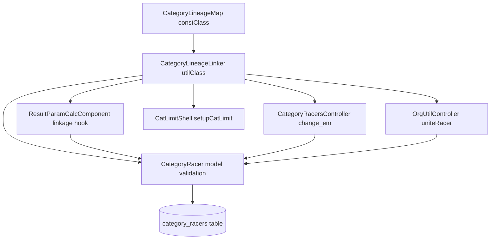
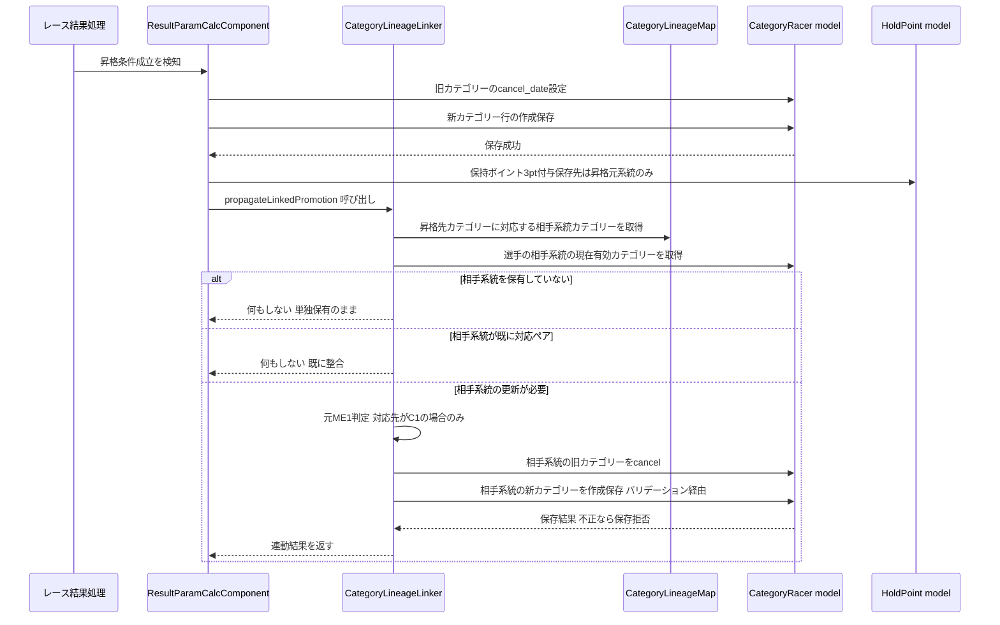
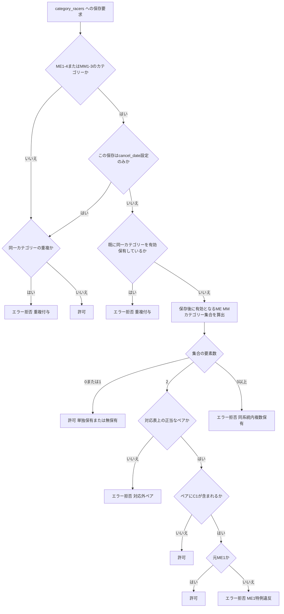

# Design Document: me-mm-linkage-2026-27

## Overview

本機能は、cyclox2web（CakePHP 2.x / PHP 7.3 / MySQL 5.7、`cyclox2_svr/cyclox2/`）における選手の
カテゴリー認定（`category_racers`）を拡張し、AJOCC 2026-27ルールの「実力別エリート（ME1〜ME4 /
`C1`〜`C4`）と実力別マスターズ（MM1〜MM3 / `CM1`〜`CM3`）の対応ペア両保有」を正規のデータ状態として
扱えるようにする。

**Users**: 大会主催者（カテゴリー付与・切替操作を行う）、システム管理者（選手統合・シーズン
バッチ運用を行う）、選手（両系統での認定状態の恩恵を受ける）。

**Impact**: 既存の `category_racers` テーブル構造・履歴管理方式（`apply_date`/`cancel_date`/
`reason_id`）は変更しない。カテゴリー認定情報の保存経路すべてに一元的な整合性検証を追加し、
レース結果によるリアルタイム昇格処理に系統間連動を追加する。既存の「片系統完結」の昇格挙動・
ランキング集計挙動・res-sys側の表示挙動は変更しない。

### Goals
- ME⇔MM対応表を単一のソースとして定義し、本specおよび後続4spec（catracer-cleanup-2026-27、
  season-rules-2026-27、jcx-lineage-lock-2026-27、ajocc-point-267-prod）から参照可能にする
- レース結果に基づくリアルタイム昇格が、対応表に沿って相手系統のカテゴリーへ連動する
- 対応外ペア・重複付与を、カテゴリー認定情報のあらゆる保存経路でエラー拒否する（自動整合はしない）
- `change_em`・`CatLimitShell`・`unite_racer` の既存不具合（brief記載の要改修項目）を、
  対応表と一元バリデーションを土台にして解消する
- 2026-07-31までにTDDで実装可能な粒度に分解できる設計にする

### Non-Goals
- 既存の対応外ペアデータの是正（catracer-cleanup-2026-27）
- シーズン末の残留・降格判定ロジックの変更（season-rules-2026-27）
- JCXエントリー時の系統固定制御（jcx-lineage-lock-2026-27）
- 新8区分ポイント表の本番化（ajocc-point-267-prod）
- 女子系統（`CL1`〜`CL3`、`WM`）への対応表適用（research.mdで対象外と確定済み）
- AJOCCランキング集計ロジック自体の変更

## Boundary Commitments

### This Spec Owns
- ME⇔MM対応表の定義（`CategoryLineageMap`）とその判定API（`CategoryLineageLinker`）
- `category_racers` への保存時に対応外ペア・重複付与を拒否するバリデーションロジック
  （`CategoryRacer` モデル）
- レース結果によるリアルタイム昇格時の系統間連動ロジック（`ResultParamCalcComponent`拡張）
- 元ME1判定ロジック
- `change_em`（系統切替画面）の新ルール下での役割・挙動
- `CatLimitShell::setupCatLimit()` の両系統出走選手への対応
- `OrgUtilController::uniteRacer()` の重複防止チェック

### Out of Boundary
- 既存の不整合データそのものの是正（catracer-cleanup-2026-27）。本specは「今後の保存」のみを
  正しく保つ
- シーズン末の残留・降格判定、系統横断残留判定（season-rules-2026-27）
- JCXシリーズ戦のエントリー制御（jcx-lineage-lock-2026-27）
- 女子系統（`CL1`〜`CL3`、`WM`）へのペア対応表適用
- res-sys（成績閲覧アプリ）側の実装変更
- AJOCCランキング集計（`PointSeriesController`等）のロジック変更

### Allowed Dependencies
- 既存 `category_racers`／`categories`／`hold_points` テーブル構造（スキーマ変更なし。
  `racers.cat_limit` は既存 `varchar(255)` カラムの値域拡張のみ）
- 既存の `app/Cyclox/Const/*` enum風パターン（`EntryCatLimit` 等）
- 既存の `SoftDelete` ビヘイビア、`TransactionManager`
- 後続spec（catracer-cleanup-2026-27 等）は本specが定義する `CategoryLineageMap` /
  `CategoryLineageLinker` の公開APIにのみ依存してよい（内部実装への直接依存は不可）

### Revalidation Triggers
- `CategoryLineageMap` の対応ペア定義（コード一覧・対応関係）が変更された場合
- `CategoryLineageLinker` の公開メソッドのシグネチャ・戻り値契約が変更された場合
- HoldPoint付与先の決定方針（本設計の Decision 参照）が変更された場合
- `category_racers` への新しい保存経路が追加され、一元バリデーションの適用対象から漏れる場合

## Architecture

### Existing Architecture Analysis
- CakePHPの伝統的なMVC構成。ドメインロジックの多くは `Controller/Component`
  （`ResultParamCalcComponent`）に集中しており、Modelは薄い（`CategoryRacer` はバリデーション
  ほぼ無し）。
- `app/Cyclox/Const/*` に、DBに依存しない列挙的な定数クラス群が既に存在し、
  `App::uses('XXX', 'Cyclox/Const')` で読み込む規約が確立している。
- `app/Cyclox/Util/*` に、モデルを介さない純粋ロジック（`PointCalculator`, `AjoccUtil`等）を置く
  規約が既に存在する。
- `category_racers` への保存経路は13箇所（`grep`で実測、brief記載の14経路とほぼ一致）あり、
  いずれも `CategoryRacer->save()`/`saveAll()`/`saveMany()` を経由し、`validate => false` を
  指定していない（research.md参照）。

### Architecture Pattern & Boundary Map



**Architecture Integration**:
- 選定パターン: 既存の層構造（Const → Util → Model → Component/Controller/Console）をそのまま
  踏襲する拡張型パターン。新規サブシステムは作らない。
- ドメイン境界: 「対応表の定義」（Const）と「対応表を使った判定ロジック」（Util）を分離し、
  「判定結果に基づく保存時拒否」（Model）と「判定結果に基づく連動更新」（Component/Controller/
  Console）を利用側に委ねる。判定ロジックを単一のUtilクラスに集約することで、Model層・
  Component層・Controller層・Console層のいずれからも同じ判定基準を参照できる。
- 既存パターンの継承: `app/Cyclox/Const/*` のenum風パターン、`App::uses()`によるレイヤー読込規約、
  `TransactionManager`によるトランザクション境界を維持する。
- 新規コンポーネントの理由: `CategoryLineageMap`（対応表の単一ソースが要件で明示的に要求されている）、
  `CategoryLineageLinker`（対応表単体では表現できない「元ME1判定」「保有集合としての正当性判定」
  「連動先カテゴリーの解決」という手続き的ロジックが必要なため、Const層とModel/Component層の間に
  1枚追加する）。
- Steering準拠: 依存方向は Const → Util → Model → Component/Controller/Console の一方向のみ
  （逆方向の参照は禁止）。

### Technology Stack

| Layer | Choice / Version | Role in Feature | Notes |
|-------|------------------|-----------------|-------|
| Backend | PHP 7.3 / CakePHP 2.x | 既存フレームワークをそのまま使用 | 新規ライブラリ追加なし |
| Data / Storage | MySQL 5.7（`category_racers`/`categories`/`hold_points`/`racers`） | 既存スキーマのまま使用。`racers.cat_limit`（`varchar(255)`）の値域を拡張するのみ | DDL変更なし |
| Testing | CakePHPの`CakeTestCase`（`lib/Cake/TestSuite/`、PHPUnit基盤） | 新規テストケース・フィクスチャを追加 | 既存プロジェクトに新規依存追加なし |

## File Structure Plan

### Directory Structure
```
app/
├── Cyclox/
│   ├── Const/
│   │   ├── CategoryLineageMap.php     # 新規: ME⇔MM対応表の単一ソース（Requirement 1, 9）
│   │   └── EntryCatLimit.php          # 変更: $BOTH（両系統出走）値を追加（Requirement 7）
│   └── Util/
│       └── CategoryLineageLinker.php  # 新規: 対応表を使った判定・連動ロジック（Requirement 2-9）
├── Model/
│   └── CategoryRacer.php              # 変更: $validate にカスタムルールを追加（Requirement 3, 8, 9）
├── Controller/
│   ├── CategoryRacersController.php   # 変更: change_em系メソッドの対応表参照・cancel範囲限定（Requirement 6）
│   ├── OrgUtilController.php          # 変更: uniteRacer() に統合後整合性チェックを追加（Requirement 8）
│   └── Component/
│       └── ResultParamCalcComponent.php # 変更: 昇格適用関数末尾に連動フックを追加（Requirement 4, 5）
├── Console/
│   └── Command/
│       └── CatLimitShell.php          # 変更: シーズン内の両系統出走を検知（Requirement 7）
├── View/
│   └── CategoryRacers/
│       ├── change_em.ctp              # 変更: 役割再定義に伴う文言更新（Requirement 6）
│       └── check_change_em.ctp        # 変更: 同上
└── Test/
    ├── Case/
    │   ├── Cyclox/
    │   │   ├── Const/
    │   │   │   └── CategoryLineageMapTest.php       # 新規
    │   │   └── Util/
    │   │       └── CategoryLineageLinkerTest.php    # 新規
    │   ├── Model/
    │   │   └── CategoryRacerTest.php                # 新規
    │   ├── Controller/
    │   │   ├── CategoryRacersControllerTest.php      # 新規
    │   │   ├── OrgUtilControllerTest.php              # 新規
    │   │   └── Component/
    │   │       └── ResultParamCalcComponentTest.php  # 新規
    │   └── Console/
    │       └── Command/
    │           └── CatLimitShellTest.php              # 新規
    └── Fixture/
        ├── CategoryFixture.php         # 新規（C1-C4, CM1-CM3, CL1-3, WM 等のテストデータ）
        ├── CategoryRacerFixture.php    # 新規
        ├── RacerFixture.php            # 新規
        └── HoldPointFixture.php        # 新規
```

### Modified Files
- `app/Model/CategoryRacer.php` — `$validate` にカスタムルール `checkLineagePair` /
  `checkNoDuplicateCategory` を追加し、`CategoryLineageLinker` へ委譲する。
- `app/Controller/Component/ResultParamCalcComponent.php` — `__execApplyRankUp()` と
  `__applyRankUp2CM()` の末尾（新カテゴリー行保存とHoldPoint付与が成功した直後）に
  `CategoryLineageLinker::propagateLinkedPromotion()` 呼び出しを追加する。既存の分岐・
  削除・cancel処理は変更しない。
- `app/Controller/CategoryRacersController.php` — `__check_category_to()` の対応マップを
  `CategoryLineageMap` 参照に置換。`check_change_em()` の `end_cats` 算出を「反対系統の
  有効カテゴリー全部」から「切替先との対応表上のペアにならないもののみ」へ限定。
- `app/Controller/OrgUtilController.php` — `uniteRacer()` の `CategoryRacer->saveAll()`
  呼び出し後（同一トランザクション内・コミット前）に、統合先選手の統合後有効カテゴリー集合を
  `CategoryLineageLinker::validateActiveSet()` で検証し、不正なら統合全体をロールバックする。
- `app/Console/Command/CatLimitShell.php` — `setupCatLimit()` 内のシーズン判定処理を、
  「シーズン最初の出走のみ参照」から「シーズン中のElite/Masters双方の出走有無を判定」へ変更。
- `app/Cyclox/Const/EntryCatLimit.php` — `$BOTH`（charVal `b`）を追加。
- `app/View/CategoryRacers/change_em.ctp`, `check_change_em.ctp` — 役割再定義に伴う説明文言の更新
  （「系統切替」から「対応ペア補完・特例対応」への文言変更。ロジック変更は伴わない）。

> `Test/Case`は`app`のクラス配置をミラーする既存規約（`Controller/Component/*Test.php`等の
> ディレクトリ構造）に倣う。`Cyclox/Const`・`Cyclox/Util`・`Console/Command`配下のテストは
> 本feature着手時点で前例が無いため、上記の対称構造を新設する。

## System Flows

### リアルタイム昇格の系統間連動フロー



**Key Decisions**:
- 連動更新（相手系統への保存）も必ず `CategoryRacer` モデルの一元バリデーションを経由させる。
  これにより連動更新自体が新たな不整合を生む可能性を構造的に排除する（Requirement 4.6）。
- HoldPointは昇格元系統にのみ1回付与する（research.md Decision参照、Requirement 4.5）。
- 相手系統を保有していない選手には新規にカテゴリーを付与しない（Requirement 4.4）。

### 対応外ペア・重複バリデーション判定フロー



## Requirements Traceability

| Requirement | Summary | Components | Interfaces | Flows |
|-------------|---------|------------|------------|-------|
| 1.1-1.4 | 対応表の単一定義 | CategoryLineageMap | `pairedCategory()`, `eliteCategories()`, `mastersCategories()` | - |
| 2.1-2.3 | 対応ペア両保有の正常系 | CategoryLineageLinker, CategoryRacer | `isValidActiveSet()` | 対応外ペア判定フロー |
| 3.1-3.6 | 対応外ペア・重複のバリデーション | CategoryRacer, CategoryLineageLinker | `$validate`カスタムルール, `isValidActiveSet()` | 対応外ペア判定フロー |
| 4.1-4.6 | リアルタイム昇格の系統間連動 | ResultParamCalcComponent, CategoryLineageLinker | `propagateLinkedPromotion()` | 系統間連動フロー |
| 5.1-5.4 | ME1特例（元ME1判定） | CategoryLineageLinker | `isFormerElite1()`, `resolveLinkedTarget()` | 系統間連動フロー |
| 6.1-6.4 | change_emの役割再定義 | CategoryRacersController, CategoryLineageMap | `__check_category_to()`（改修） | - |
| 7.1-7.2 | CatLimitShellの両系統対応 | CatLimitShell, EntryCatLimit | `setupCatLimit()`（改修） | - |
| 8.1-8.2 | 選手統合時の重複防止 | OrgUtilController, CategoryLineageLinker | `validateActiveSet()` | - |
| 9.1-9.2 | 女子系統の対応表対象外 | CategoryLineageMap, CategoryRacer | `pairedCategory()`が対象外カテゴリーに`null`を返す | - |

## Components and Interfaces

| Component | Domain/Layer | Intent | Req Coverage | Key Dependencies (P0/P1) | Contracts |
|-----------|--------------|--------|---------------|---------------------------|-----------|
| CategoryLineageMap | Const | ME⇔MM対応表の単一ソース | 1, 9 | なし（最下層） | State |
| CategoryLineageLinker | Util | 対応表を使った判定・連動ロジック | 2, 3, 4, 5, 8, 9 | CategoryLineageMap (P0), CategoryRacer model (P0) | Service |
| CategoryRacer (model) | Model | 保存時の一元バリデーション | 3, 8, 9 | CategoryLineageLinker (P0) | State |
| ResultParamCalcComponent (拡張) | Component | リアルタイム昇格の系統間連動フック | 4, 5 | CategoryLineageLinker (P0), CategoryRacer model (P0) | Service |
| CategoryRacersController (change_em系, 拡張) | Controller | 系統切替の対応表準拠化 | 6 | CategoryLineageMap (P0), CategoryRacer model (P0) | Service |
| CatLimitShell (拡張) | Console | 両系統出走の正しい記録 | 7 | EntryCatLimit (P1) | Batch |
| OrgUtilController.uniteRacer (拡張) | Controller | 統合後の整合性保証 | 8 | CategoryLineageLinker (P0), CategoryRacer model (P0) | Service |

### Const層

#### CategoryLineageMap

| Field | Detail |
|-------|--------|
| Intent | ME1〜ME4とMM1〜MM3の対応ペアを単一の場所で定義し、他コンポーネント・他specから参照可能にする |
| Requirements | 1.1, 1.2, 1.3, 1.4, 9.1 |

**Responsibilities & Constraints**
- `C1〜C4`・`CM1〜CM3` のみを対応表の対象とし、それ以外（`CL1〜CL3`, `WM`等）は対象外として
  `null` を返す（Requirement 9.1）
- 対応関係: `C4⇔CM3`, `C3⇔CM2`, `C2⇔CM1`, `C1⇔CM1`（`C1⇔CM1`はUtil層の元ME1判定と組み合わせて
  初めて成立を判定できるため、本ConstクラスはC1↔CM1の対応関係自体は返すが、成立条件の判定は
  持たない）
- 既存 `app/Cyclox/Const/*` の enum風パターン（static `init()`、`private`コンストラクタ）を踏襲する

**Dependencies**
- なし（最下層）

**Contracts**: Service [ ] / API [ ] / Event [ ] / Batch [ ] / State [x]

##### State Management
- State model: イミュータブルな静的定義（`init()`で一度構築、以後読み取り専用）
- Persistence & consistency: DBに依存しないコード内定数。`categories`テーブルのコード体系変更時は
  本クラスの改修が必須（Revalidation Trigger）
- Concurrency strategy: 読み取り専用のため考慮不要

**公開API（概念契約）**
- `pairedCategory(string $categoryCode): ?string` — 対応する相手系統カテゴリーコードを返す。
  対象外カテゴリーは `null`
- `isEliteCategory(string $categoryCode): bool` / `isMastersCategory(string $categoryCode): bool`
- `eliteCategories(): array` / `mastersCategories(): array` — 対応表対象のカテゴリーコード一覧
  （降順: `C1..C4` / `CM1..CM3`）
- `isLineageManagedCategory(string $categoryCode): bool` — 本対応表の管理対象カテゴリーか
  （Requirement 9.1の判定に使用）

**Implementation Notes**
- Integration: 後続spec（catracer-cleanup-2026-27等）はこのクラスを直接 `App::uses()` で参照する
- Validation: 対応表の値が変更された場合、`CategoryLineageMapTest` で全ペアの往復整合性
  （`pairedCategory(pairedCategory($x)) === $x` が成立するのは`C2⇔CM1`を除く全ペア。`C1`は
  `CM1`への一方向、`CM1`のデフォルト対応は`C2`という非対称性をテストで明示する）を検証する
- Risks: 対応表とAJOCC規則文書との齟齬。brief/roadmapで既に合意済みの対応関係をそのまま実装する

### Util層

#### CategoryLineageLinker

| Field | Detail |
|-------|--------|
| Intent | 対応表を用いた「保有集合の正当性判定」「元ME1判定」「連動先カテゴリーの解決」「連動保存の実行」を提供する |
| Requirements | 2.1, 2.2, 2.3, 3.1, 3.2, 3.3, 3.4, 3.5, 3.6, 4.1, 4.2, 4.3, 4.4, 4.5, 4.6, 5.1, 5.2, 5.3, 5.4, 8.1, 8.2, 9.1, 9.2 |

**Responsibilities & Constraints**
- `CategoryRacer` モデルの保存時バリデーション、`ResultParamCalcComponent` の連動フック、
  `CategoryRacersController` の`change_em`系処理、`OrgUtilController::uniteRacer()`、
  `CatLimitShell` のいずれからも同一のロジックを呼び出す単一の判定エンジンとする
- 元ME1判定はSoftDelete適用済みの論理削除を含む全履歴（`deleted=0`のもの。cancel_date の有無は
  問わず、過去に一度でも`C1`を有効保有していた記録があれば元ME1とする）を参照する
- 本クラス自身はDB保存を行わない（`isValidActiveSet`等は判定のみ）。ただし
  `propagateLinkedPromotion()`のみ、連動更新の実行（`CategoryRacer->save()`呼び出し）まで担う
  例外とする（呼び出し元でのcancel→create手順の重複実装を避けるため）

**Dependencies**
- Outbound: CategoryLineageMap（対応表参照, P0）
- Outbound: CategoryRacer model（保有履歴の検索・保存, P0）

**Contracts**: Service [x] / API [ ] / Event [ ] / Batch [ ] / State [ ]

##### Service Interface
```php
interface CategoryLineageLinker {
    /**
     * 選手が「保存後に有効保有することになるME/MMカテゴリー集合」が正当（単独保有 or 正当ペア）かを判定する。
     * @param string $racerCode
     * @param string[] $prospectiveActiveCodes 保存後に有効となるME1-4/CM1-3カテゴリーコードの集合
     * @return true|CategoryLineageValidationError
     */
    public function isValidActiveSet(string $racerCode, array $prospectiveActiveCodes);

    /**
     * 選手が過去に C1（ME1）を有効保有していたことがあるか。
     */
    public function isFormerElite1(string $racerCode): bool;

    /**
     * 起点カテゴリーへの新規適用に対し、相手系統の連動先カテゴリーを解決する。
     * 相手系統を保有していない場合は null（新規付与しない）。
     */
    public function resolveLinkedTarget(string $racerCode, string $appliedCategoryCode): ?string;

    /**
     * リアルタイム昇格に伴う相手系統への連動保存を実行する。
     * 内部で resolveLinkedTarget を用い、必要な場合のみ cancel+create を CategoryRacer 経由で行う。
     * @return CategoryLineagePropagationResult 実行結果（連動の有無、作成/失敗したCategoryRacer情報）
     */
    public function propagateLinkedPromotion(
        string $racerCode,
        string $appliedCategoryCode,
        array $sourceResult,
        string $atDate
    ): CategoryLineagePropagationResult;

    /**
     * 選手統合など複数行の一括更新後に、統合先選手の有効カテゴリー集合全体を検証する。
     * @return true|CategoryLineageValidationError
     */
    public function validateActiveSet(string $racerCode): mixed;
}
```
- Preconditions: `$racerCode` は存在する選手コード。`$appliedCategoryCode`・
  `$prospectiveActiveCodes` はカテゴリーコード（`categories.code`）。
- Postconditions: `propagateLinkedPromotion()` が連動更新を行った場合、更新後の状態は必ず
  `isValidActiveSet()` を満たす（Requirement 4.6）。判定系メソッド（`isValidActiveSet`,
  `validateActiveSet`）はDBを変更しない。
- Invariants: 対応表対象外のカテゴリー（`CL1〜CL3`, `WM`等）は判定対象集合から除外される
  （Requirement 9.1, 9.2）。

**Implementation Notes**
- Integration: `CategoryRacer::$validate` のカスタムルールから `isValidActiveSet()` を呼び出す。
  `ResultParamCalcComponent` からは `propagateLinkedPromotion()` を呼び出す。
  `CategoryRacersController` は `resolveLinkedTarget()` 相当のロジックで `__check_category_to()`
  のマップを置換する。`OrgUtilController::uniteRacer()` は `saveAll()` 実行後・トランザクション
  コミット前に `validateActiveSet()` を呼び出す。
- Validation: 元ME1判定はSoftDeleteを無視した全履歴検索で行う（既存コードの
  `Behaviors->unload('Utils.SoftDelete')` パターンを踏襲）。
- Risks: `isValidActiveSet` が呼び出し元によって「保存後に有効となる集合」の算出方法が異なると
  判定がずれる。呼び出し元は必ず「対象レコードを除いた現在の有効集合 + 今回保存しようとしている
  カテゴリー」を渡す契約とし、`CategoryRacerTest`/`CategoryLineageLinkerTest`双方でこの契約を
  固定するテストケースを用意する。

### Model層

#### CategoryRacer（拡張）

| Field | Detail |
|-------|--------|
| Intent | `category_racers` への保存経路すべてに対応外ペア・重複付与の拒否を一元適用する |
| Requirements | 3.1, 3.2, 3.3, 3.4, 3.5, 3.6, 8.2, 9.1, 9.2 |

**Responsibilities & Constraints**
- 既存の `$validate`（`racer_code`/`category_code`/`apply_date`/`reason_id`の必須・形式チェック）
  に加え、以下2つのカスタムルールを追加する:
  - `checkNoDuplicateCategory`（`category_code`に付与）: 保存後に同一カテゴリーコードが
    重複して有効保有されないことを検証する（対応表対象外カテゴリーも含め全カテゴリー共通）
  - `checkLineagePair`（`category_code`に付与）: 保存によって新たに有効カテゴリーが生じる場合
    （＝ `cancel_date` が空/未設定の保存）にのみ、`CategoryLineageLinker::isValidActiveSet()`
    を呼び出す
- `cancel_date` を設定するだけの保存（既存カテゴリーの終了処理）は `checkLineagePair` の対象外
  とする（cancelは集合を縮小するのみで不整合を生まないため。Requirement 3.1の「新しいカテゴリーが
  付与されようとし」に該当しない）
- バリデーションエラー時は主催者・システム管理者が理由を理解できるメッセージを返す
  （Requirement 3.3）。CakePHPの標準エラーメッセージ機構（`$validate`の`message`）を用いる

**Dependencies**
- Outbound: CategoryLineageLinker（判定, P0）

**Contracts**: Service [ ] / API [ ] / Event [ ] / Batch [ ] / State [x]

##### State Management
- State model: `category_racers`の各行は「選手×カテゴリー×有効期間」を表す。有効状態は
  `cancel_date IS NULL`。本設計はこの既存モデルを変更しない
- Persistence & consistency: 保存（INSERT/UPDATE）ごとに`$validate`が実行される（CakePHP標準）。
  一括保存（`saveAll`/`saveMany`）は行ごとに検証されるため、複数行にまたがる整合性は呼び出し側
  （`OrgUtilController::uniteRacer()`）が`validateActiveSet()`で別途保証する（Requirement 8.1）
- Concurrency strategy: 既存の`TransactionManager`によるトランザクション境界をそのまま利用する。
  本設計はロック戦略を追加しない（同一選手への同時更新は既存踏襲のリスクとして許容する）

**Implementation Notes**
- Integration: 13/14の既存保存経路（Controller/Component/Console）はコード変更なしに本ルールの
  適用を受ける（research.md参照）
- Validation: `checkLineagePair`は「保存後に有効となるME/MMカテゴリー集合」を`CategoryLineageLinker`
  に渡すために、保存対象レコード自身のID（更新時）を除外した「現在の有効カテゴリー一覧」をDBから
  取得したうえで、保存しようとしているcategory_codeを加えた集合を構築する
- Risks: 大量一括処理（既存の是正バッチ等、将来のcatracer-cleanup-2026-27）で本バリデーションが
  性能上のボトルネックになる可能性。本specでは通常運用の保存頻度を前提とし、性能要件は非対象
  （catracer-cleanup-2026-27側の設計で個別に検討する）

### Component層

#### ResultParamCalcComponent（拡張）

| Field | Detail |
|-------|--------|
| Intent | レース結果によるリアルタイム昇格発生時に、対応する相手系統カテゴリーへの連動更新を実行する |
| Requirements | 4.1, 4.2, 4.3, 4.4, 4.5, 4.6, 5.2, 5.3 |

**Responsibilities & Constraints**
- `__execApplyRankUp()`（エリート系昇格の汎用適用）・`__applyRankUp2CM()`（`CM1`/`CM2`昇格適用）の
  末尾、新カテゴリー行の保存とHoldPoint付与が両方成功した直後に
  `CategoryLineageLinker::propagateLinkedPromotion()` を呼び出す
- 既存の分岐・cancel処理・HoldPoint付与ロジックは変更しない（Simplification: 新規責務は追加箇所を
  最小化したフック呼び出しに限定する）
- 連動保存が失敗した場合、昇格処理全体の戻り値ステータスを`Constant::RET_FAILED`とし、呼び出し元の
  トランザクション制御に委ねる（既存の他の部分的失敗パターンと同じ扱い）

**Dependencies**
- Outbound: CategoryLineageLinker（連動判定・実行, P0）
- Outbound: CategoryRacer model（既存, P0）
- Outbound: HoldPoint model（既存, 変更なし, P1）

**Contracts**: Service [x] / API [ ] / Event [ ] / Batch [ ] / State [ ]

##### Service Interface
- 既存の `private function __execApplyRankUp(...)` / `__applyRankUp2CM(...)` の内部末尾に
  `$this->CategoryLineageLinker->propagateLinkedPromotion($racerCode, $categoryTo, $result, $applyDate)`
  を追加する（新規public APIの追加はしない。既存メソッドのシグネチャは変更しない）

**Implementation Notes**
- Integration: `App::uses('CategoryLineageLinker', 'Cyclox/Util')` を追加し、
  `__setupParams()`（既存の依存初期化箇所）でインスタンス化する
- Validation: 連動保存も`CategoryRacer`モデルの一元バリデーションを通るため、連動先が不正になる
  ケース（理論上、対応表とMEI特例ロジックが正しければ発生しないはずだが、既存不整合データが
  残っている選手に対して昇格が起きた場合は起こりうる）はログ出力のうえ`RET_FAILED`とする
- Risks: 既存不整合データ（catracer-cleanup-2026-27で是正予定）を保有する選手に対して本フックが
  最初に動作した際、連動保存がバリデーションエラーになる可能性がある。ログに詳細を残し、
  主催者が手動確認できるようにする（自動修復はしない、Requirement 3.5と整合）

### Controller層

#### CategoryRacersController（change_em系, 拡張）

| Field | Detail |
|-------|--------|
| Intent | 系統切替操作を「対応ペア補完・ME1特例対応ツール」として再定義し、対応外ペアを生む無条件cancelを廃止する |
| Requirements | 6.1, 6.2, 6.3, 6.4 |

**Responsibilities & Constraints**
- `__check_category_to()`: 内部のハードコードされた`$map`を`CategoryLineageMap::pairedCategory()`
  参照に置換する
- `check_change_em()`: `end_cats`（cancel対象）の算出を、「切替先の反対系統に属する有効カテゴリー
  全部」から「切替先カテゴリーとの対応表上のペアに**ならない**反対系統の有効カテゴリーのみ」に
  限定する。既に対応表上の正しいペアになっている反対系統カテゴリーは`keep_cats`として保持し
  cancelしない
- `exec_change_em()`: 保存処理自体は変更しない（`CategoryRacer`モデルの一元バリデーションが
  Requirement 6.1/6.4の拒否を担う）

**Dependencies**
- Outbound: CategoryLineageMap（対応表参照, P0）
- Outbound: CategoryRacer model（一元バリデーション経由の拒否, P0）

**Contracts**: Service [x] / API [ ] / Event [ ] / Batch [ ] / State [ ]

##### Service Interface
- 既存の `private function __check_category_to(array $cats): array` のシグネチャ・戻り値形式
  （`array('from' => ..., 'to' => ...)`）は変更しない。内部実装のみ`CategoryLineageMap`参照に置換

**Implementation Notes**
- Integration: View（`change_em.ctp`, `check_change_em.ctp`）の説明文言を「系統切替」から
  「対応ペア補完・特例対応」に更新する（挙動変更ではなく利用者への説明の正確化）
- Validation: ME1特例に該当しない`C1`への切替試行は、`CategoryRacer`モデルの
  `checkLineagePair`ルールが`CategoryLineageLinker::isFormerElite1()`を通じて拒否する
  （Requirement 6.4はモデル層の拒否をControllerが正しく利用者に伝えることで満たす）
- Risks: 既存の`change_em`利用者（主催者）が「系統を完全に切り替える」という旧来の操作感を期待して
  いる可能性があるため、View文言の変更と合わせて運用周知が必要（実装外のフォロー事項として
  tasks.mdまたは運用ドキュメントに記録する）

#### OrgUtilController.uniteRacer（拡張）

| Field | Detail |
|-------|--------|
| Intent | 選手統合処理が統合後に対応外ペア・重複を残さないことを保証する |
| Requirements | 8.1, 8.2 |

**Responsibilities & Constraints**
- 既存の `CategoryRacer->saveAll($param)`（統合元の`category_racers`行の`racer_code`書換え）の
  成功後、同一トランザクション内・`TransactionManager->commit()`前に
  `CategoryLineageLinker::validateActiveSet($uniteTo)` を呼び出す
- 検証が失敗した場合、`uniteRacer()`は`false`を返し、呼び出し元`do_unite_racer()`の既存の
  ロールバック処理（`TransactionManager->rollback($transaction)`）がそのまま機能する
- 統合元・統合先が同一カテゴリーを共に有効保有していた場合の重複は、`saveAll()`によって
  同一`racer_code`・同一`category_code`の行が複数存在する状態になるため、`validateActiveSet()`の
  重複検知（Requirement 3.2相当のロジックをUtil層で再利用）で検出する

**Dependencies**
- Outbound: CategoryLineageLinker（統合後集合の検証, P0）

**Contracts**: Service [x] / API [ ] / Event [ ] / Batch [ ] / State [ ]

##### Service Interface
- 既存の `public function uniteRacer($united, $uniteTo, $userNote = ''): bool` のシグネチャは
  変更しない。内部で検証呼び出しを追加し、失敗時は既存の「`false`を返す」規約に従う

**Implementation Notes**
- Integration: 検証失敗時のログメッセージ（`$this->log(...)`）を既存の他の失敗ケースと同じ形式で
  追加する
- Risks: 統合前から双方の選手が個別には正当（対応表準拠）でも、統合後の合算集合が3カテゴリー以上に
  なるケース（例: 統合元が`C3`+`CM2`保有、統合先が`C2`+`CM1`保有）を確実に拒否できるよう、
  `OrgUtilControllerTest`でこのシナリオを明示的にカバーする

### Console層

#### CatLimitShell（拡張）

| Field | Detail |
|-------|--------|
| Intent | シーズン毎のエントリー制限表示用データ（`racers.cat_limit`）が両系統出走選手を正しく表現する |
| Requirements | 7.1, 7.2 |

**Responsibilities & Constraints**
- `setupCatLimit()`内の判定を、「シーズン最初の出走エントリーのみを見てElite/Masters一方を
  決定する」既存ロジックから、「シーズン中の全出走エントリーを見てElite/Masters両方への出走が
  あれば`EntryCatLimit::$BOTH`、片方のみなら従来通りそちらを、無ければ`$NONE`」判定へ変更する
- `EntryCatLimit`（Const）に`$BOTH`（charVal `b`, name `Elite&Masters`）を追加する
- 既存の「シーズンごとに1文字を該当インデックス位置へ書き込む」文字列構造（`racers.cat_limit`,
  `varchar(255)`）は変更しない

**Dependencies**
- Outbound: EntryCatLimit（拡張, P1）

**Contracts**: Service [ ] / API [ ] / Event [ ] / Batch [x] / State [ ]

##### Batch / Job Contract
- Trigger: 既存通り `cake cat_limit setupCatLimit`（cron前提、増分更新）
- Input / validation: 既存通り `EntryRacer.modified` の差分検知
- Output / destination: `racers.cat_limit`（既存カラム、値域に`b`を追加）
- Idempotency & recovery: 既存通り。本変更は判定ロジックのみでバッチの冪等性・再実行性は変更しない

**Implementation Notes**
- Integration: `app/View/Racers/{view,edit,add}.ctp`のラベル・凡例表示に`b`（両方）の説明を追加する
  （表示側の軽微な追随）
- Validation: `CatLimitShellTest`で「同一シーズン内にElite/Masters双方のEntryRacerが存在する選手」
  のケースを追加する
- Risks: 既存の「最初の出走のみ参照」から「シーズン全体を参照」への変更はクエリ範囲が広がるため、
  性能への影響を軽微だが考慮する（対象は選手×シーズン単位の増分処理のため許容範囲と判断）

## Data Models

### Domain Model
- 本specは新しいドメインエンティティを追加しない。既存の `CategoryRacer`（選手×カテゴリー×有効期間）
  ・`Category`（`code`をPKとするカテゴリーマスタ）・`HoldPoint`（残留ポイント）・`Racer`
  （選手マスタ、`cat_limit`含む）をそのまま利用する
- 新たな不変条件（invariant）: 「ある選手について、`ME1〜ME4/MM1〜MM3`のうち有効保有
  （`cancel_date IS NULL`）しているカテゴリーコードの集合は、空集合・単一要素・または
  `CategoryLineageMap`上の正当なペアのいずれかでなければならない」を`CategoryRacer`モデルの
  責務として追加する

### Logical Data Model
- テーブル構造の変更なし。`category_racers`（既存カラムのまま）、`racers.cat_limit`
  （既存`varchar(255)`のまま、許容文字集合に`b`を追加）
- 参照整合性ルールの変更なし（`category_code`は`categories.code`への論理外部キーのまま）

### Physical Data Model
- スキーマ変更なし（brief/roadmap記載の「DBスキーマ変更は原則なし」制約に準拠）
- インデックス追加は不要と判断する。理由: `CategoryLineageLinker`が行う「選手の現在有効カテゴリー
  検索」は既存コード（`__setupCatRacerCancel`等）が既に多用しているクエリパターン
  （`racer_code` + `cancel_date IS NULL または >= 基準日` + `apply_date <= 基準日`）と同一であり、
  既存の性能特性を超えない

### Data Contracts & Integration
- 本specは外部API・イベントを新設しない。`CategoryLineageMap`/`CategoryLineageLinker`の公開
  メソッドシグネチャ（Components and Interfaces節に記載）が、後続spec
  （catracer-cleanup-2026-27等）との実質的なデータ契約となる

## Error Handling

### Error Strategy
- 保存時バリデーションエラー（CakePHPの`$validate`機構）を一次防御とし、失敗時は既存の
  Controller層の「保存失敗時のFlashメッセージ＋ロールバック」パターンをそのまま利用する
  （新しいエラーハンドリング機構は導入しない）

### Error Categories and Responses
- **業務ルール違反（対応外ペア／重複付与）**: `CategoryRacer::$validate`が拒否し、CakePHPの
  標準エラーメッセージとして「対応関係にないカテゴリーの組み合わせです」「既に保有している
  カテゴリーです」等、原因が分かるメッセージを返す（Requirement 3.3）
- **ME1特例違反**: 同じく`$validate`経由で拒否。メッセージで「元ME1でない選手にはME1を
  付与できません」等を明示する
- **連動保存の失敗（システムエラー相当）**: `ResultParamCalcComponent`内でログ出力
  （`LOG_ERR`）のうえ`Constant::RET_FAILED`を返し、既存のトランザクション制御に委ねる
- **統合後不整合**: `OrgUtilController::uniteRacer()`が`false`を返し、既存の
  ロールバック＋Flashメッセージパターンに委ねる

### Monitoring
- 既存の`$this->log(...)`（CakePHPログ機構）による記録パターンを踏襲する。新規の監視基盤は
  導入しない。連動更新（`propagateLinkedPromotion`）の実行結果は`LOG_DEBUG`で記録し、
  是正バッチ（catracer-cleanup-2026-27）が参照できるログ形式に揃える

## Testing Strategy

### Unit Tests
- `CategoryLineageMapTest`: 全カテゴリーコードに対する`pairedCategory()`の戻り値（`C4⇔CM3`,
  `C3⇔CM2`, `C2⇔CM1`, `C1→CM1`, 対象外カテゴリーは`null`）を網羅する
- `CategoryLineageLinkerTest`: (1) 空集合・単独保有・正当ペア・対応外ペア・同系統内重複の
  各パターンでの`isValidActiveSet()`判定、(2) 元ME1履歴あり/なしでの`isFormerElite1()`、
  (3) `C1⇔CM1`特例を含む`resolveLinkedTarget()`の分岐（Requirement 5.2/5.3）
- `CategoryRacerTest`: `save()`呼び出しが対応外ペア・重複を拒否すること、cancel専用の保存
  （`category_code`を伴わない）はバリデーション対象外であること

### Integration Tests
- `ResultParamCalcComponentTest`: エリート側昇格→マスターズ側連動、マスターズ側昇格→エリート側
  連動、単独保有選手の昇格で相手系統に新規付与されないこと、HoldPointが昇格元系統にのみ1回
  付与されること（Requirement 4全AC）
- `CategoryRacersControllerTest`: `change_em`が対応ペア補完としてのみ機能し、既に正しいペアを
  破壊しないこと、ME1特例に反する切替がエラーになること
- `OrgUtilControllerTest`: 統合後に対応外ペア・重複が生じるケースで統合全体がロールバックされること

### Batch Tests
- `CatLimitShellTest`: 同一シーズン内でElite/Masters双方への出走がある選手に`b`が記録され、
  片方のみの選手は既存通り`e`/`m`が記録されること

## 技術要件・制約チェック（SDD overlay / 初回実装時）

### 環境固有の制約
| 制約 | 内容 |
|---|---|
| 言語ランタイムのバージョン制約 | PHP 7.3（既存Docker環境準拠）。PHP 7.3で有効な構文のみ使用する（例: `?string`等のnullable型宣言は7.1+で利用可、`??=`等7.4以降の構文は不可） |
| データストアのバージョン制約 | MySQL 5.7。スキーマ変更なしのため制約なし |
| Docker / 実行環境での考慮事項 | 既存`docker-compose`環境（cyclox2_docker）上でのCakePHPテストランナー実行を前提とする。実装作業自体はsubmodule `cyclox2_svr/cyclox2/`側の新規ブランチで行う |
| その他 | 本spec（cyclox2_docker側）はドキュメントのみ変更。コード実装はsubmodule側リポジトリ（`cyclox-dev/cyclox2web`）の別ブランチで行い、PRもsubmodule側に対して発行する |

### 初回実装前の確認
- [ ] 上記スタック・テスト方針・既存結合・環境制約を確認した
- [ ] 人間が技術要件を確認した（**承認の記録は `spec.json` の design ゲートに集約。本チェックは二重管理しない**）
