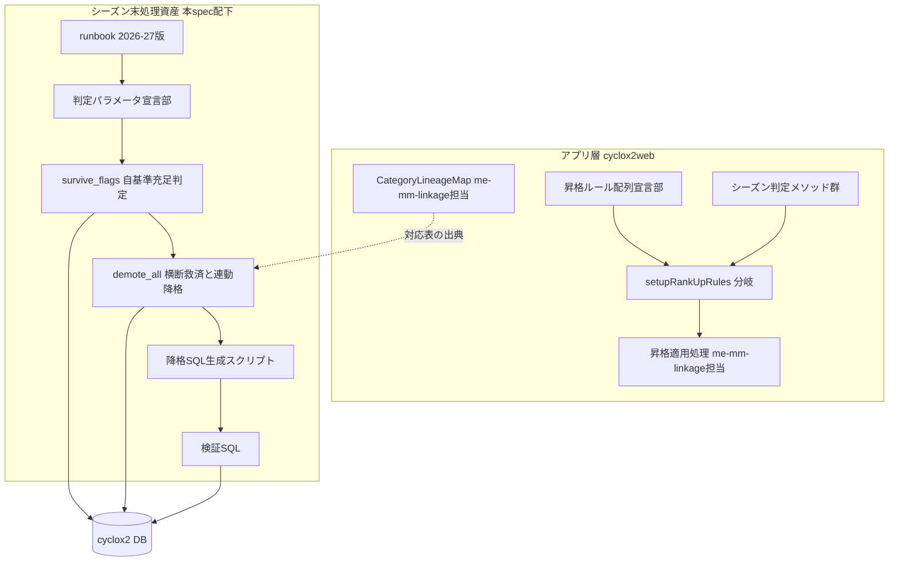
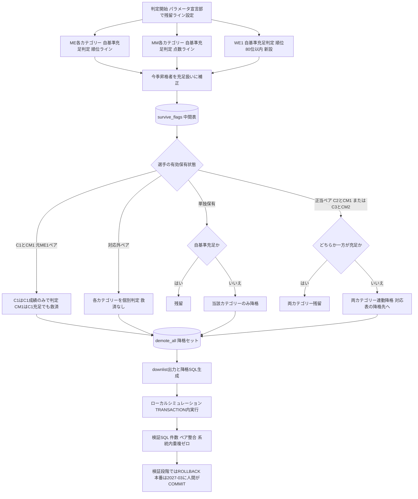

# Design Document: season-rules-2026-27

## Overview

本機能は、AJOCC 2026-27規則改正で変更される昇格・残留・降格ルールを cyclox2 に反映する。
対象は二層である。(a) **リアルタイム昇格枠**: cyclox2web（CakePHP 2.x / PHP 7.3、
`cyclox2_svr/cyclox2/`）の `ResultParamCalcComponent` における MM2→MM1 昇格上限を
2026-27シーズンから最大3名へ引き上げる。(b) **シーズン末残留・降格判定**:
rider-demotion-2025-26 の runbook/SQL 資産を、残留ライン新値（ME2/ME3=240位、WE1=80位新設）と
系統横断残留判定・ME1例外・連動降格に対応した 2026-27 版へ改訂し、ローカルダンプで検証する。

**Users**: 大会主催者（リアルタイム昇格の恩恵を受ける）、システム管理者（2027-03 のシーズン末
降格処理を runbook に従い実行する）、選手（新ルールでの認定・残留判定を受ける）。

**Impact**: アプリ側は `ResultParamCalcComponent` への追加のみで、既存のシーズン分岐・
ルール配列・昇格適用処理は変更しない。SQL 側は `.kiro/specs/season-rules-2026-27/` 配下に
新資産を作成し、`.kiro/specs/rider-demotion-2025-26/` の既存資産は変更しない（参照元として温存）。
本番 DB への降格処理実行は本 spec の成果物に含まれない（2027-03 に人間が実施）。

### Goals
- 2026-27シーズンのレースで MM2→MM1 が最大3名まで昇格でき、過去シーズンの判定は不変であること
- 2026-27シーズン末の残留・降格判定が新基準・系統横断・連動降格で実行できる SQL/runbook が
  整備され、2025-26 ローカルダンプで検証済みであること
- 昇格枠・残留ラインの値がシーズン毎に更新しやすい形（宣言部への集約＋有効シーズンの記録）で
  管理されること
- アプリコード変更は TDD、SQL/runbook はロールバック可能なシミュレーションで検証されること

### Non-Goals
- 2026-27シーズン末降格の本番実行（2027-03、人間が runbook に従い実施）
- ME⇔MM 対応表・両保有モデル・リアルタイム昇格の系統間連動そのもの（me-mm-linkage-2026-27）
- 既存の対応外ペアデータの是正（catracer-cleanup-2026-27）
- 新8区分ポイント表の本番化（ajocc-point-267-prod）、JCX 系統固定（jcx-lineage-lock-2026-27）
- AJOCC ランキング集計ロジック（`tmp_ajoccpt_racer_sets` の生成側）の変更

## Boundary Commitments

### This Spec Owns
- `ResultParamCalcComponent` の**昇格枠ルール定義**（ルール配列・シーズン判定・
  `__setupRankUpRules()` の 2026-27 分岐）
- 2026-27シーズン末の残留・降格**判定ルール**（残留ライン新値・系統横断残留・ME1例外・
  連動降格）の SQL 表現と runbook
- シーズン末判定 SQL 資産一式（判定セット生成・降格SQL生成・検証）と
  そのローカルダンプ検証プロセス
- 昇格枠・残留ライン値の管理方法（宣言部集約と有効シーズン記録の規約）

### Out of Boundary
- `ResultParamCalcComponent` の**昇格適用処理**（`__execApplyRankUp()` / `__applyRankUp2CM()`）
  への変更 — me-mm-linkage-2026-27 が連動フックを追加する領域であり、本 spec は触れない
- ME⇔MM 対応表の定義変更 — 単一ソースは me-mm-linkage-2026-27 の `CategoryLineageMap`。
  本 spec の SQL 内対応ペア定義はその複製（出典コメント必須）であり、正本ではない
- HoldPoint の付与ロジック — me-mm-linkage-2026-27 の決定（昇格元系統のみ1回付与）に従う。
  本 spec は HoldPoint モデル・付与処理を変更しない
- `category_racers` への保存バリデーション — me-mm-linkage-2026-27 の一元バリデーションが
  適用される。降格 SQL は直接 DB 操作（アプリ層を経由しない）のためバリデーション対象外だが、
  降格結果が対応表準拠であることは本 spec の検証 SQL が保証する
- 既存資産 `.kiro/specs/rider-demotion-2025-26/` の変更（読み取り専用の参照元）

### Allowed Dependencies
- me-mm-linkage-2026-27 が定義する ME⇔MM 対応表（C4⇔CM3, C3⇔CM2, C2⇔CM1, C1→CM1 非対称）と
  両保有モデル。アプリ側は `CategoryLineageMap` の公開 API のみ、SQL 側は対応関係の値
  （出典コメント付き複製）に依存する
- 計算済みランキング `tmp_ajoccpt_racer_sets`（全国版: `ajoccpt_local_setting_id IS NULL`,
  `type=1`, 合計点 = `sumup_json` 先頭要素）
- 既存テーブル `category_racers` / `racer_results` / `entry_racers` / `entry_categories` /
  `entry_groups` / `meets` / `seasons` / `category_races_categories`（スキーマ変更なし）
- rider-demotion-2025-26 の runbook/SQL 資産（改訂のベースとして参照）
- ローカル Docker 環境（`cyclox2_mysql` コンテナ、MySQL 5.7）と 2025-26 データダンプ

### Revalidation Triggers
- me-mm-linkage-2026-27 の `CategoryLineageMap` の対応ペア定義が変更された場合
  （SQL 内の複製定義の追随・再検証が必要）
- `ResultParamCalcComponent::__setupRankUpRules()` の分岐構造が他 spec により変更された場合
- `tmp_ajoccpt_racer_sets` のスキーマまたは集計仕様（全国版判定・sumup_json 形式）が
  変更された場合
- AJOCC が 2026-27 ルールの追補（残留ライン・昇格枠の再変更）を発表した場合
- `category_races_categories` の集計対象定義（特に CL1/UCIWE、UCI 区分の増減）が変更された場合

## Architecture

### Existing Architecture Analysis
- リアルタイム昇格枠は `ResultParamCalcComponent` 内で「ルール配列（メンバ宣言部 L45-90 に
  集約）× シーズン判定分岐（`__setupRankUpRules()`）」の2要素で管理され、2015-16 以降
  5世代の切替実績がある。判定は大会開催日 `__atDate` 基準のため、過去レースの再計算時も
  当時のルールが適用される
- 現行の CM2→CM1 ルールは `__rule011122`（40人以上→2名、10人以上→1名）。`CM2+3` レースも
  同配列を共有する
- シーズン末降格は SQL 直接操作方式（runbook + 判定SQL + 生成スクリプト + 検証SQL）。
  判定はカテゴリー単位・系統独立で、残留ライン値が判定 SQL 内にリテラル埋め込みされている
  （改善対象、Requirement 6.2）
- 検証 SQL は「二重降格 = 0」を前提としており、連動降格の導入で再定義が必要（research.md 参照）

### Architecture Pattern & Boundary Map



**Architecture Integration**:
- 選定パターン: 既存パターン拡張（research.md 案A）。アプリ層は「ルール配列＋シーズン分岐」
  パターンの複製追加、SQL 層は既存資産の 2 段化改訂。新規サブシステムは作らない
- ドメイン境界: 「リアルタイム昇格枠（アプリ・レース単位・即時）」と「シーズン末判定
  （SQL・シーズン単位・年1回人間実行）」は発効時期も実行主体も異なる独立した2層とし、
  相互依存させない。共有するのは ME⇔MM 対応表（me-mm-linkage 正本）のみ
- 既存パターンの継承: `__ruleXXXX` 配列命名・`_isSeasonAfterEqXXXX()` 日付判定・
  「次年度の更新点」方式の runbook・SET 変数によるSQLパラメータ化
- 新規要素の理由: `survive_flags` 中間表（系統横断判定の目視検証可能性、Requirement 7.3）
- 依存方向: ルール値宣言 → 判定ロジック → 適用/生成 → 検証 の一方向。逆方向参照は禁止

### Technology Stack

| Layer | Choice / Version | Role in Feature | Notes |
|-------|------------------|-----------------|-------|
| Backend | PHP 7.3 / CakePHP 2.x | リアルタイム昇格枠の変更（`ResultParamCalcComponent`） | 新規ライブラリ追加なし。submodule `cyclox2_svr/cyclox2/` 側で改修 |
| Data / Storage | MySQL 5.7（コンテナ `cyclox2_mysql`） | シーズン末判定 SQL の実行基盤 | JSON 関数不使用（`SUBSTRING_INDEX` で `sumup_json` 先頭要素を抽出）。スキーマ変更なし |
| Scripting | bash + mysql CLI（`docker exec`） | downlist・降格 SQL の機械生成 | rider-demotion-2025-26 の `02_gen_koukaku.sh` 方式を踏襲 |
| Testing | CakeTestCase（PHPUnit 基盤） / SQL 検証クエリ | アプリ側は TDD、SQL 側はローカルダンプシミュレーション | 検証結果は `test-results.md` に記録 |

## File Structure Plan

### Directory Structure

```
.kiro/specs/season-rules-2026-27/          # 本リポジトリ（cyclox2_docker）側
├── runbook.md                              # 新規: 2026-27版降格処理手順書（系統横断判定対応）
├── sql/
│   ├── 01_build_demote_set.sql             # 新規: 判定セット生成（2段構成: survive_flags → demote_all）
│   ├── 02_gen_koukaku.sh                   # 新規: downlist・降格SQL生成（連動降格対応の小改訂版）
│   └── 03_verify.sql                       # 新規: 最終検証（二重降格の再定義・連動降格件数出力）
├── test-results.md                         # 新規: アプリ側テスト結果＋SQLシミュレーション結果の記録
└── integration-test-checklist.md           # 新規: 公開ランキング照合・境界ケース・本番反映前チェック

cyclox2_svr/cyclox2/                        # submodule（cyclox-dev/cyclox2web）側
├── app/Controller/Component/
│   └── ResultParamCalcComponent.php        # 変更: ルール配列追加・シーズン判定追加・26-27分岐追加
└── app/Test/Case/Controller/Component/
    └── ResultParamCalcComponentTest.php    # 変更または新規: 昇格枠のシーズン境界テストを追加
                                            # （me-mm-linkage-2026-27 が先に作成していれば追記）
```

### Modified Files
- `cyclox2_svr/cyclox2/app/Controller/Component/ResultParamCalcComponent.php` —
  3点のみ追加（既存行の変更なし）:
  (1) メンバ宣言部（L90 付近）へ新ルール配列 `__rule011233`（仮名。CM2→CM1 上限3名。
  人数閾値は AJOCC 改正文で確定）を追加し、有効シーズンをコメントで記録、
  (2) シーズン判定メソッド `_isSeasonAfterEq2627()`（`__atDate > '2026-03-31'`）を追加、
  (3) `__setupRankUpRules()` の最上位に 2026-27 分岐を追加（24-25 分岐の複製で、
  `CM2` と `CM2+3` の `rule` のみ新配列へ差し替え）
- `cyclox2_svr/cyclox2/app/Test/Case/Controller/Component/ResultParamCalcComponentTest.php` —
  昇格枠テストを追加。me-mm-linkage-2026-27 が同ファイルを新規作成する計画のため、
  存在すれば追記・なければ本 spec が新規作成する（Fixture も同様に再利用または自前定義）

> `.kiro/specs/rider-demotion-2025-26/` 配下は変更しない（読み取り専用の改訂ベース）。
> 新 SQL 資産のファイル名は 2025-26 版と同名を維持し、ディレクトリで年度を区別する
> （runbook の年次コピー運用に整合）。

## System Flows

### シーズン末判定の 2 段フロー（系統横断残留・連動降格）



**Key Decisions**:
- 今季昇格者除外（既存基準3）は survive_flags 段で「充足扱い」とすることで、対応ペアの
  相手側にも救済が自然に波及する（Requirement 5.4、agreement-log 決定事項 5）
- C1（ME1）は MM1 の充足によって救済されない（Requirement 4.1-4.2）。逆方向（C1 充足による
  CM1 救済）は許可（Requirement 4.3）
- 対応外ペア保有者（是正バッチ未処理データ）は救済なしの個別判定に落ちるため、判定は
  破綻しない（Requirement 3.4）。検証時に該当者数を出力し是正後の再実行要否を判断する

### リアルタイム昇格枠のシーズン切替（参考・既存パターンの複製）

昇格枠の選択は既存フローのまま（`__setupMeetParams()` で大会開催日を取得 →
`__setupRankUpRules()` がシーズン判定分岐で `__rankUpMap` を構築 → 昇格判定が
`rule` 配列の `racer_count` / `up` を参照）。本 spec は分岐の最上位に 2026-27 分岐を
1 つ追加するのみで、フロー自体を変更しないためシーケンス図は省略する。

## Requirements Traceability

| Requirement | Summary | Components | Interfaces | Flows |
|-------------|---------|------------|------------|-------|
| 1.1 | 26-27のMM2→MM1上限3名 | ResultParamCalcComponent（昇格枠拡張） | `__rankUpMap['CM2']['rule']`（26-27分岐） | リアルタイム昇格枠切替 |
| 1.2 | 25-26以前は上限2名のまま | 同上 | `_isSeasonAfterEq2627()` 境界判定 | 同上 |
| 1.3 | 他カテゴリーの枠は不変 | 同上 | 26-27分岐は24-25分岐の複製（CM2/CM2+3のみ差替え） | 同上 |
| 1.4 | 新上限での昇格適用 | 同上 | 既存昇格判定が新 `rule` 配列を参照 | 同上 |
| 2.1 | ME2=240位 | 判定セット生成SQL | パラメータ宣言部 `@line_c2` | シーズン末2段フロー |
| 2.2 | ME3=240位 | 同上 | `@line_c3` | 同上 |
| 2.3 | WE1=80位新設 | 同上 | `@line_cl1`（順位判定へ移行） | 同上 |
| 2.4 | WE1無出走は降格 | 同上 | ランキング不在=降格＋出走照合クエリ | 同上 |
| 2.5 | ME1/MM1/MM2ラインは不変 | 同上 | `@line_c1`=240, `@pt_cm1`=80, `@pt_cm2`=40 | 同上 |
| 2.6 | 過去シーズンは旧基準 | runbook・旧資産温存 | 旧資産は変更せず年度別ディレクトリで管理 | - |
| 3.1 | ペアの一方充足で両残留 | 判定セット生成SQL | survive_flags→demote_all 結合条件 | シーズン末2段フロー |
| 3.2 | 両方不充足で両降格 | 同上 | 同上 | 同上 |
| 3.3 | 単独保有は自基準のみ | 同上 | 同上 | 同上 |
| 3.4 | 対応外ペアは個別判定 | 同上 | 同上（救済条件に正当ペア判定を含む） | 同上 |
| 4.1 | ME1は自成績のみで判定 | 同上 | C1 行の救済条件除外 | 同上 |
| 4.2 | MM1充足でもME1は救済されない | 同上 | 同上 | 同上 |
| 4.3 | ME1充足でMM1救済 | 同上 | CM1 行の救済条件に C1 充足を含む | 同上 |
| 5.1 | ペア両方の連動降格 | 判定セット生成SQL・降格SQL生成 | demote_all にペア2行が入る／gen_sql の降格先マップ | 同上 |
| 5.2 | ME1降格時のMM1連動条件 | 判定セット生成SQL | CM1 行は自基準・C1充足の双方不成立時のみ降格 | 同上 |
| 5.3 | 単独保有は単独降格 | 判定セット生成SQL・降格SQL生成 | 保有していないカテゴリーは demote_all に入らない | 同上 |
| 5.4 | 今季昇格者除外の維持 | 判定セット生成SQL | survive_flags の is_promoted 補正 | 同上 |
| 6.1 | 昇格枠値の分離定義 | ResultParamCalcComponent | ルール配列のメンバ宣言部集約（既存規約の踏襲） | - |
| 6.2 | 残留ラインの冒頭集約 | 判定セット生成SQL | SET 変数宣言部（リテラル埋め込みの解消） | - |
| 6.3 | 値置換のみで次回改定対応 | 両層 | 分岐構造と値定義の分離 | - |
| 6.4 | 有効シーズンの記録 | 両層・runbook | コード内コメント＋runbook パラメータ表 | - |
| 7.1 | 新ルール反映のSQL/runbook | SQL資産一式・runbook | `.kiro/specs/season-rules-2026-27/` 配下 | シーズン末2段フロー |
| 7.2 | 本番実行はしない | runbook・検証プロセス | シミュレーションは ROLLBACK 方式 | 同上 |
| 7.3 | 件数・救済数・連動数の出力 | 検証SQL | survive_flags/demote_all の集計クエリ | 同上 |
| 7.4 | ロールバック可能な実行 | runbook・検証SQL | TRANSACTION + ROLLBACK 手順 | 同上 |
| 7.5 | 次年度更新点の記載 | runbook | 「次年度の更新点」節の更新 | - |
| 8.1 | WE1出走集計にUCIWE含む | 判定セット生成SQL | `races_category_code IN ('CL1','UCIWE')` | シーズン末2段フロー |
| 8.2 | WE1順位は全国版と同一範囲 | 同上 | `tmp_ajoccpt_racer_sets`（CL1・全国版）参照 | 同上 |
| 8.3 | 集計対象の目視確認出力 | 検証SQL・runbook | 集計対象カテゴリー一覧の出力クエリ | 同上 |

## Components and Interfaces

| Component | Domain/Layer | Intent | Req Coverage | Key Dependencies (P0/P1) | Contracts |
|-----------|--------------|--------|---------------|---------------------------|-----------|
| ResultParamCalcComponent（昇格枠拡張） | アプリ/Component | MM2→MM1 上限を 26-27 から 3 名にする | 1.1-1.4, 6.1, 6.3, 6.4 | 既存ルール配列パターン (P0) | Service |
| 判定セット生成SQL（01） | SQL資産 | 新残留ライン＋系統横断＋連動降格の判定セット構築 | 2.1-2.5, 3.1-3.4, 4.1-4.3, 5.1-5.4, 6.2-6.4, 7.1, 8.1, 8.2 | tmp_ajoccpt_racer_sets (P0), category_racers (P0), CategoryLineageMap対応表[複製] (P0) | Batch |
| 降格SQL生成スクリプト（02） | SQL資産 | demote_all から downlist・INSERT/UPDATE SQL を機械生成 | 5.1, 5.3, 7.1 | 判定セット生成SQL (P0) | Batch |
| 検証SQL（03） | SQL資産 | 降格結果の整合検証と新ルール正常系の集計出力 | 7.3, 7.4, 8.3 | 降格SQL生成スクリプト (P0) | Batch |
| runbook 2026-27版 | ドキュメント/運用 | 2027-03 本番実行のための手順書 | 2.6, 6.4, 7.1, 7.2, 7.4, 7.5, 8.3 | SQL資産一式 (P0) | - |
| ローカル検証プロセス | 検証 | 2025-26 ダンプでのシミュレーションと記録 | 7.2, 7.3, 7.4, 8.3 | SQL資産一式 (P0), 2025-26ダンプ (P0) | Batch |

### アプリ層

#### ResultParamCalcComponent（昇格枠拡張）

| Field | Detail |
|-------|--------|
| Intent | 2026-27 シーズンのレースから MM2→MM1 昇格上限を最大3名にする（過去シーズン非影響） |
| Requirements | 1.1, 1.2, 1.3, 1.4, 6.1, 6.3, 6.4 |

**Responsibilities & Constraints**
- 追加は3点のみ: 新ルール配列（メンバ宣言部）、`_isSeasonAfterEq2627()`、
  `__setupRankUpRules()` 最上位の 2026-27 分岐。**既存行は一切変更しない**
- 2026-27 分岐は 24-25 分岐（`_isSeasonAfterEq2425()` ブロック）の複製とし、`CM2` と
  `CM2+3` の `rule` のみ新配列へ差し替える（`CM2+3` は `CM2` とルールを共有する既存規約に従う）
- 新ルール配列の値: 上限 3 名は AJOCC 改正で確定。出走人数の閾値区分は実装タスク冒頭で
  AJOCC 公式改正文と照合して確定し、配列コメントに「26-27〜」と出典を記録する
  （Requirement 6.4）
- `CM1+2+3` レースの特殊経路（優勝→CM1／表彰台→CM2）と少人数昇格特例は本改正の対象外の
  ため変更しない（Requirement 1.3）
- **共有シーム**: 本 spec の変更対象メソッドは me-mm-linkage-2026-27 の変更対象
  （`__execApplyRankUp()` / `__applyRankUp2CM()` 末尾フック）とメソッド単位で重ならない。
  同一ファイルのためマージ時の機械的競合には注意するが、ロジック上の干渉はない

**Dependencies**
- Outbound: 既存の `__rankUpMap` 参照ロジック（変更なし, P0）
- External: なし

**Contracts**: Service [x] / API [ ] / Event [ ] / Batch [ ] / State [ ]

##### Service Interface
- 新規 public API なし。既存 private 構造への追加のみ:

```php
// メンバ宣言部（L90付近）に追加。名称は既存の __ruleXXXX 命名規約に従い
// 実装時に確定値へ合わせて命名する（例: 40人以上→3名, 20人以上→2名, 10人以上→1名 なら __rule0123）
private $__rule26mm = array( // 26-27 から CM2->CM1 の上限が3名に（AJOCC 2026-27改正）
    // 値は AJOCC 公式改正文と照合して確定する
);

/**
 * 2025-26 シーズンより後のシーズン（26-27以降）であるかをかえす
 */
private function _isSeasonAfterEq2627()
{
    if (empty($this->__atDate)) {
        return true; // 既存メソッド群の規約に従う
    }
    return ($this->__atDate > '2026-03-31');
}
```

- Preconditions: `__atDate` は `__setupMeetParams()` で大会開催日が設定済みであること
- Postconditions: 2026-04-01 以降のレースでは `__rankUpMap['CM2']['rule']` /
  `['CM2+3']['rule']` が上限 3 名の配列を返し、それ以前は既存分岐の結果と完全一致する
- Invariants: `CM2` / `CM2+3` 以外のエントリは 24-25 分岐と同一値

**Implementation Notes**
- Integration: `__setupRankUpRules()` の先頭 `if` として
  `if ($this->_isSeasonAfterEq2627()) { ... } else if ($this->_isSeasonAfterEq2425()) { ... }`
  の形で挿入する
- Validation: TDD。境界日（2026-03-31 のレース→上限2名 / 2026-04-01 のレース→上限3名）を
  必ずテストする。private メソッドのため、テストは昇格処理の公開フロー経由
  （レース結果再計算で CM2 出走者が何名 CM1 に昇格するか）で観測する
- Risks: me-mm-linkage-2026-27 と同一ファイル・同一テストファイルを触るため、実装 Wave の
  順序（me-mm-linkage 先行）を前提に rebase で追随する。テスト Fixture は me-mm-linkage の
  ものを再利用し、未整備の場合のみ自前定義する

### SQL 資産層

#### 判定セット生成SQL（sql/01_build_demote_set.sql）

| Field | Detail |
|-------|--------|
| Intent | 残留ライン新値・系統横断残留・ME1例外・連動降格を反映した降格判定セットを 2 段構成で構築する |
| Requirements | 2.1, 2.2, 2.3, 2.4, 2.5, 3.1, 3.2, 3.3, 3.4, 4.1, 4.2, 4.3, 5.1, 5.2, 5.3, 5.4, 6.2, 6.3, 6.4, 7.1, 8.1, 8.2 |

**Responsibilities & Constraints**
- **パラメータ宣言部（冒頭 SET 文）に全ルール値を集約する**（Requirement 6.2。2025-26 版で
  リテラル埋め込みだった残留ラインを変数化する）:
  - `@s`（season_id）, `@pf`/`@pt`（今季昇格判定窓）
  - `@line_c1 := 240`, `@line_c2 := 240`, `@line_c3 := 240`（ME 順位ライン。C2/C3 が新値）
  - `@pt_cm1 := 80`, `@pt_cm2 := 40`（MM 点数ライン。変更なし）
  - `@line_cl1 := 80`（WE1 順位ライン。新設）
  - 各変数に「2026-27 値・出典 AJOCC 改正文」コメントを付す（Requirement 6.4）
- **第1段 `survive_flags`**: racer_code × category_code（C1, C2, C3, CM1, CM2, CL1）ごとに
  `meets_own`（自基準充足: ME/WE1=順位ライン以内、MM=点数ライン以上）と
  `is_promoted`（今季昇格者: `reason_id=2`, `apply_date` 窓内, `cancel_date IS NULL`,
  `deleted=0`）を持つ中間表。`is_promoted=1` は充足扱い（Requirement 5.4）
- **第2段 `demote_all`**: 有効保有（`cancel_date IS NULL AND deleted=0`）と survive_flags を
  結合し、以下の救済規則を適用して降格対象を導出する:
  - `C2` 行: 自充足でなく、かつ「CM1 を有効保有し CM1 が充足」でない場合に降格
  - `CM1` 行: 自充足でなく、かつ「C2 を有効保有し C2 が充足」でも「C1 を有効保有し C1 が充足」
    でもない場合に降格（C1→CM1 の非対称ペアを含む。Requirement 4.3, 5.2）
  - `C3` 行: 自充足でなく、かつ「CM2 を有効保有し CM2 が充足」でない場合に降格
  - `CM2` 行: 自充足でなく、かつ「C3 を有効保有し C3 が充足」でない場合に降格
  - `C1` 行: 自充足でない場合に降格（**MM1 による救済なし**。Requirement 4.1, 4.2）
  - `CL1` 行: 自充足（順位 80 位以内）でない場合に降格（対応ペアなし・単独判定）
  - 救済条件の「有効保有」判定は対応表上の正当ペアのみを対象とし、対応外ペア
    （例: C3 と CM1 の同時保有）は救済に使わない（Requirement 3.4）
- 対応ペア定義（C2⇔CM1, C3⇔CM2, C1→CM1）と降格先（C1→C2, C2→C3, C3→C4, CM1→CM2,
  CM2→CM3, CL1→CL2）には `me-mm-linkage-2026-27 CategoryLineageMap を出典とする複製` で
  ある旨のコメントを必ず付す
- WE1 の順位判定は `tmp_ajoccpt_racer_sets`（`category_code='CL1'`, 全国版, `type=1`）を
  参照する（Requirement 8.2）。出走照合用の参考クエリ
  （`races_category_code IN ('CL1','UCIWE')`, `status<>0`）を確認出力として同梱する
  （Requirement 2.4, 8.1）
- 末尾に確認出力: カテゴリー別降格件数、系統横断救済の適用者数（自基準不充足だが相手側
  充足で残留した racer×category 数）、連動降格ペア数、対応外ペア保有者数（Requirement 7.3）

**Dependencies**
- Outbound: `tmp_ajoccpt_racer_sets`（順位・点数ソース, P0）、`category_racers`（有効保有・
  今季昇格判定, P0）、`racer_results`〜`meets` 結合（WE1 出走照合, P1）
- External: me-mm-linkage-2026-27 の対応表定義（値の複製元, P0）

**Contracts**: Service [ ] / API [ ] / Event [ ] / Batch [x] / State [ ]

##### Batch / Job Contract
- Trigger: 人間が runbook §5 の手順で実行
  （`docker exec -e MYSQL_PWD cyclox2_mysql sh -c 'mysql -u root cyclox2 < 01_build_demote_set.sql'`）
- Input / validation: 冒頭 SET 変数（season_id・期間・全ライン値）。実行前に runbook §2 の
  パラメータ表と突合する
- Output / destination: `cyclox2.survive_flags`（中間表・目視検証用）、`cyclox2.demote_all`
  （racer_code, src, ord_rank, ord_pt）、確認用集計の標準出力
- Idempotency & recovery: `DROP TABLE IF EXISTS` + `CREATE TABLE` の再実行冪等。
  読み取り専用（`category_racers` 等は変更しない）

**Implementation Notes**
- Integration: `demote_all` のスキーマ（racer_code, src, ord_rank, ord_pt）は 2025-26 版と
  互換とし、02 スクリプトの読み取り部を変えずに済ませる
- Validation: 2025-26 ダンプ（season_id=16）でのシミュレーションで、旧ルール実績
  （583名）との差分を要因別（ME ライン変更・WE1 新基準・横断救済）に説明する
- Risks: MySQL 5.7 のユーザー変数はサブクエリ内での評価順に注意。判定条件は JOIN /
  EXISTS ベースで書き、変数は比較値のみに使う

#### 降格SQL生成スクリプト（sql/02_gen_koukaku.sh）

| Field | Detail |
|-------|--------|
| Intent | demote_all から downlist と降格 SQL（INSERT 降格先 + UPDATE 旧所属終了）を機械生成する |
| Requirements | 5.1, 5.3, 7.1 |

**Responsibilities & Constraints**
- 2025-26 版の構造（`emit_downlist` / `gen_sql`）を踏襲。年次パラメータを
  `APPLY='2027-04-01'` / `CANCEL='2027-03-31'` / `NOTE='2026-27シーズン成績の降格処理による'`
  に更新する
- 降格先マッピング（C1→C2, C2→C3, C3→C4, CM1→CM2, CM2→CM3, CL1→CL2）に対応表出典コメントを付す
- 連動降格は demote_all にペアの 2 行（例: 同一 racer の C3 行と CM2 行）が入ることで
  自然に両系統の SQL が生成される。生成スクリプト自体にペア認識ロジックは持たせない
  （判定は 01 に集約、生成は機械変換に徹する）
- 実行時に MYSQL_PWD 未設定なら失敗する既存のガード（秘密情報ハードコード禁止）を維持する

**Dependencies**
- Outbound: `demote_all`（01 の出力, P0）

**Contracts**: Service [ ] / API [ ] / Event [ ] / Batch [x] / State [ ]

##### Batch / Job Contract
- Trigger: `bash 02_gen_koukaku.sh <出力先dir>`（01 実行済みが前提）
- Input / validation: `MYSQL_PWD` 環境変数必須（`.env` の `MYSQL_ROOT_PASSWORD` から設定）
- Output / destination: `<dir>/{c1,c2,c3,m1,m2,we1}_downlist.txt` と `*_koukaku.sql`
  （出力先は git 管理外。PII を含むため）
- Idempotency & recovery: 出力ファイルの上書き再生成で冪等

#### 検証SQL（sql/03_verify.sql）

| Field | Detail |
|-------|--------|
| Intent | 降格適用後の整合検証。連動降格を正常系として扱う新しい検証基準を実装する |
| Requirements | 7.3, 7.4, 8.3 |

**Responsibilities & Constraints**
- 2025-26 版の検証項目を継承しつつ「二重降格」を再定義する:
  - **同一系統内の複数降格**（例: 同一 racer が C2 と C3 の両方で降格 INSERT）= 0 期待（異常）
  - **対応外ペアの同時降格** = 0 期待（異常）
  - **対応ペアの連動降格**（C2+CM1、C3+CM2、C1+CM1 の同時降格）= 正常系として件数を出力
- 継承する検証: 降格先別件数、降格者の旧カテゴリーアクティブ行残存 = 0
- 追加する検証: 連動降格された racer の降格先ペアが対応表上の正当なペア
  （C3→C4 と CM1→CM2 のような不整合がないこと）であること = 違反 0 期待
- WE1 の集計対象確認: `category_races_categories` から CL1 の集計対象
  race_category 一覧を出力し、UCIWE の包含を目視確認できるようにする（Requirement 8.3）

**Dependencies**
- Outbound: `category_racers`（降格適用結果, P0）、`category_races_categories`（集計対象確認, P1）

**Contracts**: Service [ ] / API [ ] / Event [ ] / Batch [x] / State [ ]

##### Batch / Job Contract
- Trigger: 降格 SQL 適用後（シミュレーション時は TRANSACTION 内、ROLLBACK 前）に実行
- Input / validation: 冒頭 SET 変数（`@note`, `@apply`）
- Output / destination: 検証結果の標準出力（`test-results.md` へ転記）
- Idempotency & recovery: 読み取り専用

### 運用ドキュメント層

#### runbook 2026-27版（runbook.md）

| Field | Detail |
|-------|--------|
| Intent | 2027-03 の本番降格処理を人間が安全に実行できる手順書（rider-demotion-2025-26 版の次年度改訂） |
| Requirements | 2.6, 6.4, 7.1, 7.2, 7.4, 7.5, 8.3 |

**Responsibilities & Constraints**
- 2025-26 版 runbook の構成（§0 前提〜§9 本番反映、次年度の更新点）を踏襲し、以下を改訂する:
  - §2 基本パラメータ表: season_id（2026-27 のもの。ダンプの `seasons` テーブルで確認）、
    期間、残留ライン新値（ME1=240 / ME2=**240** / ME3=**240** / MM1=80pt / MM2=40pt /
    WE1=**80位**）と各値の有効シーズン・出典（Requirement 6.4）
  - §3 判定基準: 3 基準に加えて**系統横断残留判定（ペアの一方充足で両残留・ME1 例外・
    対応外ペアは個別判定）**と**連動降格**の説明を追加
  - §4 重複調査: 「二重降格」の再定義（同系統内=異常 / 対応ペア=正常）を反映
  - §6 ローカル実行: シミュレーション時は ROLLBACK、本番時のみ COMMIT の分岐を明記
    （Requirement 7.2, 7.4）
  - §8 公開ランキング照合: WE1 の 80 位境界の照合を追加
  - 「次年度の更新点」: 対応表変更時の SQL 追随チェック（Revalidation Trigger）を追加
    （Requirement 7.5）
- 本番実行の判断・COMMIT は人間のみが行う旨を明記する（Requirement 7.2）
- 落とし穴の継承: WE1=CL1+UCIWE、`sumup_json` 先頭要素抽出、全国版判定、`status<>0`、
  年齢別カテゴリー自動付与ノイズ

**Contracts**: なし（運用ドキュメント）

**Implementation Notes**
- Integration: `test-results.md`（シミュレーション結果）と `integration-test-checklist.md`
  （照合・本番前チェック）から相互参照する
- Risks: 2026-27 の season_id は本番データ投入後でないと確定しない可能性がある。
  runbook では「`SELECT id,name FROM seasons` で実行時に確認」とプレースホルダ化する

## Data Models

### Domain Model
- 新しい永続エンティティは追加しない。降格の表現は既存の `category_racers` への
  INSERT（降格先、`reason_id=4`）+ UPDATE（旧所属の `cancel_date` 設定）のまま
- 新しい不変条件: 「連動降格が適用された選手の降格後の有効 ME/MM カテゴリー集合は、
  me-mm-linkage-2026-27 の対応表上の正当なペアまたは単独保有である」— 検証 SQL が保証する

### Logical / Physical Data Model
- スキーマ変更なし。作業用テーブルとして `survive_flags`（新規・検証用中間表）と
  `demote_all`（2025-26 版と同スキーマ）をローカル DB に作成する（`DROP IF EXISTS` +
  `CREATE`、本番適用対象外）
- `survive_flags`: `(racer_code VARCHAR(16), category_code VARCHAR(8), meets_own TINYINT,
  is_promoted TINYINT, ord_rank INT, ord_pt DECIMAL(10,2))`
- `demote_all`: `(racer_code VARCHAR(16), src VARCHAR(16), ord_rank INT, ord_pt DECIMAL(10,2))`
  （2025-26 版互換）

### Data Contracts & Integration
- `demote_all` のスキーマは 01（生成）と 02（消費）の間の実質的契約。2025-26 版互換を維持する
- SQL 内対応ペア定義は me-mm-linkage-2026-27 `CategoryLineageMap` の複製（出典コメント必須・
  変更時追随は Revalidation Trigger）

## Error Handling

### Error Strategy
- アプリ側: 新規エラーパスなし（ルール配列と分岐の追加のみ。既存の昇格処理のエラー
  ハンドリングをそのまま利用）
- SQL 側: 判定 SQL は読み取り専用のため失敗しても DB 状態を変えない。降格 SQL の適用は
  カテゴリー単位 TRANSACTION で行い、検証クエリの期待値不一致時は COMMIT せず ROLLBACK する
  （runbook §6 手順として明文化）

### Error Categories and Responses
- **判定パラメータ誤り**（season_id・ライン値の設定ミス）: 01 実行後の確認出力
  （カテゴリー別件数）が 2025-26 実績と桁違いになるため人間が検知できる。runbook §2 の
  パラメータ表との突合を実行前チェックとする
- **対応外ペア保有者の残存**（是正バッチ未処理）: 判定は個別判定に落ちるため破綻しない。
  01 の確認出力で該当者数を出し、閾値超過時は catracer-cleanup-2026-27 の実施後に再実行する
- **検証 SQL の期待値不一致**: シミュレーション段階では ROLLBACK し、判定 SQL の欠陥として
  調査する（2025-26 の UCIWE 取りこぼし検出の前例に倣い、公開ランキング照合まで実施）

### Monitoring
- 年1回の人間実行プロセスのため常時監視は不要。実行ログ・検証出力を `test-results.md`
  （ローカル検証）および本番実行時の記録（2027-03、実行者が残す）として保存する

## Testing Strategy

### Unit Tests（アプリ側・TDD 必須）
- `ResultParamCalcComponentTest`: 2026-04-01 以降のレースで CM2→CM1 昇格上限が 3 名になる
  こと（出走人数が最上位区分の場合に 3 位まで昇格、4 位は昇格しない）
- 同: 2026-03-31 以前のレースでは上限 2 名のまま（境界日の前日・当日・翌日の 3 点で確認）
- 同: 26-27 分岐でも `CM2+3` レースが `CM2` と同一ルールで判定されること
- 同: 26-27 分岐で C2/C3/C4/CM3 等の他カテゴリーの枠が 24-25 分岐と同一であること
  （回帰確認）

### SQL Simulation Tests（ローカルダンプ検証・test-results.md へ記録）
- 2025-26 ダンプ（season_id=16）への新判定 SQL 適用: カテゴリー別件数が出力され、旧ルール
  実績（93/107/202/48/113/20=583）との差分が要因別（ME2 260→240・ME3 280→240 のライン変更、
  WE1 出走→80位の基準変更、系統横断救済）に説明できること
- 系統横断救済の検証: 「自基準不充足だが相手側充足」の選手が demote_all に入らないこと、
  その人数が確認出力と一致すること
- ME1 例外の検証: C1 不充足かつ CM1 充足の選手（存在する場合）の C1 行が demote_all に
  入ること。C1 充足かつ CM1 不充足の選手の CM1 行が入らないこと
- 連動降格の検証: ペア両方不充足の選手について demote_all にペア 2 行が入り、生成 SQL 適用後
  （TRANSACTION 内）の検証で降格先が正当なペアになること。検証後 ROLLBACK すること
- WE1 回帰防止: 順位 80 位境界（80 位=残留、81 位=降格）と、UCIWE のみ出走選手の出走照合
  クエリでの計上を確認すること

### Integration Tests（integration-test-checklist.md へ記録）
- 公開ランキング（`https://data.cyclocross.jp/ajocc_ranking/<season_id>/0/<CODE>`）との
  境界選手 1 件ずつの突合（残留ライン位置・☆今季昇格・点数境界。WE1 は 80 位境界）
- `category_races_categories` の CL1 集計対象出力に UCIWE が含まれることの目視確認
- runbook 手順の通し実行（ダンプ復元→判定→生成→シミュレーション→検証→ROLLBACK）が
  手順書のみで完遂できること

## Security Considerations
- DB 接続パスワードは `.env` の `MYSQL_ROOT_PASSWORD` を環境変数 `MYSQL_PWD` 経由で渡す
  （リポジトリへの平文ハードコード禁止。2025-26 版の方式を踏襲）
- downlist・降格 SQL・実行ログは選手 PII（racer_code と成績の対応）を含むため、出力先は
  git 管理外ディレクトリとする（2025-26 版 `outputs/` 方式を踏襲し、runbook に明記）

## 技術要件・制約チェック（SDD overlay / 初回実装時）

### 環境固有の制約
| 制約 | 内容 |
|---|---|
| 言語ランタイムのバージョン制約 | PHP 7.3（既存 Docker 環境準拠）。PHP 7.4 以降の構文は不可。既存コードのタブインデント・命名規約（`__ruleXXXX`, `_isSeasonAfterEqXXXX`）に従う |
| データストアのバージョン制約 | MySQL 5.7。JSON 関数不使用（`SUBSTRING_INDEX` で `sumup_json` 先頭要素抽出）。CTE（WITH 句）不可のため中間表は実テーブル（`DROP IF EXISTS` + `CREATE`）で表現 |
| Docker / 実行環境での考慮事項 | SQL はコンテナ `cyclox2_mysql` へ `docker cp` + `mysql` CLI で投入。パスワードは `MYSQL_PWD` 環境変数経由。シミュレーションは 2025-26 ダンプ復元後のローカル DB でのみ実行 |
| その他 | アプリコード変更は submodule `cyclox2_svr/cyclox2/`（cyclox-dev/cyclox2web）側の新規ブランチで行い PR も submodule 側へ発行。本リポジトリ側は `.kiro/specs/season-rules-2026-27/` 配下のみ変更。me-mm-linkage-2026-27 と同一ファイル（ResultParamCalcComponent とそのテスト）を触るため実装 Wave 順（me-mm-linkage 先行）を前提に追随する |

### 初回実装前の確認
- [ ] 上記スタック・テスト方針・既存結合・環境制約を確認した
- [ ] 人間が技術要件を確認した（**承認の記録は `spec.json` の design ゲートに集約。本チェックは二重管理しない**）
