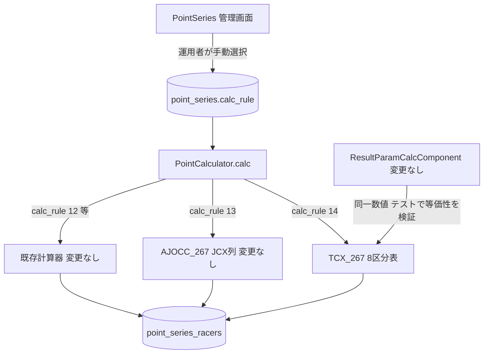
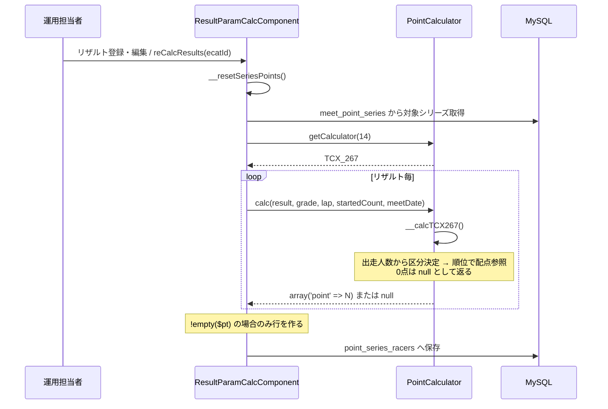
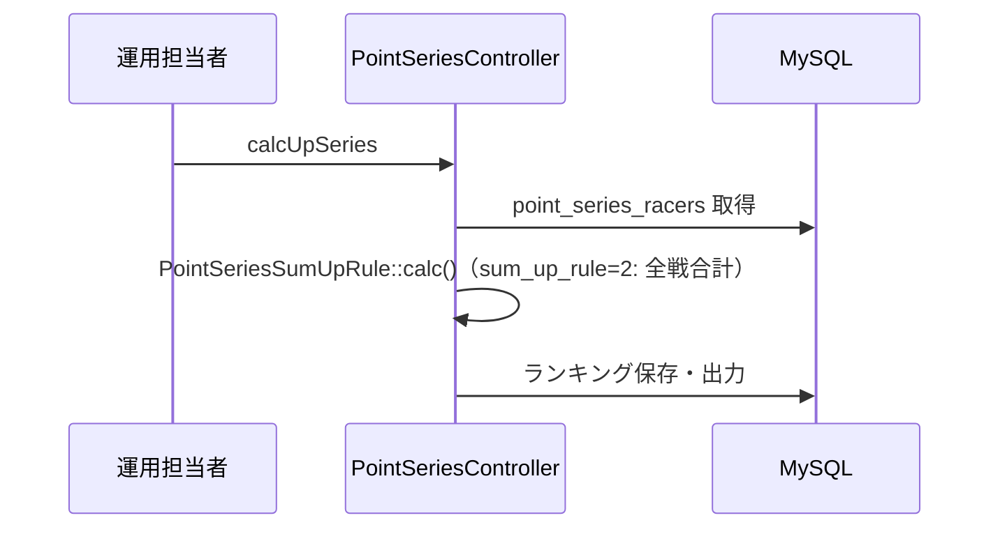
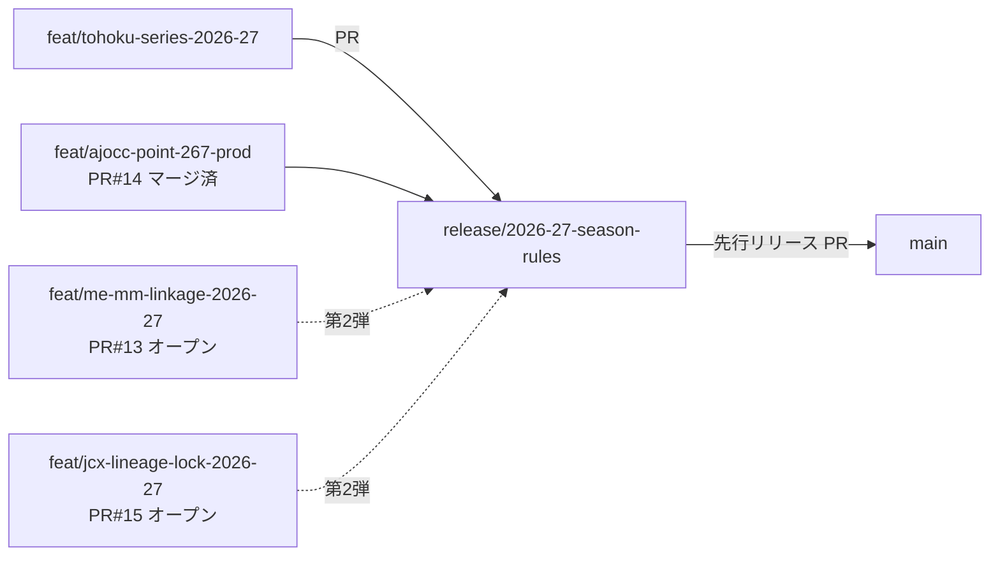

# 設計: tohoku-series-2026-27

タスクID: `tohoku-series-2026-27`
作成日: 2026-08-15

## Overview

**Purpose**: 2026-27シーズンの東北シリーズ（東北シクロクロス）のシリーズランキング集計に使用する
ポイント計算器 `TCX_267`（`calc_rule=14`）を `PointCalculator` に追加する。配点は 2026-27
新AJOCC得点表の出走人数8区分表（非JCX列）をそのまま使用する。

**Users**: AJOCC運営担当者（東北シリーズの設定・ランキング運用）、開発・保守担当者。

**Impact**: `cyclox2_svr/cyclox2`（CakePHP 2.x）の `app/Cyclox/Util/PointCalculator.php` 1ファイルと、
その単体テスト `app/Test/Case/Cyclox/Util/PointCalculatorTest.php` に閉じる。DBスキーマ変更・
UI変更・System①（AJOCCポイント計算）への変更は伴わない。

### Goals

- `point_series.calc_rule=14` を選択したシリーズが、新AJOCC得点表の8区分表で集計される。
- `TCX_267` の配点が `ResultParamCalcComponent` の非JCX新表と機械的に一致することが自動テストで
  担保される（数値の二重定義に対する防御）。
- 既存計算器（`val=1`〜`13`）の挙動が一切変化しない。
- 2026-27東北シリーズの登録手順が runbook として残る。

### Non-Goals

- `ResultParamCalcComponent`（System①）のリファクタリング・得点表の共通定数化
  （Requirement 4.4 により変更禁止。既存の `TCX_223` / `TCX_245` も同様に独立定義されており、
  本仕様だけが構造を変えると一貫性を損なう。詳細は Design Decision 1 参照）。
- `point_series` / `meet_point_series` レコードの実登録（runbook のみ提供）。
- 東北シリーズのカテゴリー構成の決定。
- ポイント表管理のUI化・DB化。

## Boundary Commitments

### This Spec Owns

- `PointCalculator` における `TCX_267` の定義（`$TCX_267` プロパティ、`$TABLE_TCX267` テーブル、
  `init()` 内の初期化と説明テキスト生成、`calculators` 配列への登録、`calc()` の `case` 追加、
  `__calcTCX267()` の実装）。
- `PointCalculatorTest` における `TCX_267` の単体テストおよび `ResultParamCalcComponent` の
  非JCX新表との等価性テスト。
- 2026-27東北シリーズ登録の runbook（`.kiro/specs/tohoku-series-2026-27/runbook.md`）。

### Out of Boundary

- `ResultParamCalcComponent`（System①）の一切の変更。
- `AJOCC_267`（`val=13`）を含む既存計算器の定義・`val`・`name` の変更。
- `PointSeries` モデル・コントローラ・ビューの変更（`calc_rule` の選択肢は
  `PointCalculator::calculators()` から自動生成されるため、登録するだけで表示される）。
- DBスキーマおよび `point_series` / `meet_point_series` のデータ操作。
- `cyclox2ressys_svr/cyclox2res_sys` の変更。

### Allowed Dependencies

- **`origin/release/2026-27-season-rules`** ブランチ（`ajocc-point-267-prod` マージ済み、
  `val=13` 確定済み）。ローカルの同名ブランチは古いので使用しない（後述「起点ブランチの注意」）。
- 既存の `PointCalculator` レジストリ機構（`calculators` 配列・`getCalculator()`・`calc()`）。
- 既存の `__KEY_STARTED_OVER` / `__KEY_TABLE` による出走人数区分表現（`TCX_223` / `TCX_245` と同一）。
- `ResultParamCalcComponent::calcAjoccPt($rank, $startedCount, $date, $isJcx)`（public。
  等価性テストの期待値ソースとしてのみ参照する。プロダクションコードからは呼ばない）。
- CakePHP 2.x 組み込みテストスイート（`Console/cake test`）。

### Revalidation Triggers

- `ajocc-point-267-prod` が `val=13` 以外の採番へ変更された場合（`val=14` の前提が崩れる）。
- 新AJOCC得点表の数値が公式資料との照合で修正された場合（`ResultParamCalcComponent` 側が
  修正されるため、等価性テストが失敗して検知される。`TCX_267` も追随修正が必要）。
- 東北シリーズが「AJOCCポイントと同配点」以外の独自配点を採用する方針に変わった場合。
- 他 spec が `PointCalculator` に新規計算器を追加した場合（`val=14` の採番衝突）。

## Architecture

### Existing Architecture Analysis

シリーズ点（System②）は `PointCalculator::calc()` が `point_series.calc_rule` に応じた計算器を
選択して算出する。東北シリーズは 2017-18 以降、その年度の AJOCC 得点表と同配点の専用計算器を
使う方式で運用されてきた。

| シーズン | `calc_rule` | 計算器 | 備考 |
|---|---|---|---|
| 2017-18, 2018-19 | 7 | `THK_178` | ポイントは10位まで |
| 2019-20 〜 2021-22 | 6 | `KNT_178` | 17-18 AJOCC ポイントと同じ |
| 2022-23, 2023-24 | 9 | `TCX_223` | 22-23 AJOCC ポイントと同じ（3区分） |
| 2024-25, 2025-26 | 12 | `TCX_245` | 24-25 AJOCC ポイントと同じ（3区分） |
| **2026-27** | **14（新規）** | **`TCX_267`** | **26-27 AJOCC ポイントと同じ（8区分）** |

得点表が変わらない年度は既存計算器を流用し（例: 25-26 は `TCX_245` を継続使用）、AJOCC 得点表が
改正された年度に新規計算器を追加する、という運用が一貫している。2026-27 は得点表が全面改正
（区分が3→8、配点も改定）されるため、新規計算器の追加が必要となる。

いずれの東北用計算器も **JCXテーブルを使用せず、ボーナスもグレード依存も持たない**。

### Architecture Pattern & Boundary Map



### Technology Stack

| 領域 | 採用 | 備考 |
|---|---|---|
| 言語 / FW | PHP 7.3 / CakePHP 2.10 | 既存踏襲 |
| テスト | PHPUnit 3.7.38（`Console/cake test`） | 既存踏襲 |
| 実行環境 | Docker（`cyclox2_svr` / `cyclox2_mysql`） | 既存踏襲 |

## File Structure Plan

### Modified Files

| ファイル | 変更内容 |
|---|---|
| `app/Cyclox/Util/PointCalculator.php` | `$TCX_267` 宣言、`$TABLE_TCX267` 宣言、`init()` での初期化・登録、`calc()` の `case` 追加、`__calcTCX267()` 追加 |
| `app/Test/Case/Cyclox/Util/PointCalculatorTest.php` | `TCX_267` の単体テスト・等価性テスト・回帰テストを追加 |

### New Files

| ファイル | 内容 |
|---|---|
| `.kiro/specs/tohoku-series-2026-27/runbook.md` | 2026-27東北シリーズの登録手順（リリース後に運用担当者が実施） |

## System Flows

シリーズ点の付与と集計は**2段階に分かれている**。`PointCalculator` が呼ばれるのは前段
（リザルト再計算）だけであり、後段の集計（`calcUpSeries`）は既存の `point_series_racers` を
読むだけで `PointCalculator` を呼ばない。この点は runbook の手順順序に直結する。

**前段: ポイント付与（`PointCalculator` を使用）**



**後段: 集計（`PointCalculator` は不使用）**



> **帰結**: `point_series` と `meet_point_series` を登録しても、**対象大会のリザルトが登録済みの
> 場合は再計算しない限り `point_series_racers` は生成されず、シリーズランキングは空になる**。
> 25-26 の `meet_point_series` はシーズン開幕前（2025-08-12）に作成されており、実運用は
> 「先に紐付け → リザルト登録」の順序である。runbook にこの順序制約と、後から紐付けた場合の
> 再計算手順を必ず記載する（Req 5.7）。

## Requirements Traceability

| 要件 | 設計での対応 |
|---|---|
| 1.1〜1.3 | `$TCX_267 = new PointCalculator(14, 'TCX_267', ...)`、`calculators` 登録、`calc()` の `case` 追加 |
| 1.4, 1.5 | `init()` 内の `$text` 生成（`TCX_245` と同一書式のループ） |
| 1.6 | `PointSeriesController` が `PointCalculator::calculators()` から選択肢を生成するため、登録のみで自動反映（コード変更不要） |
| 2.1〜2.4 | `$TABLE_TCX267` を8区分（`__KEY_STARTED_OVER` = 99/79/59/39/19/9/4/0）で定義 |
| 2.2 | 等価性テスト（`calcAjoccPt` との全順位比較） |
| 2.3 | 区分境界テスト |
| 2.5, 2.6 | `__calcTCX267()` は `bonus` を設定せず、`$grade` を参照しない |
| 3.1〜3.4 | `__calcTCX267()` の `rank` 空 → `null`、既定値 `$point = 0`。`calc()` 末尾で0点が `null` に変換される点は Error Handling 節に明記 |
| 4.1〜4.3 | 既存コードへの追記のみ。回帰テストで担保 |
| 4.4, 4.5 | `ResultParamCalcComponent` / DB を変更対象から除外 |
| 5.1〜5.9 | `runbook.md`（作業順序・再計算の必要性は System Flows 節の帰結を反映） |
| 6.1 | 起点は `origin/release/2026-27-season-rules`（「起点ブランチの注意」） |
| 6.2, 6.5, 6.6 | 「リリース構成」（`--no-ff`・期限） |
| 6.3 | 結合試験の実施と記録（tasks 5.3） |
| 6.4 | 「submodule ポインタの取り扱い」 |

## Components and Interfaces

### Cyclox/Util 層

#### PointCalculator（変更）

**Responsibility**: `calc_rule` に対応する配点計算を提供する。

**追加する要素**:

```php
public static $TCX_267;                  // val=14
private static $TABLE_TCX267;            // init() で初期化（8区分）
private function __calcTCX267($result, $grade, $raceLapCount, $raceStartedCount, $meetDate)
```

**`$TABLE_TCX267` の構造**（既存 `TCX_245` と同一パターン。降順に評価される）:

| 添字 | `started_over` | 意味 | 配点要素数 | 1位配点 | 最終要素 |
|---|---|---|---|---|---|
| 0 | 99 | 100人以上 | 119 | 400 | 1 |
| 1 | 79 | 80人以上 | 99 | 400 | 1 |
| 2 | 59 | 60人以上 | 79 | 400 | 1 |
| 3 | 39 | 40人以上 | 59 | 350 | 1 |
| 4 | 19 | 20人以上 | 39 | 300 | 1 |
| 5 | 9 | 10人以上 | 19 | 250 | 1 |
| 6 | 4 | 5人以上 | 9 | 200 | 1 |
| 7 | 0 | 1人以上 | 4 | 200 | 1 |

（要素数・1位配点・最終要素は `ResultParamCalcComponent` の該当分岐から機械的に抽出して確認済み。
2026-08-15 時点、`release/2026-27-season-rules`）

配点値は `ResultParamCalcComponent::__getAjoccPointMap()` の
「`$mtDate >= $divDate2026` かつ非JCX」分岐の `points` 配列と完全に同一とする
（実装時に同ファイルから機械的に転記し、等価性テストで検証する）。全区分で `defaultPoint = 0`、
全区分の最終要素が `1`、表中に値 `0` は存在しないことを確認済み。

**説明テキスト（`$text`）の生成書式**: `KNT_178` のループ書式
（`if (($j + 1) % 10 == 0 || $j == $n - 1)`）を採用する。`TCX_245` の書式は `% 10 == 0` のみで
末尾改行を持たず、8区分の要素数（119/99/79/59/39/19/9/4）はいずれも10の倍数でないため、
各区分の末尾で改行されず次区分の `---` が同一行に連結して表示が崩れる。Requirement 1.5 の
「既存と同じ書式」はこの改行補正を含む意味として解釈する。

**`__calcTCX267()` の仕様**（`__calcTCX245()` と同一ロジック）:

```php
if (empty($result['rank'])) return null;
$rankIndex = $result['rank'] - 1;
$point = 0;                                     // 最低ポイントは0pts
foreach (self::$TABLE_TCX267 as $table) {
    if ($raceStartedCount > $table[self::__KEY_STARTED_OVER]) {
        if (isset($table[self::__KEY_TABLE][$rankIndex])) {
            $point = $table[self::__KEY_TABLE][$rankIndex];
        }
        break;
    }
}
return array('point' => $point);
```

**Preconditions**: `$raceStartedCount` は正の整数。
**Postconditions**: `bonus` キーを含まない。`$grade` に依存しない。

## Data Models

DBスキーマ変更なし。`point_series.calc_rule`（`smallint unsigned`）に新しい値 `14` が
格納可能になるのみ（既存カラムの値域拡張であり、DDL変更は不要）。

**データ契約**: `calc_rule=14` は「2026-27東北クロス配点」を意味する。この値は
`PointCalculator::$TCX_267->val()` が唯一の定義元であり、他所にハードコードしない。

## Error Handling

### Error Strategy

既存の `PointCalculator` の方針を踏襲し、例外は投げない。

| 状況 | `__calcTCX267()` の戻り | `calc()` の戻り（外部から観測される挙動） | 集計への影響 |
|---|---|---|---|
| `rank` が空 | `null` | `null` | `point_series_racers` 行を作成しない |
| 順位が表範囲外 | `array('point' => 0)` | **`null`** | 同上（0点行も作られない） |
| `raceStartedCount` が 0 以下 | `array('point' => 0)` | **`null`** | 同上 |
| 正常（表範囲内） | `array('point' => N)` | `array('point' => N)` | 行を作成 |
| `calc_rule` に未登録の値 | — | `getCalculator()` が `null`（既存挙動、変更しない） | — |

**重要**: `calc()` は末尾で
`if (empty($pt['point']) && empty($pt['bonus'])) { return null; }`
を実行するため、**ポイント0は外部に `null` として観測される**。呼び出し側
`ResultParamCalcComponent::__resetSeriesPoints()` は `if (!empty($pt))` で分岐するため、
0点の選手は `point_series_racers` 行を持たない。これは既存 `TCX_245` / `AJOCC_267` と同一の
挙動であり（既存テスト `testAjocc267Rank110ReturnsNull` が実証）、本仕様で変更しない。
テスト設計・結合試験の期待値はこの前提で組むこと。

## Testing Strategy

TDD（テスト先行）で進める。すべて `app/Test/Case/Cyclox/Util/PointCalculatorTest.php` に追加する。

### Unit Tests

1. `getCalculator(14)` が `TCX_267` を返し、`name()` が `'TCX_267'` であること（Req 1.1, 1.2）。
2. `description()` / `text()` に「東北」「JCX テーブル無し」等の必要文言が含まれること（Req 1.4）。
3. 区分境界テスト: 出走人数 4/5、9/10、19/20、39/40、59/60、79/80、99/100 で適用区分が
   切り替わること（Req 2.3）。
4. 順位境界テスト: 各区分の 1位・最終要素の順位・その次の順位（範囲外→0）（Req 3.2, 3.3）。
5. `rank` が空の場合に `null` を返すこと（Req 3.1）。
6. グレード 1 / 2 / null で結果が同一であること（Req 2.6）。
7. 返却値に `bonus` キーが含まれないこと（Req 2.5）。

### Equivalence Test（数値二重定義への防御）

8. 出走人数を各区分の代表値（1, 4, 5, 9, 10, 19, 20, 39, 40, 59, 60, 79, 80, 99, 100, 150）、
   順位を 1〜125 で総当たりし、`TCX_267` の値が
   `ResultParamCalcComponent::calcAjoccPt($rank, $startedCount, '2026-09-01', false)` と
   一致することを検証する（Req 2.2）。

   **実装上の必須制約**（これを守らないとテストは必ず失敗する）:

   - **出走人数ごとに `ResultParamCalcComponent` の新規インスタンスを生成する**（16インスタンス）。
     `calcAjoccPt()` は `$this->ajoccPtMap` に**出走人数・日付・isJcx を問わず初回の表を永続
     キャッシュ**する（`if (isset($this->ajoccPtMap)) { $map = $this->ajoccPtMap; ... }`）。
     `origin/release/2026-27-season-rules` では `ajocc-point-267-prod` によりキャッシュ破棄
     メソッド `resetAjoccPtCache()` が**削除済み**のため、インスタンスを分ける以外に回避手段が
     ない。1インスタンスで回すと初回（出走1人＝4件表）の表が全ペアに適用され全滅する。
   - 順位ループは同一インスタンス内で回してよい（同じ出走人数なら同じ表でよいため）。
     ペアごとに新インスタンスを作ると、キャッシュミス時の `foreach ($map as $Item) $this->log(...)`
     により debug.log が十数万行に膨れるため避ける。
   - **戻り値の正規化**: `calc()` はポイント0を `null` として返す一方、`calcAjoccPt()` は `0` を
     返す。比較前に `$actual = ($pt === null) ? 0 : $pt['point'];` と正規化する。
   - 出走人数0以下は `calcAjoccPt()` が `-1`（エラー値）を返す仕様のため、対象外とする。

   これにより「System① と System② に同じ数値を二重定義する」構造上のリスクを、リファクタリング
   （＝Requirement 4.4 違反）なしにテストで封じ込める。System① 側の表が将来修正された場合、
   このテストが失敗して追随漏れを検知する。

### Regression Tests

9. `AJOCC_267`（`val=13`）の代表値（1位=1000、109位=1、110位=ポイントなし）が不変（Req 4.1）。
10. `TCX_245`（`val=12`）の代表値が不変（Req 4.2）。
11. `calculators()` の要素数が 14 で、`val=1`〜`13` の `val` / `name` が不変（Req 4.3）。

### Integration Test（人手）

`integration-test-checklist.md` に記載する。`ajocc-point-267-prod` の未消化17項目と合わせて
先行リリース前に実施する（Req 6.3）。

- 管理画面の配点ルール選択に `TCX_267` が表示される
- `TCX_267` を選択したシリーズで集計が完走し、ランキングが妥当な値になる
- シリーズランキングCSV出力が崩れない
- res-sys 側のシリーズランキング表示が崩れない

## リリース構成（Req 6）



- 実装ブランチ: `feat/tohoku-series-2026-27`（**`origin/release/2026-27-season-rules`** から分岐）
- 先行リリース内容: `ajocc-point-267-prod` + 本仕様
- マージ方式: **`--no-ff`**（マージコミットを残す）。リポジトリ設定では squash / rebase も
  許可されているが、release ブランチを再利用するため履歴の乖離を避ける必要がある
- リリース期限: 2026-09-01 より前（2026-27シーズン開幕前）
- 先行リリース後も `release/2026-27-season-rules` は残存し、第2弾（me-mm-linkage 等）の
  集約先として継続利用する。`main` にホットフィックスが入った場合は `main` → `release` の
  追随マージを行う。

> 図中の PR #15（`jcx-lineage-lock-2026-27`）の base は `release/2026-27-season-rules` ではなく
> **`feat/me-mm-linkage-2026-27`**（stacked PR）である。第2弾リリースは
> me-mm-linkage → jcx-lineage-lock の順に依存する。

### 起点ブランチの注意（実装前に必ず確認）

ローカルの `release/2026-27-season-rules` は `origin/main` と同一コミット（`2c3fd3a`）を指す
**古い状態**であり、`ajocc-point-267-prod` の成果を含まない。一方
`origin/release/2026-27-season-rules` は `0635466`（PR #14 マージ済み）である。

| ref | コミット | `val=13` の名称 | 267prod のテスト |
|---|---|---|---|
| ローカル `release/2026-27-season-rules` | `2c3fd3a` | `AJOCC_267_TEST` | 無し |
| `origin/release/2026-27-season-rules` | `0635466` | `AJOCC_267` | 有り |

古い方から分岐すると `val=13` の名称が `AJOCC_267_TEST` のままとなり、`val=14` の前提も
267prod の既存テストも失われる。実装開始時に `git fetch origin` を実行し、
`origin/release/2026-27-season-rules` から分岐すること。

### submodule ポインタの取り扱い

親リポジトリ `cyclox2_docker` の `main` が指す submodule コミットは `2479bcd` で、これは
`feat/jcx-lineage-lock-2026-27` にのみ存在する未マージコミットである。したがって:

- 本番反映の基準は **アプリリポジトリ `cyclox2web` の `main`** であり、親リポジトリの submodule
  ポインタはローカル開発の都合で先行している状態にある。
- 結合試験は Docker 環境（親リポジトリの submodule チェックアウト）で行うため、**試験前に
  submodule をリリース対象コミット（release + 本仕様のマージ結果）へ明示的にチェックアウト
  する**こと。これを怠るとリリース対象でないビルドを検証してしまう。
- 親リポジトリの submodule ポインタを先行リリースに合わせて戻すか据え置くかは、第2弾リリースの
  進め方と併せて人間が判断する（本仕様では変更しない）。

### ロールバック時の既知の危険

`app/View/PointSeries/view.ctp:39` と `app/View/PointSeriesGroups/view.ctp:95` は
`PointCalculator::getCalculator($calc_rule)->name()` を **null チェックなしで**呼ぶ。
リリース後に運用担当者が `calc_rule=14` の `point_series` 行を作成した状態でアプリを
`main`（`TCX_267` 無し）へロールバックすると、シリーズ詳細・グループ詳細画面が Fatal error に
なる。ロールバック手順には「先に `calc_rule=14` の `point_series` 行を削除（または `deleted=1`）
する」を含めること。本仕様ではビューの null 安全化は行わない（Out of Boundary）。

## Design Decisions

### Decision 1: 得点表を共通定数化せず、独立定義＋等価性テストで担保する

- **Context**: 26-27 の非JCX8区分表を `ResultParamCalcComponent`（System①）と
  `PointCalculator`（System②）の2箇所に持つことになる。
- **Alternatives**:
  - (A) 独立定義＋等価性テスト（採用）
  - (B) 共通定数クラス（例 `Cyclox/Const/Ajocc267PointTable`）へ抽出し両者から参照
  - (C) `PointCalculator` から `ResultParamCalcComponent` を参照
- **Selected**: (A)
- **Rationale**: (B) は Requirement 4.4（System① 無変更）に反し、`ajocc-point-267-prod` が
  検証済みのコードへ回帰リスクを持ち込む。また既存の `TCX_223` / `TCX_245` / `KNT_178` も
  System① の表を独立定義しており、本仕様のみ構造を変えると一貫性を損なう。(C) は Util 層から
  Controller/Component 層への逆依存となり層構造を壊す。(A) は既存パターンを維持したまま、
  二重定義の実害（数値のずれ）だけをテストで機械的に排除できる。
- **Trade-off**: 数値の重複自体は残る。将来 System① の表が修正された際は等価性テストが失敗する
  ため、追随漏れは検知できるが、修正の手間は2箇所に発生する。共通化は 4 spec 完了後の
  リファクタリング候補として `docs/` に申し送る。

### Decision 2: シリーズ登録は runbook（コード対象外）とする

- **Context**: `point_series` / `meet_point_series` の登録が別途必要。
- **Selected**: 管理画面での手作業とし、本仕様は手順のみ提供する。
- **Rationale**: 過去の東北シリーズ実装（PR #9 等）もコード変更は `PointCalculator.php` のみで、
  シリーズ登録は運用作業として実施されてきた。シリーズ本数・カテゴリー構成は大会運営の中で
  主催者が決定する事項であり、リリース時点では確定していない。マイグレーション化すると
  未確定の構成をコードに固定することになる。

## 技術要件・制約チェック

| 項目 | 確認結果 |
|---|---|
| 秘密情報のハードコード | なし（DB接続・認証情報を扱わない） |
| DBスキーマ変更 | なし |
| 公開インターフェース変更 | `calc_rule=14` の新設（データ契約の追加）。既存値の意味は不変 |
| 後方互換性 | 既存 `calc_rule` の挙動は不変。回帰テストで担保 |
| 性能 | 配点参照は定数時間。既存計算器と同等 |
| セキュリティ | 認証・権限・PII に関与しない |
| main 直接コミット禁止 | 遵守（`feat/tohoku-series-2026-27` → PR） |
| TDD | 遵守（テスト先行でタスクを構成） |
