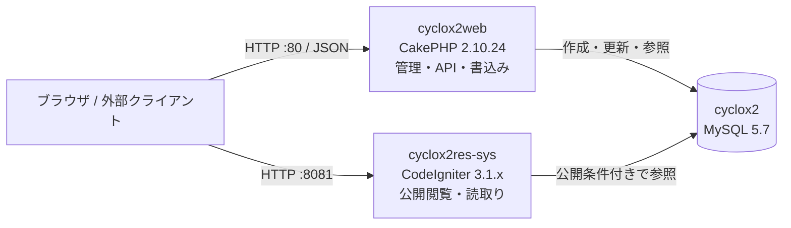
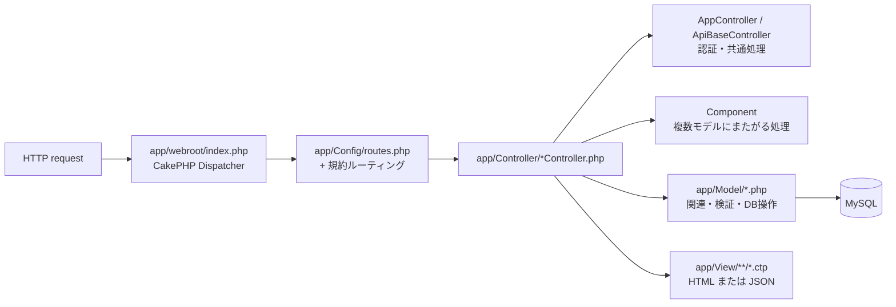
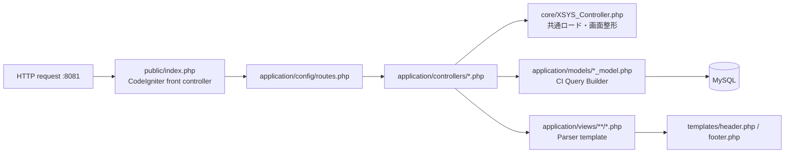
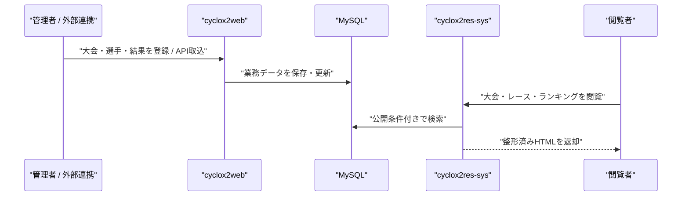

# Cyclox2 コードリーディングガイド

このガイドは、管理アプリ **cyclox2web** と成績閲覧アプリ **cyclox2res-sys** のコードを読むための入口を示す。ソースコードとコンテナ定義を基準にしており、認証情報や実データを必要とせずに構造を把握できる。

## 1. まず全体像をつかむ

| 呼称 | 実体パス | 役割 | フレームワーク |
| --- | --- | --- | --- |
| cyclox2web | `cyclox2_svr/cyclox2/` | 選手・大会・エントリー・結果・ポイントを管理する書込み側アプリ | CakePHP 2.10.24 / PHP 7.3 |
| cyclox2res-sys | `cyclox2ressys_svr/cyclox2res_sys/` | 公開対象の大会結果・選手・ランキングを表示する閲覧側アプリ | CodeIgniter 3.1.x / PHP 7.3 |
| cyclox2_mysql | `cyclox2_mysql/` | 両アプリが利用する MySQL 5.7 | MySQL 5.7 |

`cyclox2web` と `cyclox2res-sys` は、このDocker環境リポジトリに含まれるGit submoduleである。アプリ本体を変更する際は、親リポジトリではなく各submoduleの履歴・ブランチを確認する。

### 実行環境の入口

- Dockerサービス定義: `docker-compose.yml`
- cyclox2web はホストの `80`（HTTPS は `443`）を公開し、ソースを `/var/www/html` にマウントする。
- cyclox2res-sys はホストの `8081` を公開し、コンテナ内では `/var/www/html/ajocc_xsys` として動く。
- どちらも固定Dockerネットワーク上の `cyclox2_mysql` を利用する。ローカル開発用の接続設定は、各アプリの設定ファイルをコンテナへマウントして差し替える。

## 2. cyclox2web（管理アプリ）を読む

### 技術構成とフレームワークの考え方

CakePHP 2系の規約ベースMVCである。通常のURLでは、コントローラ名・アクション名から対応する `app/View/<Controller>/<action>.ctp` が選ばれる。モデルはActive Record風の `AppModel` 継承クラスで、関連定義を通じて他テーブルを取得する。

明示的なルートは `app/Config/routes.php` に少数あり、それ以外はCakePHPの標準ルーティングを使う。たとえば `/meets/view/ABC` は原則として `MeetsController::view('ABC')` に届く。JSON拡張子を付ける経路（例: `.json`）は、同じコントローラがJSON応答へ分岐する設計である。

### 最初に読むファイル

1. `app/Config/bootstrap.php` — 有効なプラグインを確認する。`Acl`、`Users`、`Maintenance`、`Search`、`Utils`、`DebugKit` を読み込む。
2. `app/Config/routes.php` — `/`、`/pages/*`、管理ユーザーの明示ルートを確認し、残りが規約ルーティングであることを理解する。
3. `app/Controller/AppController.php` — 全画面の共通入口。フォーム認証とBasic認証をURLのJSON拡張子で切替え、ACL認可、メンテナンス制御、共通ヘルパを設定する。
4. `app/Controller/ApiBaseController.php` — API系コントローラの共通JSON形式、メタ情報、エラー形式を把握する。
5. 関心機能のController → Component → Model → View の順に進む。

### ディレクトリと役割

| パス | 読む目的 |
| --- | --- |
| `app/Controller/` | 画面・APIのユースケース入口。多数の業務コントローラがある。 |
| `app/Controller/Component/` | 横断的または複雑な業務処理。ポイント・昇格・結果処理はここが重要。 |
| `app/Model/` | テーブル単位のモデル、関連、検証、DBアクセス。 |
| `app/View/` | `.ctp` テンプレート。画面出力とフォームの確認点。 |
| `app/Cyclox/Const/` | 業務定数・列挙的な値。カテゴリー、結果状態、ポイント規則などの語彙を定義する。 |
| `app/Cyclox/Util/` | 計算やユーティリティ。`PointCalculator.php` はポイント計算の入口。 |
| `app/Console/Command/` | Cakeコンソールから起動する運用・バッチ処理。 |
| `app/Plugin/` | CakePHPプラグイン。認可、ユーザー、検索、論理削除などの横断機能。 |
| `app/Test/` | CakePHP/PHPUnit系のテスト。既存の仕様を確認する際の補助資料。 |
| `app/Config/` | フレームワーク、ルート、DB、メール、プラグインの設定。実DB設定はDockerから上書きされる。 |

### このアプリ固有の読み方

#### 認証・認可を理解したい

`AppController.php` から始める。通常画面はフォーム認証、`.json` のAPIはメールアドレスをユーザー名とするBasic認証を使う。認可はCakePHPのActions ACLで構成されるため、続けて `app/Plugin/Acl/`、`app/Plugin/Users/`、`app/Controller/Component/PermissionComponent.php` を読む。

#### 大会・エントリーを理解したい

以下の順に読む。

1. `app/Controller/MeetsController.php`
2. `app/Model/Meet.php` と関連モデル（`EntryGroup`、`EntryCategory`、`EntryRacer`）
3. `app/View/Meets/`
4. API連携も対象なら `app/Controller/ApiController.php` と `app/Controller/ApiBaseController.php`

`MeetsController` はHTMLとJSONのどちらにも応答する。`_isApiCall()` の分岐を見落とすと、同じアクションに二つの入出力契約があることを見落とす。

#### 選手・認定カテゴリーを理解したい

1. `app/Controller/RacersController.php` — 選手検索・表示の入口。
2. `app/Model/Racer.php`、`app/Model/CategoryRacer.php`、`app/Model/Category.php`
3. `app/Controller/CategoryRacersController.php`
4. `app/Controller/Component/AgedCategoryComponent.php`、`UnifiedRacerComponent.php`

論理削除を使う箇所では `Utils.SoftDelete` Behavior が処理時に読み込まれる。単純なモデル検索と結果が異なる場合は、このBehaviorの有無を最初に確かめる。

#### リザルト、昇格、ポイント計算を理解したい

1. `app/Controller/ApiController.php` — 外部からの結果取込を含むAPI入口。
2. `app/Controller/Component/ResultReadComponent.php` — 結果データの読取り。
3. `app/Controller/Component/ResultParamCalcComponent.php` — 結果を基にした業務処理・パラメータ計算の中心。
4. `app/Cyclox/Util/PointCalculator.php` と `app/Cyclox/Const/` 配下の関連定数。
5. `app/Model/RacerResult.php`、`HoldPoint.php`、`PointSeriesRacer.php`、`CategoryRacer.php`。
6. 挙動の根拠として `app/Test/Case/` の対応テスト。

この領域はコントローラよりComponentに処理が集まる。モデルだけを追っても、結果反映後の副作用（ポイント、昇格、関連データ更新）を把握しきれない。

#### バッチ・保守機能を理解したい

`app/Console/Command/` を起点にする。`ResultShell.php`、`CatLimitShell.php`、`OrgUtilShell.php`、`OneTimeShell.php` が対象の業務処理を呼び出す。ShellがどのComponent・Model・定数を使うかを追跡する。

### 注意点

- `AppController` を継承していても、API用はさらに `ApiBaseController` を継承する。レスポンス形式・認証を確認せずに画面用の読み方を当てはめない。
- 管理画面の削除は、モデルまたはBehaviorにより論理削除となる場合がある。`deleted` 条件と`Utils.SoftDelete`を確認する。
- `app/Config/database.php` はDockerで `cyclox2_svr/cyclox2_conf/database.php` からマウントされる。リポジトリの雛形だけで実行時接続先を断定しない。

## 3. cyclox2res-sys（成績閲覧アプリ）を読む

### 技術構成とフレームワークの考え方

CodeIgniter 3系のMVCアプリである。フロントコントローラは `public/index.php`、個別URLは `application/config/routes.php` でControllerメソッドに対応付ける。各Controllerは必要なModelをコンストラクタ内で明示ロードし、ModelはCI Query BuilderでMySQLを検索する。

書込み側のcyclox2webとDBを共有するが、このアプリの主目的は公開用の参照である。大会・ポイントシリーズの検索には `publishes_on_ressys = 1` が条件として使われ、公開対象を絞っている。

### 最初に読むファイル

1. `public/index.php` — `application` とComposerで導入したCodeIgniter本体へのパス、実行環境の切替を確認する。
2. `application/config/config.php` — 基本URL、言語、Composer autoload、`XSYS_` 接頭辞を確認する。
3. `application/config/routes.php` — 公開URLとControllerの対応を一覧で把握する。
4. `application/core/XSYS_Controller.php` — 全Controllerの共通基底。セッション、Parser、共通ヘルパ、ヘッダ・本文・フッタを結合する `_fmt_render()` を理解する。
5. 関心機能のController → 明示ロードされたModel → View の順に進む。

### ディレクトリと役割

| パス | 読む目的 |
| --- | --- |
| `public/` | Web公開ディレクトリとフロントコントローラ。静的アセットもここに置く。 |
| `application/controllers/` | 公開画面の入口。大会、レース、選手、ランキング、ポイントシリーズを担当する。 |
| `application/models/` | 検索SQLを組み立てる読取りモデル。 |
| `application/views/` | Parserでレンダリングされる画面テンプレート。`templates/` が共通レイアウト。 |
| `application/core/XSYS_Controller.php` | 独自基底Controller。共通初期化、フラッシュメッセージ、レイアウト合成を持つ。 |
| `application/etc/cyclox/` | cyclox2web側と対応する業務定数・ユーティリティ。データ解釈を追う起点。 |
| `application/config/` | ルーティング、DB、環境設定。実行時にはDocker側の設定で上書きされるものがある。 |
| `vendor/` と `application/vendor/` | Composerで導入されるCodeIgniter本体と依存ライブラリ。通常の業務読解では最後に見る。 |

### 機能別の最短読解ルート

| 理解したい機能 | まず読むController | 次に読むModel | 画面 |
| --- | --- | --- | --- |
| トップページ | `controllers/Pages.php` | `Basedata_model.php`、`Meet_model.php` | `views/pages/home.php` |
| 大会一覧・大会ページ | `controllers/Meet.php` | `Meet_model.php`、`Race_model.php`、`Categoryracer_model.php` | `views/meet/` |
| レース結果・ラップ・昇格表示 | `controllers/Race.php` | `Race_model.php`、`Result_model.php`、`Categoryracer_model.php`、`Pointseries_model.php` | `views/race/view.php` |
| 選手検索・選手履歴 | `controllers/Racer.php` | `Racer_model.php`、`Result_model.php`、`Pointseries_model.php` | `views/racer/` |
| AJOCCランキング | `controllers/Ajocc_ranking.php` | `Ajoccranking_model.php`、`Category_model.php` | `views/ajocc_ranking/` |
| ポイントシリーズ | `controllers/Point_series.php` | `Pointseries_model.php`、`Ajoccranking_model.php` | `views/point_series/` |

### 代表的な処理を追う

レース結果の表示なら、`routes.php` の `race/(:num)` → `Race::view($ecat_id)` → `Race_model` / `Result_model` / `Categoryracer_model` / `Pointseries_model` → `views/race/view.php` の順で追う。Controllerは結果の時間差、ラップ、昇格、ポイントシリーズを表示向け配列へ組み立て、ModelはSQLとDB上の公開条件を担当する。

大会一覧なら、`meet` → `Meet::index()` → `Meet_model::get_meets()` → `views/meet/index.php` である。`get_meets()` の `publishes_on_ressys` 条件が、管理側のデータがすべて公開側に表示されるわけではないことを示している。

### 注意点

- すべてのControllerが `XSYS_Controller` を継承する。ビューを直接 `load->view()` するより、`_fmt_render()` 経由で共通ヘッダ・本文・フッタを結合することが基本である。
- `__` を含むルート・メソッド・ビュー（例: `view__`、`__view.php`）が並存する。互換・旧表示系の可能性があるため、片方だけを消したり変更対象から外したりする前に、ルートと呼出し元を検索する。
- `application/config/database.php` は雛形であり、Dockerでは `cyclox2ressys_svr/conf/database.php` がコンテナ内設定へマウントされる。資格情報はガイドやコードに記載しない。

## 4. 二つのアプリをまたいで機能を読む順番

同じ業務概念を両方で追う場合は、まずcyclox2webで「どのデータを、いつ、どう更新するか」を読み、次にcyclox2res-sysで「そのデータをどの条件で公開し、どう整形するか」を読む。

特に大会・レース・選手・カテゴリー・ポイントシリーズは共通テーブルを異なる責務で扱う。表示の不具合を調べるときも、最初から管理側のControllerを変更対象と決めず、次の順で切り分ける。

1. cyclox2res-sysのModelに公開条件・日付条件・論理削除条件があるか確認する。
2. 表示用ControllerがModel結果を加工していないか確認する。
3. cyclox2webのModel・Controller・Componentで元データの更新経路を確認する。
4. DBスキーマや実データを確認する必要が出た場合だけ、読取り専用の調査を行う。

## 5. 調査済みの実行確認と限界

- 調査時点で `cyclox2_svr` と `cyclox2_mysql` は稼働していた。`http://127.0.0.1/` はログイン画面へリダイレクトし、CakePHPセッションが発行されることを確認した。
- `cyclox2ressys_svr` は停止しており、`http://127.0.0.1:8081/` への接続は確認できなかった。コンテナを起動していないため、成績閲覧画面の実レスポンスは未検証である。
- 本ガイドは読み取り調査のみで作成しており、コンテナ、DB、アプリコード、submoduleの既存差分を変更していない。
