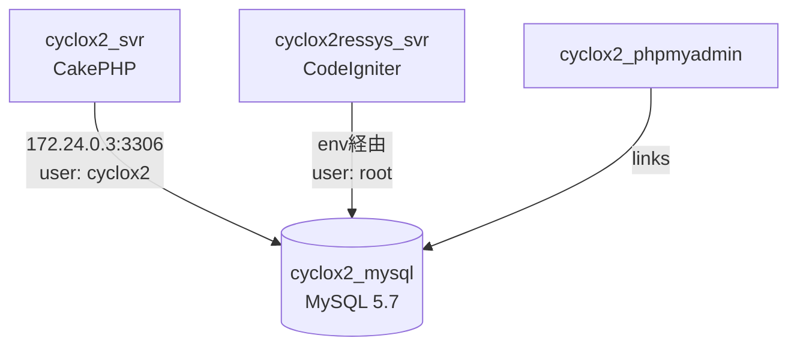

# システム全体構成

## システム概要

**Cyclox2** は自転車競技（主にAJOCC主催大会）の競技管理・成績管理を行うWebシステムです。
主管理アプリ（cyclox2web）と成績閲覧アプリ（cyclox2 Result System）で構成されます。

---

## サービス構成

| サービス名 | 役割 | 技術スタック | URLアクセス |
|---|---|---|---|
| `cyclox2_svr` | 競技管理メインアプリ（管理者・スタッフ向け） | Apache + PHP 7.3 / CakePHP 2.x | http://localhost/ |
| `cyclox2_mysql` | データベース | MySQL 5.7.42 (UTF-8 / バイナリログ有効) | localhost:3306 |
| `cyclox2_phpmyadmin` | DB管理UI | phpMyAdmin (公式イメージ) | http://localhost:4040/ |
| `cyclox2ressys_svr` | 競技成績閲覧アプリ（一般公開向け） | Apache + PHP 7.3 / CodeIgniter 3.1.x | http://localhost:8081/ |

---

## ネットワーク構成

```
固定サブネット: 172.24.0.0/24 (fixed_compose_network)

ホストマシン
  │  :80, :443(→8443)  :3306  :4040  :8081
  │
  ├── cyclox2_svr        172.24.0.2
  ├── cyclox2_mysql      172.24.0.3
  ├── cyclox2_phpmyadmin 172.24.0.4
  └── cyclox2ressys_svr  172.24.0.5
```

### ポートマッピング
| ホストポート | コンテナポート | サービス | 用途 |
|---|---|---|---|
| 80 | 80 | cyclox2_svr | HTTP (メインアプリ) |
| 443 | 8443 | cyclox2_svr | HTTPS (メインアプリ) |
| 3306 | 3306 | cyclox2_mysql | MySQL |
| 4040 | 80 | cyclox2_phpmyadmin | phpMyAdmin |
| 8081 | 80 | cyclox2ressys_svr | 成績閲覧アプリ |

---

## サービス間依存関係



---

## アプリケーション構成（サブモジュール）

| サブモジュール | パス | リポジトリ | 役割 |
|---|---|---|---|
| cyclox2web | `cyclox2_svr/cyclox2/` | `cyclox-dev/cyclox2web` | CakePHP製メイン管理アプリ |
| cyclox2res-sys | `cyclox2ressys_svr/cyclox2res_sys/` | `cyclox-dev/cyclox2res-sys` | CodeIgniter製成績閲覧アプリ |

### cyclox2web（メイン管理アプリ）ドメインモデル概要

競技管理の主要エンティティ：

| エンティティ | 説明 |
|---|---|
| Season | シーズン（年度） |
| Meet | 大会・試合 |
| MeetGroup | 大会グループ |
| Racer | 選手 |
| Category | カテゴリ（クラス分け） |
| Group | グループ |
| EntryRacer | エントリー選手 |
| RacerResult | 成績・結果 |
| TimeRecord | タイム記録 |
| PointSeries | ポイントシリーズ |
| HoldPoint | 保留ポイント |

主な機能領域：
- 大会・エントリー管理
- カテゴリ・グループ管理
- 成績・タイム記録
- ポイントシリーズ管理
- 選手管理（名前変更ログ含む）
- JSON API（外部サイト向け `ApiController`）
- AJOCC PTローカル設定

### cyclox2 Result System（成績閲覧アプリ）ドメインモデル概要

| エンティティ | 説明 |
|---|---|
| Meet | 大会 |
| Race | レース |
| Racer | 選手 |
| Category | カテゴリ |
| Result | 成績 |
| PointSeries | ポイントシリーズ |
| Season | シーズン |

主な機能領域：
- 成績一覧・詳細表示（一般公開）
- AJOCCランキング表示
- ポイントシリーズ表示

---

## データベース

| 項目 | 内容 |
|---|---|
| DB名 | `cyclox2` |
| バージョン | MySQL 5.7.42 |
| 文字コード | utf8 / utf8_general_ci |
| バイナリログ | 有効（server-id=1101、3日で自動削除） |
| cyclox2web接続 | host: 172.24.0.3, user: cyclox2, DB: cyclox2 |
| cyclox2res-sys接続 | host: env(DB_HOSTNAME), user: env(DB_USERNAME), DB: env(DB_DATABASE) |

**初期データ投入**: 本番/他環境からのSQLダンプを `cyclox2_mysql/var/dump/` に配置してインポート。
（詳細は [local-setup.md](./local-setup.md) 参照）
